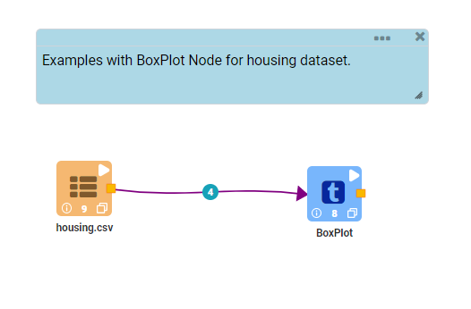
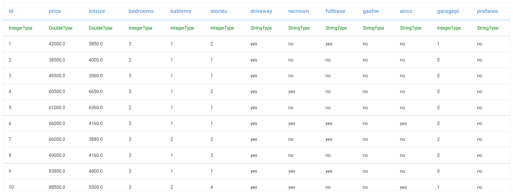
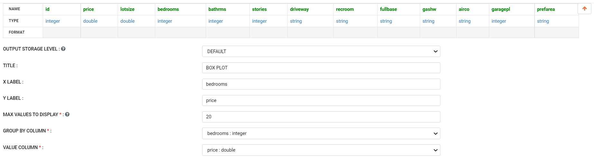

BOXPLOT
=========

This workflow reads in a housing dataset. It then visualize using BoxPlot.

Workflow
-------

The below workflow:

* Reads in the input housing data.
* Visualize housing data using BoxPlot.

   
Reading from Dataset
---------------------

It reads the Dataset Files.

Visualize using Boxplot
--------------------

It plot graph with BoxPlot node.

Output result
-------------

.. figure:: ../../_assets/tutorials/visualization/10.PNG
   :alt: Visualization
   :width: 90%
