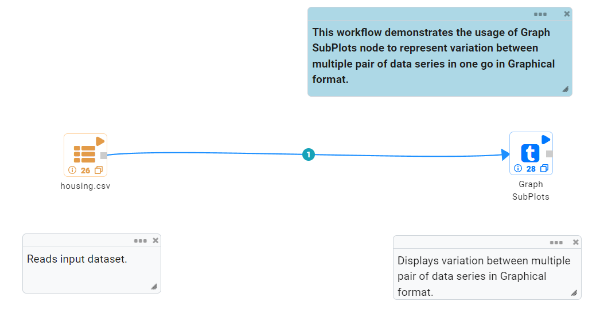
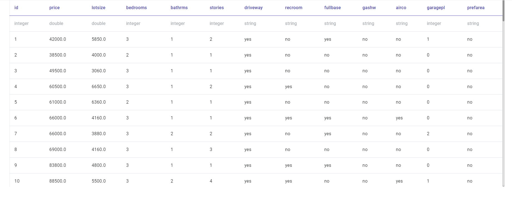
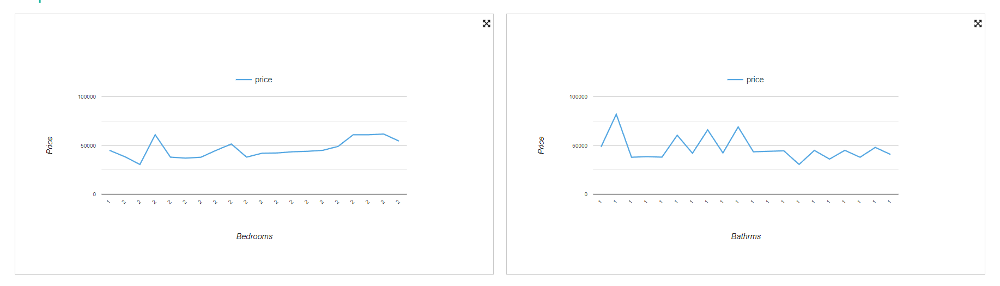

Subplot
=========

This workflow reads in a housing dataset. It then visualize using subplot.

Workflow
-------

The below workflow:

* Reads in the input housing data.
* Visualize housing data using subplot.

   
Reading from Dataset
---------------------

It reads the Dataset Files.

Visualize using subplot
--------------------

It plots multiple parameter graph simultaneously using subplot node.

.. figure:: ../../_assets/tutorials/visualization/sub-plots-config.png
   :alt: Visualization
   :width: 60%

Output result
-------------

