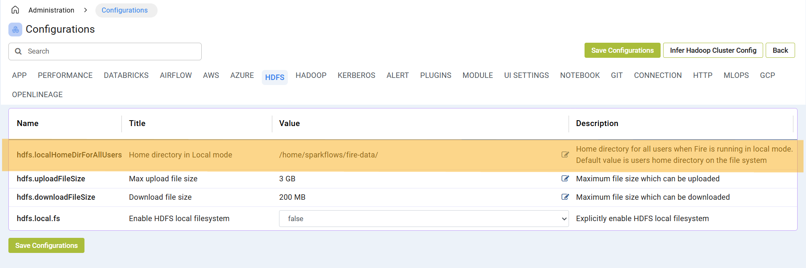

Local Filesystem
=====

Fire Insights enable you use Local Filesystem by default when there is no Compute is enabled or s3 is configured.

By default Fire Insights sample data is being bundled in Fire Insights binary with `data` folder in home directory.

you can copy `data` folder to your specified location and configured the path to use in Fire Insights.

you can login to Fire Insights go to ``Administration/Configurations`` and update below in ``HDFS`` tab:

::

    hdfs.localHomeDirForAllUsers : $PATH of data configured

