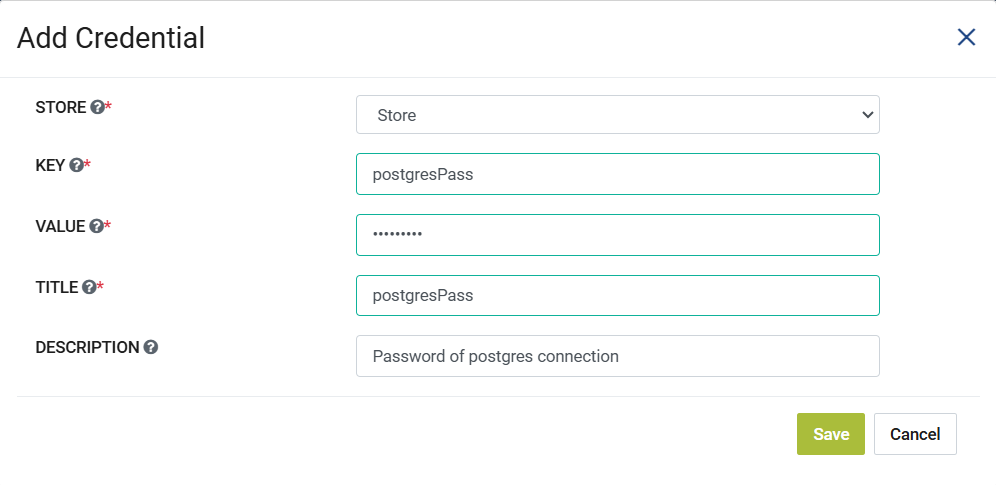

Application Credentials
============================

Sparkflows enables you to create a Application Credentials. They store a Key and its Value. They are associated to Local Store Type Credential Stores and their values can be used during the Create/Update of Application Connection through Macros.

Below are the steps for creating a Application Credential:

Go to Administration -> Credential Store
-------------

Login to Sparkflows then navigate to Administration page and then click on the Credential Store card.

.. figure:: ../../_assets/credential_store/local-credential-store/credential-store-card.png
   :alt: Credential Store Card
   :width: 45%

Now select the **Credential** navigation tab and then click on **Add Credentials** button.

Now add the detials for the Credential where in we select the Credential Store we created of Store Type **Local**, then pass the value for the **Key** and **Value** fields. Here since we are creating a postgres related Application Credential as an example we can add lets say the password in the Value field, then give it a title and optionally add a description if needed like the below image. Then click on **Save** button to create the Application Credential.

*Note: During the creation of Application Credential the Key field has a validation check where in the Key has to be unique for the selected Local Credential Store in the dropdown.*

During the Edit of an Application Credential, the fields such as **Store, Key, Title and Description** can be updated individually by clicking the **Edit Details** icon located in the **Actions** column for the respective Application Credential while the **Value** field can be updated separately by clicking on **Edit Value** icon located in the same **Actions** column.

This Application Credential can be used along with its associated Local Credential Store within the Create/Edit of Application Connection through Credential Store specific Macros.
