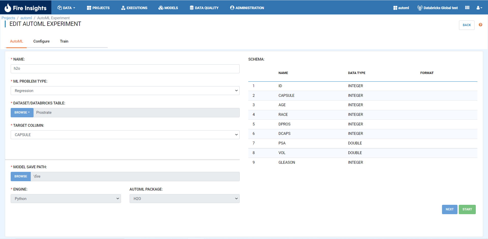
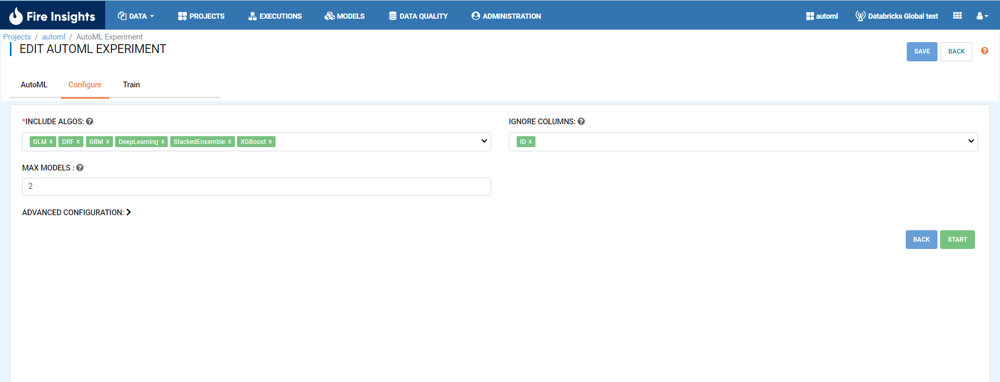
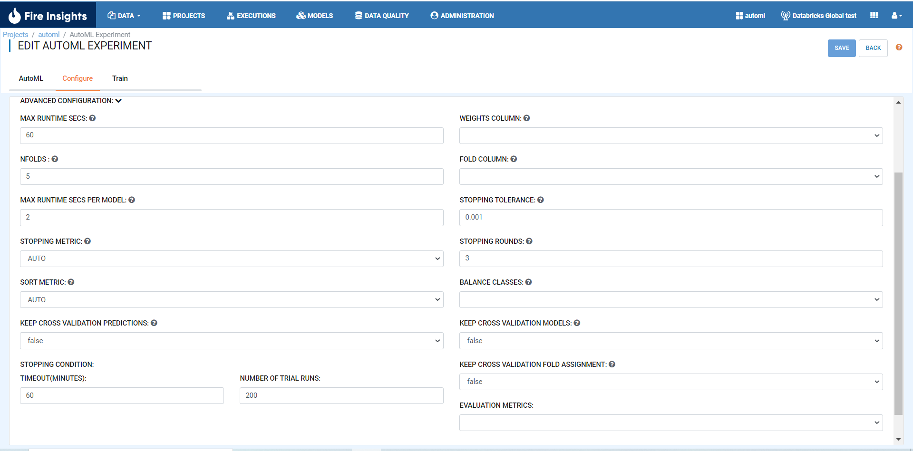
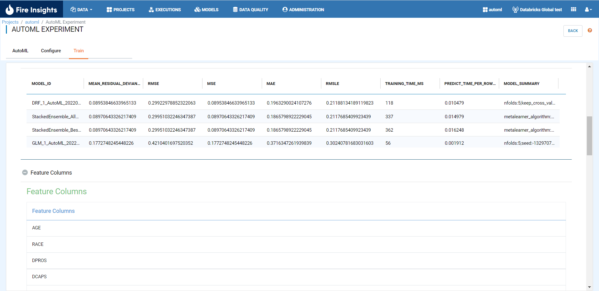

H2O 
======================

Create the AutoML experiment with H2O package by selecting H2O in package field. Next select the problem type as either a Regression or Classification problem to be solved along with the target column name (outcome) in configuration.

* Add required details and select AutoML package as H2O

* Add H2O configurations 

      
      

      
      
* Save button will save the experiment details. Clicking on start button will run the experiment on the training data. On completion of the AutoML run it will display the Leaderboard and feature columns.

