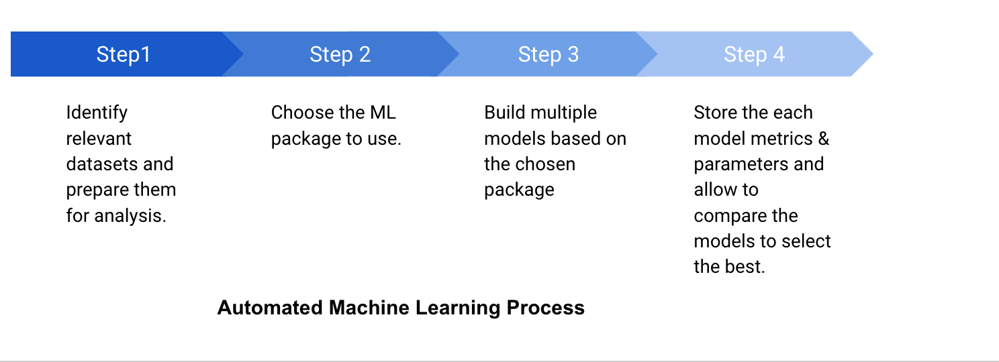
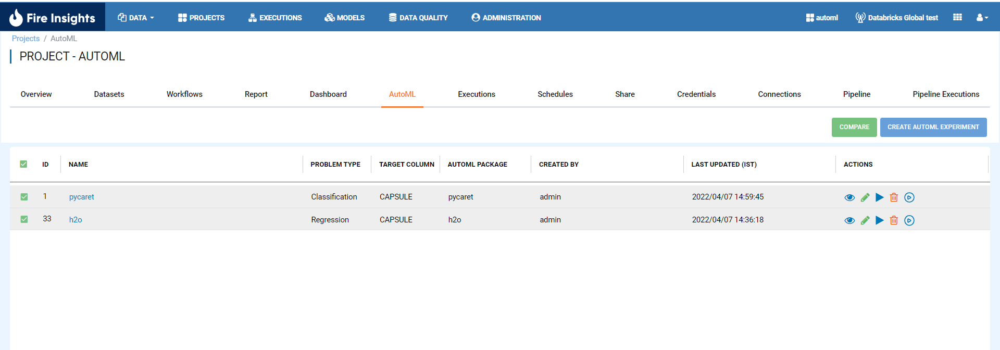
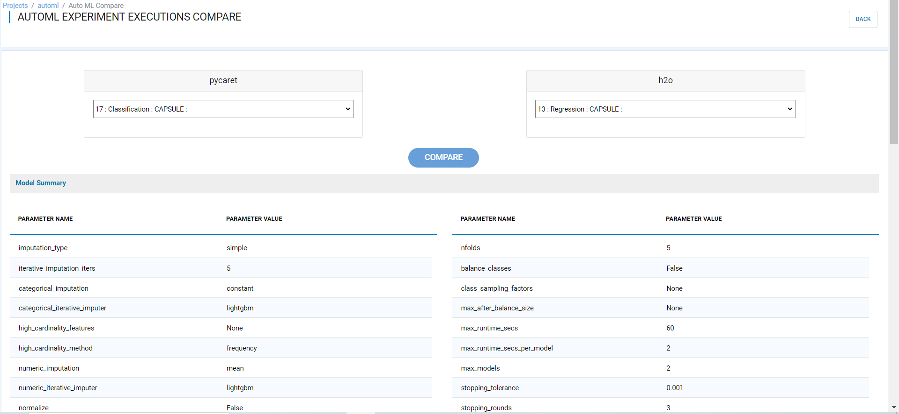
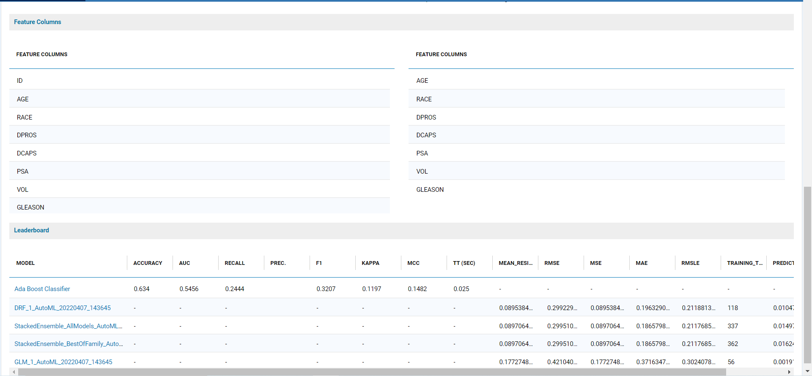
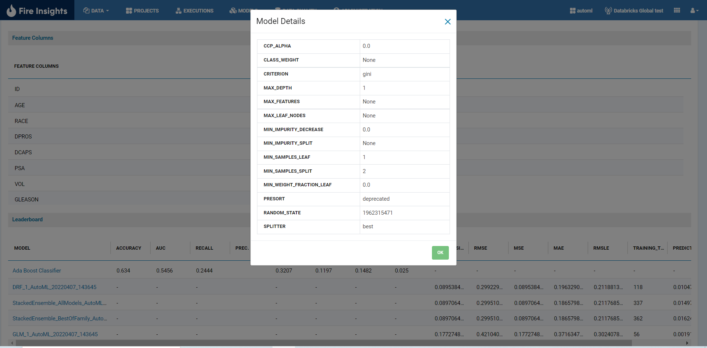

Auto-ML
=====================

AutoML aims to automate all the tasks involved in developing and deploying machine learning models, from cleaning the raw data all the way through to parameter optimization.
As well as making data scientists much more productive, AutoML tools can be used by non-experts to run the same dataset against combinations of hundreds or even thousands of different algorithms simultaneously to arrive at the optimal AI model. Contrast that scenario with a data scientist hand coding to create a data pipeline, build the model, do all the testing and then run the dataset against a handful of algorithms.

Fire provide the option to create the AutoML experiments by selecting the data and type of package. Each experiment will provide the leaderboard with different models & the hyperparameters used in the experiments.All experiments can be compared to decide the best fit for that particular use case.

      

Currently fire supports h2o and pycaret automl packages.
--------------------------------------------

.. panels::
    :container: container-lg pb-2

    :doc:`/user-guide/auto-ml/h2o`

    H2O AutoML packge is used in experiments.

    ---

    :doc:`/user-guide/auto-ml/pycaret`

    Pycaret automl package is used in experiments.

.. toctree::
   :hidden:

   h2o.rst
   pycaret.rst
   

Model Comparison
------------------

* Select 2 auto-ml experiment to compare accross model and the click on compare button to compare executions of different experiment.

      
      
* Select execution of 2 different experiment to comapre
      
* Now, After selecting click compare button to view comparison

      
      

      
* On clicking model name can view model details

      
