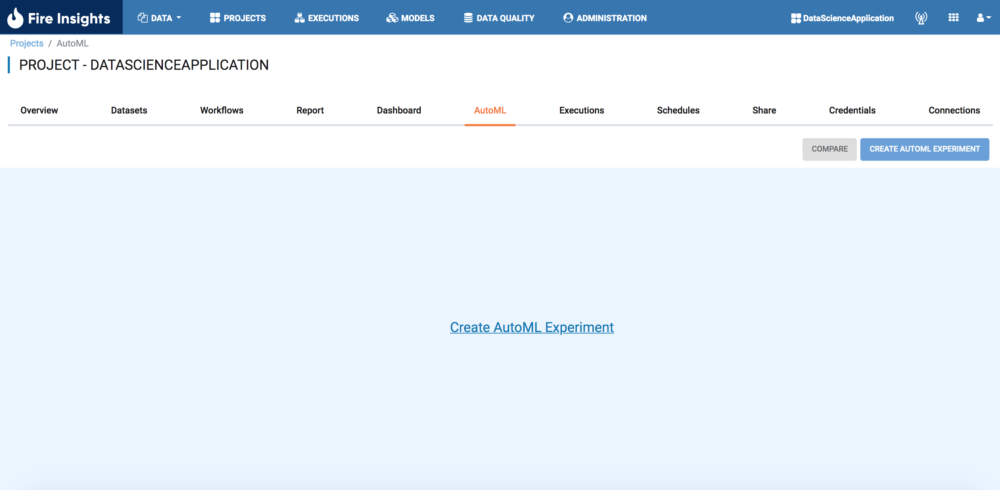

AutoML
=====================

AutoML (Automated Machine Learning) is a process of automating the entire machine learning pipeline, from data preparation and feature engineering to model selection and hyperparameter tuning. The goal of AutoML is to make the process of building and deploying machine learning models faster, easier, and more accessible, particularly for people with less experience in machine learning. 

AutoML systems automate the entire machine learning pipeline by using a combination of techniques such as evolutionary algorithms, Bayesian optimization, and gradient-based optimization. They also provide an interface to interact with the system, like providing feedback on results, choosing model and stopping the pipeline.

The main advantage of AutoML is that it allows users to build machine learning models without having to have a deep understanding of the underlying algorithms or the technical details of the process. This can make it faster, easier and more accessible to create high-performing models, especially for people with less experience in machine learning. Additionally, since AutoML uses many different algorithms and parameters, it can be more robust to different types of data and problems, making it a more general-purpose solution

Fire provides the option to create the AutoML experiments by selecting the data and type of package. Each experiment will provide the leaderboard with different models & the hyperparameters used in the experiments.All experiments can be compared to decide the best fit for that particular use case.

.. figure:: ../../_assets/auto-ml/automl-steps.png
      :alt: auto-ml
      :width: 90%
      

By default in fire AutoML function is disabled.And once is enabled in the fire configuration, user's can see the option to create the automl experiments in project page.

      

Currently fire supports H2O and Pycaret AutoML packages.
--------------------------------------------

.. panels::
    :container: container-lg pb-2

    :doc:`/user-guide/auto-ml/h2o`

    H2O AutoML packge is used in experiments.

    ---

    :doc:`/user-guide/auto-ml/pycaret`

    Pycaret AutoML package is used in experiments.

.. toctree::
   :hidden:

   h2o.rst
   pycaret.rst
   

Model Comparison
------------------

* Select 2 AutoML experiment to compare accross model and then click on the compare button to view and compare executions of different experiment.

.. figure:: ../../_assets/auto-ml/ml-compare-1.PNG
      :alt: auto-ml
      :width: 90%
      
      
* Select execution of 2 different experiment to compare
      
* Clicking the compare button will display the comparison among the two models

.. figure:: ../../_assets/auto-ml/ml-compare-2.PNG
      :alt: auto-ml
      :width: 90%
      
      
.. figure:: ../../_assets/auto-ml/ml-compare-3.PNG
      :alt: auto-ml
      :width: 90%
      
* On clicking model name we can view the model details

.. figure:: ../../_assets/auto-ml/ml-compare-4.PNG
      :alt: auto-ml
      :width: 90%      

