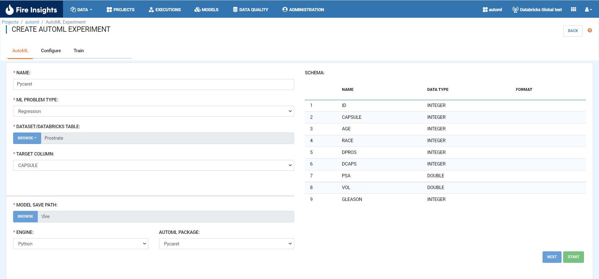
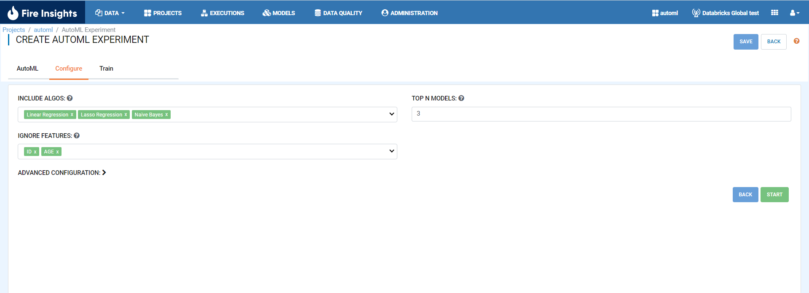
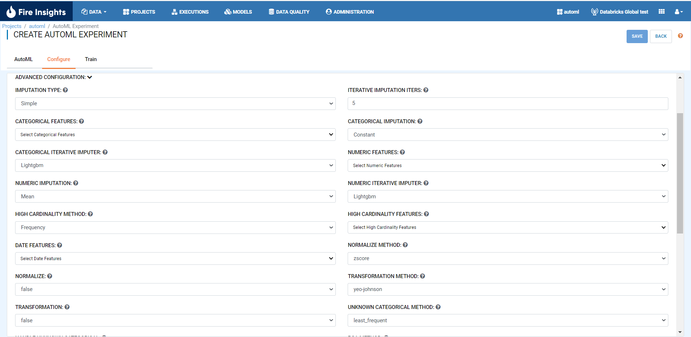
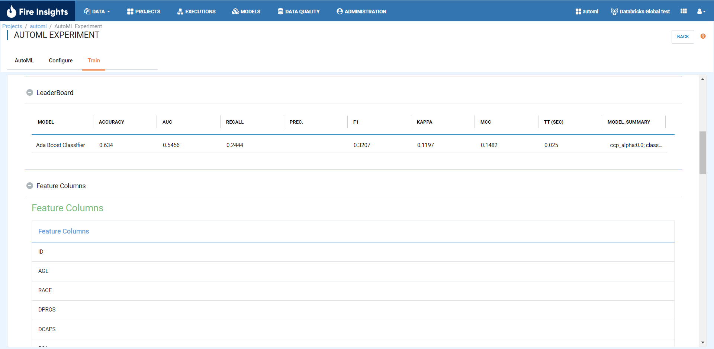

PyCaret 
======================

Create the AutoML experiment with PyCaret package by selecting PyCaret from the dropdown in the package field. Next, select the type of problem to run the experiment as either Regression or Classification with target column name in configuration.

* Add required details and select AutoML package as PyCaret.

* Add Pycaret Configurations. 

      
      

      
      
* Click on the ``SAVE`` button to save the AutoML experiment details. Click on the ``START`` button to run the training data on the selected algortihms. On completion of the AutoML run, the Leaderboard and feature columns will be displayed as shown below.

