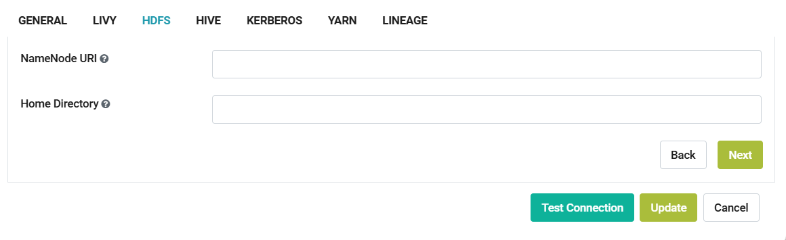
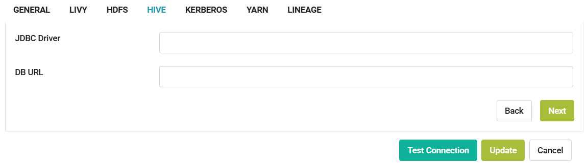
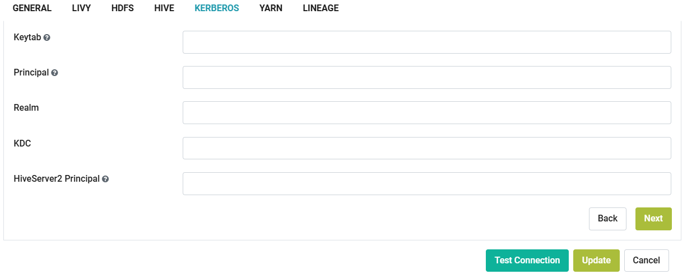
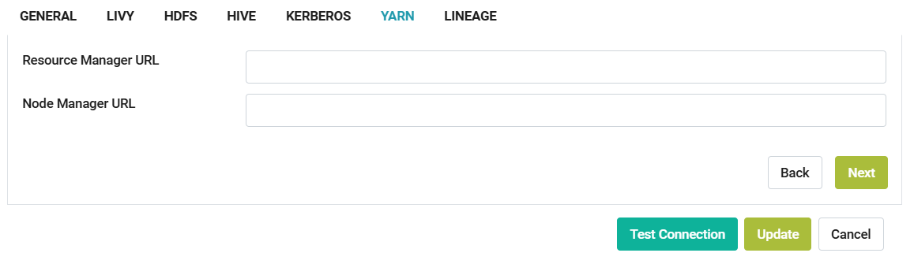
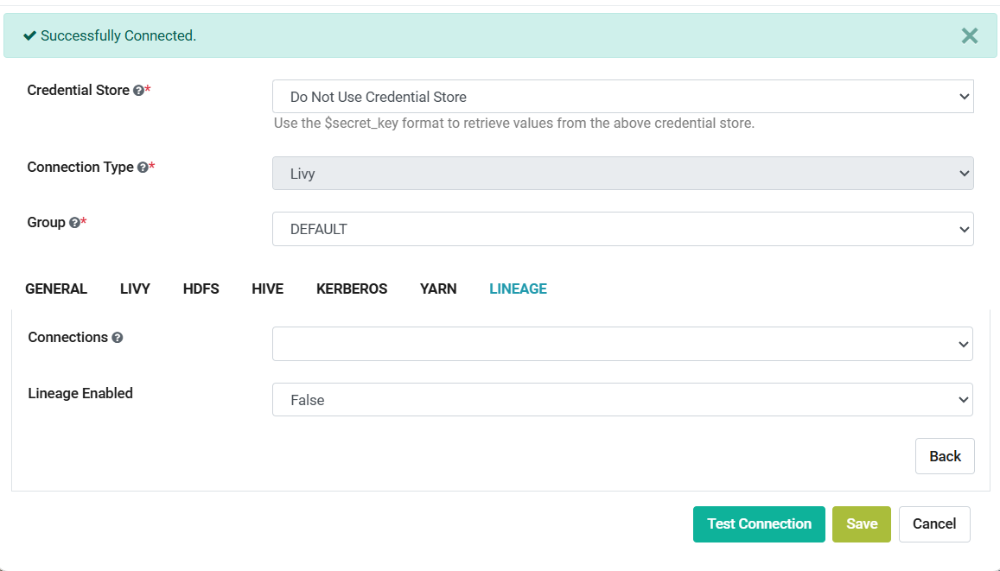
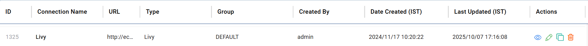

Livy Connection
--------------

Sparkflows enables you to create "Apache Livy Connection" and use it to submit jobs/workflows. Connections can be at various levels:

  * **Global:** Everyone has access to these connections.
  * **Group:** Users belonging to the group have access to these connections.
  * **Project:** The owner of the project and the groups with which the project has been shared will have access to the project level connections.

Follow the steps below to create a "Livy Connection" in Sparkflows.

Step 1 : Enable Livy in Sparkflows
===========

* Login to **Sparkflows**.
* Navigate to **Administration -> Configurations -> CONNECTION**.
* Enable Livy connection by setting the **value** of below parameter to **true** and save the configuration.

  ::

     connection.livy.enabled = true

  .. figure:: ../../../../_assets/aws/livy/livy_configuration.PNG
     :alt: livy
     :width: 60%

Step 2 : Add a Connection for Group
===========

* Once you save the above configuration, navigate to **Administration -> Global/Group Connections** as shown below:

  .. figure:: ../../../../_assets/aws/livy/livy_7.png
     :alt: livy
     :width: 50%
   
* From the Connections page click on **Add Connections** button and choose **Add Connection For Group** from the dropdown, as shown below:  

  .. figure:: ../../../../_assets/aws/livy/livy_8.png
     :alt: livy
     :width: 50%

* In the 'Add Connection' dialog box, select connection category as **Compute** and connection type as **Livy**, as shown below:

  .. figure:: ../../../../_assets/aws/livy/livy_5.png
     :alt: livy
     :width: 50%
   
   
Step 3 : Add Additional Parameters as per your Environment
======

Once you have selected the connection type & groups, add the additional connection parameters needed. For more details refer the following tables and images:

For GENERAL Tab
++++

.. list-table:: 
   :widths: 10 20 30
   :header-rows: 1

   * - Title
     - Description
     - Value
   * - Connection Name
     - Connection Name
     - Name of Connection
   * - Postback Url
     - Postback Url
     - Postback Url through which Livy sent result back to Sparkflows
   * - Auth Type 
     - Auth Type 
     - Value can be None, Basic or OAUTH
   * - Title 
     - Title of Selected Connection
     - Title of Selected Connection  
   * - Description 
     - Connection Description 
     - Connection Description
   * - Url
     - Url for selected Connection type
     - Add URL for Livy Connection
   * - Driver Class
     - Driver Class for selected Connection type 
     - It Comes with default value  
     
.. figure:: ../../../../_assets/aws/livy/livy_1.png
   :alt: livy
   :width: 50%

.. figure:: ../../../../_assets/aws/livy/livy_2.png
   :alt: livy
   :width: 50%

For LIVY Tab
++++++
.. list-table:: 
   :widths: 10 20 30
   :header-rows: 1

   * - Title
     - Description
     - Value
   * - Jars
     - Jars to be used in emr livy session
     - Jars path located in S3 Location
   * - File
     - File contains application to execute
     - py file path located in s3 Location 
   * - Pyspark Files
     - Pyspark Files to be used in emr livy session
     - Pyspark file located in S3 Location  
   * - Files
     - Files to be used in emr livy session
     - Any Files if needed
   * - Archives Files
     - Archives Files to be used in emr livy session
     - Value  
   * - Driver Memory 
     - Driver Memory to be used in emr livy session
     - Driver Memory if any specific memory you need to pass
   * - Driver Cores
     - Driver Cores to be used in emr livy session
     - Driver Cores if any specific Cores you need to pass  
   * - Executor Memory
     - Executor Memory to be used in emr livy session
     - Executor Memory if any specific Executor Memory you need to pass  
   * - Executor Cores
     - Executor Cores to be used in emr livy session
     - Executor Cores if any specific Executor Cores you need to pass  
   * - Num Executors
     - Num Executors to be used in emr livy session
     - Num Executors if any specific Num Executors you need to pass  
   * - Conf 
     - Conf to be used in emr livy session
     - Conf to be used in emr livy session  
   * - Livy Log File S3 location
     - Location to be used to store Livy Log
     - Update the path ie s3://sparkflows-bucket/logs  
     
.. figure:: ../../../../_assets/aws/livy/livy_6.png
   :alt: livy
   :width: 50%

.. Note:: Make sure to upload ``fire-spark_x.y.z-core-x.y.z-jar-with-dependencies.jar`` & "workflowexecutecloud.py" to S3 bucket and is accessible from Saprkflows webserver UI. This jar is available in Sparkflows binary. Untar the binary to find it inside ``fire-x.y.z/fire-core-lib`` & ``fire-x.y.z/dist/``. 

.. figure:: ../../../../_assets/aws/livy/livy_3.png
   :alt: livy
   :width: 50%

.. Note:: You can ignore the other tabs if using Livy

For HDFS Tab
++++++

.. list-table:: 
   :widths: 10 20 30
   :header-rows: 1

   * - Title
     - Description
     - Value
   * - NameNode URI
     - Namenode URI - hdfs://<namenode host>:<namenode port> - Used when running on the Hadoop Cluster. Set it to file:// when running with Spark Standalone cluster and no HDFS
     - NameNode URI for HDFS
   * - Home Directory
     - Home Directory under which the various user directories exist, when running on an HDFS cluster. eg: /user
     - Value  
 

For HIVE Tab
+++++

.. list-table:: 
   :widths: 10 20 30
   :header-rows: 1

   * - Title
     - Description
     - Value
   * - JDBC Driver
     - JDBC Driver
     - JDBC Driver for Hive
   * - DB URL
     - JDBC DB URL
     - JDBC DB URL for Hive
     

For KERBEROS Tab
++++++

.. list-table:: 
   :widths: 10 20 30
   :header-rows: 1

   * - Title
     - Description
     - Value
   * - Keytab
     - Keytab
     - Kerberos Keytab for Fire user   
   * - Principal
     - Principal 
     - Kerberos Principal for Fire user  
   * - REALM
     - REALM
     - Value   
   * - KDC
     - KDC
     - Value 
   * - HiveServer2 Principal
     - Kerberos Principal for HiveServer2
     - Value  
     

For YARN Tab
++++++

.. list-table:: 
   :widths: 10 20 30
   :header-rows: 1

   * - Title
     - Description
     - Value
   * - Resource Manager URL
     - Resource Manager URL
     - Value
   * - Node Manager URL
     - Node Manager URL
     - Value
     

For LINEAGE Tab
++++++

.. list-table:: 
   :widths: 10 20 30
   :header-rows: 1

   * - Title
     - Description
     - Value
   * - Connections
     - Connections
     - Select Lineage Connections
   * - Lineage Enabled
     - Lineage Enabled
     - True
     
.. figure:: ../../../../_assets/aws/livy/livy_9.png
   :alt: livy
   :width: 60%

.. Note:: You can ignore the ``LINEAGE`` tab if not being used.

Step 4 : Test & Save the Connection
==========

Once you have updated the above parameters, click on **Test Connection** button. If the connection is successful as shown below, click on **Save** button to save the connection.

The saved livy connection will be displayed in Connections as below:

Documentation
=======

Reference guide : https://docs.sparkflows.io/en/latest/aws/admin-guide/emr/index.html

.. Note:: Make sure that Apache Livy URL should be accessible from Sparkflows webserver URL.
