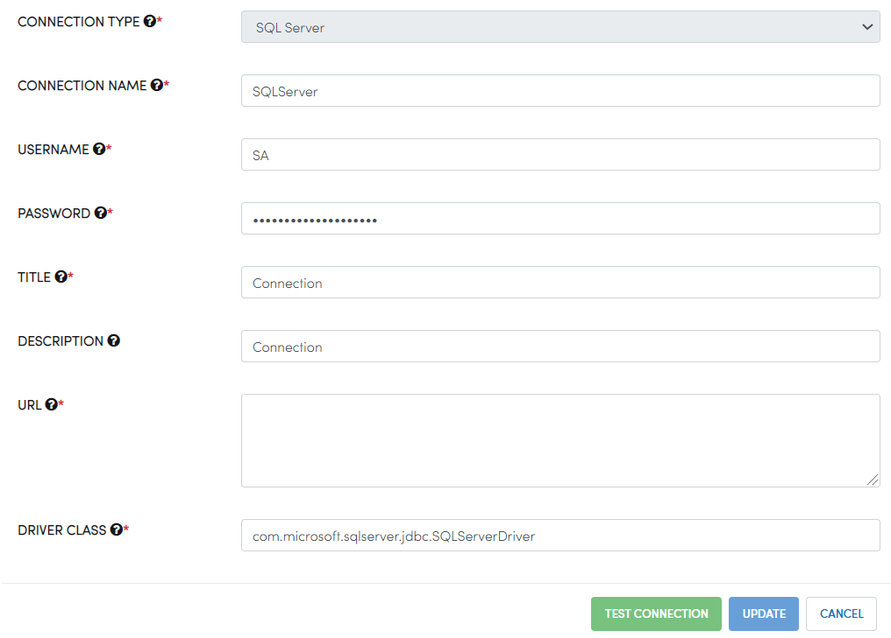
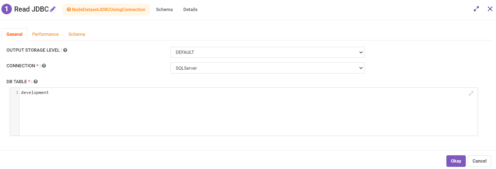

SQL Server
=========

In Fire Insights, Connections can be made to SQL Server. This can be used in the JDBC Connection nodes in the Workflow Editor for reading and writing data to SQL server database.

Creating Connection
-------------------
Create a connection in Fire Insights for SQL Server.

It can be created by the Administrator under Administration/Global Connections. These connections are available for everyone to use.

It can also be created by any user with their Application. In this case, it is only available to the Application and its users.

Specify your SQL Server Username, Password, and JDBC URL and save the details.

We can also test the specified connection before saving the connection details. 

Now we are ready to start using the SQL Server Connection in Fire Insights using JDBC Connection nodes.

