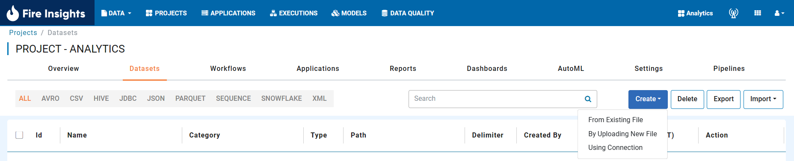
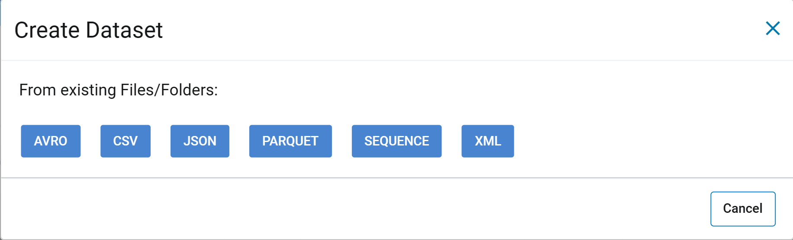
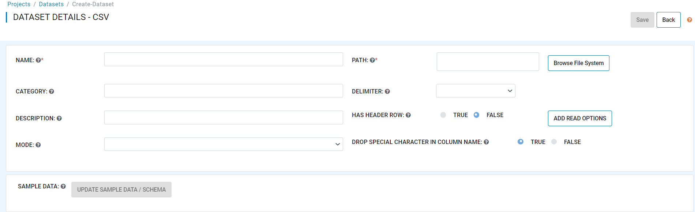
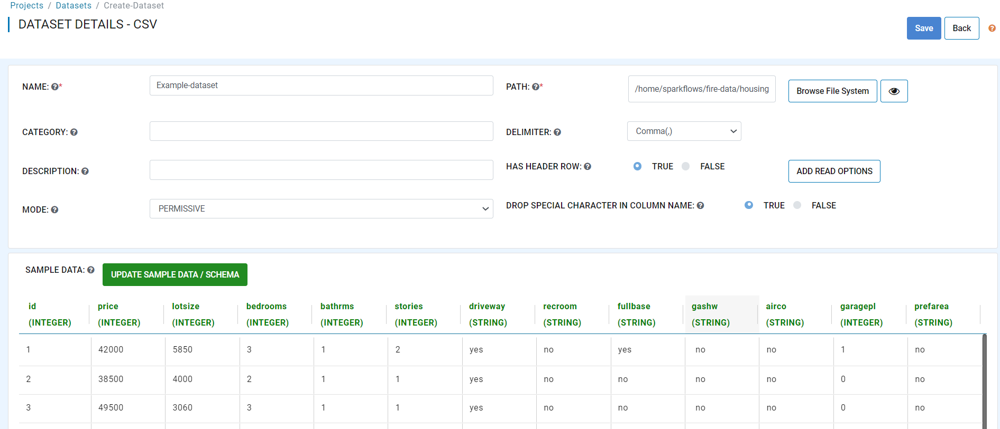
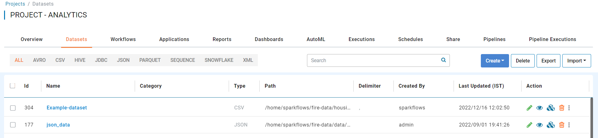

Creating Dataset
===============
 
Overview
-----------------

You can define a new dataset by clicking on the ``Create Dataset`` button on the Dataset page. You can choose to create dataset:

* From Existing File
* By Uploading New File
* Using Connection

It will bring up the dialog box as below. Select the format of the file for which the new dataset is being created.

   
Enter Field Details
-----------------

Below are the details of the fields in the ``Create Dataset`` page:

- **NAME**: Name of the new dataset we are creating.
- **DESCRIPTION**: Description of the new dataset.
- **CATEGORY**: Category of the new dataset.
- **PATH**: It defines the location of the file or directory containing the data files for the dataset. It can either point to a single file, or to a directory containing a set of files. All the files have to have the same schema.
- **DELIMITER**: Delimiter field is also used for CSV/TSV files. It indicates the delimiter to be used between the fields in the data.
- **HAS HEADER ROW**: This is used for CSV/TSV files. It indicates whether the dataset has a header row specifying the name of the columns or not.
- **DROP SPECIAL CHARACTER IN COLUMN NAME**: Drop special character in Column Name, if any.
- **MODE**: Mode for dealing with corrupt records during parsing.

  
 

Update the Schema of the Dataset
-----------------

You can update the schema of the dataset by clicking on ``Update Sample Data/Schema``. It would display sample data for the dataset followed by the schema inferred by Fire Insights.

In this example, the data file did not have a header row. So Fire gave it standard column names of ``C0, C1``, etc.

You can update the column names in the schema based on your data.
 

   

Save the New Dataset
-----------------

Click on the ``Save`` button to save the new dataset created.
 
 

 
 
 
 
 
 
 
 
 

