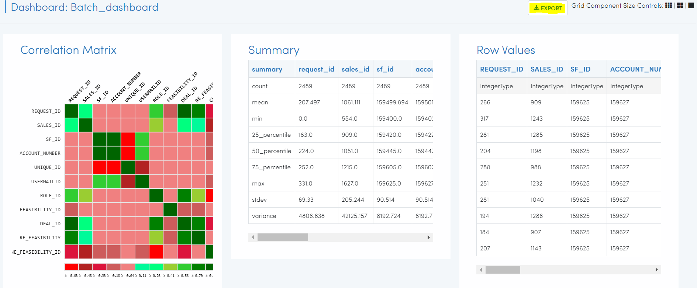
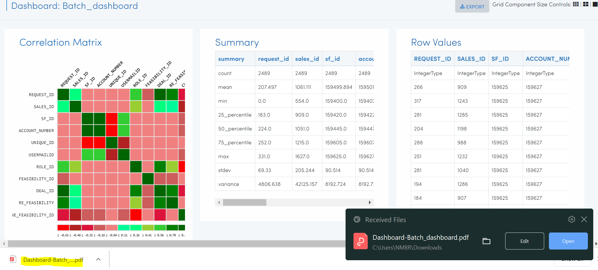
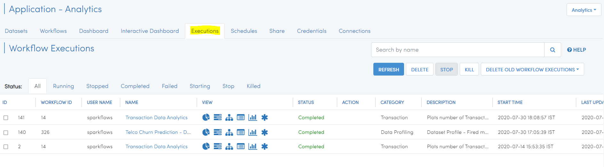
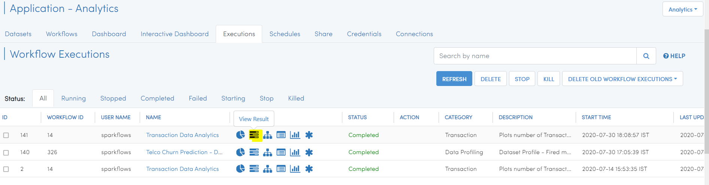
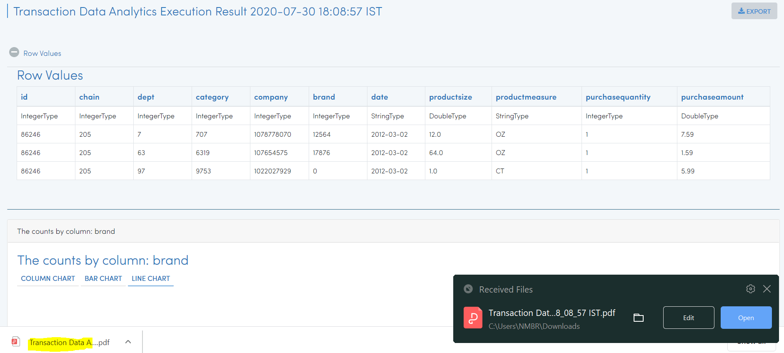

Exporting Visuals
=======================

Sparkflows enables you to export the output, dashboards, and visuals in various ways.

Exporting dashboard
-------------------

Since Sparkflows is browser-based, it makes easy to export the pages as PDF files.

- Go to the dashboard under your application where you have created a batch dashboard.
- Click on the ` `View` ` option to find the ` `Export` ` option. 

   
Clicking on the ` `Export` ` option, ` ` Able to Visualize` ` option etc. will export the whole batch dashboard in PDF format on the local machine.

 
Exporting output
-----------------

Once the workflow is completed, the output result can be exported.

- Go to the application page where you created workflow & successfully executed it.

Clicking on the ``Executions`` tab will display the latest workflow execution on the list page.

On the action icon, you can see ``view result``,  clicking on this will take you to the next page.

On opening the above link, you can view the results from the specific workflow which was executed. You will also get an export option to download the result in a local machine in PDF format.

.. figure:: ../../../_assets/user-guide/exportresult.PNG
   :alt: Dataset
   :width: 80%
   

