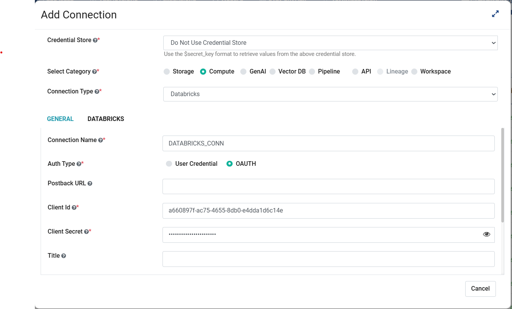

Databricks Connection
=======

Sparkflows enables you to create Databricks connection and use the connection to submit job on respective Databricks cluster. Connections can be at various levels:

  * **Global:** Everyone has access to these connections.
  * **Group:** Users belonging to the group have access to these connections.
  * **Project:** The owner of the project and the groups with which the Project has been shared will have access to the Project level connections.

Below are the steps required to create Databricks connection:

Step 1 : Enable Databricks in Sparkflows
------
* Open the Sparkflows web server URL and log in with your credentials.
* Go to  **Administration -> Configurations -> CONNECTION**.
* Enable Databricks connection by setting the below parameter to **true** and save the configuration.

  ::

    connection.databricks.enabled : true

Step 2 : Navigate to Connections
-----
Go to **Administration -> Global/Group Connections**. These connections are available for everyone to use if defined at **Global** level or for a particular Group if defined at the **Group** level.

 .. figure:: ../../../_assets/installation/connection/databricks_selgrp_global.png
    :alt: connection
    :width: 60%    

Step 3 : Add Connection Details
-----

* Make selection in the **Add Connection** dialog box as shown below, to create **Databricks Compute** connection.

  .. figure:: ../../../_assets/installation/connection/databricks_sel_type.png
    :alt: connection
    :width: 60%    

* After selecting Databricks connection, the connection configuration page will appear with two tabs: **General** and **Databricks**, as shown below.

  .. figure:: ../../../_assets/installation/connection/databricks_general_uc1.png
   :alt: connection
   :width: 60%    

  

Step 4 : Configure the Connection
----
Based on the **Authentication Type** selected, the fields will vary. Choose between **User Credential** and **OAuth**.

To configure the connection, refer the following tables for filling required details for ``General`` Tab and ``Databricks`` Tab:
 
**GENERAL Tab (User Credential):**

.. list-table:: 
   :widths: 10 20 20
   :header-rows: 1

   * - Title
     - Description
     - Value
   * - CREDENTIAL STORE  
     - Select the Credential Store from drop-down
     - Choose specific Credential Store from drop-down or Select Do not use Credential Store
   * - Select Category
     - Select Category of Connection Type
     - Select Compute Connection
   * - CONNECTION TYPE 
     - Select the Connection type from drop-down
     - Choose Databricks as Connection Type
   * - CONNECTION NAME
     - Connection Name
     - Add an unique Connection Name
   * - Auth Type
     - Select the Authentication Type
     - Select the appropriate option as ``User Credential`` 
   * - TOKEN 
     - Token
     - Add token generated
   * - POSTBACK URL
     - Fire Insights Post Back URL
     - Add Fire Insights Post Back URL
   * - TITLE 
     - Title for selected Connection
     - Add an unique Title
   * - DESCRIPTION
     - Connection Description
     - Add some Connection Description
   * - URL
     - Jdbc url for databricks connection
     - Add Jdbc Url for Databricks Connection. Example: jdbc:databricks://HOST_NAME:443/default;transportMode=http;ssl=1;httpPath=sql/protocolv1/o/7174905206826341/0109-043115-vc4yc9ai;AuthMech=3;UID=token;PWD=<personal-access-token>

**GENERAL Tab (OAUTH):**

.. list-table:: 
   :widths: 10 20 20
   :header-rows: 1

   * - Title
     - Description
     - Value
   * - CREDENTIAL STORE  
     - Select the Credential Store from drop-down
     - Choose specific Credential Store from drop-down or Select Do not use Credential Store
   * - Select Category
     - Select Category of Connection Type
     - Select Compute Connection
   * - CONNECTION TYPE 
     - Select the Connection type from drop-down
     - Choose Databricks as Connection Type
   * - CONNECTION NAME
     - Connection Name
     - Add an unique Connection Name
   * - Auth Type
     - Select the Authentication Type
     - Select the appropriate option as ``OAUTH``
   * - POSTBACK URL
     - Fire Insights Post Back URL
     - Add Fire Insights Post Back URL
   * - Client ID 
     - Client ID for the connection
     - Enter Client ID for the connection
   * - Client Secret 
     - Client Secret for the connection
     - Enter Client Secret for the connection
   * - TITLE 
     - Title for selected Connection
     - Add an unique Title
   * - DESCRIPTION
     - Connection Description
     - Add some Connection Description
   * - URL
     - Jdbc url for databricks connection
     - Add Jdbc Url for Databricks Connection. Example: jdbc:databricks://HOST_NAME:443/default;transportMode=http;ssl=1;httpPath=sql/protocolv1/o/7174905206826341/0109-043115-vc4yc9ai;AuthMech=3;UID=token;PWD=<personal-access-token>

**DATABRICKS Tab:**

.. list-table:: 
   :widths: 10 20 20
   :header-rows: 1

   * - Title
     - Description
     - Value
   * - Fire core jar
     - path of Fire core jar dependencies
     - Absolute path of Fire core jar  
   * - Python file
     - path of Pyspark main file
     - Absolute path of Pyspark main file
   * - Fire pyspark libraries
     - path of Fire pyspark libraries
     - Absolute path of Fire pyspark libraries
   * - DBFS Scratch directory
     - Scratch directory on DBFS where it have Read/Write/Delete Permissions.
     - Absolute path ex. dbfs:/FileStore

.. figure:: ../../../_assets/installation/connection/databricks_other.PNG
   :alt: connection
   :width: 60%    

Step 5 : Test & Save the Connection
-----

* After filling in all required fields, test the connection by clicking on ``Test Connection`` button.

* If the connection validation is successful, click on ``Save`` button to save the connection. Once you save the connection, it can be used for submitting the job on specific Databricks cluster.

**Documentation**
+++++++++++++++++

Reference guide : `Databricks User Guide Documentation. <https://docs.sparkflows.io/en/latest/databricks/user-guide/index.html>`_

.. note:: Make sure to add 'POSTBACK URL' through which jobs running on Databricks would send back results to Sparkflows using this URL, else it will use the default ``app.postMessageURL`` defined in configuration.

