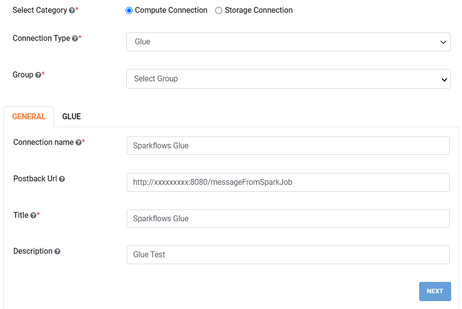

AWS Glue Connection
----------------

Sparkflows enables you to create Aws Glue connection and use the connection to submit job on Aws Glue. Connections can be at various levels:

  * Global  : Everyone has access to these connections.
  * Group   : Users belonging to the group have access to these connections.
  * Project : The owner of the project and the groups with which the Project has been shared with have access to the Project level connections.

Follow the steps below to create Glue connection:

Step 1 : Enable Glue in Sparkflows
+++++

* Login to Sparkflows application i.e **Fire Insights**.
* Go to  **Administration -> Configurations -> Connection**
* Enable Glue connection by setting the below parameter to **true** and save the configuration.

  ::

    connection.glue.enabled : true

Step 2 : Create Global Connection
+++++

* Navigate to **Administration -> Global/Group Connections** as shown below:

  .. figure:: ../../../_assets/installation/connection/create_connections/administration_page.png
     :alt: create_connections
     :width: 60%

* Click on **Add Connection** button from the connections page.

Step 3 : Add Connection for group
+++++

* Choose **Add Connection For Group** from the dropdown which will pop up a new window.

  .. figure:: ../../../_assets/credential_store/create-snowflake-connection/connections-add.png
      :alt: Credential Store
      :width: 65%

* Select category as **Compute Connection** and connection type as **Glue**, as shown below:

  .. figure:: ../../../_assets/installation/connection/glue_connection.PNG
     :alt: livy
     :width: 60%

Step 4 : Update the parameters 
+++++

* Now, update the below parameters as per AWS configurations. For more details, refer the following table and the image shown.

**For GENERAL Tab :**

.. list-table:: 
   :widths: 10 20 30
   :header-rows: 1

   * - Title
     - Description
     - Value
   * - Connection name
     - Connection name
     - Connection name
   * - Postback Url
     - Postback Url
     - Postback Url
   * - Title
     - Title
     - Title
   * - Description
     - Connection Description
     - Connection Description

**For GLUE Tab :**

.. list-table:: 
   :widths: 10 20 30
   :header-rows: 1

   * - Title
     - Description
     - Value
   * - Script Location
     - Glue script location.
     - s3://aws-glue-scripts/scripts/FireGlueApp.scala
   * - IAM Role
     - AWS IAM Role, role has policy to access S3, EC2, etc.
     - AWSGlueServiceRole-Sparkflows
   * - Glue Main Class  
     - Glue Main class to execute.
     - FireGlueApp
   * - Default Arguments
     - Pass any parameters as default arguments.
     - --TempDir s3://aws-glue-temporary;,--postBackUrl http://host_name:8080/messageFromSparkJob
   * - Glue Version
     - Glue Version. If empty it takes default glue version.
     - 3.0
   * - Glue Language
     - Glue Language. Input should be scala or python.
     - scala
   * - Extra Jars
     - Extra Jar file path pass in default arguments.
     - s3://aws-glue-scripts/fire-spark_3.2.1-core-3.1.0-jar-with-dependencies.jar
   * - S3 Path
     - S3 bucket location where workflow JSON file gets uploaded for execution.
     - s3://aws-glue-scripts/workflow-json
   * - Glue Connections
     - Glue connection names. Input the glue connection names as comma separated value like Glue-conn, Glue-conn1.
     - Glue-Fire
   * - AWS Region
     - AWS Region of Glue.
     - AWS Region where Glue is deployed
   * - Workflow Files Directory
     - Directory used for Writing the workflow files.
     - Directory used for Writing the workflow files

.. note:: Copy ``fire-spark_3.2.1-core-3.1.0-jar-with-dependencies.jar`` from ``fire-x.y.z/fire-core-jar`` bundled in Fire tgz file.

Step 5 : Save the connection
++++++

* Once you have entered the above parameters, click on  **Save** button to save the connection.

Documentation
+++++

Reference guide : https://docs.sparkflows.io/en/latest/aws/admin-guide/glue-integration/index.html
