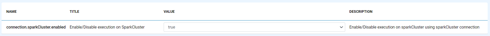
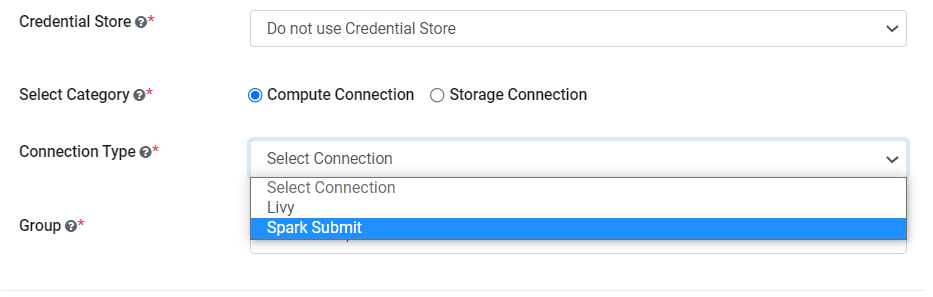
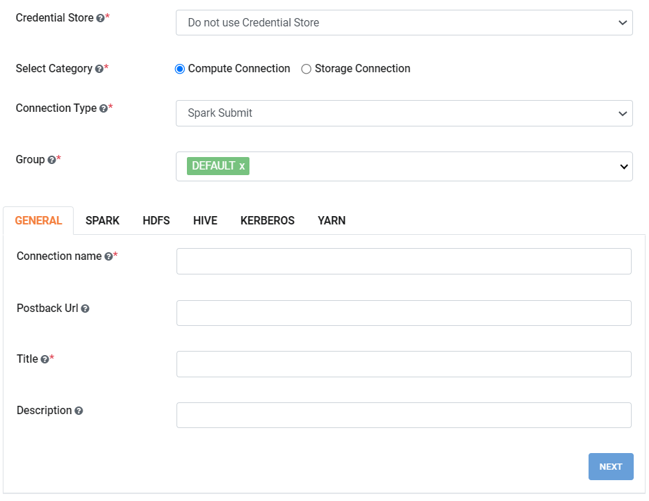
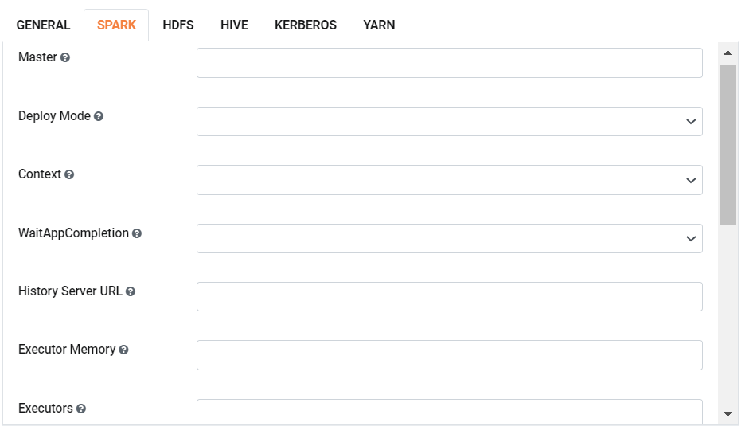
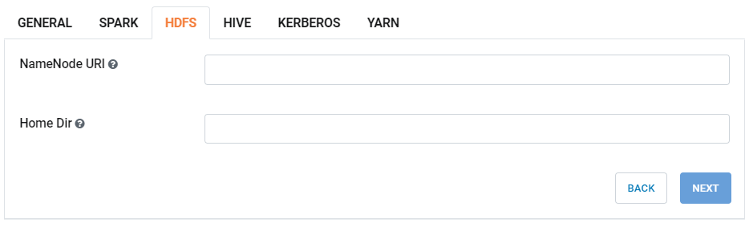
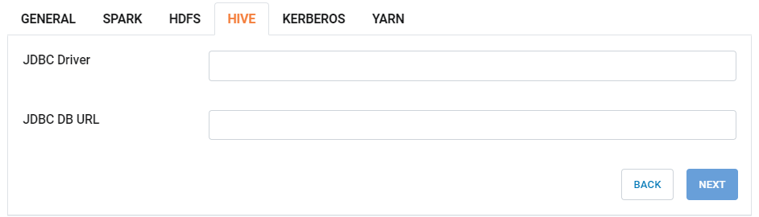
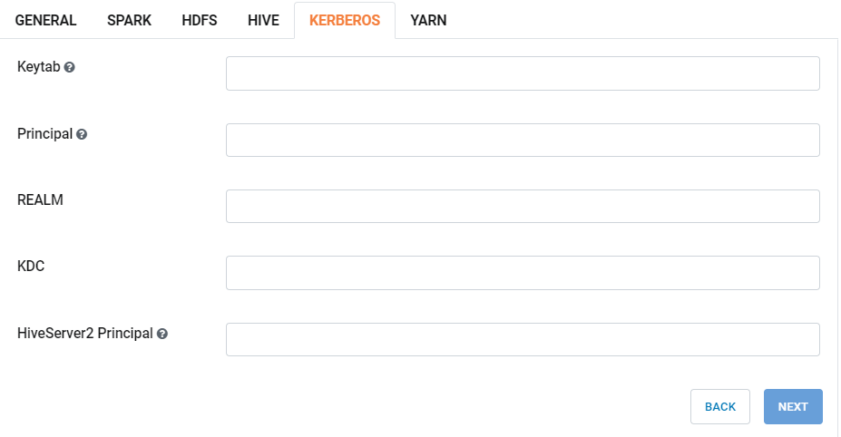
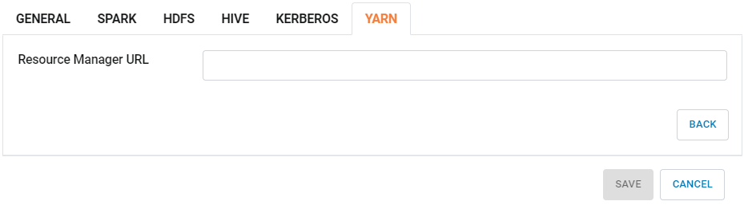

Spark Submit Connection
===============

Sparkflows enables you to create spark submit connection and use it to submit jobs/workflows. Connections can be at various levels:

  * Global  : Everyone has access to these connections.
  * Group   : Users belonging to the group have access to these connections.
  * Project : The owner of the project and the groups with which the project has been shared with have access to the project level connections.

Below are the steps to create a Livy connection in Sparkflows:

1. Enable spark-submit in Sparkflows:

Login to ``Sparkflows`` application -> ``Administration`` -> ``Configurations`` -> ``Connection`` -> and enable spark-submit connection by setting the below parameter:

::

    connection.sparkCluster.enabled	 : true

2. Create global connections:

Once you save the above configuration, navigate to ``Administration`` -> ``Global Connections`` -> ``Add Connections`` as shown below:

.. figure:: ../../../_assets/aws/livy/administration.png
   :alt: livy
   :width: 60%
   
3. Add connection for group:

Navigate to ``Administration`` -> ``Global Connections`` -> ``Add Connections`` -> ``Add Connection For Group`` which pop up a new windows -> Select ``Compute Connection`` and other parameters as shown below:

   

   
4. Additional parameters as per your environment:

Once you  have selected the connection type & groups, add the additonal connection parameters needed. For more details on the additional parameters refer the following images and tables:

For GENERAL tab :

.. list-table:: 
   :widths: 10 20 30
   :header-rows: 1

   * - Title
     - Description
     - Value
   * - Connection name
     - Connection Name
     - Name of Connection
   * - Postback Url
     - Postback URL
     - Postback Url through which Spark Cluster sent result back to Fire Insights
   * - Title 
     - Title of Selected Connection
     - Title of Selected Connection  
   * - Description 
     - Connection Description 
     - Connection Description
        

For SPARK tab :

.. list-table:: 
   :widths: 10 20 30
   :header-rows: 1

   * - Title
     - Description
     - Value
   * - Master
     - Spark-Submit run locally or on the cluster
     - possible value would be (local/yarn/spark)
   * - Deploy Mode
     - Whether to deploy spark driver on the worker node (cluster) or locally.
     - client/cluster  
   * - Context
     - Whether to use SQL Context or Hive Context.
     - SQLContext or HiveContext
   * - WaitAppCompletion
     - Whether spark-submit should wait for YARN App Completion
     - Whether spark-submit should wait for YARN App Completion  
   * - History Server URL 
     - Spark History Server URL
     - Spark History Server URL
   * - Executor Memory
     - Spark Executor Memory size to be used in spark-submit. Not used if it is empty.
     - Spark Executor Memory size to be used in spark-submit. Not used if it is empty.  
   * - Executors
     - Enable dynamic allocation instead on the spark cluster - spark.dynamicAllocation.enabled
     - Not used  
   * - Executor Cores
     - Number of Spark Executor Cores to be used in spark-submit. Not used if its value is less than or equal to 0
     - Not used if its value is less than or equal to 0  
   * - Command
     - Use spark2-submit with spark2, depending on your setup
     - by default it should tak spark-submit
   * - Impersonate Users
     - Whether to impersonate the logged in user, or run everything as the user Fire is running with
     - update accordingly  
   * - Spark Submit jar
     - Absolute path of the Fire jar file to be used for submitting the spark jobs
     - Absolute path of the Fire jar file to be used for submitting the spark jobs
   * - Spark Submit zip
     - Absolute path of the Python zip file to be used for submitting the spark jobs
     - Absolute path of the Python zip file to be used for submitting the spark jobs
   * - Workflow Files Directory
     - Directory used for writing the workflow files. An HDFS location can also be specified. 
     - eg: hdfs:///tmp/fire/workflowsUse an HDFS location when running in YARN cluster mode  
     
     
     

For HDFS tab :

.. list-table:: 
   :widths: 10 20 30
   :header-rows: 1

   * - Title
     - Description
     - Value
   * - NameNode URI
     - NameNode URI 
     - NameNode URI for HDFS
   * - Home Dir
     - Home Dir under which various directories exist
     - Value  
 

For HIVE tab :

.. list-table:: 
   :widths: 10 20 30
   :header-rows: 1

   * - Title
     - Description
     - Value
   * - JDBC Driver
     - JDBC Driver
     - JDBC Driver for Hive
   * - JDBC DB URL
     - JDBC DB URL
     - JDBC DB URL for Hive
     

For KERBEROS tab :

.. list-table:: 
   :widths: 10 20 30
   :header-rows: 1

   * - Title
     - Description
     - Value
   * - Keytab
     - Keytab
     - Kerberos Keytab for Fire user   
   * - Principal
     - Principal 
     - Kerberos Principal for Fire user  
   * - REALM
     - REALM
     - Value   
   * - KDC
     - KDC
     - Value 
   * - HiveServer2 Principal
     - Kerberos Principal for HiveServer2
     - Value  
     

For YARN tab :

.. list-table:: 
   :widths: 10 20 30
   :header-rows: 1

   * - Title
     - Description
     - Value
   * - Resource Manager URL
     - Resource Manager URL
     - Value  
     

5. Save connection :

Once you have updated the above parameters, click on  ``Save`` the connection to save the newly created spark submit connection.

.. Note:: Make sure that the above configured configuration should be accessible from Sparkflows web server URL. 
