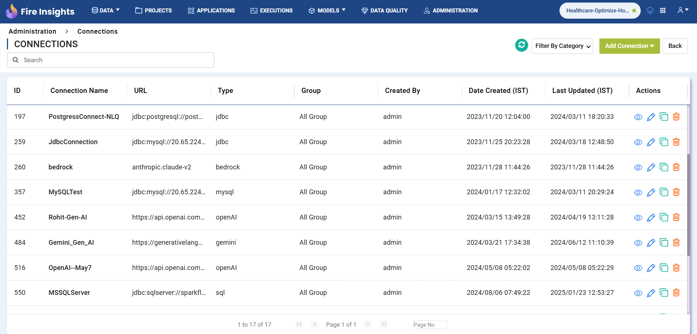

Connections
-----------

Fire Insights enables you to create different connections. It offers the following three types of Connections:

#. **Compute Connections -** like Databricks, AWS Glue, Livy, and Spark Submit connection.

#.  **Storage Connections -** like MySQL, Snowflake, PostgreSQL, Redshift, SQL Server, SFTP, Cassandra and Sybase connection.   

#. **GenerativeAI Connections -** like OpenAI, Azure OpenAI, Nvidia, Databricks LLM, Vertex Palm API, and Bedrock connection.

#. **Vector Database Connections -** like Pinecone, FAISS, Milvus and Weaviate connection.

Connections can be created at various levels:

* **Global  :** Everyone has access to these connections.
* **Group   :** Only users belonging to a group have access to these connections.
* **Project :** The project owner and the groups with which the project has been shared have access to these connections.

To create a Connection follow the steps below:

Step 1 : Login to Fire Insights
+++++

Enter your sign in credentials as an **Admin**, as shown below. 

  
You will land on the **Dashboard** page, as shown below.

Step 2 : Navigate to Connections Page
+++++

Click on **Administration** tab from the main menu, then click on **Global/Group Connections** card.

 
The connections page will open up as shown below:

Step 3 : Adding a Connection
+++++

#. To create a connection click on **Add Connection** button located at the top right corner of the Connections page. It will display two options: global and group connection, as shown below.

   .. figure:: ../../_assets/installation/connection/create_connections/global-groupconnections.png
      :alt: create_connections
      :width: 60%

#. For adding a global level connection, choose the option **Add Connection For ALL** and enter the configuration details as shown below. Then click on **Save** button.

   .. figure:: ../../_assets/installation/connection/create_connections/add_global_connection.png
      :alt: create_connections
      :width: 60%

   .. figure:: ../../_assets/installation/connection/create_connections/global_connectiontype.png
      :alt: create_connections
      :width: 60%

#. For adding a group level connection, choose the option **Add Connection For Group** and enter the configuration details as shown below. Then click on **Save** button.
 
   .. figure:: ../../_assets/installation/connection/create_connections/add_group_connection.png
      :alt: create_connections
      :width: 60%

  

.. toctree::
   :maxdepth: 4

   compute-connection/index.rst
   storage-connection/index.rst
   gen-ai-connection/index.rst
   vector-database-connection/index.rst
