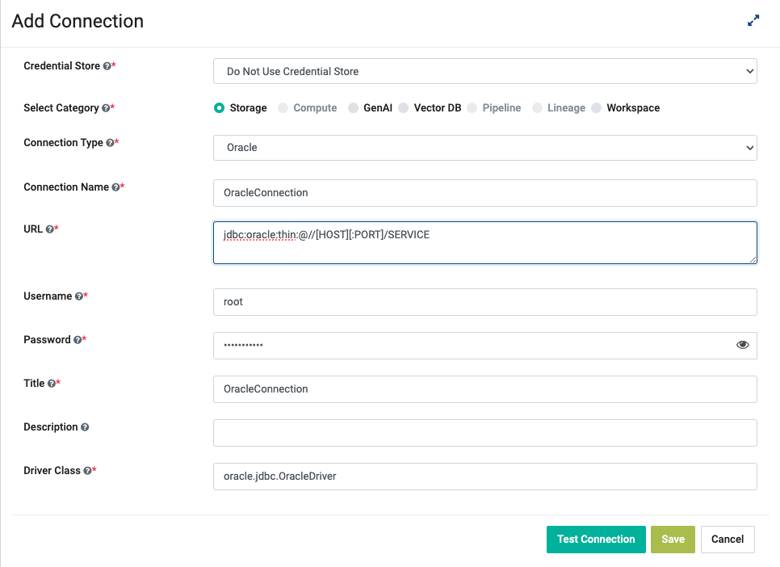

Oracle Connection
================

Sparkflows provides the capability to create Oracle connection and use the connection for reading from and writing to Oracle. Below are the steps for creating Oracle connection in Sparkflows:

  * Download Oracle JDBC Driver
  * Install the JDBC Driver
  * Restart Sparkflows
  * Create the Oracle Connection

Download Oracle JDBC Driver
-------------

- Oracle JDBC Driver can be downloaded from : https://www.oracle.com/database/technologies/appdev/jdbc-downloads.html or you can follow this guide: https://www.oracle.com/database/technologies/maven-central-guide.html
- Use the JAR file for installation in the Fire.

Install the JDBC Driver
--------

In order to install the JDBC driver copy the driver jdbc jar file into ``fire-user-lib`` and ``fire-server-lib`` directories under the Fire installation home directory.

Restart Fire Server
------------

Once you have copied the JDBC driver into the required folder, restart the Fire server with ``./run-fire-server.sh restart`` for it to register the new driver.

This will restart the Fire services automatically.

Or else, you can also wait for 60 minutes and the JDBC driver would be automatically registered with Sparkflows.

Create the Oracle Connection
-----

Create the Oracle Connection at Global, Group or Project level.

Connection Details
++++

Enter the configuration details with the help of table given below and click on ``Add Connection``.

                                                 
Test Connection and Save
+++++

Once you have entered the connection details, click on ``Test Connection``. If the connection is successful,  click on ``Save`` to save the connection. 

Now, you are ready to start using the Connection in workflows.

.. Note:: Make sure that Oracle URL should be accessible from Sparkflows web server URL.

Connection Field Details
----------------------

.. list-table:: 
   :widths: 10 20 20
   :header-rows: 1

   * - Title
     - Description
     - Value
   * - Credential Store  
     - Select the Credential Store from drop-down
     - Choose specific Credential Store from drop-down or Select Do not use Credential Store
   * - Select Category
     - Select Category of Connection Type
     - Select Storage Connection
   * - Connection Type 
     - Select the Connection type from drop-down
     - Choose Oracle as Connection Type
   * - Connection Name
     - Connection Name
     - Add an unique Connection Name
   * - Username 
     - Username
     - Username for Oracle
   * - Password
     - Password
     - Password of Oracle
   * - Title 
     - Title for selected Connection
     - Add an unique Title
   * - Description
     - Connection Description
     - Add some Connection Description
   * - Url
     - Url for Oracle
     - JDBC Url for Oracle
   * - Driver Class
     - Driver Class Name for Oracle
     - oracle.jdbc.OracleDriver (by default)
      
Run Workflows using Oracle JDBC JAR
-----------------

When running workflows, select the checkbox for the Oracle JAR file in the Workflow Execution Page.

