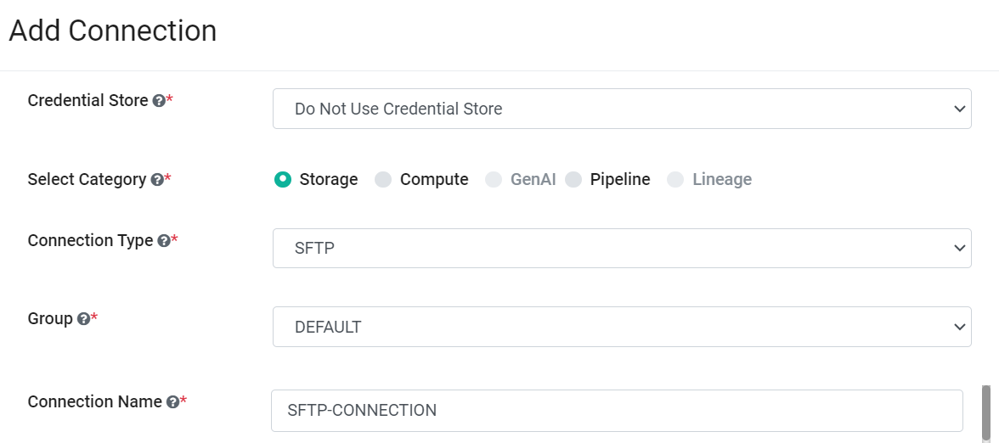
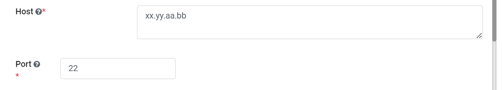
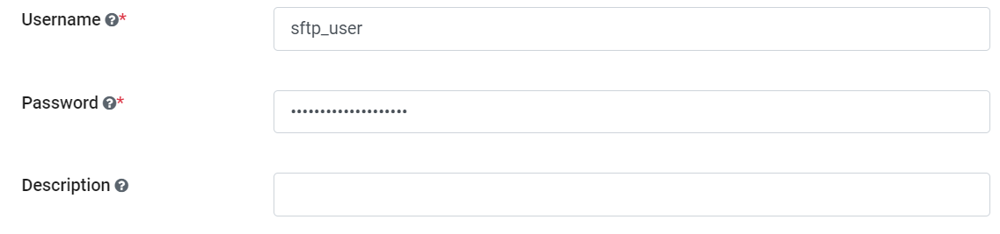

SFTP Connection
================

Fire Insights provides the capability to create SFTP connection and use the connection for reading from and writing to SFTP. Below are the steps for creating SFTP connection in Fire Insights:

SFTP Connection Configuration
----------

Use the below configurations for creating the connection to SFTP.

   .. list-table:: 
      :widths: 10 20 20
      :header-rows: 1

      * - Title
        - Description
        - Value
      * - Credential Store  
        - Select the Credential Store from drop-down
        - Choose specific Credential Store from drop-down or Select Do not use Credential Store
      * - Select Category
        - Select Category of Connection Type
        - Select Storage Connection
      * - Connection Type 
        - Select the Connection type from drop-down
        - Choose SFTP as Connection Type
      * - Connection Name
        - Connection Name
        - Add an unique Connection Name
      * - Host 
        - Host URL for selected Connection
        - Host URL for SFTP
      * - Username 
        - Username
        - Username for SFTP
      * - Password
        - Password
        - Password of SFTP
      * - Description
        - Connection Description
        - Add some Connection Description
      

.. Note:: Make sure that SFTP URL and port should be accessible from Sparkflows web server URL.

Save Connection
+++++

Once you have entered the connection details, click on ``Save`` to save the connection. 

Now, you are ready to start using the Connection in workflows using SFTP Node.

