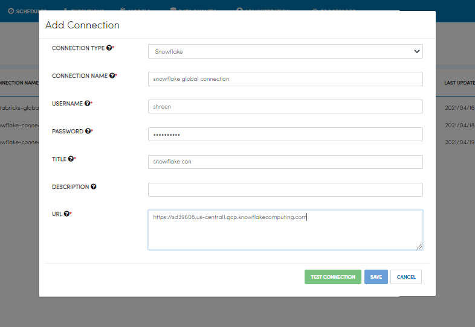

Snowflake
=========

In Fire Insights, Connections can be made to Snowflake. This can be used in the Snowflake nodes in the Workflow Editor for reading and writing data to Snowflake.

Creating Connection
-------------------
Create a connection in Fire Insights for Snowflake.

It can be created by the Administrator under Administration/Global Connections. These connections are available for everyone to use.

It can also be created by any user with their Application. In this case, it is only available to the Application and its users.

Specify your Snowflake Username, Password and Url and save the details.

We can also test the specified connection before saving the connection details. 

Now we are ready to start using the Snowflake Connection in Fire Insights.

Read Snowflake Node
-------------------

Write Snowflake Node
--------------------

