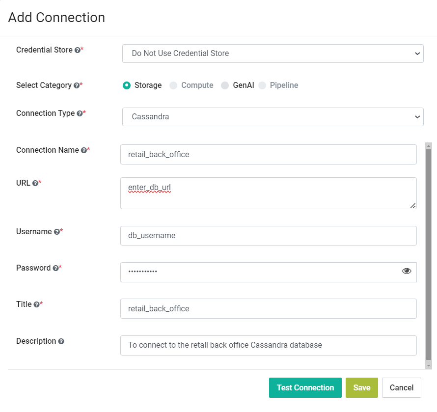
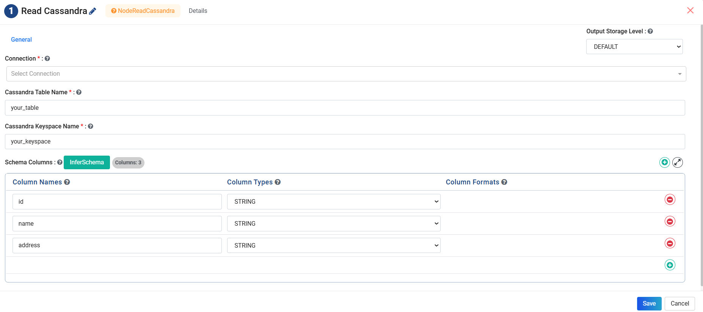
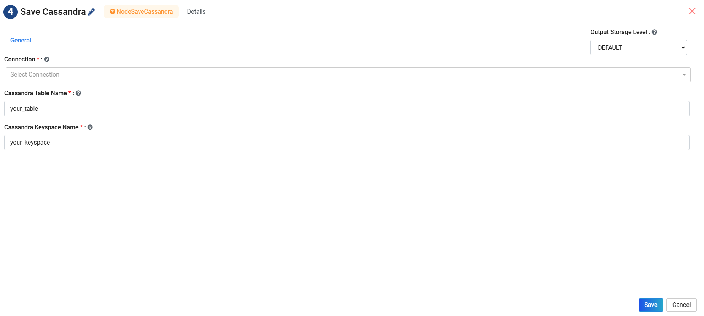
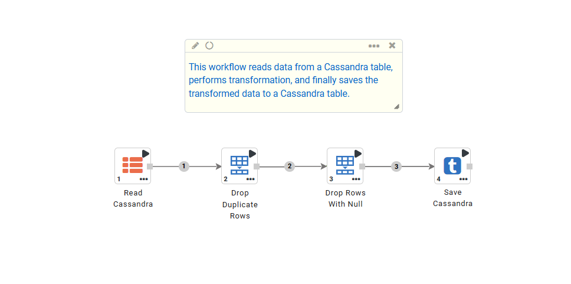

Cassandra
==========

Fire Insights has a processor that allows you to connect with Cassandra. Apache Cassandra is a distributed NoSQL database designed for handling large amounts of data.

Setting Up a Connection to Cassandra Database
---------------------------------------

* The connection to Cassandra Database can be setup as below.
* The connection can be setup Globally at application level using **Administration->Connections** option. It can also be setup locally for a Project.

* **Connection Type:** Select **Cassandra** in the **Connection Type** dropdown.
* **Connection Name:** Enter an Identifier for the connection in **Connection Name**.
* **URL:** Enter the Cassandra database URL.
* **Usename:** Enter the login username to access the Cassandra database.
* **Password:** Enter the login password to access the Cassandra database.
* **Title:** Enter a Title for the Cassandra connection.
* **Description:** Enter a Description for the Cassandra connection.

.. note::  Make sure that the Cassandra host URL is accessible from the Fire Machine.

Read Cassandra
------------------

* **Read Cassandra** connector can be used to read data from a Cassandra Database Table.
* **Read Cassandra** connector can be setup as below.

* **Connection:** Select a **Cassandra Connection** from the dropdown.
* **Cassandra Table Name:** Enter a table name from the Cassandra Database whose data is intended to be fetched.
* **Cassandra Keyspace Name:** Enter Cassandra Keyspace name to which the Table belongs. Keyspace refers to a group of tables within a Cassandra database.
* Please click on the **Refresh Schema** button to fetch the selected Table schema.

Save Cassandra
---------------------------------------

* **Save Cassandra** connector can be used to save data to a Cassandra Database Table.
* **Save Cassandra** connector can be setup as below.

* **Connection:** Select a **Cassandra Connection** from the dropdown.
* **Cassandra Table Name:** Enter a table name from the Cassandra Database whose data is intended to be fetched.
* **Cassandra Keyspace Name:** Enter Cassandra Keyspace name to which the Table belongs. Keyspace refers to a group of tables within a Cassandra database.
   
Workflow
------------------

* A sample workflow to read and save data to Cassandra table can be created as below. It uses the **Cassandra** nodes to read and write data.

