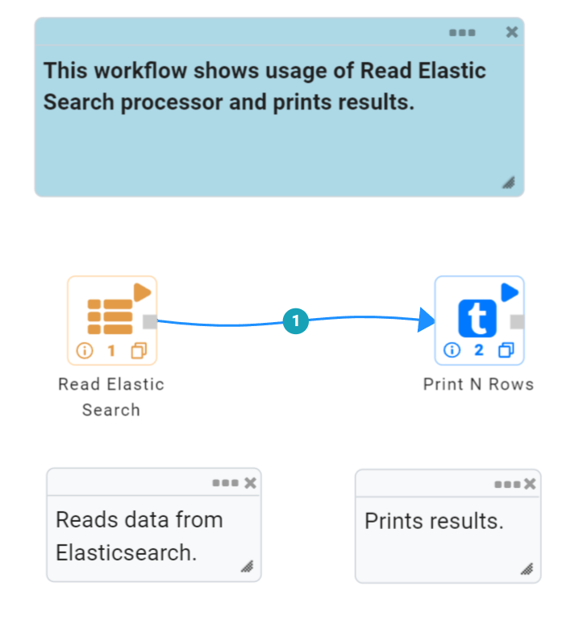
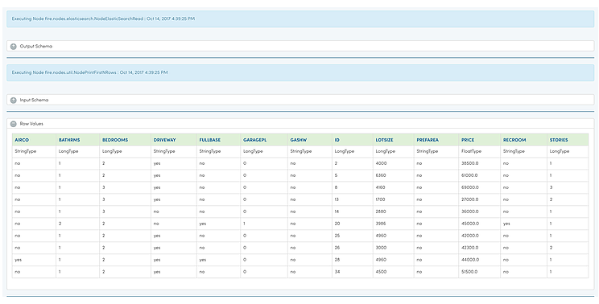
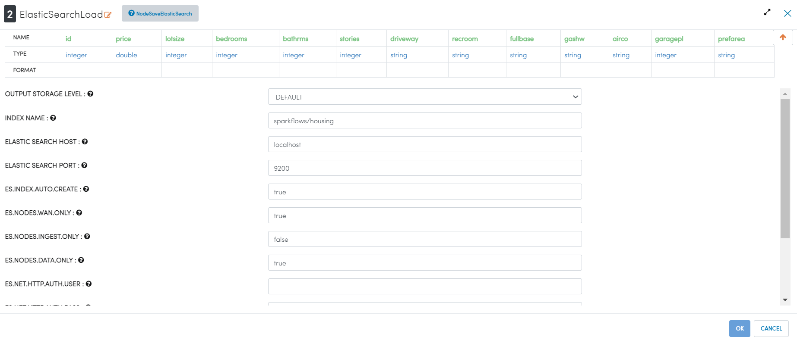
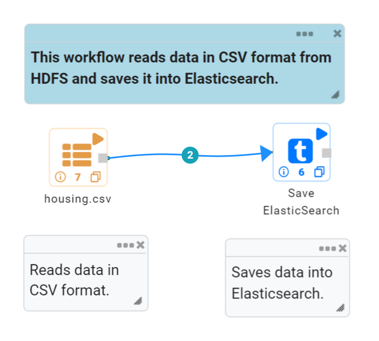
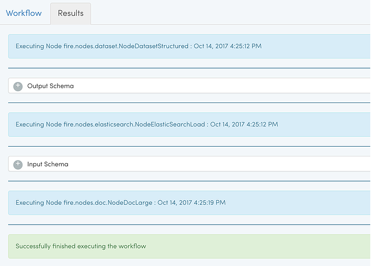

Elasticsearch
================

Fire Insights has a processor that allows you to connect with Elasticsearch.

Read from Elasticsearch
================

Reading data from Elasticsearch is easy. Drag and drop ``ReadElasticSearch`` processor into your workflow and configure it.

Elastic Search Read Processor Configuration
---------------

The following screenshot displays the dialog box for the Elasticsearch Read Processor.

.. figure:: ../../_assets/tutorials/dataset/22_a.PNG
   :alt: Dataset
   :width: 90%  
 
 
In the dialog box above, ``Refresh Schema`` button infers the schema of the index. Thus, it is able to pass down the output schema to the next processor making it easy to build the workflows.

The SQL field specifies the SQL to be used for reading from Elastic Search. It allows you to limit the columns of interest, and apply clauses etc.

The Elasticsearch Processor understands the SQL and translates it into the appropriate QueryDSL. The connector pushes down the operations directly to the source, where the data is efficiently filtered out so that only the required data is streamed back to Spark. This significantly increases the query performance and minimizes the CPU, memory and I/O operations on both the Spark and Elastic Search Clusters.

Workflow
---------

The below sample workflow reads the data from the *sparkflows/housing index* in Elastic Search and prints out the first few lines.

Workflow Execution
------------------

When the sample workflow as displayed above is executed, it reads in the index from Elasticsearch and displays the first few lines.

   

Write to Elasticsearch
======================================

Elasticsearch is often used for indexing, searching and analyzing datasets. Fire Insights makes it easy to write data to Elasticsearch.

Elasticsearch-hadoop provides native integration between Elasticsearch and Apache Spark. In the example below, we will first load data from HDFS into Elasticsearch and then read it back into Apache Spark from Elasticsearch.

If your data is already in Elasticsearch, skip to ``Workflow for Reading data from Elasticsearch``. 

Workflow
-----------

Create a new empty workflow. Drag and drop the source dataset from which you want to load data into Elasticsearch. If you don't have a dataset for the source data, create one. 

Once the source processor is on the workflow canvas, drag and drop ``SaveElasticSearch`` processor in the workflow. Configure your Elastic Search processor in the dialog box shown below.

After configuring ``SaveElasticSearch`` processor, connect your data source processor to Elasticsearch processor.

The sample workflow below reads a Housing Dataset which is in CSV format from HDFS. The ``SaveElasticSearch`` takes in the incoming data and loads it into the Elastic Search Index *sparkflows/housing*.

Workflow Execution
------------------

When the workflow above is executed, it reads in the dataset and saves it into Elasticsearch.

   
   
