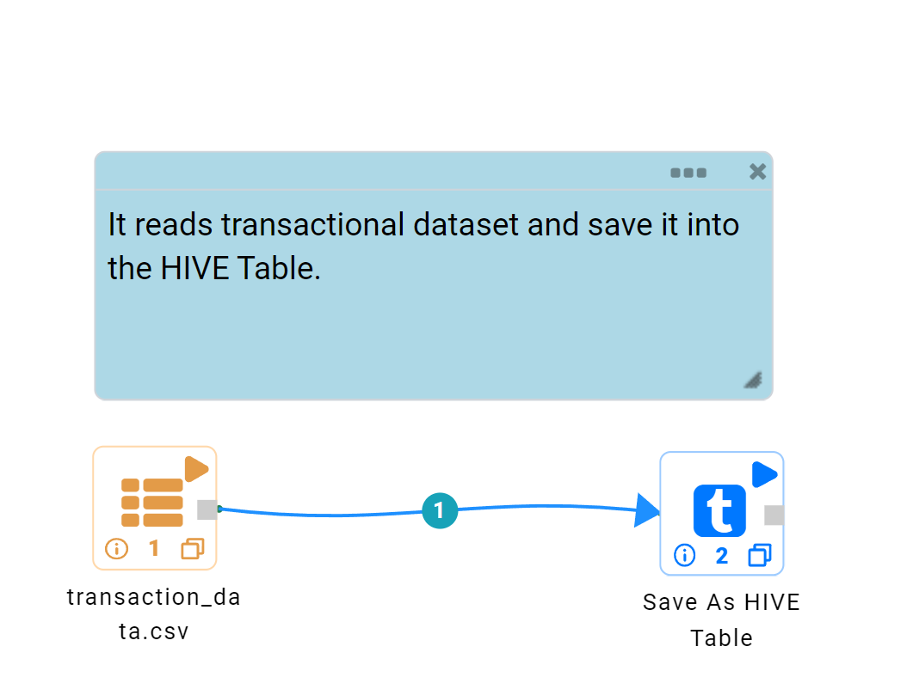

HIVE
==================

Depending on your data pipeline or workflow, you might want to save data to HIVE after it has been read from a data source, cleaned and transformed. After data is saved in HIVE, it can be read from another workflow or accessed through BI tools such as Tableau.

Fire Insights has "SaveAsHIVETable" processor.

Note: Fire Insights can run in cluster mode or in the standalone mode. These settings are in Administration/Configuration. When connecting to HIVE, Sparkflows must be running in cluster mode on an edge node of a Hadoop cluster. HIVE settings have to be correctly set under Administration/Configuration.

Workflow
--------

Below workflow shows the "SaveAsHIVETable" Processor. It reads Transaction Dataset and saves it into the HIVE 'sample_08' table.

Processor Configuration
----------------------

.. figure:: ../../_assets/tutorials/dataset/HiveTableNodeConfiguration1.png
   :alt: Dataset
   :width: 90%
   
When the above workflow is executed, data is written into HIVE Table as 'sample_08'.   
The 'sample_08' gets created with the schema of the Transaction Dataset.
   
   

