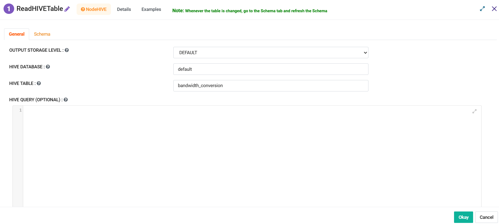
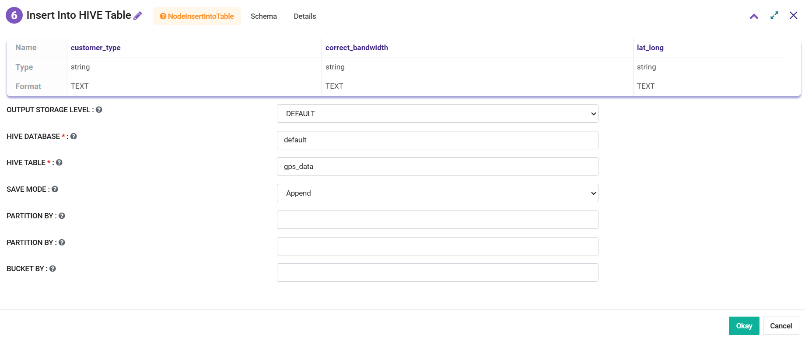
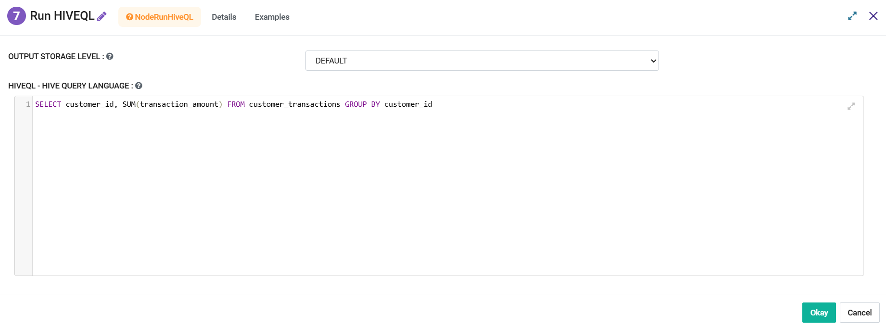
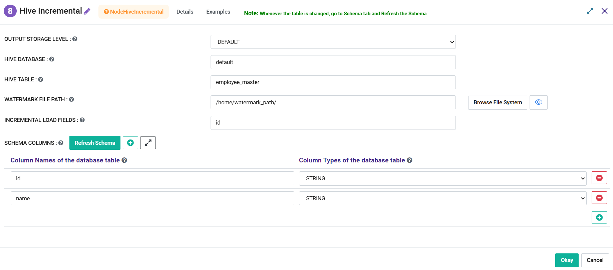
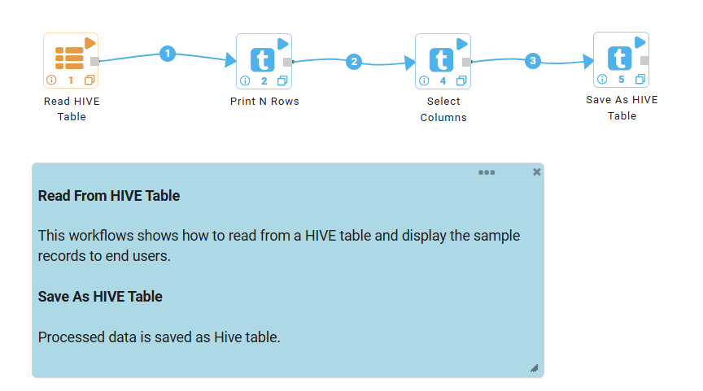

HIVE
==================

Sparkflows provides a set of connectors and processors to read and save data to HIVE database. These nodes facilitates to interact with Hive Database to query and manage large datasets. 

Sparkflows provides following nodes to access and process data from Hive Database:

* Read Hive Table - It facilitates to read data from Hive table.
* Save As Hive Table - It facilitates to save processed data as Hive table in a Database.
* Insert Into Hive Table - It facilitates to Insert data into a Hive Table.
* Run HiveQL - It facilitates to execute SQL statement against Hive Table.
* Hive Incremental - It facilitates to read incremental data from Hive table.

Depending on your data pipeline or workflow, you might want to save data to HIVE after it has been read from a data source, cleaned and transformed. After data is saved in HIVE, it can be read from another workflow or accessed through BI tools such as Tableau.

Note: Sparkflows can run in cluster mode or in the standalone mode. These settings are in Administration/Configuration. When connecting to HIVE, Sparkflows must be running in cluster mode on an edge node of a Hadoop cluster. HIVE settings have to be correctly set under Administration/Configuration.

Processors and Connectors
--------

Read Hive Table
+++++++++

This connector reads data from the Apache HIVE table and creates a DataFrame from it.

It needs to be configured as below:

* **HIVE DATABASE:** Specify the HIVE database to use.
* **HIVE TABLE:** Specify the table within the HIVE database to read.
* **HIVE QUERY (OPTIONAL):** (If needed) Provide a custom SQL query to retrieve data from the HIVE table i.e. SELECT customer_id, SUM(transaction_amount) FROM customer_transactions GROUP BY customer_id

Save As Hive Table
+++++++++

This connector Saves the processed data into an Apache HIVE Table.

It needs to be configured as below:

* **HIVE DATABASE:** Specify the HIVE database where the table will be created.
* **HIVE TABLE:** Specify the name of the HIVE table to which the data will be written.
* **FORMAT:** Choose the file format for the HIVE table (e.g., Parquet, ORC, CSV, Json).
* **SAVE MODE:** Choose how to save data in the table, if any (Append, Overwrite, ErrorIfExists, Ignore).

* **PARTITION BY:** (Optional) Specify columns to partition the HIVE table. You can select multiple columns from the "Available" list and move them to the "Selected" list to define the partitioning schema.
* **NUM BUCKETS:** Specify the number of buckets to use when bucketing the HIVE table.
* **BUCKET BY:** (Optional) Specify columns to bucket the HIVE table. You can select multiple columns from the "Available" list and move them to the "Selected" list to define the bucketing scheme.

Insert Into Hive Table
+++++++++

This connector inserts data into a HIVE table.

It needs to be configured as below:

* **HIVE DATABASE:** Specify the HIVE database containing the target table.
* **HIVE TABLE:** Specify the table within the HIVE database where data will be inserted.
* **SAVE MODE:** Choose how to handle existing data in the table (Append, Overwrite, ErrorIfExists, Ignore).
* **PARTITION BY:** (Optional) Specify columns to partition the HIVE table.
* **BUCKET BY:** (Optional) Specify columns to bucket the HIVE table.

Run HiveQL
+++++++++

This connector executes a Query Statement to fetch data from Hive Table and creates a dataframe.

It needs to be configured as below:

* **HiveQL - HIVE Query Language :** Specify HiveQL in a Sql format i.e. SELECT customer_id, SUM(transaction_amount) FROM customer_transactions GROUP BY customer_id

Hive Incremental
+++++++++

This node reads a table from Hive and creates a DataFrame containing the schema and data of the specified table, with an incremental load configuration.

It needs to be configured as below:

* **HIVE DATABASE:** Specify the Hive database from which data is to be read.
* **HIVE TABLE:** Specify the table in the Hive database from which data is to be read incrementally.
* **WATERMARK FILE PATH:** Define the file path for the watermark file to track the last load timestamp.
* **INCREMENTAL LOAD FIELDS:** Specify the fields that will be used for incremental loading (e.g., timestamp or ID fields).

Workflow
--------

Below workflow shows the usage of **Read Hive Table** and **Save As HIVE Table** processors. It reads Transaction Dataset and saves it into the HIVE table.

