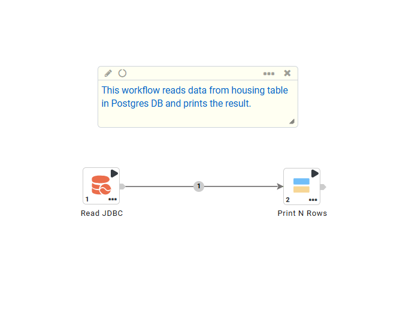
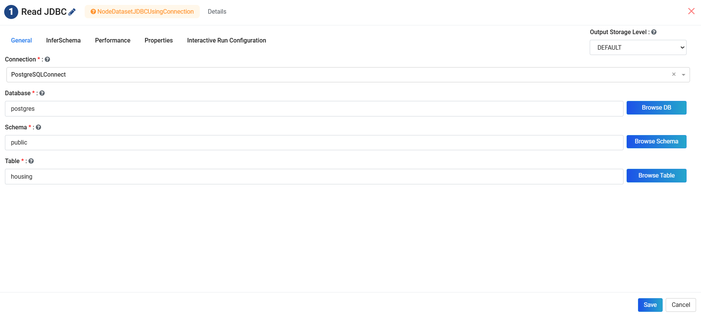
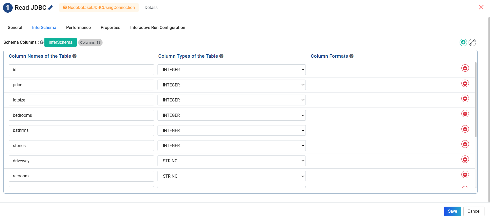
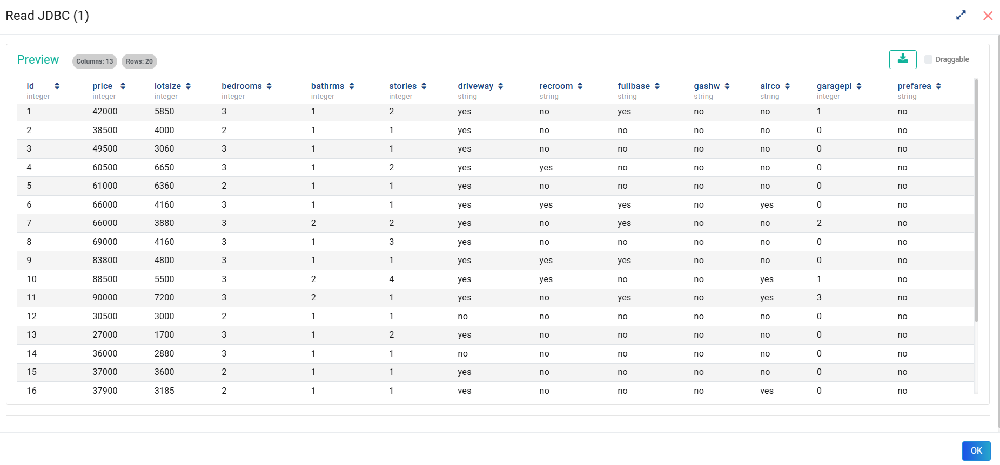
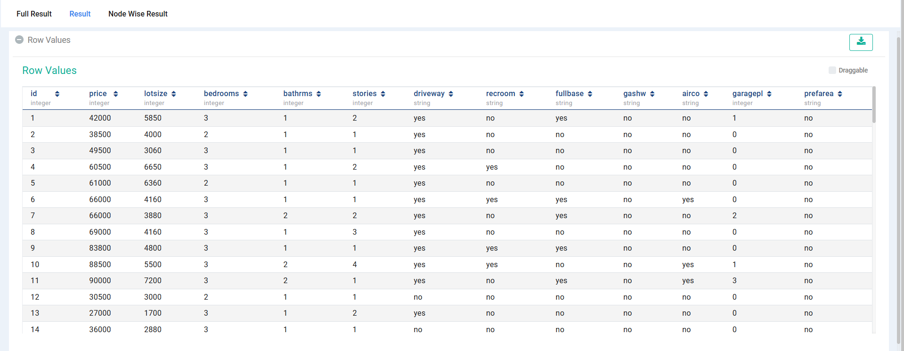

JDBC
====

Sparkflows has JDBC Processors for reading from or writing to JDBC sources.

In order to connect to a JDBC source like PostgreSQL/MySQL/Oracle/SQLServer/Redshift/DB2 etc. the JDBC driver needs to be installed in Sparkflows.

Use the steps given at the following link for installing the corresponding JDBC driver for your RDBMS and creating the Connection.

https://docs.sparkflows.io/en/latest/user-guide/connection/storage-connection/PostgreSQL.html

Workflow for reading from an RDBMS
----------------------------------

Below is a workflow which reads data from PostgreSQL using a JDBC Connection and prints the result using the ``Print N Rows`` processor. It reads in the data from the ``housing`` table in PostgreSQL.

JDBC Processor Configuration
----------------------------

Below are the configuration details of the **Read JDBC** Processor. It uses the provided JDBC Connection for reading from the PostgreSQL database. On clicking **InferSchema**, Sparkflows gets the schema of the table from PostgreSQL and populates the entries.

Results of reading from PostgreSQL Table
----------------------------------------

The following image displays the schema of the table from the PostgreSQL table in Sparkflows.

Specifying a Sub-Query
----------------------

In the configuration of the Read JDBC node for ``DB TABLE``, anything that is valid in a FROM clause of a SQL query can be used. For example, instead of a full table we could also use a subquery.

More details are available in the Spark JDBC guide: https://spark.apache.org/docs/latest/sql-data-sources-jdbc.html

Executing the processor displays the records read from PostgreSQL Table.

