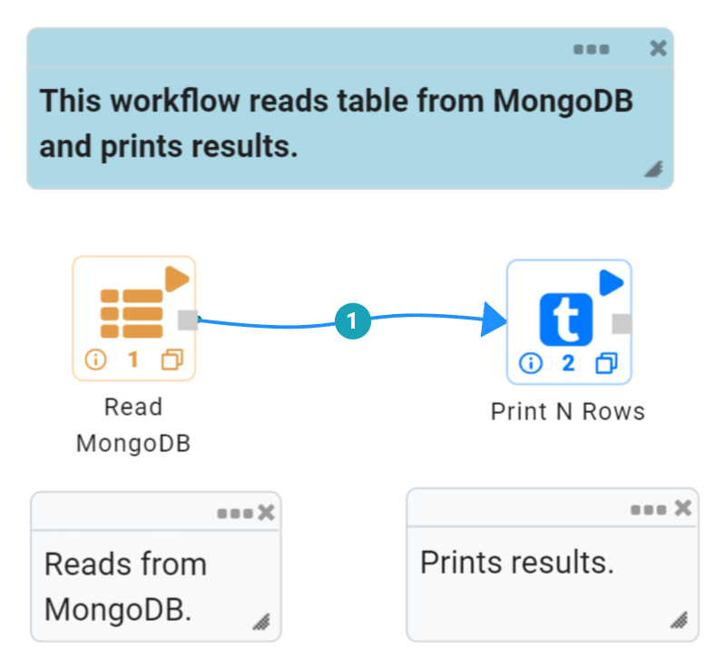
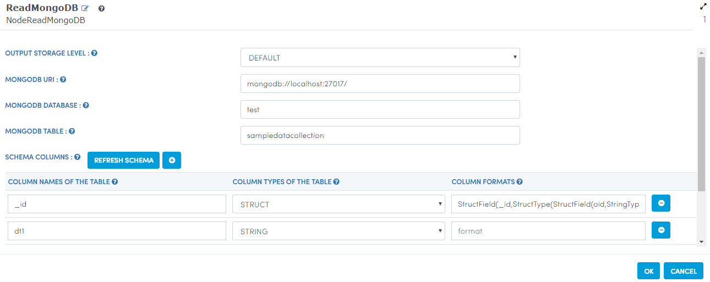
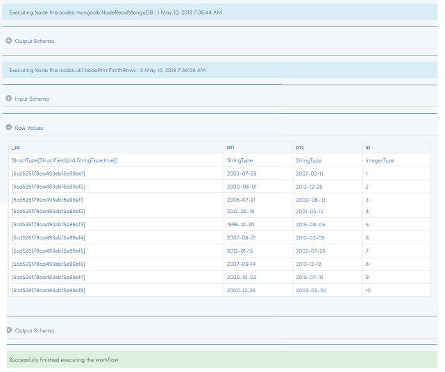
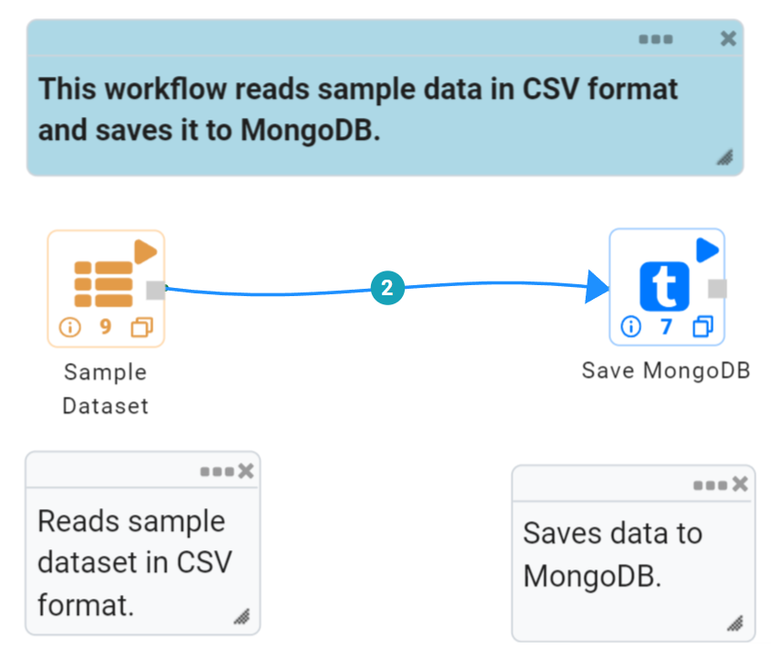
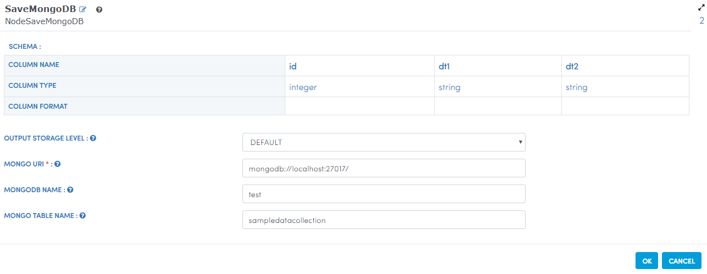
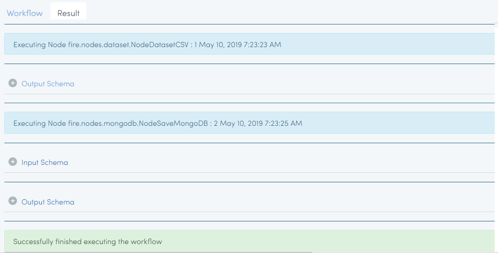

MongoDB
==========

Fire Insights has a processor that allows you to connect with MongoDB.

Workflow for Reading Data from MongoDB
---------------------------------------

The below workflow reads data in MongoDB and then prints the data.

Below is the image that displays the dialog box for the ReadMongoDB Processor.

   
In the above dialog box, the ``Refresh Schema`` button infers the schema of the collections. Thus, it is able to pass down the output schema to the next Processor making it easy for us to build the workflow.   
   
Workflow Execution
------------------

When we execute the workflow, it reads in the sample collection from MongoDB and displays the first few lines.

We see that the sample data records that we wrote to MongoDB in the first/above workflow is read back now.

Workflow for Loading data into MongoDB
---------------------------------------

The below workflow reads in the sample dataset which is in CSV format from HDFS. It then saves the data into MongoDB.

The below image shows the dialog box for the SaveMongoDB Processor.

   
Workflow Execution
------------------

When we execute the above workflow, it reads in the dataset from HDFS and loads it into the MongoDB.

   
  
