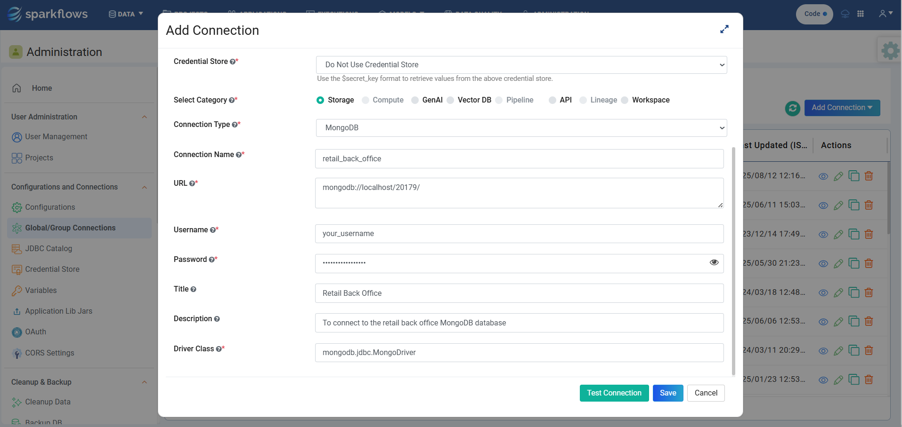
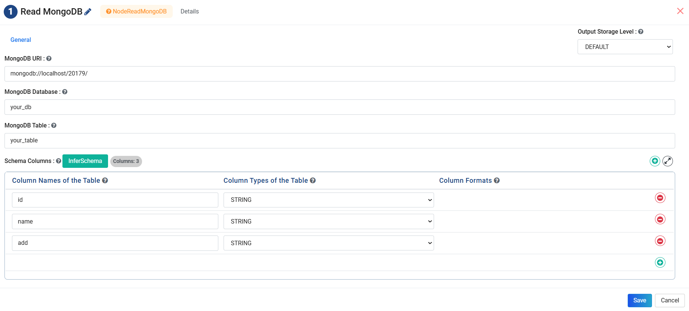
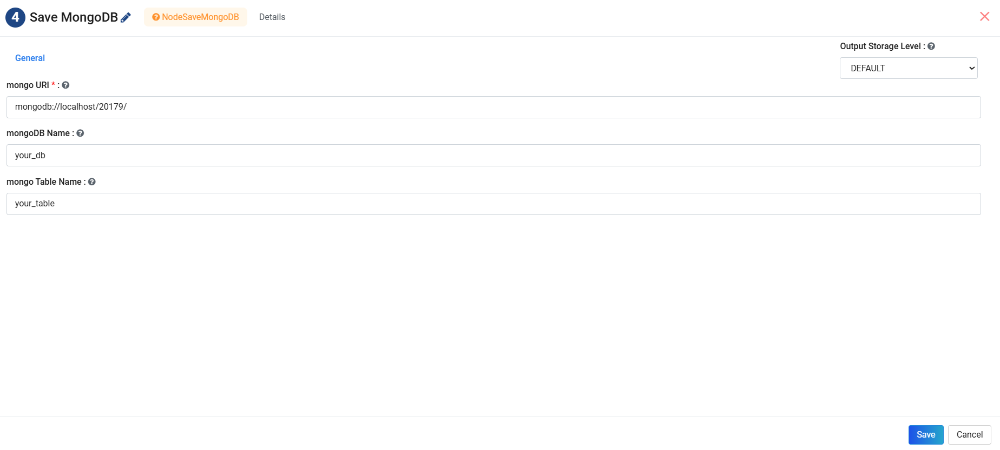
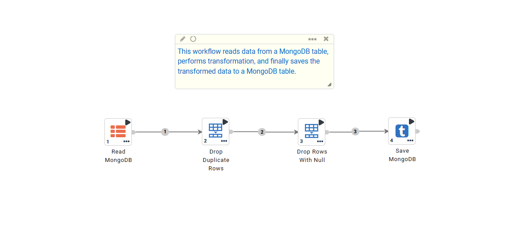

MongoDB
==========

Fire Insights has a set of processors that allows you to read and write data to MongoDB.

Setting Up A Connection To MongoDB Database
---------------------------------------

* Connection To MongoDB Database can be setup as below.
* Connection can be setup Globally at application level using **Administration->Connections** option. It can also be setup locally for a Project.

* **Connection Type:** Select **MongoDB** in the **Connection Type** dropdown.
* **Connection Name:** Enter a Identifier for the connection in **Connection Name**.
* **URL:** Enter MongoDB database url.
* **Usename:** Enter login username to access the MongoDB database.
* **Password:** Enter login password to access the MongoDB database.
* **Title:** Enter a Title for the MongoDB connection.
* **Description:** Enter a Description for the MongoDB connection.
* **Driver Class:** Enter the MongoDB driver class name.

Read MongoDB
---------------------------------------

* **Read MongoDB** connector can be used to read data from a table residing in a MongoDB database.
* **Read MongoDB** connector can be configured as below.

* **MongoDB URI:** Enter URI of the MongoDB to read data from.
* **MongoDB Database:** Enter the Database name which contains the table to read the data from.
* **MongoDB Table:** Enter name of the Table from which data is intended to be fetched.
* Please click on the **Refresh Schema** button to fetch the selected Table schema. It infers the schema and pass it on to the next processor for further processing.

Save MongoDB
------------------

* **Save MongoDB** connector can be used to save data to a table residing in a MongoDB database.
* **Save MongoDB** connector can be configured as below.

* **MongoDB URI:** Enter URI of the MongoDB to save data to.
* **MongoDB Database:** Enter the Database name which contains the table to save the data into.
* **MongoDB Table:** Enter name of the Table to which data is intended to be saved.

Workflow
------------------

* A sample workflow to read and save data to MongoDB table can be created as below. It uses the **MongoDB** nodes to read and write data.
* This workflow transforms data before saving the data to the MongoDB table.

   
