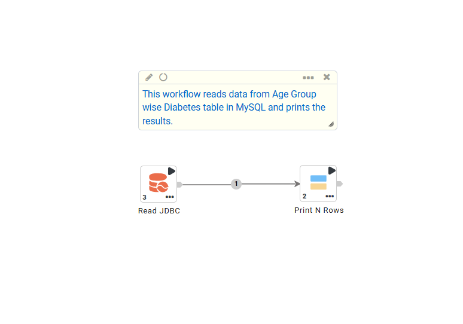
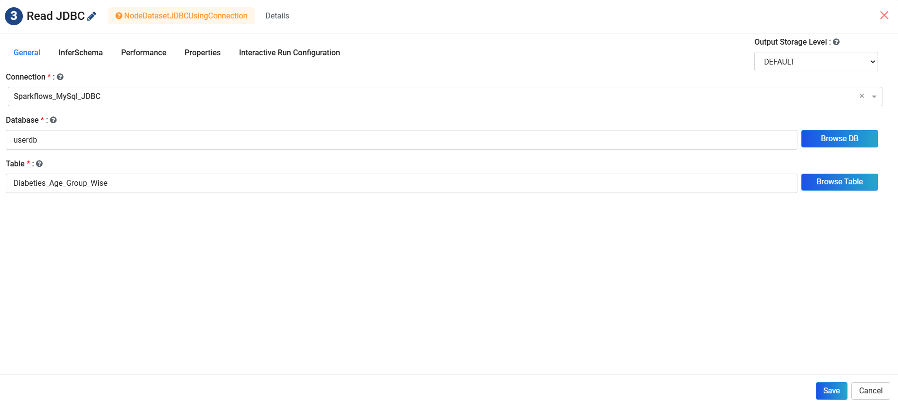
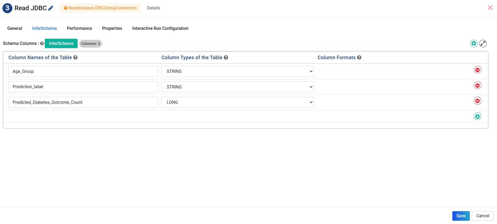
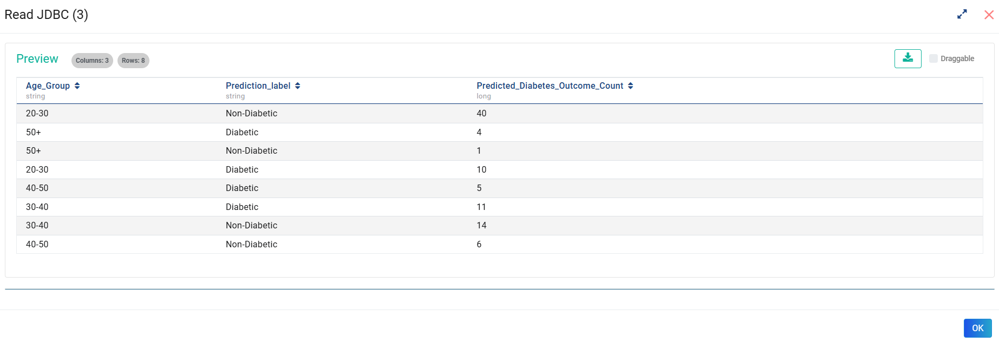
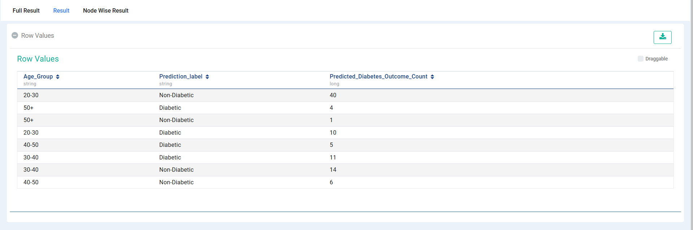
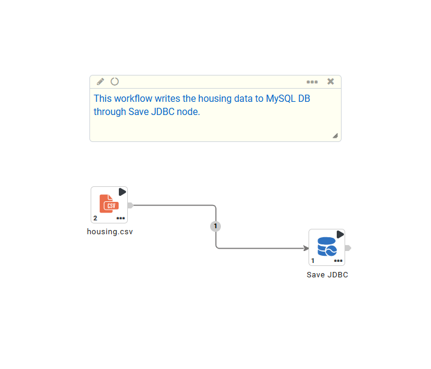
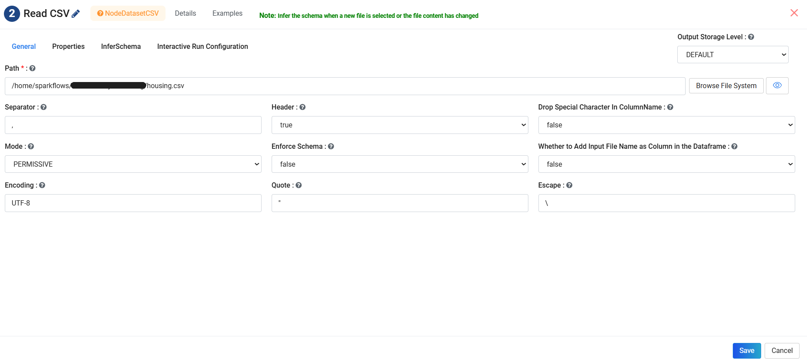
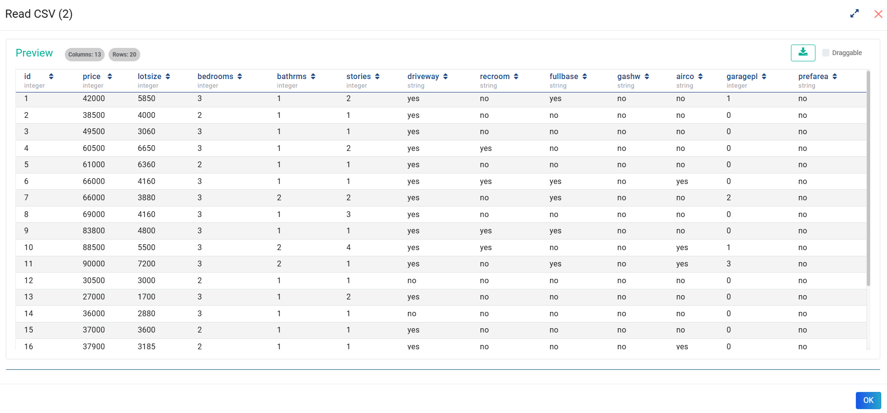
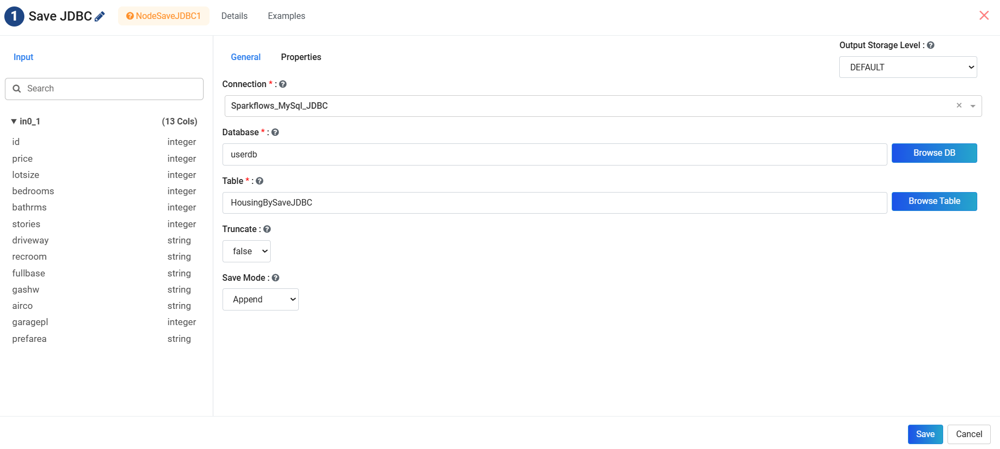
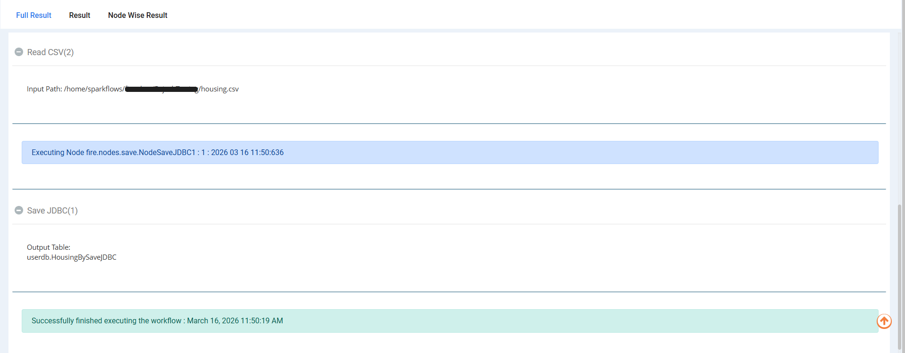

MySQL
=====

Sparkflows provides Read JDBC and Save JDBC processors for reading from and writing to MySQL.

Below are the steps for it:

- Setup the MySQL Connection to the Database
- Use the Read JDBC or Save JDBC node in workflows with the MySQL Connection created

Setup the MySQL Connection
----------------------------

Refer the following page for setting up the MySQL Connection:

https://docs.sparkflows.io/en/latest/user-guide/connection/storage-connection/mysql.html

Use the Read JDBC and Save JDBC nodes in workflows
----------------------------------------------------------

- For reading from MySQL use the Read JDBC node. 
- For writing to MySQL use the Save JDBC node. 

Example workflows for Read JDBC and Save JDBC nodes are as follows:

Read JDBC
-----------

Below is a workflow which reads data from MySQL using a JDBC Connection and prints the result using the ``Print N Rows`` processor. It reads in the data from the ``Diabetes Age Group wise`` table in MySQL.

**Read JDBC Node Configuration**
++++++++++++++++++++++++++++++++++

Below are the configuration details of the **Read JDBC** Processor. It uses the provided JDBC Connection for reading from the MySQL database. On clicking **InferSchema**, Sparkflows gets the schema of the table from MySQL and populates the entries. 

**Output**
++++++++++++++

Executing the workflow displays the records read from MySQL Table, as shown below:

Save JDBC
-----------

Below is a workflow that writes data to MySQL using a JDBC Connection and prints the result using the ``Print N Rows`` processor. It reads in the data from the housing table located in the file system through ``Read CSV`` processor and writes it to MySQL through ``Save JDBC`` processor.

**Save JDBC Node Configuration**
++++++++++++++++++++++++++++++++++

Below are the configuration details of the **Read CSV** and **Save JDBC** Processor. **Read CSV** reads the housing data and **Save JDBC** uses the provided JDBC Connection for writing it to the MySQL database. 

**Output**
+++++++++++++++++

Executing the workflow saves the records read from housing table to MySQL Database, as shown below:

