Salesforce
================
Fire Insights enables to Read from and Write to Salesforce using cdata JDBC Driver.

Below are the steps for Downloading and Configuring cdata JDBC Driver and Reading and Writing to Salesforce in Fire Insights.

Download and Configure cdata JDBC Driver
----------------

Login to cdata Salesforce JDBC Driver page and click on ``Download Trial version``, after adding some required information. The driver file can be downloaded in zip format in your system.

  * cdata JDBC Driver URL :  https://www.cdata.com/drivers/salesforce/download/jdbc/
    

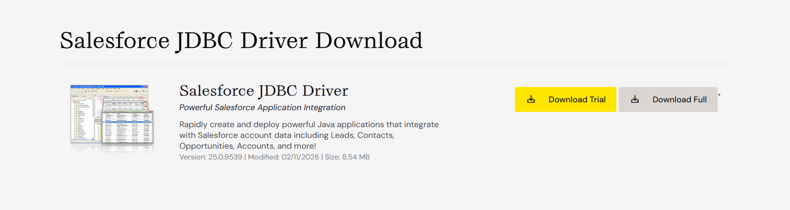
   
   
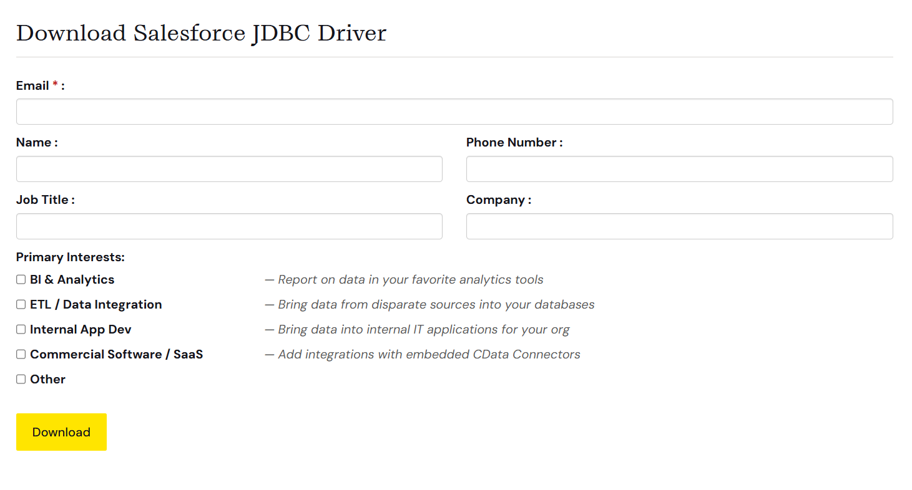

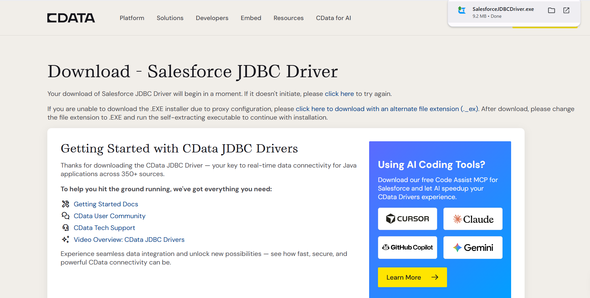
   
Once the dowload completes, unzip that and extract jar from file `setup.jar` with below command and accept END USER LICENSE AGREEMENT with some required information.   

::

    java -jar setup.jar
    
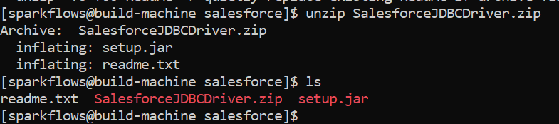

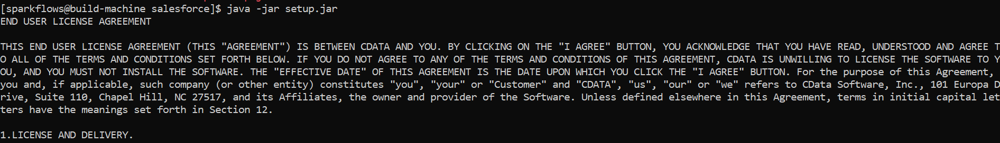
   
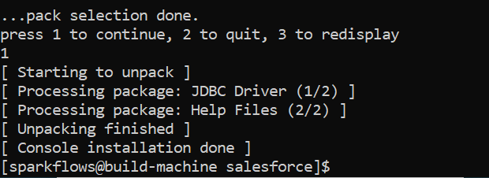
 
On Successful completion of the above steps, go to path where you installed salesforce drive and point to the below path:

::

    $salesforce_home/lib/
    
    
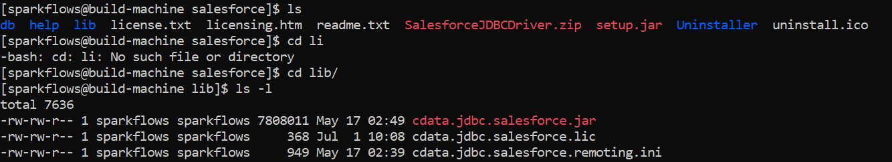
   
Configure cdata JDBC Driver in Fire Insights
^^^^^^^^^^^^^^^^^^^^^^^^^^^^

Now, cdata JDBC Driver jar can be configured in Fire Insights to Read and Write to Salesforce using JDBC Processors.

Below are the steps to configure cdata JDBC Driver in Fire Insights and read and write to Salesforce.

- Copy the ``cdata.jdbc.salesforce.jar`` to ``fire-user-lib & fire-server-lib`` and restart the Fire server.
- Login to Fire Insights application and Go inside project and workflow tab to create a sample workflow with Read and Write to Salesforce using Read JDBC & Save JDBC Processors.

Read Salesforce
---------------

Fire Insights has a processor that allows you to read data from Salesforce. Salesforce is a powerful cloud-based Customer Relationship Management (CRM) platform that helps businesses manage their customer interactions, sales processes, and various aspects of their operations.

* **Read Salesforce** connector can be used to read data from Salesforce. It reads data from the specified Table in the Query.

**Read Salesforce** connector can be configured as below.
^^^^^^^^^^^^^^^^^^^^^^^^^^^^

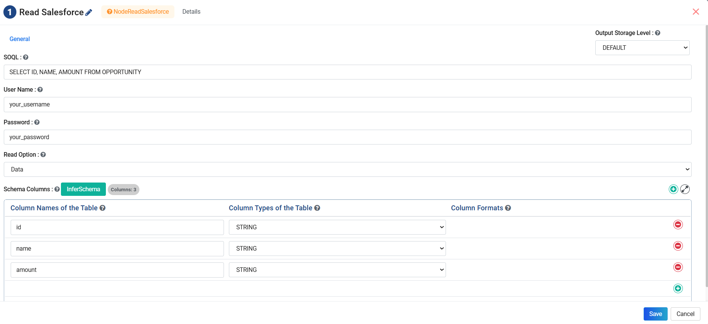

* **SOQL:** Enter a Sql Query to fetch data from Salesforce Table.  
* **User Name:** Enter Salesforce Platform User Name.
* **Password:** Enter Salesforce Platform access Password.
* **Read Option:** Select either **Data** or **Object** from the dropdown. Select **Data** option to fetch data using the SOQL query. Select **Object** option to fetch Object list along with the Schema Details.
* Please click on the **Refresh Schema** button to fetch the selected Table schema. It infers the schema and pass it on to the next processor for further processing.

Save Salesforce
------------------

* **Save JDBC** connector can be used to save data to Salesforce table.

It needs to be carried out in two steps first to create a JDBC connection and then use it to save data.

**JDBC Connection** can be configured as below.
^^^^^^^^^^^^^^^^^^^^^

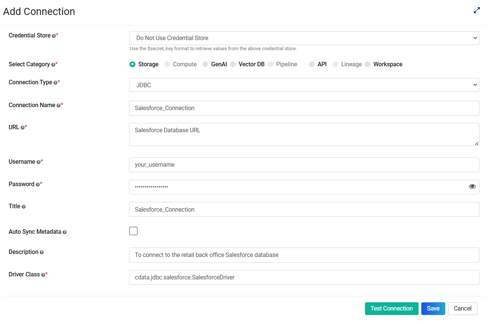

* **Connection Type:** Select **JDBC** in the **Connection Type** dropdown.
* **Connection Name:** Enter a Identifier for the connection in **Connection Name**.
* **URL:** Enter Salesforce database url.
* **Usename:** Enter login username to access the Salesforce database.
* **Password:** Enter login password to access the Salesforce database.
* **Title:** Enter a Title for the Salesforce connection.
* **Description:** Enter a Description for the Salesforce connection.
* **Driver Class:** Enter the Salesforce driver class name.

**Save JDBC** connector can be configured as below.
^^^^^^^^^^^^^^^^^^^^^^^^

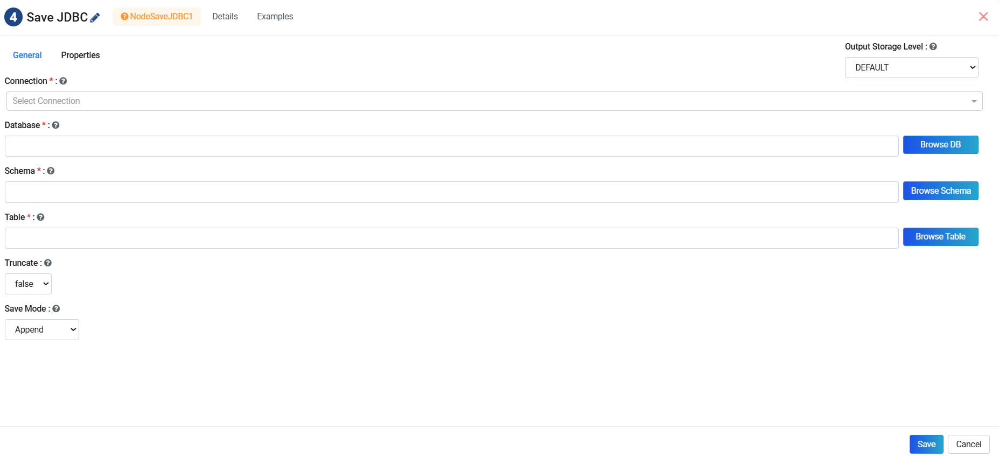

* **Connection:** Select **JDBC Connection** created for the **Salesforce** database.
* **DB Table:** Enter the Database Table name to save data to.
* **Trucate:** Select an appriate value from the dropdown.
* **Save Mode:** Select an appriate value from the dropdown.

Workflow
------------------

* A sample workflow to read and save data to Salesforce database can be created as below. It uses the **Read Salesforce** node to read and **Save JDBC** node to write data.
* This workflow transforms data before saving the data to Salesforce Table. On Successful execution of workflow, the data will be written to Salesforce.

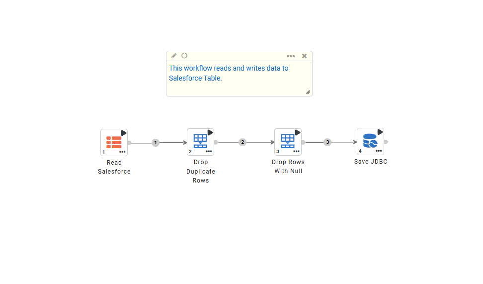
