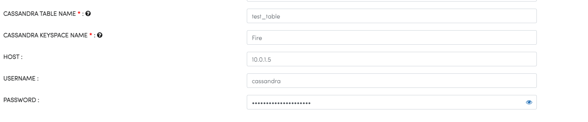

Cassandra
==============

Fire Insights enables you to write to Apache Cassandra table.

Below parameters are used in configuring Save Cassandra processor.

.. list-table::
      :widths: 5 10
      :header-rows: 1

      * - Name
        - Description
      * - CASSANDRA TABLE NAME
        - Cassandra Table into which the data gets loaded.
      * - CASSANDRA KEYSPACE NAME 
        - The keyspace where table is looked for.
      * - HOST
        - Cassandra HOST URL.
      * - USERNAME
        - USERNAME of Cassandra.
      * - PASSWORD
        - PASSWORD of Cassandra.
        

Once the above workflow executes successfully, the data gets visible in the specific table of Apache Cassandra.

.. note::  Make sure that the Cassandra host URL is accessible from the Fire Machine.
