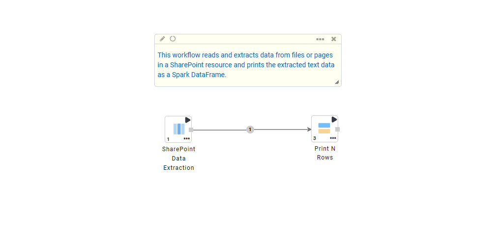
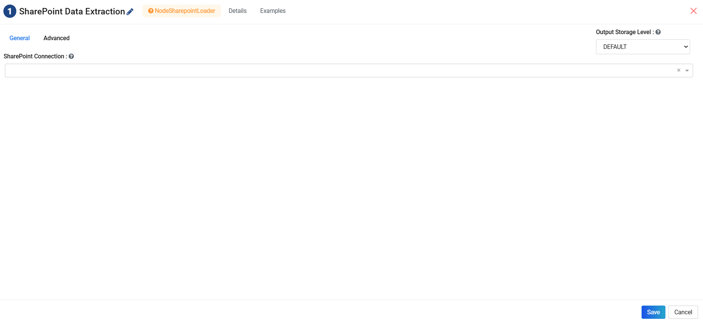
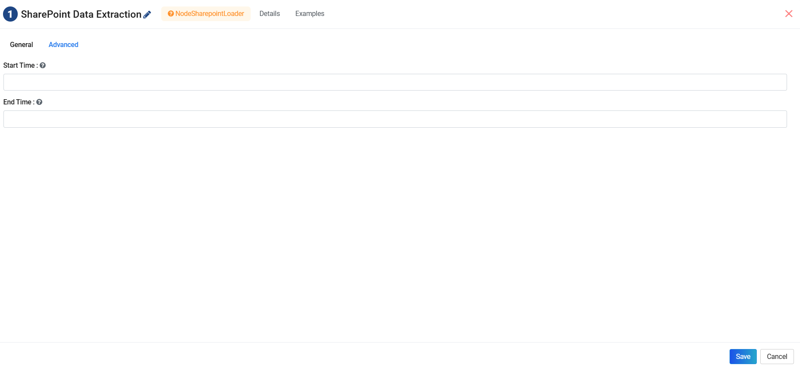

SharePoint
==========

Sparkflows enables extracting data from SharePoint resources through the **SharePoint Data Extraction** processor.

Prerequisite
------------------

Before creating a workflow using the processor, you must first create a connection to Sharepoint, if you have not already created it. The below page has the details for creating Connection to Sharepoint.

:ref:`Create SharePoint Connection<SharePoint Connection>`

Data Extraction from Sharepoint
-------------------------------

Workflow
^^^^^^^^
Below is a sample workflow that retrieves files and pages from a SharePoint resource, extracts their textual content and prints the result.

Node Configuration
^^^^^^^^^^^^^^^^^^
The **SharePoint Data Extraction** node can be configured as below:

**General Configuration**

* **SharePoint Connection:** Select the required SharePoint connection from the dropdown that you created earlier.

**Advanced Configuration**

* **Start Time:** It is optional start time to include only files or pages by last modified date time. Supported format is **YYYY-MM-DD HH:MM:SS**.

* **End Time:** It is optional end time to include only files or pages by last modified date time. Supported format is **YYYY-MM-DD HH:MM:SS**.

Output
^^^^^^^^^
The output is a Spark DataFrame containing all accessible files and pages from the SharePoint site with extracted text content.

.. note:: Only files accessible to the configured SharePoint credentials are retrieved. 

The SharePoint Data Extraction node performs read-only operations and does not modify SharePoint data. This node does not require an input DataFrame.

