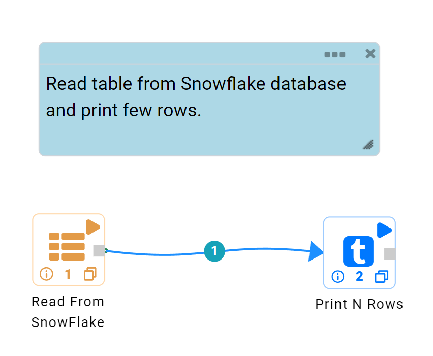
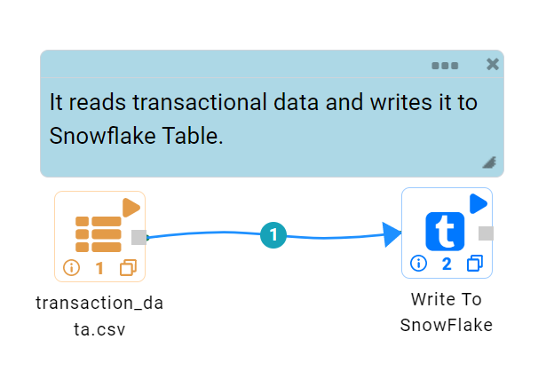

Snowflake
==========

Fire Insights has a processor that allows you to connect with live Snowflake data warehouse, directly from workflows.

Read from Snowflake
-------------------

The below workflow does the following:

* Reads Snowflake Table.
* Prints a few records of the DataFrame.

Reading from Snowflake Table
-------------------

It reads Table using Read From Snowflake processor.

* CONNECTION  : Connection created for Snowflake.
* SF DATABASE : Snowflake Database Name.
* SF SCHEMA : Snowflake Schema Name.
* SF WAREHOUSE : Snowflake Warehouse Name.
* SF TABLE : Snowflake Table Name.

Processor Configuration
^^^^^^^^^^^^^^^^^^

.. figure:: ../../_assets/snowflake/2.PNG
   :alt: snowflake
   :width: 90%
   
Processor Output
^^^^^^

.. figure:: ../../_assets/snowflake/3.PNG
   :alt: snowflake
   :width: 90%

Prints the Results
------------------

It prints the first few records of the DataFrame.

Write to Snowflake
------------------

The below workflow does the following:

* Reads Housing Dataset.
* Write it to Snowflake Table.

   
Reading from CSV File
---------------------

It reads Housing data from a CSV File using Read CSV Processor.

Processor Configuration
^^^^^^^^^^^^^^^^^^   

.. figure:: ../../_assets/snowflake/5.PNG
   :alt: snowflake
   :width: 90%
   
Processor Output
^^^^^^

.. figure:: ../../_assets/snowflake/6.PNG
   :alt: snowflake
   :width: 90%

Write it to Snowflake
------------------

It saves CSV File in specified Snowflake Table.

* CONNECTION  : Connection created for Snowflake.
* SF DATABASE : Snowflake Database Name.
* SF SCHEMA : Snowflake Schema Name.
* SF WAREHOUSE : Snowflake Warehouse Name.
* SAVE MODE : Append, Overwrite, ErrorifExists & Ignore.
* SF TABLE : Snowflake Table Name.

.. figure:: ../../_assets/snowflake/7.PNG
   :alt: snowflake
   :width: 90%
   
Once the workflow is executed successfully, the CSV File will be written to Snowflake Table.

.. figure:: ../../_assets/snowflake/8.PNG
   :alt: snowflake
   :width: 90%

.. note::  Make sure that Snowflake connection is accessible from the Fire Machine.
