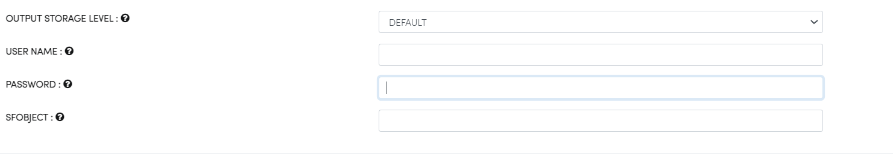

Save Salesforce
===============

Fire Insights enables you to write to Salesforce.

Save Salesforce
-----------

while using the above processor you need to have below parameter

.. list-table::
      :widths: 5 10
      :header-rows: 1

      * - Name
        - Description
      * - USER NAME
        - USER NAME of Salesforce
      * - PASSWORD
        - PASSWORD of Salesforce
      * - SFOBJECT 
        - Salesforce Object

