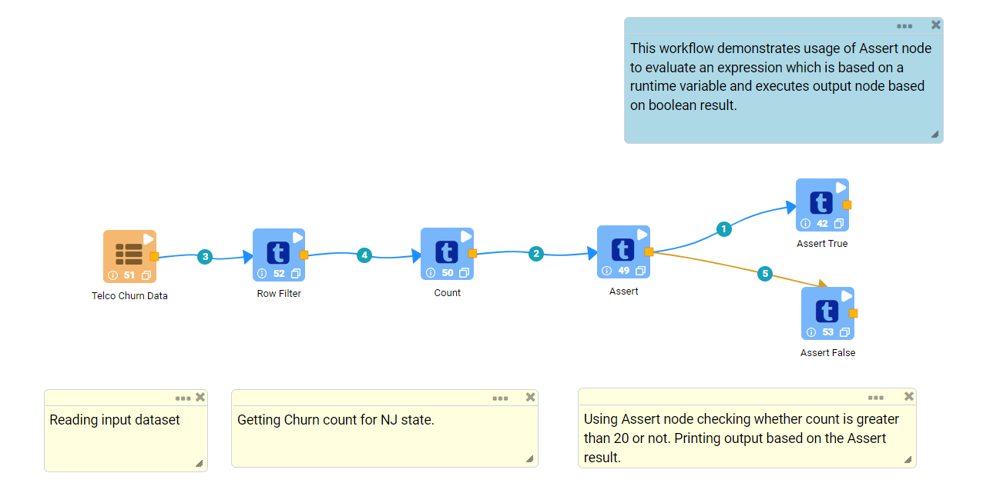
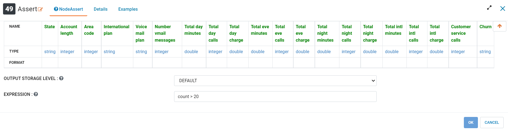
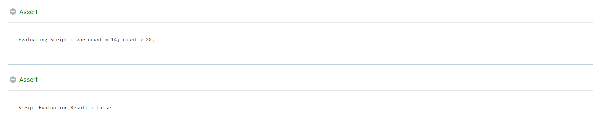
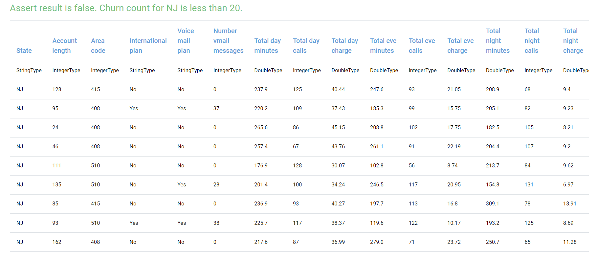
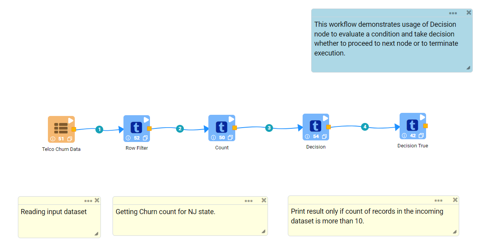
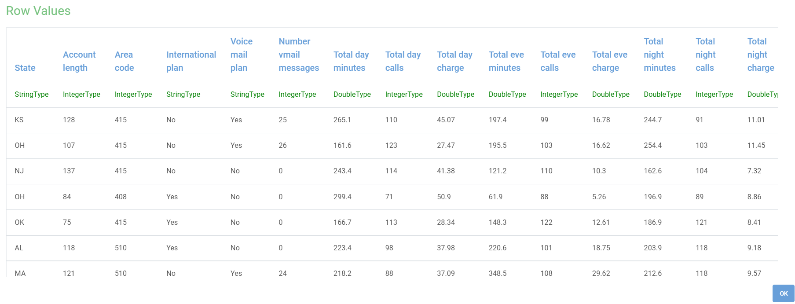
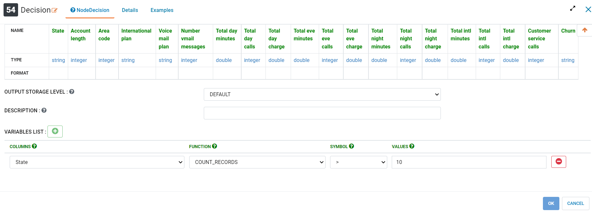
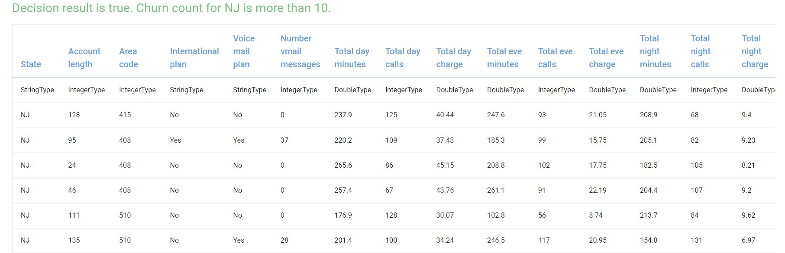

Condition Function
==========

Fire Insights provides the below processors for controlling execution flow based on conditions.

.. list-table:: 
   :widths: 30 70
   :header-rows: 1

   * - Title
     - Description
   * - Assert
     - It evaluates an expression which is based on a runtime variable and executes output node based on boolean result.
   * - Decision
     - It evaluates a condition and takes decision whether to proceed to next node or to terminate execution.
 
 
Assert
-------

Below is a sample workflow that contains ``Assert`` processor in Fire Insights. It demonstrates the usage of ``Assert`` node to evaluate an expression which is based on a runtime variable and executes output node based on boolean result.

It does the following processing of data:

*	Reads incoming dataset.
*	Evaluates an expression which is based on a runtime variable and executes output node based on boolean result using ``Assert`` node.
*	Prints output node based on the Assert result. If result is true then 1st node would be executed or else 2nd node.

   
**Incoming Dataset**

.. figure:: ../../_assets/user-guide/data-preparation/condition/assert-incoming-dataset.png
   :alt: condition_userguide
   :width: 70%
   
**Assert Node configuration**

*	``Assert`` node is configured as below.
*	Input of this node are the incoming datasets.
*	Expression based on the runtime variable is to be entered in ``Expression`` box. It would be evaluated to a boolean value and result would decide which output node to execute.
*	In this example Count is the variable computed using Count node. Count variable is used in the expression.
*	Output of this node would be based on Assert result.

   
**Assert Node Output**

Output of ``Assert`` node would be based on Expression evaluation.

*	Assert node result:

*	Execution result of node on the false condition:
   

   
   
Decision
--------

Below is a sample workflow that contains ``Decision`` processor in Fire Insights. It demonstrates the usage of ``Decision`` node to evaluate a condition and take decision whether to proceed to next node or to terminate execution.

It does the following processing of data:

*	Reads incoming dataset.
*	Evaluates a condition and take decision whether to proceed to next node or to terminate execution using ``Decision`` node.
*	Prints output node based on the Decision node result. If result is true then next node would be executed else workflow would terminate on this node.

   
**Incoming Dataset**

   
**Decision Node Configuration**

*	``Decision`` node is configured as below.
*	Input of this node are the incoming dataset.
*	Column from the incoming dataset on which expression would be based is to be selected in ``Columns`` list.
*	Function to be applied on the column is to be selected in ``Function`` list.
*	Comparison symbol to be used in the Condition is to be selected in ``Symbol`` list.
*	Value against which the Function is to be compared is to be entered in ``Values`` box.
*	In this example decision is made based on Churn Count of the NJ state. If count is more than 10 then execute next node or else terminate here.
*	Multiple conditions can be entered by adding additional rows.
*	Output of this node would be based on Decision result.

   
**Decision Node output**

Output of ``Decision`` node would be based on Expression evaluation.

*	Printing output as condition in the Decision node evaluated to true.

