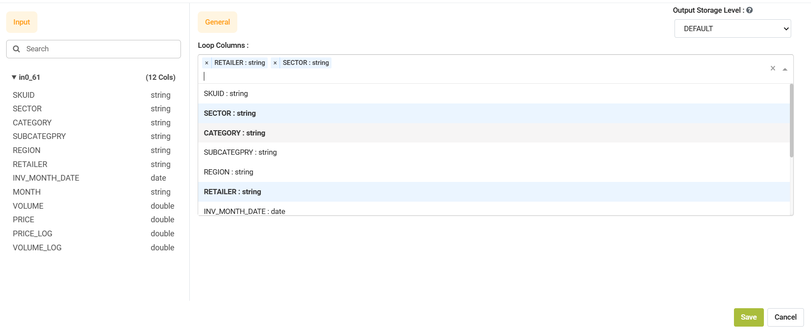

Execute In Loop
=================

Fire Insights has the below processor for Distinct Values in Loop.

Below are the parameters that can be used in the 'Execute In Loop' processor:

.. list-table:: **Execute In Loop**
   :widths: 20 80
   :header-rows: 1
   
   * - Title
     - Description
   * - Output Storage Level
     - Default is recommended.
   * - Input
     - It lists all the columns available from the input dataset.
   * - Loop Columns
     - Select the columns from the dropdown list for which you want to find distinct values.
     

