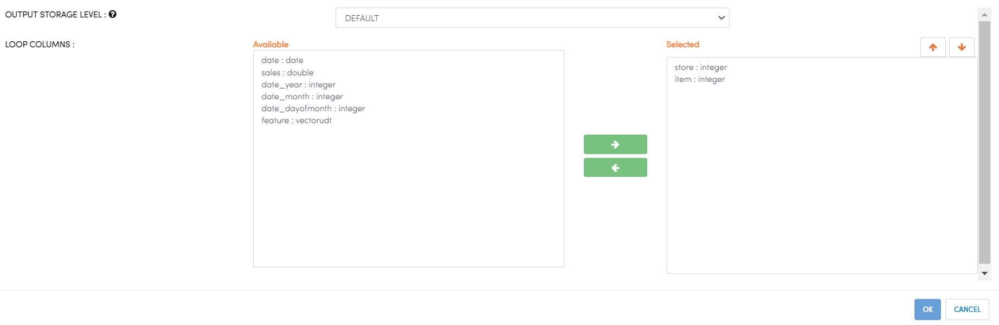

Execute In Loop
=================

Fire Insights has the below processors for Distinct Values in Loop.

Below are parameter which can be used in Execute In Loop processor:

.. list-table:: Execute In Loop
   :widths: 20 80
   :header-rows: 1
   
   * - Title
     - Description
   * - LOOP COLUMNS
     - Select the columns which need to find distinct values.
     

