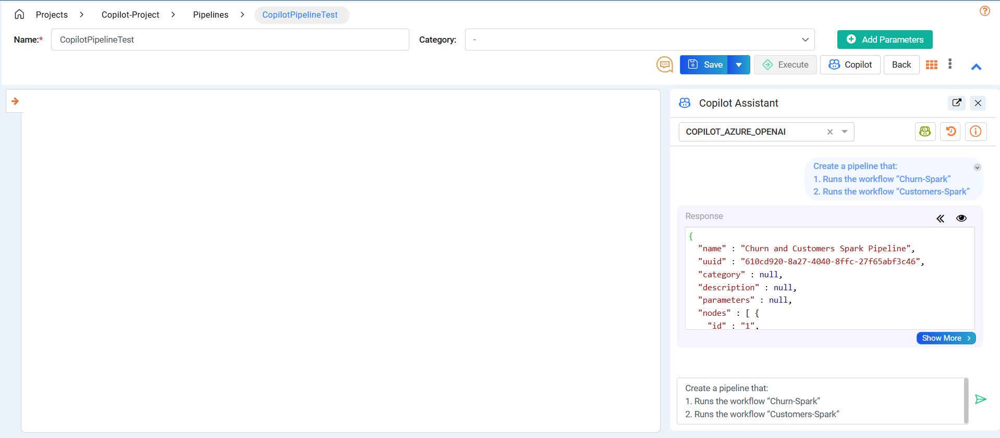

Copilot Pipeline Examples
====

This guide provides examples of using Copilot to create and update pipelines. 

Follow the steps below to see how Copilot can assist in building and modifying your data processes.

Pipeline Copilot Examples
----

Click on the **Copilot** button to open the Assistant window.

**Example Prompt**
++++++++++++++++++++++++

Example 1
++++

**Step 1: Create the Initial Pipeline using the prompt**

Prompt 1

Create the pipeline by:

1. Adding an emr cluster
2. Adding a step to the emr with the workflow name "wf_token_size" after step 1 
3. Adding a step sensor to check the status from step 2 
4. Terminate the cluster once the step sensor is completed after step 3

* After receiving the response, the user can select and preview it. The **Select** button converts the response into the pipeline edit page.

  .. figure:: ../../_assets/user-guide/copilot/copilot-example-pipeline-2.png
     :alt: copilot configuration
     :width: 60%

**Step 2: Update the Created Pipeline with more functions by using another prompt**

Prompt 2

Update pipeline by:

1. Adding a step to the emr with task name “new_task” between node 2 and 3 

  .. figure:: ../../_assets/user-guide/copilot/copilot-example-pipeline-2-update.png
     :alt: copilot configuration
     :width: 60%

Example 2
++++

**Prompt 1**

Create the pipeline by:

1. Adding an emr cluster
2. Adding a step to the emr with the workflow name "wf_token_size" after step 1 
   
  .. figure:: ../../_assets/user-guide/copilot/copilot-example-pipeline-3.png
     :alt: copilot configuration
     :width: 60%

**Prompt 2**

Update pipeline by:

1. Add a step sensor node to check the status after node 2
2. Terminate the cluster once the step sensor node is completed.

  .. figure:: ../../_assets/user-guide/copilot/copilot-example-pipeline-3-update.png
     :alt: copilot configuration
     :width: 60%

Example 3
++++

**Prompt 1**

Create a pipeline using the following nodes and logic:

1. Add an S3 Sensor to wait for a file arrival in the bucket “raw-data-uploads”
2. Add a Branch Python Operator node after step 1 which checks the file extension between .csv and .parquet
3. Add a Run Snowflake Command as a new branch from node 2
4. Add a Create Cluster node as a new branch from node 2
5. Add a Run Notebook node with notebook name “process_parquet” after step 4
6. Add a Terminate Cluster node after node 5
7. Join node 3 and node 8 using the Empty Operator node after step 6
8. Add Email Notification to send a success status after step 7
9. Add a Trigger Next DAG node with name “downstream_analytics" after step 8
   
  .. figure:: ../../_assets/user-guide/copilot/copilot-example-pipeline-4.png
     :alt: copilot configuration
     :width: 60%
