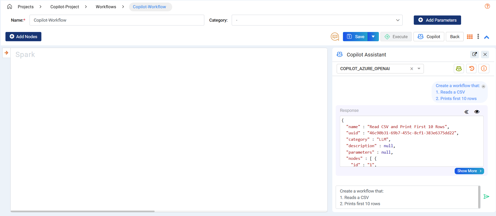

Copilot Workflow Examples
====

This guide provides examples of using Copilot to create and update workflows. 

Follow the steps below to see how Copilot can assist in building and modifying your data processes.

Workflow Copilot Examples
----
Click on the **Copilot** button to open the Assistant window.

**Example Workflow Creation Prompts**
+++++++++++++++++++++

Example 1
++++

**Step 1: Create the Initial Workflow using the prompt**

Prompt 1

Create a workflow by:

1. Reading Parquet data from the S3 location: **s3a://assume-role-bucket1/data/housing_parquet/**.

2. Selecting rows with a price greater than 42,000.

3. Selecting columns with names: **id**, **price**, **lotsize**, and **bedrooms**.

4. Saving the output as Parquet to the S3 location: **s3a://assume-role-bucket1/data/assit_output** with overwrite mode.

* After receiving the response, the user can select and preview it. The **Select** button converts the response into the workflow edit page.

  .. figure:: ../../_assets/user-guide/copilot/copilot-example-wf.png
     :alt: copilot configuration
     :width: 60%

**Step 2: Update the Created Workflow with more functions by using another prompt**

* Update the workflow by calculating ``totalprice = price * lotsize`` after the row filter. 
* Then select the final columns: **id**, **price**, **lotsize**, **bedrooms**, and **totalprice**.

  .. figure:: ../../_assets/user-guide/copilot/wf-add-math-expression.png
     :alt: copilot configuration
     :width: 60%
   
  In the above, a **MathExpression** is added with ``totalprice = price * lotsize``.

**Step 3: Add a New Field**

* Update the workflow with one more field to calculate: ``sqft_price = lotsize / price``

Example 2
++++

**Prompt 1**

Create a workflow that:

1. Reads a parquet file from this path “s3a://dp-nucleus-us-east-1-dev/Sparkflows-data/erics/270/”
2. Print the first 13 rows from Step 1 on a new branch
3. Filter rows where event_source = DirectGatewayRequest from Step 1
4. Select columns “record_uuid, event_source, payload” from Step 3
5. Save the output of Step 4 to this path "s3a://dp-nucleus-us-east-1-dev/Sparkflows-data/output" as a parquet file

 .. figure:: ../../_assets/user-guide/copilot/copilot-ex2-prompt1-wf.png
    :alt: copilot configuration
    :width: 60%

**Prompt 2**

Update the workflow by:

1. Print first 2 rows from output of node 4 as a new branch
2. Update node 1 to read from file 's3a://test'
3. Remove node 3 and connect node 1 to node 4
4. Remove node 2

 .. figure:: ../../_assets/user-guide/copilot/copilot-ex2-prompt2-wf.png
     :alt: copilot configuration
     :width: 60%

Example 3
++++

**Prompt 1**

Create a workflow that: 

1. Reads the CSV located at “/home/sparkflows/fire-data/TELCO/Telco-Churn-Prediction/Raw-Data/churn.csv”
2. Remove the rows from step 1 where any of the following columns are null “state, account_length, total_day_minutes, churned”
3. Use Data Cleansing Node to remove all whitespaces anywhere in the string on the “churned” column from step 2
4. Filter rows from step 3 by the rule: “churned = ‘True.’”
5. Print the first 20 rows from the output of step 4 as a new branch
6. Group the output of step 4 by “state” and calculate average of total_day_minutes as “avg_total_day_minutes”, average of total_day_charge as “avg_total_day_charge”, and count of churned customers as “churned_count”
7. Sort the output of step 6 by churn count in descending order 
8. Write the output of step 7 as a CSV to “/home/sparkflows/fire-data/TELCO/Telco-Churn-Prediction/Cleaned_aggregated/” in overwrite mode

 .. figure:: ../../_assets/user-guide/copilot/copilot-ex3-prompt1-wf.png
     :alt: copilot configuration
     :width: 60%

Example 4
++++

**Prompt 1**

Create a workflow that: 

1. Reads the CSV located at “/home/sparkflows/fire-data/TELCO/Telco-Churn-Prediction/Raw-Data/churn.csv”
2. Filters the rows where “total_day_minutes > 250” from step 1
3. Selects the columns “state, account_length, total_day_minutes, total_day_charge, churned” from step 2
4. Saves the output of step 3 to “/home/sparkflows/fire-data/TELCO/Telco-Churn-Prediction” as a parquet file with overwrite mode set

Example 5
++++

**Prompt 1**

Add a Row Filter node after node 4 with conditoin "total_day_minutes > 250"

Example 5
++++

**Prompt 1**

Remove node 2 from the workflow

Example 6
++++

**Prompt 1**

Update the workflow by changing the source file in node 1 to “/home/sparkflows/fire-data/TELCO/Telco-Churn-Prediction/Raw-Data/churn_new.csv”

Example 7
++++

**Prompt 1**

Create a workflow that: 

1. Read the CSV file located at “/path/to/file/orders.csv”
2. Select the columns “order_id, order_date” from step 1
3. Extracts the month from the “order_date” column and creates a new column “order_month” from step 2

**Prompt 2**

Update the workflow by:

1. Adding a node that reads another CSV file located at “/path/to/file/order_items.csv”
2. Select the columns “order_id, price, quantity” from step 1

**Prompt 3**

Update the workflow by: 

1. Joining node 3 and node 5 on “order_id” column
2. Create the column “total_price” by multiplying “price” and “quantity” columns from step 1
3. Saves the output of step 2 to “/path/to/file/output” as a CSV 

Example 8
++++

**Prompt 1**

Create a workflow that: 

1. Read the CSV file located at “/path/to/file/orders.csv”
2. Group the data by “order_id” and calculate the sum of “total_amount” as “order_total” from step 1

**Prompt 2**

Update the workflow by: 

1. Group the data by “order_id” and calculate the average of “total_amount” as “order_avg” from node 1 as a new branch

**Prompt 3**

Update the workflow by:

1. Joining node 2 and node 3 on “order_id” column
2. Print the first 10 rows of the output from step 1 as a new branch
3. Saves the output of step 1 to “/path/to/file/output” as a CSV

Example 9
++++

**Prompt 1**

Create a workflow that: 

1. Read the CSV file located at “/path/to/file/orders.csv”
2. When "email_supplied='Yes'" put 1 in the column "email_flag" else put 0 in the "email_flag" column
3. When "phone_supplied='Yes'" put 1 in the column "phone_flag" else put 0 in the "phone_flag" column
4. Drop the columns "email_supplied" and "phone_supplied" from step 3
5. Saves the output of step 4 to “/path/to/file/output” as a CSV

Example 10
++++

**Prompt 1**

Create a workflow that: 

1. Read the CSV file located at “/path/to/file/training_data.csv”
2. Trains Generalized Linear Models with label column "label" from step 1
3. Save the trained model using H2O Model Save Node to path “/path/to/file/model” from step 2
