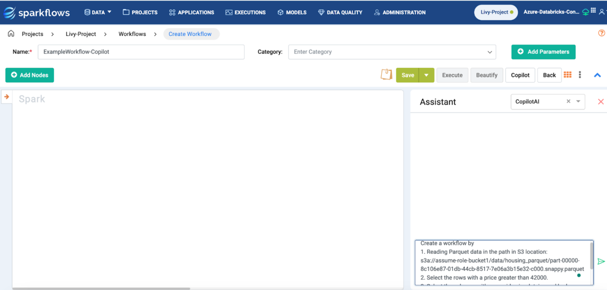
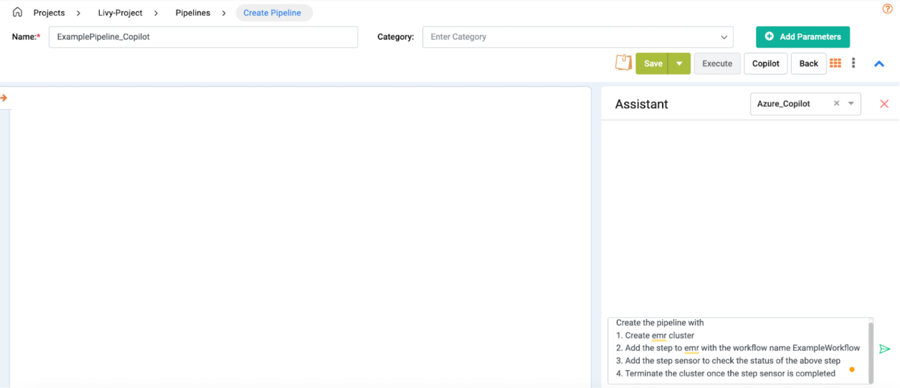

Copilot Examples
====

This guide provides examples of using Copilot to create and update workflows and pipelines. 

Follow the steps below to see how Copilot can assist in building and modifying your data processes.

Workflow Copilot Example
----
Click on the **Copilot** button to open the Assistant window.

**Example Prompt**
+++++++++++++++++++++

**Step 1: Create the Initial Workflow**

* Create a workflow by:

  1. Reading Parquet data from the S3 location: **s3a://assume-role-bucket1/data/housing_parquet/**.

  2. Selecting rows with a price greater than 42,000.

  3. Selecting columns with names: **id**, **price**, **lotsize**, and **bedrooms**.

  4. Saving the output as Parquet to the S3 location: **s3a://assume-role-bucket1/data/assit_output** with overwrite mode.

* After receiving the response, the user can select and preview it. The **Select** button converts the response into the workflow edit page.

  .. figure:: ../../_assets/user-guide/copilot/copilot-example-wf.png
     :alt: copilot configuration
     :width: 60%

**Step 2: Update the Created Workflow with more functions**

* Update the workflow by calculating ``totalprice = price * lotsize`` after the row filter. 
* Then select the final columns: **id**, **price**, **lotsize**, **bedrooms**, and **totalprice**.

  .. figure:: ../../_assets/user-guide/copilot/wf-add-math-expression.png
     :alt: copilot configuration
     :width: 60%
   
  In the above, a **MathExpression** is added with ``totalprice = price * lotsize``.

**Step 3: Add a New Field**

* Update the workflow with one more field to calculate: ``sqft_price = lotsize / price``

Pipeline Copilot Example
----

Click on the **Copilot** button to open the Assistant window.

**Example Prompt**
++++++++++++++++++++++++

* Create the pipeline by:

  1. Creating an EMR cluster.

  2. Adding a step to EMR with the workflow name **ExampleWorkflow**.

  3. Adding a step sensor to check the status of the above step.

  4. Terminating the cluster once the step sensor is completed.

* After receiving the response, the user can select and preview it. The **Select** button converts the response into the pipeline edit page.

  .. figure:: ../../_assets/user-guide/copilot/copilot-example-pipeline.png
     :alt: copilot configuration
     :width: 60%

