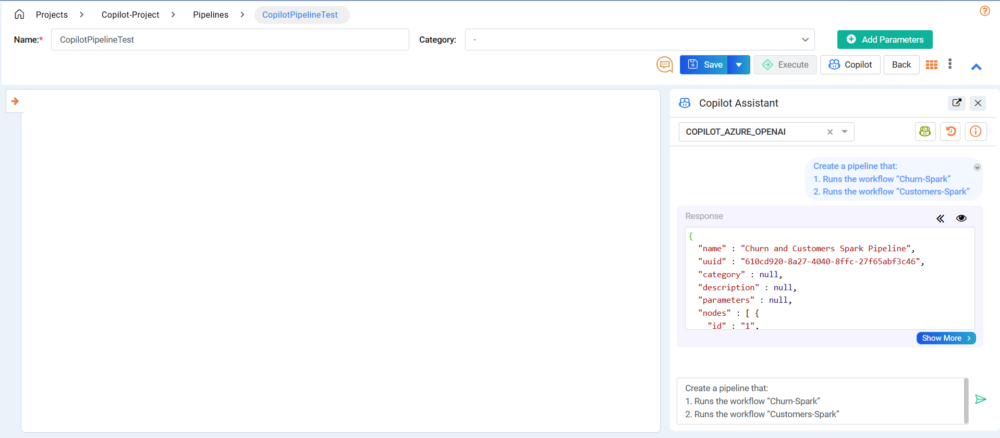

Update Pipeline Examples
====

This guide shows how to structure effective prompts and use Copilot to update existing pipelines.

**Opening the Copilot Assistant**
+++++++++++++++++++++
Click on the **Copilot** button to open the Assistant window. Type your queries into the text field and click **Enter** to interact with Copilot.

**Update - Example Prompts**
+++++++++++++++++++++

Example 1
++++

**Prompt**

Update the pipeline by:

1. Adding a step to the emr with task name “new_task” between node 2 and 3
 
**Before**

 .. figure:: ../../../_assets/user-guide/copilot/update-pipeline-examples/example-1-before.png
    :alt: copilot configuration
    :width: 60%
**After**

 .. figure:: ../../../_assets/user-guide/copilot/update-pipeline-examples/example-1-after.png
    :alt: copilot configuration
    :width: 60%

Example 2
++++

**Prompt**

Update pipeline by:

1. Removing nodes 2 and 5 and connecting node 1 to node 3
 
**Before**

 .. figure:: ../../../_assets/user-guide/copilot/update-pipeline-examples/example-2-before.png
    :alt: copilot configuration
    :width: 60%

**After**

 .. figure:: ../../../_assets/user-guide/copilot/update-pipeline-examples/example-2-after.png
    :alt: copilot configuration
    :width: 60%

Example 3
++++

**Prompt**

Update the pipeline by:

1. Setting node 1 task name to "test_task_name" and its cluster name to "test_cluster_name"
2. Setting node 5 to terminate job flow on failure 
 
**Before**

 .. figure:: ../../../_assets/user-guide/copilot/update-pipeline-examples/example-3-before.png
    :alt: copilot configuration
    :width: 60%

**After**

 .. figure:: ../../../_assets/user-guide/copilot/update-pipeline-examples/example-3-after.png
    :alt: copilot configuration
    :width: 60%

Example 4
++++

**Prompt**

Update the pipeline by:

1. Adding a Snowflake Sensor node before node 3
 
**Before**

 .. figure:: ../../../_assets/user-guide/copilot/update-pipeline-examples/example-4-before.png
    :alt: copilot configuration
    :width: 60%

**After**

 .. figure:: ../../../_assets/user-guide/copilot/update-pipeline-examples/example-4-after.png
    :alt: copilot configuration
    :width: 60%

Example 5
++++

**Prompt**

Update the pipeline by:

1. Adding a Branch Python Operator node after node 1
2. Connecting node 2 as a new branch from step 1
3. Adding a Run Snowflake Command node as a new branch from step 1
4. Joining the outputs of step 2 and step 3 using an Empty Operator node
5. Connecting the output of step 4 to node 3
 
**Before**

 .. figure:: ../../../_assets/user-guide/copilot/update-pipeline-examples/example-5-before.png
    :alt: copilot configuration
    :width: 60%

**After**

 .. figure:: ../../../_assets/user-guide/copilot/update-pipeline-examples/example-5-after.png
    :alt: copilot configuration
    :width: 60%