Create Workflow Examples
====

This guide shows how to structure effective prompts and use Copilot to create new workflows.

Follow the steps below to explore how Copilot can help you design and build your data processes more efficiently.

**Opening the Copilot Assistant**
+++++++++++++++++++++
Click on the **Copilot** button to open the Assistant window. Type your queries into the text field and click **Enter** to interact with Copilot.

.. figure:: ../../../_assets/user-guide/copilot/Copilot-On-Workflow/Copilot-WF-Generate-Response.PNG
    :alt: copilot configuration
    :width: 60%

**Create - Example Prompts**
+++++++++++++++++++++

Example 1
++++

**Prompt**

Create a workflow that:

1. Reads Parquet data from the S3 location: **s3a://assume-role-bucket1/data/housing_parquet/**
2. Filters rows where "price > 42,000"
3. Selects columns with names: **id**, **price**, **lotsize**, and **bedrooms**
4. Saves the output as a Parquet to the S3 location: **s3a://assume-role-bucket1/data/assit_output** with overwrite mode.
 
**Generated Workflow**

After receiving the response, you can choose to **preview** or **select** it. The **Preview** button lets you review the generated workflow before making a decision. Selecting **Select** converts the response into the workflow edit page, where you can continue refining it.

 .. figure:: ../../../_assets/user-guide/copilot/create-workflow-examples/example-1.png
    :alt: copilot configuration
    :width: 60%

Example 2
++++

**Prompt**

Create a workflow that:

1. Reads a parquet file from this path “s3a://dp-nucleus-us-east-1-dev/Sparkflows-data/erics/270/”
2. Prints the first 13 rows from Step 1 on a new branch
3. Filters rows where "event_source = DirectGatewayRequest" from Step 1
4. Select columns “record_uuid, event_source, payload” from Step 3
5. Save the output of Step 4 to this path "s3a://dp-nucleus-us-east-1-dev/Sparkflows-data/output" as a parquet file

**Generated Workflow**

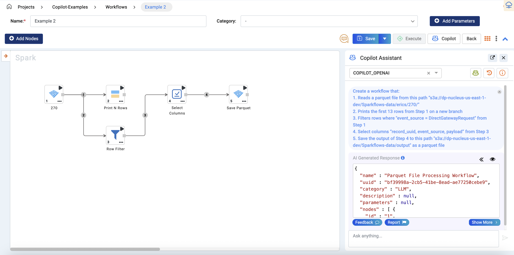

Example 3
++++

**Prompt**

Create a workflow that:

1. Reads the CSV located at “/home/sparkflows/fire-data/TELCO/Telco-Churn-Prediction/Raw-Data/churn.csv”
2. Removes the rows from step 1 where any of the following columns are null “state, account_length, total_day_minutes, churned”
3. Use Data Cleansing Node to remove all whitespaces anywhere in the string on the “churned” column from step 2
4. Filters rows from step 3 by the rule: “churned = ‘True.’”
5. Prints the first 20 rows from the output of step 4 as a new branch
6. Groups the output of step 4 by “state” and calculate average of total_day_minutes as “avg_total_day_minutes”, average of total_day_charge as “avg_total_day_charge”, and count of churned customers as “churned_count”
7. Sorts the output of step 6 by churn count in descending order
8. Writes the output of step 7 as a CSV to “/home/sparkflows/fire-data/TELCO/Telco-Churn-Prediction/Cleaned_aggregated/” in overwrite mode

**Generated Workflow**

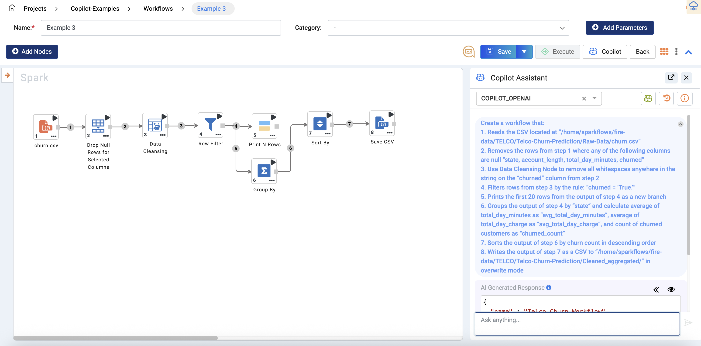

Example 4
++++

**Prompt**

Create a workflow that:

1. Reads the CSV located at “/home/sparkflows/fire-data/TELCO/Telco-Churn-Prediction/Raw-Data/churn.csv”
2. Filters the rows where “total_day_minutes > 250” from step 1
3. Selects the columns “state, account_length, total_day_minutes, total_day_charge, churned” from step 2
4. Saves the output of step 3 to “/home/sparkflows/fire-data/TELCO/Telco-Churn-Prediction” as a parquet file with overwrite mode set

**Generated Workflow**

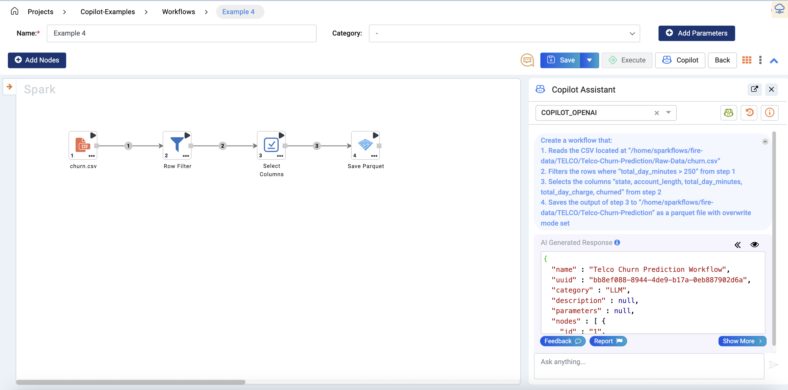

Example 5
++++

**Prompt**

Create a workflow that:

1. Reads the CSV file located at “/path/to/file/orders.csv”
2. Groups the data by “order_id” and calculate the sum of “total_amount” as “order_total” from step 1

**Generated Workflow**

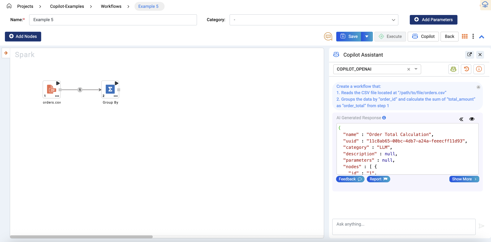

Example 6
++++

**Prompt**

Create a workflow that:

1. Reads the CSV file located at “/path/to/file/orders.csv”
2. When "email_supplied='Yes'" put 1 in the column "email_flag" else put 0 in the "email_flag" column
3. When "phone_supplied='Yes'" put 1 in the column "phone_flag" else put 0 in the "phone_flag" column
4. Drops the columns "email_supplied" and "phone_supplied" from step 3
5. Saves the output of step 4 to “/path/to/file/output” as a CSV

**Generated Workflow**

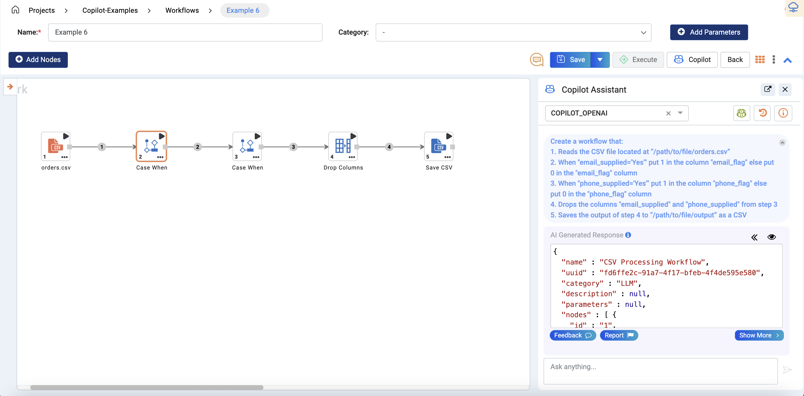

Example 7
++++

**Prompt**

Create a workflow that:

1. Reads the CSV file located at “/path/to/file/training_data.csv”
2. Trains Generalized Linear Models with label column "label" from step 1
3. Save the trained model using H2O Model Save Node to path “/path/to/file/model” from step 2

**Generated Workflow**

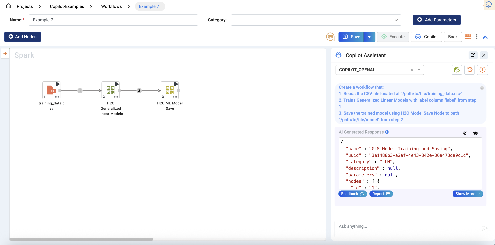

Example 8
++++

**Prompt**

Create a workflow that:

1. Reads the JSON file at "/data/sales/2025/january.json"
2. Filters rows where "region = 'EMEA'"
3. Converts column "sale_amount" to numeric
4. Fill null values in "sale_amount" column with 0
5. Groups data by "sales_rep" and calculates total sales as "total_sales"
6. Sorts by "total_sales" in descending order
7. Writes output as Parquet to "/data/sales/processed/january_emea/"

**Generated Workflow**

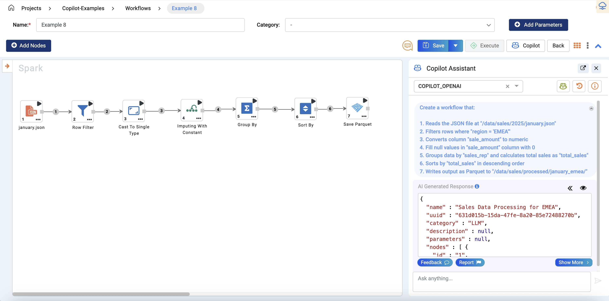

Example 9
++++

**Prompt**

Create a workflow to:

1. Read the CSV "/data/marketing/campaign.csv"
2. Drop rows with null values
3. Clean whitespace in column "campaign_name" from step 3
4. Filter rows with condition "clicks > 100" from step 4
5. Create a new column "CTR" from the expression "clicks / impressions" from step 5
6. Write output as CSV to "/data/marketing/processed/campaign_filtered/data.csv" in overwrite mode

**Generated Workflow**

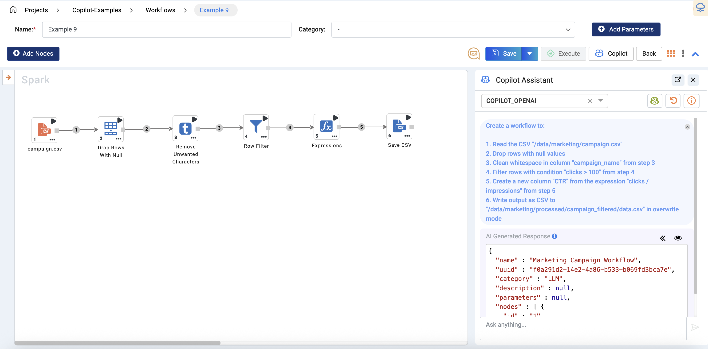

Example 10
++++

**Prompt**

Create a workflow to:

1. Load Excel "/data/hr/employee_data.xlsx"
2. Select columns "employee_id", "name", "salary", "department" from step 1
3. Filter rows by salary > 50000 and salary < 100000 from step 2
4. Group by department to compute average salary as "avg_salary" from step 3
5. Write output as CSV to "/data/hr/processed/avg_salary_by_department/" from step 4

**Generated Workflow**

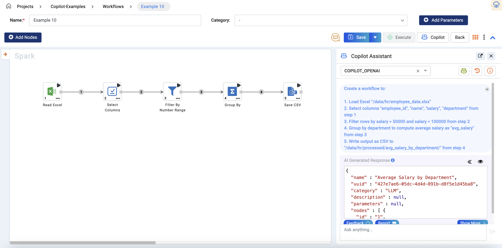

Example 11
++++

**Prompt**

Create a workflow to:

1. Read CSV "/data/logs/server_logs.csv"
2. Parse "timestamp" column to UNIX timestamp from step 1
3. Filter rows where status_code = 500 from step 2
4. Extract the hour from the "timestamp" column as a new column named "hour" from step 3
5. Group by "hour" columns to compute count as "error_count" from step 4
6. Write output to as CSV to "/data/logs/errors_by_hour/" in overwrite mode

**Generated Workflow**

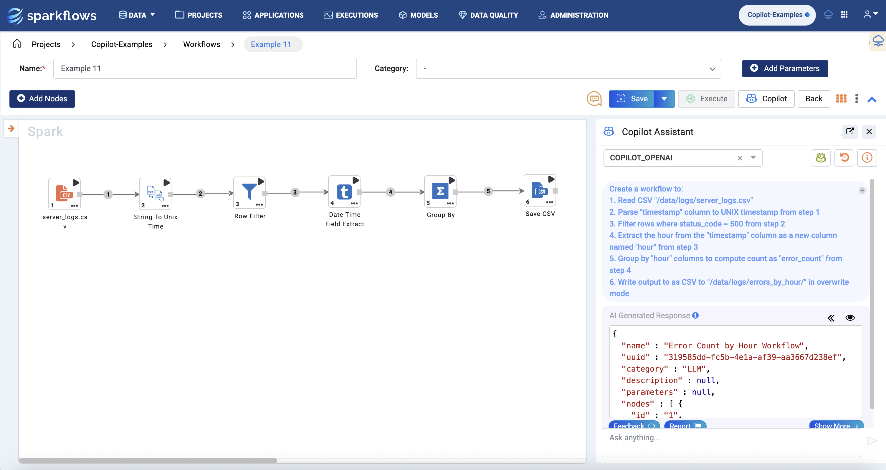

Example 12
++++

**Prompt**

Create a workflow to:

1. Read JSON file "/data/orders/orders_2025.json"
2. Explode column "order_items" array into rows from step 1
3. Filter rows by "quantity > 2" from step 2
4. Create a new column "total_price" using the expression "quantity * unit_price" from step 3
5. Group by "product_id" to compute total quantity as "total_quantity" and total sales as "total_sales" from step 4
6. Read JSON file "/data/products/products_master.csv" 
7. Join output of step 6 with output of step 5 on "product_id"
8. Sort by "total_sales" in descending order
9. Write the output as CSV to "/data/orders/top_products/"

**Generated Workflow**

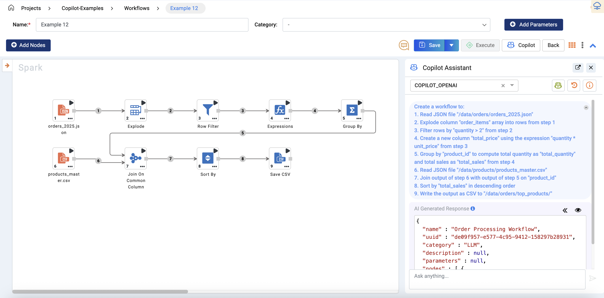