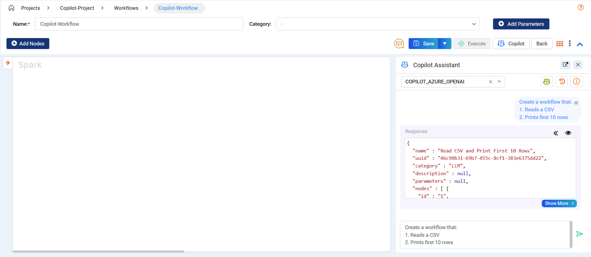

Update Workflow Examples
====

This guide shows how to structure effective prompts and use Copilot to update existing workflows.

Follow the steps below to explore how Copilot can help you modify and enhance your existing data processes more efficiently.

**Opening the Copilot Assistant**
+++++++++++++++++++++
Click on the **Copilot** button to open the Assistant window. Type your queries into the text field and click **Enter** to interact with Copilot.

**Update - Example Prompts**
+++++++++++++++++++++

Example 1
++++

**Prompt**

Update the workflow by:

1. Calculating "totalprice = price * lotsize" after node 4
2. Then select the final columns: **id**, **price**, **lotsize**, **bedrooms**, and **totalprice** from step 1
 
**Before**

 .. figure:: ../../../_assets/user-guide/copilot/update-workflow-examples/example-1-before.png
    :alt: copilot configuration
    :width: 60%

**After**

After receiving the response, you can choose to **preview** or **select** it. The **Preview** button lets you review the generated workflow before making a decision. Selecting **Select** converts the response into the workflow edit page, where you can continue refining it.

 .. figure:: ../../../_assets/user-guide/copilot/update-workflow-examples/example-1-after.png
    :alt: copilot configuration
    :width: 60%

Example 2
++++

**Prompt**

Update the workflow by:

1. Print first 2 rows from output of node 4 as a new branch
2. Update node 1 to read from file 's3a://test'
3. Remove node 3 and connect node 1 to node 4
4. Remove node 2
 
**Before**

 .. figure:: ../../../_assets/user-guide/copilot/update-workflow-examples/example-2-before.png
    :alt: copilot configuration
    :width: 60%

**After**

 .. figure:: ../../../_assets/user-guide/copilot/update-workflow-examples/example-2-after.png
    :alt: copilot configuration
    :width: 60%

Example 3
++++

**Prompt**

Update the workflow by:

1. Have node 1 read from file path “/home/sparkflows/fire-data/TELCO/Telco-Churn-Prediction/Raw-Data/churn_new.csv”
 
**Before**

 .. figure:: ../../../_assets/user-guide/copilot/update-workflow-examples/example-3-before.png
    :alt: copilot configuration
    :width: 60%

**After**

 .. figure:: ../../../_assets/user-guide/copilot/update-workflow-examples/example-3-after.png
    :alt: copilot configuration
    :width: 60%

Example 4
++++

**Prompt**

Update the workflow by:

1. Adding a node that reads another CSV file located at “/path/to/file/order_items.csv”
2. Select the columns “order_id, price, quantity” from step 1
 
**Before**

 .. figure:: ../../../_assets/user-guide/copilot/update-workflow-examples/example-4-before.png
    :alt: copilot configuration
    :width: 60%

**After**

 .. figure:: ../../../_assets/user-guide/copilot/update-workflow-examples/example-4-after.png
    :alt: copilot configuration
    :width: 60%

Example 5
++++

**Prompt**

Update the workflow by:

1. Joining node 1 and node 2 on “order_id” column
2. Create the column “total_price” by multiplying “price” and “quantity” columns from step 1
3. Saves the output of step 2 to “/path/to/file/output” as a CSV
 
**Before**

 .. figure:: ../../../_assets/user-guide/copilot/update-workflow-examples/example-5-before.png
    :alt: copilot configuration
    :width: 60%

**After**

 .. figure:: ../../../_assets/user-guide/copilot/update-workflow-examples/example-5-after.png
    :alt: copilot configuration
    :width: 60%

Example 6
++++

**Prompt**

Update the workflow by:

1. Adding a group by node between node 3 and node 5
2. Update the new node to Group by “order_id” and calculate the average of “total_amount” column as “order_avg” 
 
**Before**

 .. figure:: ../../../_assets/user-guide/copilot/update-workflow-examples/example-6-before.png
    :alt: copilot configuration
    :width: 60%

**After**

 .. figure:: ../../../_assets/user-guide/copilot/update-workflow-examples/example-6-after.png
    :alt: copilot configuration
    :width: 60%

Example 7
++++

**Prompt**

Update the workflow by:

1. Joining node 1 and node 2 on “order_id” column
2. Print the first 10 rows of the output from step 1 as a new branch
3. Saves the output of step 1 to “/path/to/file/output” as a CSV
 
**Before**

 .. figure:: ../../../_assets/user-guide/copilot/update-workflow-examples/example-7-before.png
    :alt: copilot configuration
    :width: 60%

**After**

 .. figure:: ../../../_assets/user-guide/copilot/update-workflow-examples/example-7-after.png
    :alt: copilot configuration
    :width: 60%

Example 8
++++

**Prompt**

Update the workflow to:

1. Normalize column "total_day_minutes" using MinMax scaling after node 3
2. Filter rows with "churned = True" from step 1
3. Save the output of step 1 to “/path/to/file/output” as a CSV from step 2
 
**Before**

 .. figure:: ../../../_assets/user-guide/copilot/update-workflow-examples/example-8-before.png
    :alt: copilot configuration
    :width: 60%

**After**

 .. figure:: ../../../_assets/user-guide/copilot/update-workflow-examples/example-8-after.png
    :alt: copilot configuration
    :width: 60%

Example 9
++++

**Prompt**

Update the workflow to:

1. Normalize column "total_day_minutes" using MinMax scaling after node 3
2. Filter rows with "churned = True" from step 1
3. Save the output of step 1 to “/path/to/file/output” as a CSV from step 2
 
**Before**

 .. figure:: ../../../_assets/user-guide/copilot/update-workflow-examples/example-9-before.png
    :alt: copilot configuration
    :width: 60%

**After**

 .. figure:: ../../../_assets/user-guide/copilot/update-workflow-examples/example-9-after.png
    :alt: copilot configuration
    :width: 60%

Example 10
++++

**Prompt**

Update the workflow to:

1. Filter rows where "total_day_minutes > 200" between node 3 and node 4
2. Group by "state" and "usage_category" to count customers as "customer_count" after node 4
3. Sort the results by "customer_count" in descending order from step 2
4. Print the first 20 rows as a new branch from step 3
5. Write the results as CSV to /data/churn/processed/state_usage_summary/ in overwrite mode from step 3
 
**Before**

 .. figure:: ../../../_assets/user-guide/copilot/update-workflow-examples/example-10-before.png
    :alt: copilot configuration
    :width: 60%

**After**

 .. figure:: ../../../_assets/user-guide/copilot/update-workflow-examples/example-10-after.png
    :alt: copilot configuration
    :width: 60%

Example 11
++++

**Prompt**

Update the workflow to:

1. Update node 1 to read from "/data/telco/2025/churn_data.csv"
2. Update node 2 filter condition to "churned = 'True' AND total_day_minutes > 200"
3. Remove node 3
4. Connect node 2 to node 4
 
**Before**

 .. figure:: ../../../_assets/user-guide/copilot/update-workflow-examples/example-11-before.png
    :alt: copilot configuration
    :width: 60%

**After**

 .. figure:: ../../../_assets/user-guide/copilot/update-workflow-examples/example-11-after.png
    :alt: copilot configuration
    :width: 60%