Data Exploration
==========

Fire Insights provides a number of processors or nodes for exploration of data.

Data Exploration Processors in Fire Insights
----------------------------------------

.. list-table:: 
   :widths: 30 70
   :header-rows: 1

   * - Title
     - Description
   * - ColumnsCardinality
     - Distribution of categorical data. Calculates the count of records for each unique value for the column specified.
   * - Correlation
     - Computes and displays the correlation between two series of data.
   * - CrossTab
     - Displays distribution of data for all combination of categorical data series.
   * - DistinctValuesInColumn   
     - Displays distinct combination data present in the select data series.
   * - Flag Outlier
     - Flag the outlier based on the selected column using Box-and-Whisker technique.
   * - GraphMonthDistribution  
     - This node displays monthly distribution of data.
   * - GraphWeekDayDistribution  
     - This node displays weekday wise distribution of data.     
   * - GraphYearDistribution  
     - This node displays yearly distribution of data.     
   * - Histogram  
     - This node displays distribution of data spread across multiple bins.    
   * - NullValuesInColumn  
     - Number of Null Values in Selected Columns.
   * - Skewness And Kurtosis
     - Displays Skewness (measure of symmetry) and Kurtosis (measure of whether the data are heavy-tailed or light-tailed relative to a normal distribution).
   * - Summary Statistics
     - Summary statistics provide useful information about sample data, e.g. measures of spread.
 
Columns Cardinality
----------------------------------------

Below is a sample workflow that contains Columns Cardinality processor in Fire Insights. It demonstrates the usage of Columns Cardinality node to display categorical distribution of data. It displays count of rows for each distinct values in the selected columns (Categories).

It does the following processing of data:

*	Reads incoming dataset.
*	Displays Categorical distribution of data using Columns Cardinality node. It displays count of rows for each distinct values in the selected columns (Categories). More than one column can be seclected to display distribution of data.

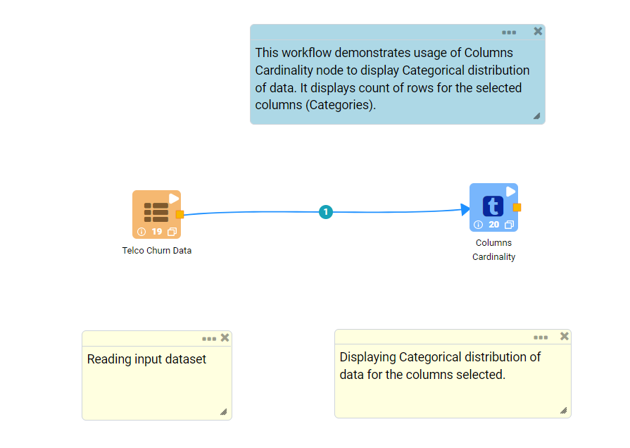
   
**Incoming Dataset**

.. figure:: ../../_assets/user-guide/data-exploration/data-exploration/columnscardinality-incoming-dataset.png
   :alt: dataexploration_userguide
   :width: 75%

**Columns Cardinality Node Configuration**

Columns Cardinalitynode is configured as below.

*	Input of this node is the incoming dataset.
*	``Max Values To Display`` specifies the maximum Categorical data to be displayed. It denotes maximum number of distinct values in the selected columns for which count needs to be displayed.
*	Columns for which distribution needs to be displayed is to be selected in ``Column Names`` list. More than one column can be selected. Data for each columns would be displayed separately.
*	Output of this node would contain count of each distinct values in the selected columns.

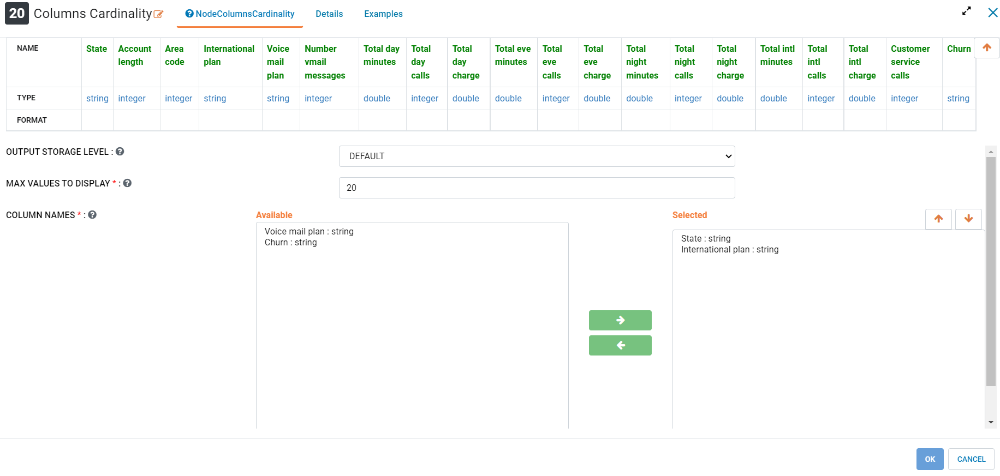
   
**Columns Cardinality Node output**

Output of Columns Cardinality node displaying count of distinct values for each selected columns and categorical data (count of distinct values) for each selected columns in the node.

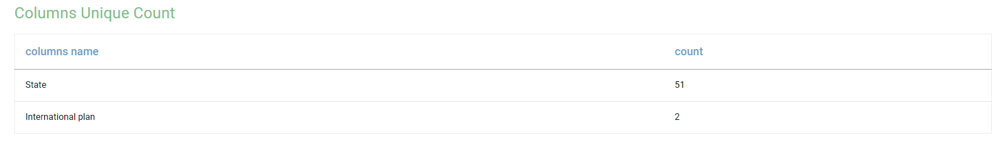
   
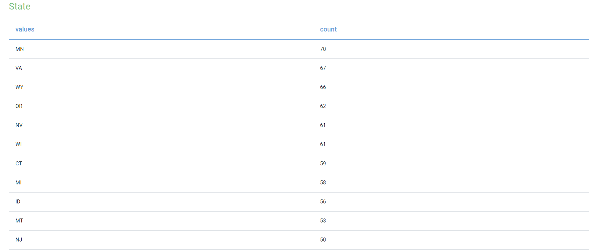
   
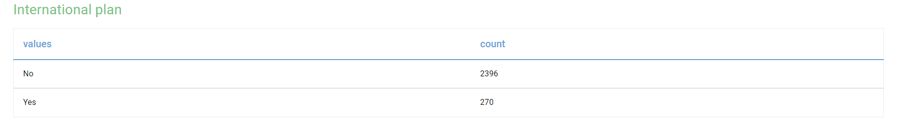
   
Correlation
----------------------------------------

Below is a sample workflow that contains Correlation processor in Fire Insights. It demonstrates the usage of Correlation node to display correlation between data of selected columns.

It does the following processing of data:

*	Reads incoming dataset.
*	Displays correlation between data of selected columns using Correlation node. More than two columns can be selected to identify correlation. It displays correlation in color codes along with scale to read highly and less correlated data series.

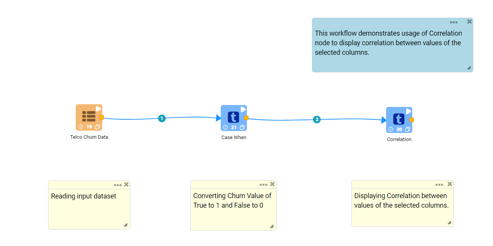
   
**Incoming Dataset**

.. figure:: ../../_assets/user-guide/data-exploration/data-exploration/correlation-incoming-dataset.png
   :alt: dataexploration_userguide
   :width: 75%

**Correlation Node Configuration**

Correlation node is configured as below.

*	Input of this node is the incoming dataset.
*	All Numeric between which the correlation is to be identified are to be selected in ``Input Column For Correlation`` list.
*	Title of the Correlation Matrix needs to be entered in ``Title``.
*	Output of this node would display correlation between all the selected columns.

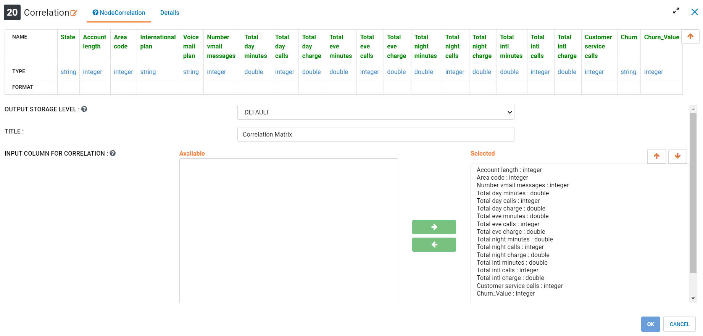
   
**Correlation Node Output**

Output of ``Correlation`` node displaying correlation between all the selected columns along with the color code is shown as below. The output as shown below displays Correlation Matrix along with Color Code Scale. Green indicates highly correlated and Red, less correlated. From the output as shown below, we can identify that ``Customer Service Calls`` and ``Churn`` are correlated.

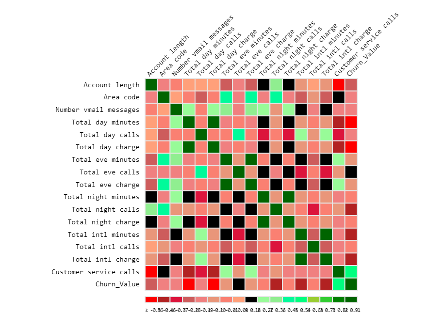
   
Cross Tab
----------------------------------------

Below is a sample workflow that contains ``Cross Tab`` processor in Fire Insights. It demonstrates the usage of ``Cross Tab`` node to display distribution of data between all possible combinations of all distinct values of two series.

It does the following processing of data:

*	Reads incoming dataset.
*	Displays distribution of data between all possible combinations of all distinct values of two series using ``Cross Tab`` node. Distribution can be displayed between any two Categorical columns from the incoming dataset.

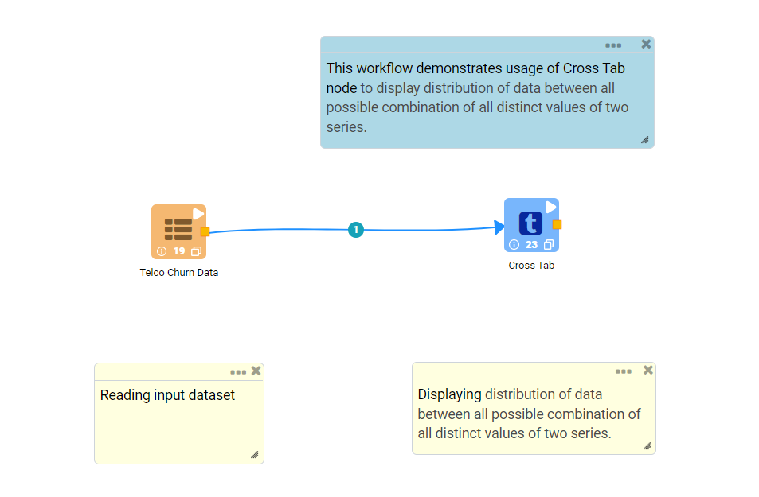
   
**Incoming Dataset**

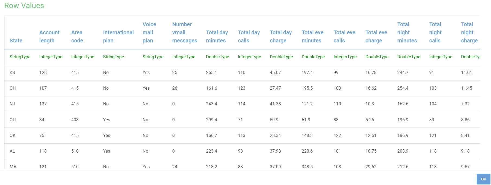

**Cross Tab Node Configuration**

Cross Tab node is configured as below.

*	Input of this node is the incoming dataset.
*	Any two categorical columns from incoming dataset can be selected as ``Firstcolumn`` and ``Secondcolumn``. All distinct values from ``Firstcolumn`` would be displayed as rows and all distinct values from ``Secondcolumn`` would be displayed as columns of the Table. Row count of Row and Column value combination would be displayed as distribution.
*	Output of this node would display table depicting distribution of data between the two series.

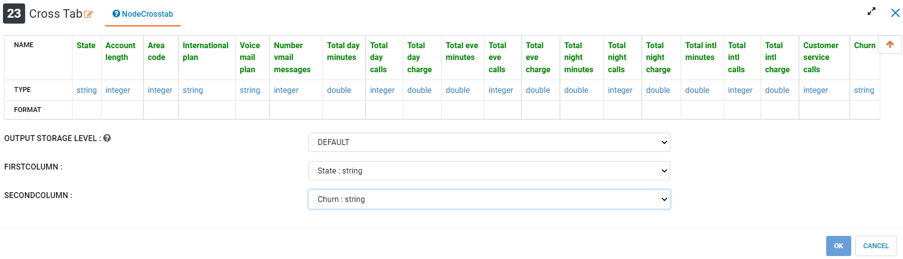
   
**Cross Tab Node Output**

Output of Cross Tab node displaying distribution between Firstcolumn and Secondcolumn in tabular format.

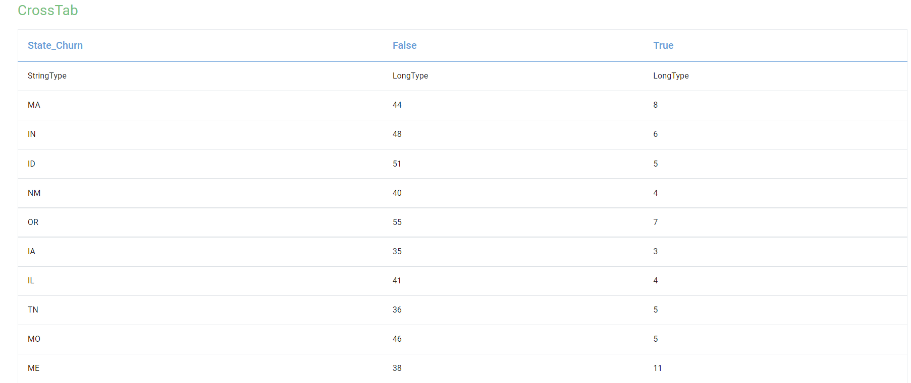
   

Distinct Values In Column
----------------------------------------

Below is a sample workflow that contains Distinct Values In Column processor in Fire Insights. It demonstrates the usage of Distinct Values In Column node to display distinct combinations of values in the selected columns.

It does the following processing of data:

*	Reads incoming dataset.
*	Displays distinct combinations of values in the selected columns using Distinct Values In Column node. If only one column is selected then it displays Distinct values present in that column. If more than one column is selected then it displays distinct combinations of values present in the selected columns.

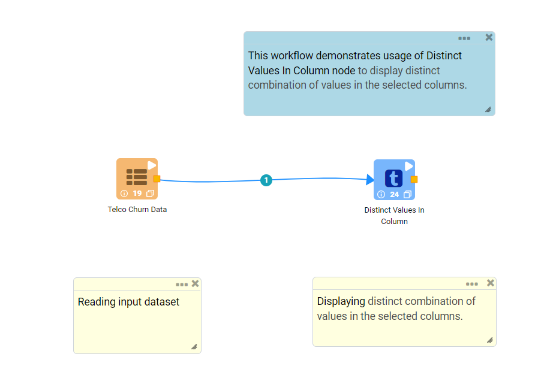
   
**Incoming Dataset**

.. figure:: ../../_assets/user-guide/data-exploration/data-exploration/distinctval-incoming-dataset.png
   :alt: dataexploration_userguide
   :width: 75%

**Distinct Values In Column Node Configuration**

Distinct Values In Column node is configured as below.

*	Input of this node is the incoming dataset.
*	Columns between which unique combination of data is to be identified are to be selected in ``Column Names`` list. One or more columns can be selected.
*	Output of this node would display distinct combinations of values in the selected columns.

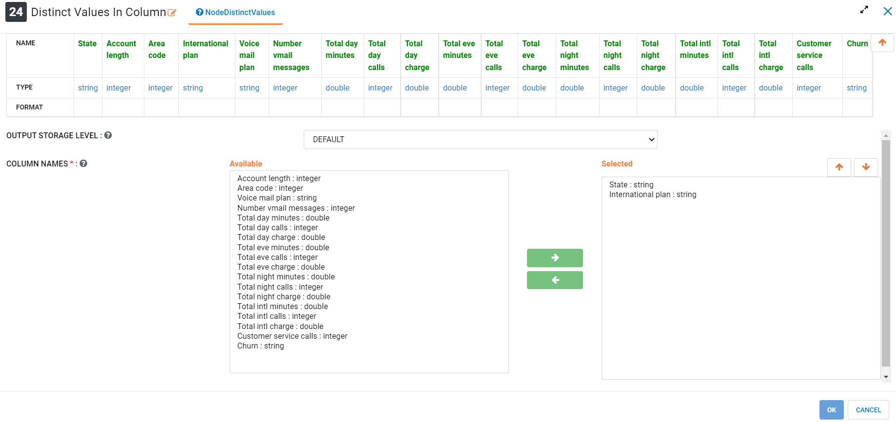
   
**Distinct Values In Column Node Output**

Output of Distinct Values In Column node displaying distinct combination of values in the selected columns.

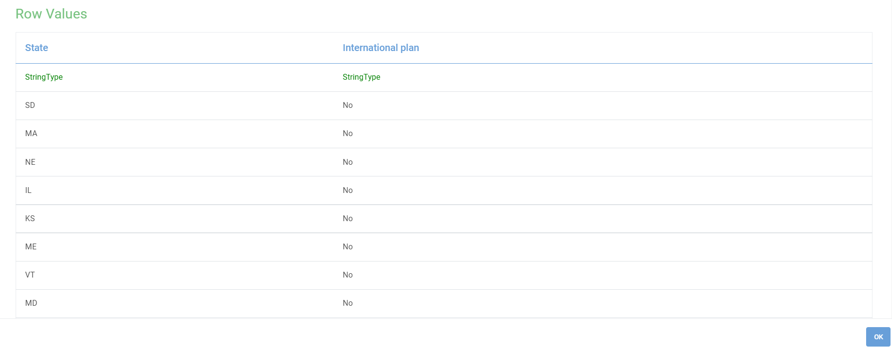
   

Flag Outlier
----------------------------------------

Below is a sample workflow that contains Flag Outlier processor in Fire Insights. It demonstrates the usage of Flag Outlier node to identify whether a data point is outlier in a series or not based on the lower and upper quantile set.

It does the following processing of data:

*	Reads incoming dataset.
*	Identifies whether a data point is outlier in a series or not based on the lower and upper quantile set using Flag Outlier node. It can be checked against numeric columns only.

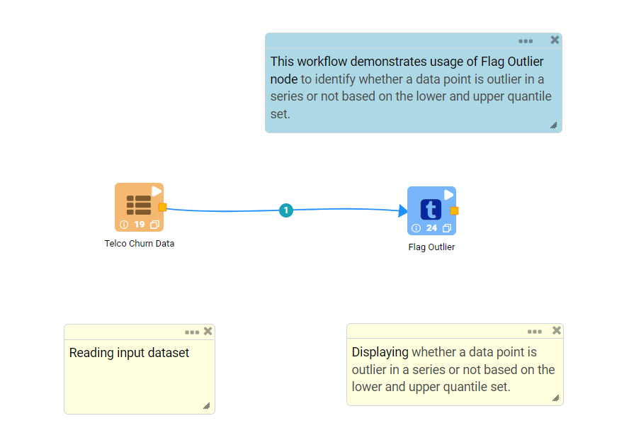
   
**Incoming Dataset**

.. figure:: ../../_assets/user-guide/data-exploration/data-exploration/flagoutlier-incoming-dataset.png
   :alt: dataexploration_userguide
   :width: 75%

**Flag Outlier Node Configuration**

Flag Outlier node is configured as below.

*	Input of this node is the incoming dataset.
*	Numeric Column in which datapoints are to be identified as outlier needs to be selected in ``Input Column To Flag The Outlier`` list.
*	``Lowerquantile`` and ``Upperquantile`` values need to be entered in the respective boxes. Datapoint would be checked against these values to flag it as outlier.
*	Output of this node would display Outlier flag for the datapoint in the selected column.

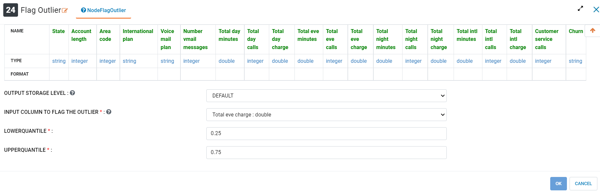
   
**Flag Outlier Node Output**

Output of Flag Outlier node displaying Outlier flag for datapoints in the selected column.

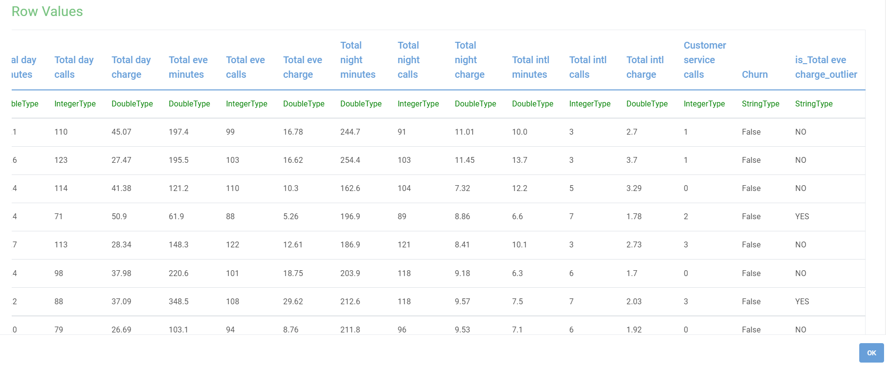
   

Graph Month Distribution
----------------------------------------

Below is a sample workflow that contains Graph Month Distribution processor in Fire Insights. It demonstrates the usage of Graph Month Distribution node to display monthly distribution of data.

It does the following processing of data:

*	Reads incoming dataset.
*	Displays monthly distribution of data using Graph Month Distribution node. In the workflow given below, the Graph Month Distribution node displays monthly distribution of count of trade executed.

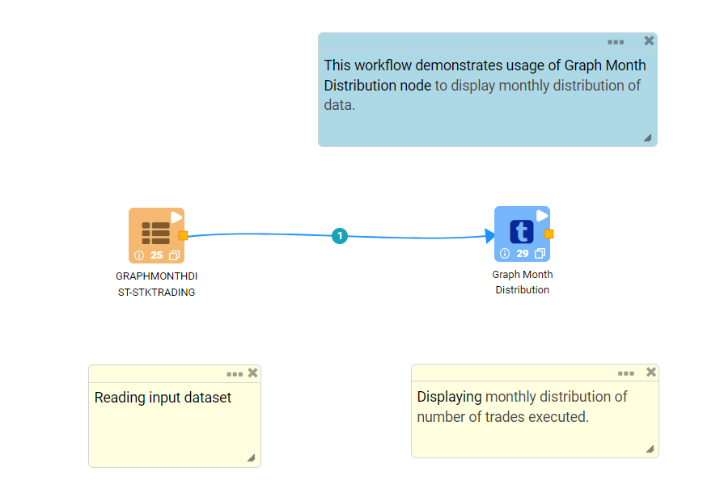
   
**Incoming Dataset**

**Graph Month Distribution Node Configuration**

Graph Month Distribution node is configured as below.

*	Input of this node is the incoming dataset.
*	``Chart Type`` can be selected from the list based on the representation needed.
*	String columns representing Date Values need to be selected in ``Y Columns`` list. More than one value can be selected.
*	Output of this node would display monthly distribution of data present in the selected columns.

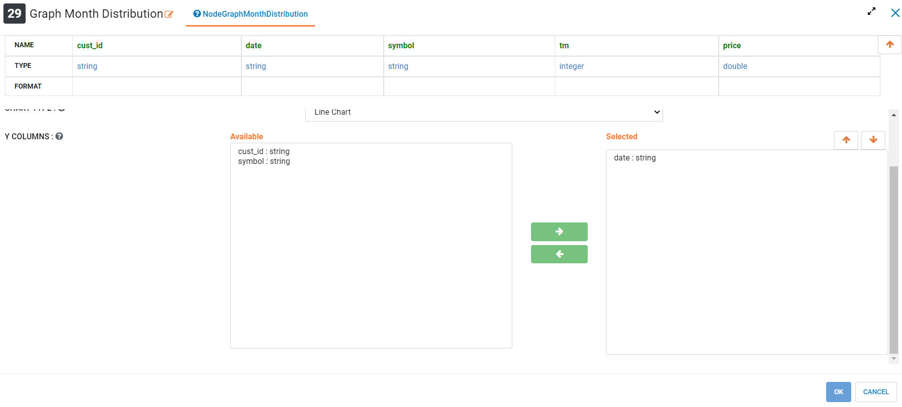
   
**Graph Month Distribution Node Output**

Output of Graph Month Distribution node displaying monthly distribution of selected columns i.e. number of trades executed.

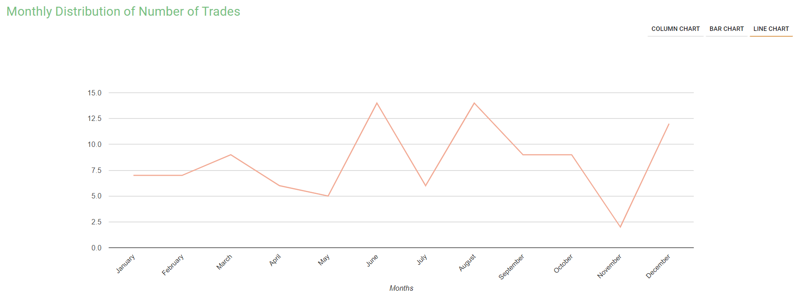
   
Graph Weekday Distribution
----------------------------------------

Below is a sample workflow that contains Graph Weekday Distribution processor in Fire Insights. It demonstrates the usage of Graph Weekday Distribution node to display weekday wise distribution of data.

It does the following processing of data:

*	Reads incoming dataset.
*	Displays weekday wise distribution of data using Graph Weekday Distribution node. In the workflow given below, the Graph Weekday Distribution node displays weekday wise distribution of count of trade executed.

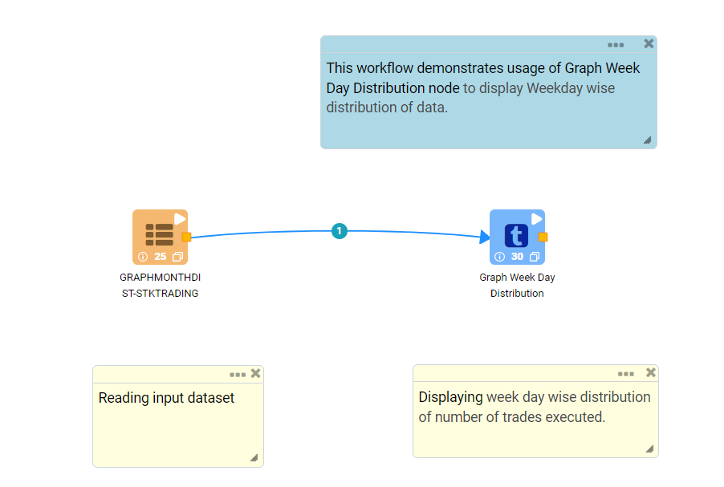
   
**Incoming Dataset**

**Graph Weekday Distribution Node Configuration**

Graph Weekday Distribution node is configured as below.

*	Input of this node is the incoming dataset.
*	Title of the output graph needs to be entered in the ``Title`` box.
*	``Chart Type`` can be selected from the list based on the representation needed.
*	String columns representing Date Values need to be selected in ``Y Columns`` list.
*	Output of this node would display weekday wise distribution of data present in the selected columns.

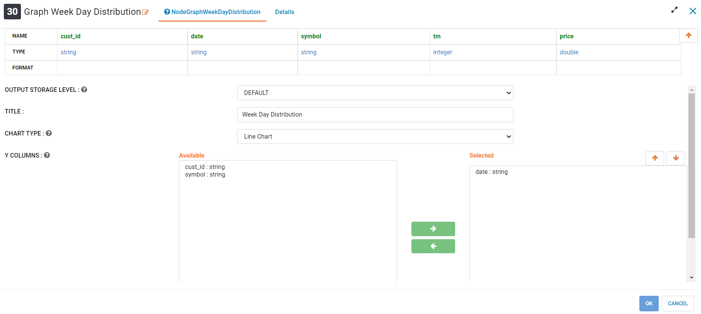
   
**Graph Weekday Distribution Node Output**

Output of Graph Weekday Distribution node displaying weekday wise distribution of selected columns i.e. number of trades executed.

.. figure:: ../../_assets/user-guide/data-exploration/data-exploration/graphwkdaydist-printnode-output.png
   :alt: dataexploration_userguide
   :width: 75%       	    
   

Graph Year Distribution
----------------------------------------

Below is a sample workflow that contains Graph Year Distribution processor in Fire Insights. It demonstrates the usage of Graph Year Distribution node to display yearly distribution of data.

It does the following processing of data:

*	Reads incoming dataset.
*	Displays yearly distribution of data using Graph Year Distribution node. In the workflow given below, the Graph Year Distribution displays yearly distribution of count of trade executed.

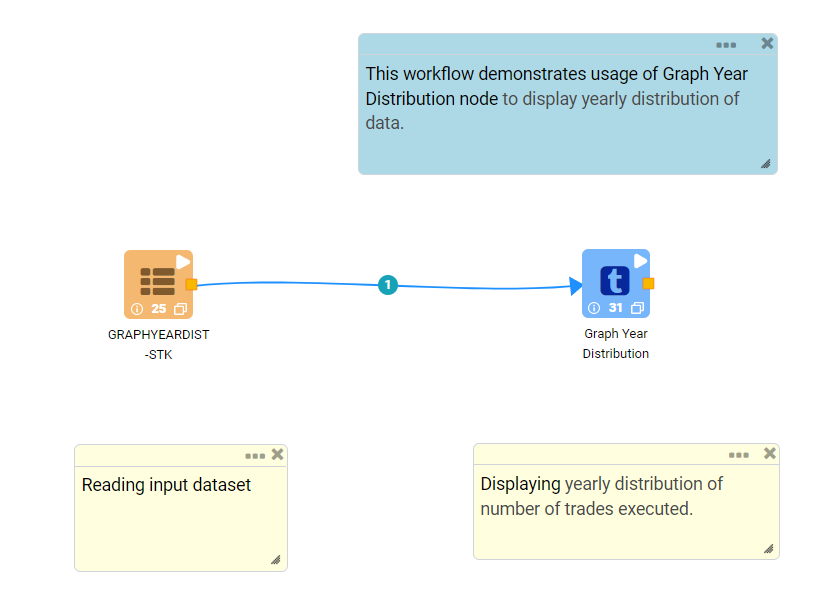
   
**Incoming Dataset**

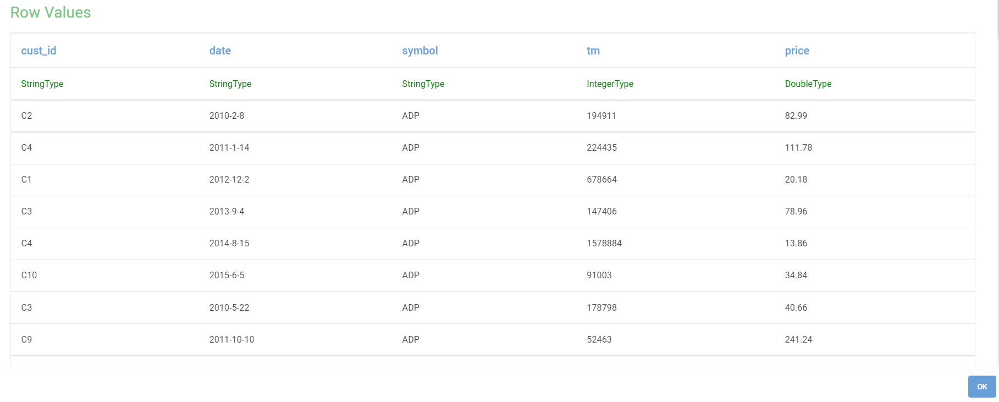

**Graph Year Distribution Node Configuration**

Graph Year Distribution node is configured as below.

*	Input of this node is the incoming dataset.
*	Title of the output graph needs to be entered in  the ``Title`` box.
*	``Chart Type`` can be selected from the list based on the representation needed.
*	String columns representing Date Values need to be selected in ``Y Columns`` list.
*	Output of this node would display yearly distribution of data present in the selected columns.

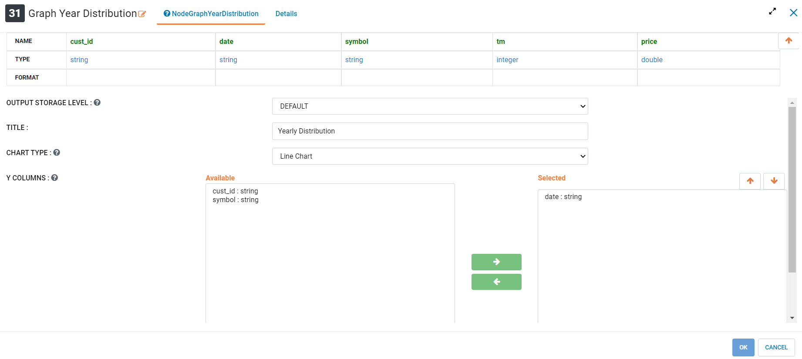
   
**Graph Year Distribution Node output**

Output of Graph Year Distribution node displaying yearly distribution of selected columns i.e. number of trades executed.

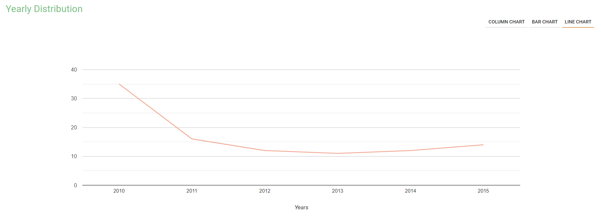
   
Histogram
----------------------------------------

Below is a sample workflow that contains Histogram processor in Fire Insights. It demonstrates the usage of Histogram node to display distribution of data spread across multiple bins.

It does the following processing of data:

*	Reads incoming dataset.
*	Displays distribution of data spread across multiple bins using Histogram node. In the workflow given below, the Histogram processor displays the distribution of traded volume spread across multiple bins.

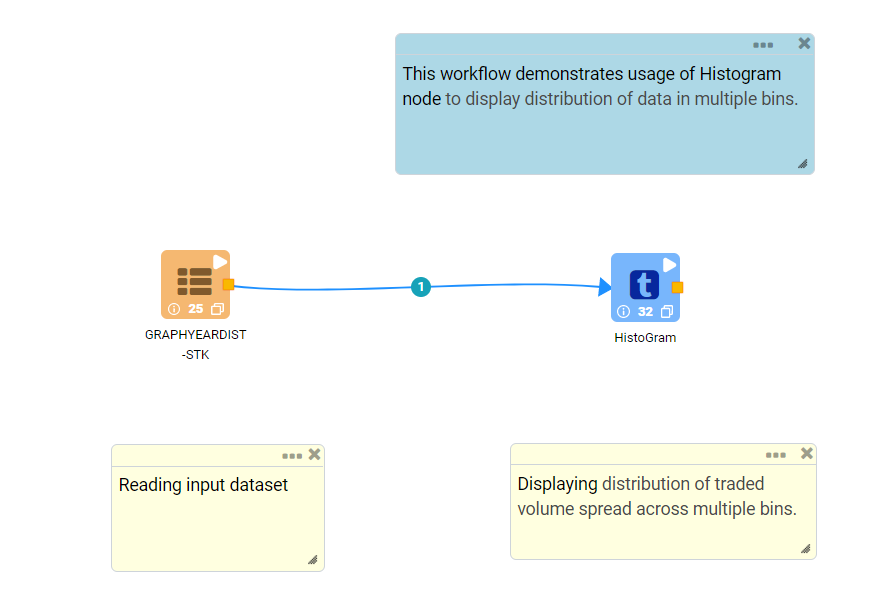
   
**Incoming Dataset**

**Histogram Node Configuration**

Histogram node is configured as below.

*	Input of this node is the incoming dataset.
*	Title of the output graph needs to be entered in the ``Title`` box.
*	Input Column of which distribution needs to be displayed is to be selected in ``Column Name`` list.
*	Number of equally spaced bins that needs to be created is to be entered in ``Number Of Bins`` box.
*	Output of this node would display distribution of data present in the selected column spread across multiple bins.

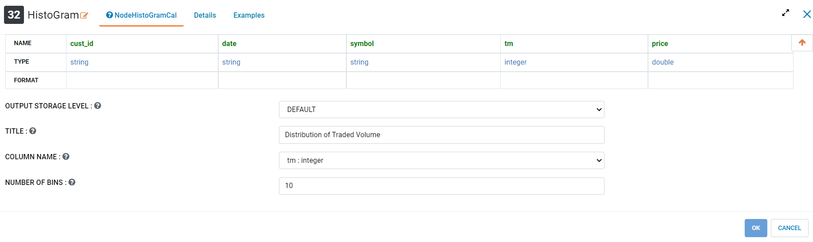
   
**Histogram Node Output**

Output of Histogram node displaying distribution of data present in the selected column spread across multiple bins.

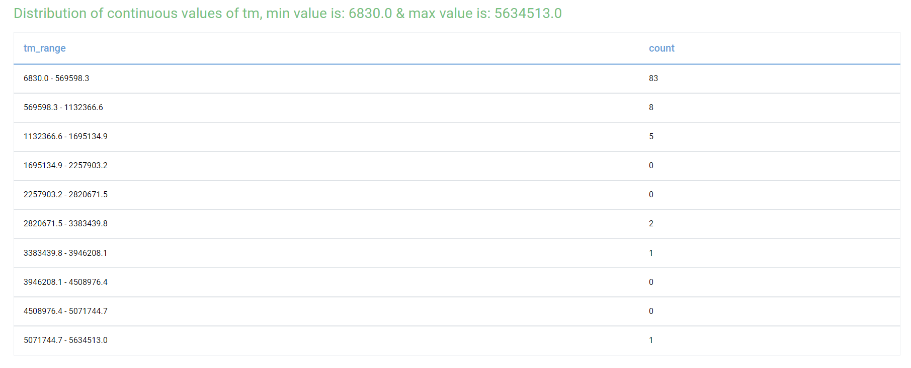
   
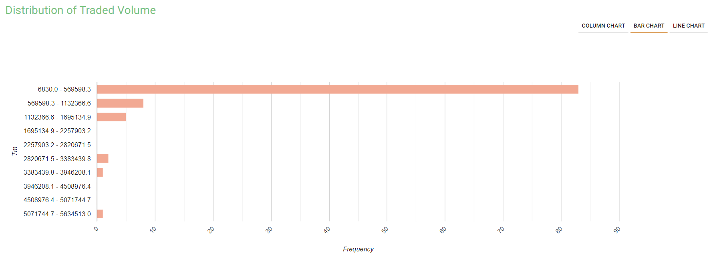

Null Values In Column
----------------------------------------

Below is a sample workflow that contains Null Values In Column processor in Fire Insights. It demonstrates the usage of Null Values In Column node identify number of Null values and its percentage against the total data length in the selected columns.

It does the following processing of data:

*	Reads incoming dataset.
*	Identifies number of Null values and its percentage against the total data length in the selected columns using Null Values In Column node. 

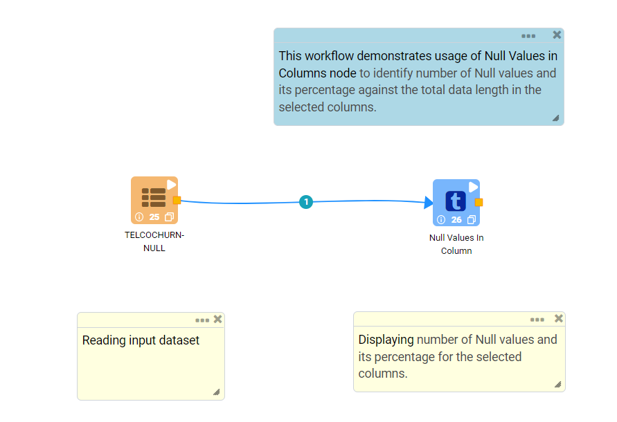
   
**Incoming Dataset**

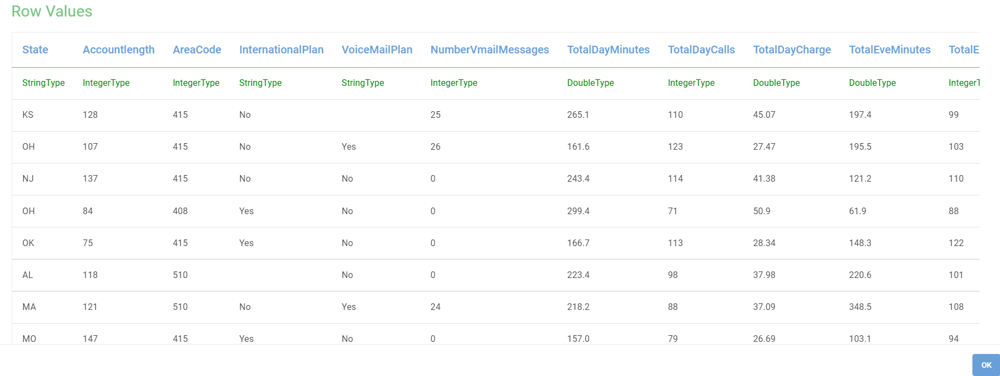

**Null Values In Column Node configuration**

Null Values In Column node is configured as below.

*	Input of this node is the incoming dataset.
*	Columns in which the null values need to be identified are to be selected in ``Column Names`` list. Multiple columns can be selected.
*	Output of this node would display number of Null values and its percentage for the selected columns.

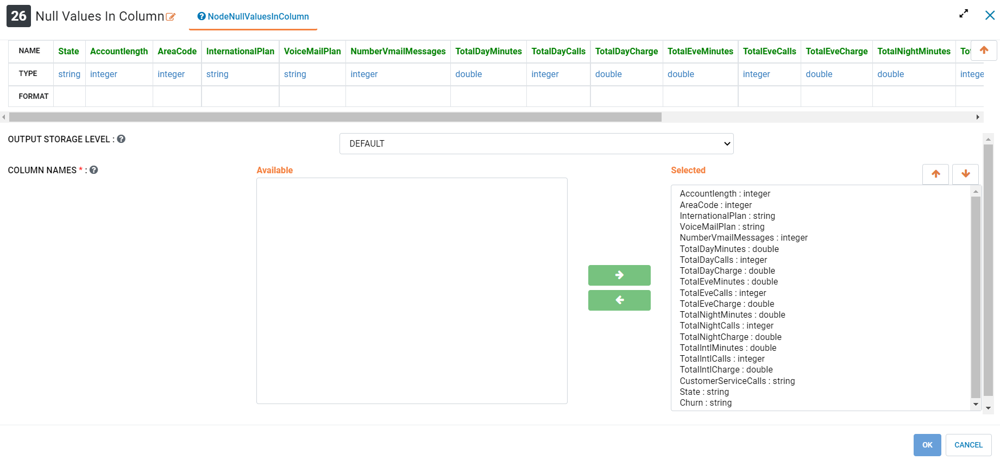
   
**Null Values In Column Node Output**

Output of Null Values In Column node displaying number of Null values and its percentage for the selected columns.

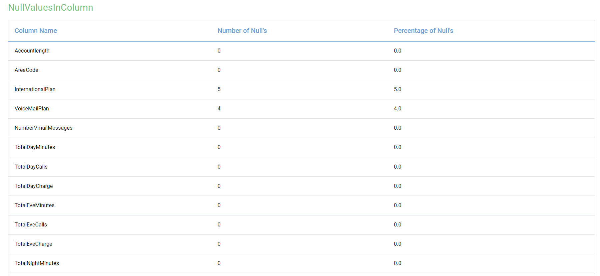
   

Skewness And Kurtosis
----------------------------------------

Below is a sample workflow that contains Skewness And Kurtosis processor in Fire Insights. It demonstrates the usage of Skewness And Kurtosis node to identify Skewness (measure of symmetry) and Kurtosis (measure of whether the data are heavy-tailed or light-tailed relative to a normal distribution) in the selected columns.

It does the following processing of data:

*	Reads incoming dataset.
*	Identifies Skewness and Kurtosis in the selected columns using Skewness And Kurtosis node. 

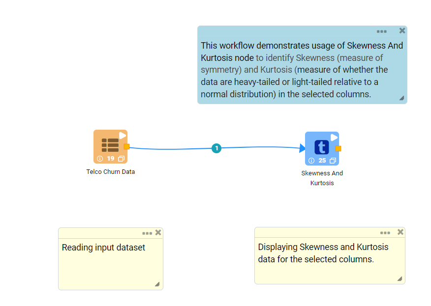
   
**Incoming Dataset**

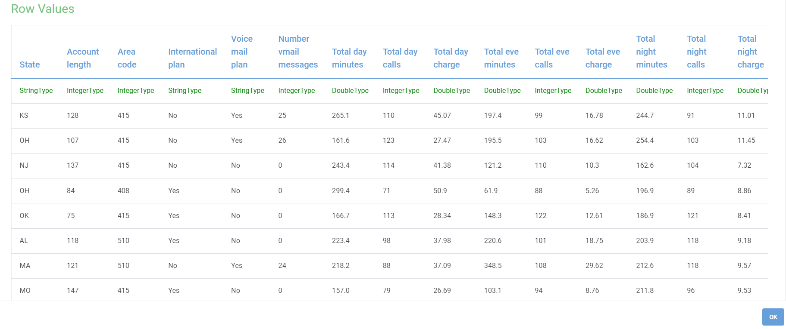

**Skewness And Kurtosis Node Configuration**

Skewness And Kurtosis node is configured as below.

*	Input of this node is the incoming dataset.
*	Columns for which Skewness And Kurtosis need to be computed are to be selected in ``Column Names`` list. Multiple columns can be selected.
*	Output of this node would display Skewness And Kurtosis values for the selected columns.

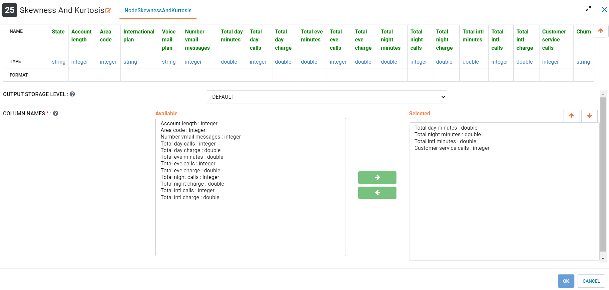
   
**Skewness And Kurtosis Node output**

Output of Skewness And Kurtosis node displaying Skewness And Kurtosis values for the selected columns.

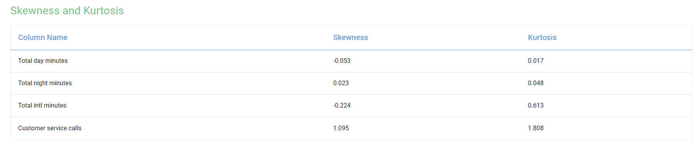
   

Summary Statistics
----------------------------------------

Below is a sample workflow that contains Summary Statistics processor in Fire Insights. It demonstrates the usage of Summary Statistics node to compute Statistical Summary such as count, mean, min, max, etc. for the selected columns.

It does the following processing of data:

*	Reads incoming dataset.
*	Computes Statistical Summary such as count, mean, min, max, etc. for the selected columns using Summary Statistics node. 

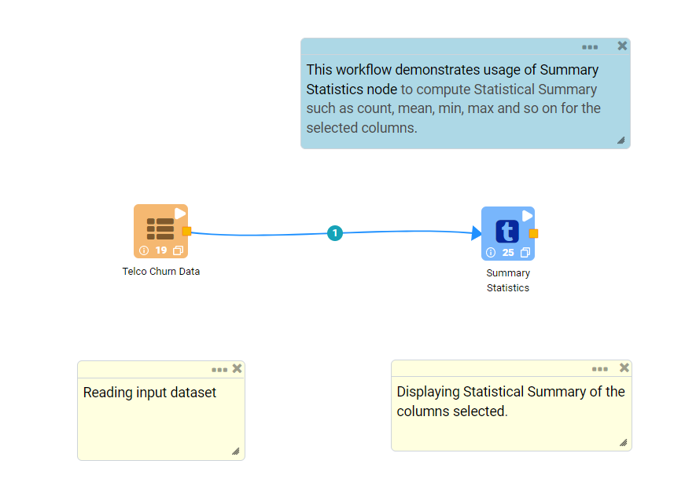
   
**Incoming Dataset**

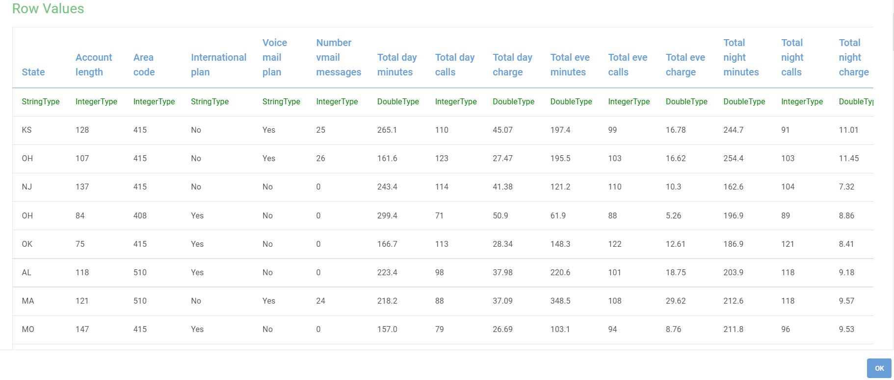

**Summary Statistics Node Configuration**

Summary Statistics node is configured as below.

*	Input of this node is the incoming dataset.
*	Title of the output needs to be entered in the ``Title`` box.
*	Columns for which summary need to be computed are to be selected in ``Column Names`` list. Multiple columns can be selected.
*	Output of this node would display Statistical Summary of the columns selected.

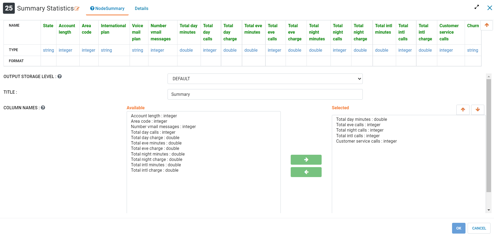
   
**Summary Statistics Node Output**

Output of Summary Statistics node displaying Statistical Summary of the columns selected.

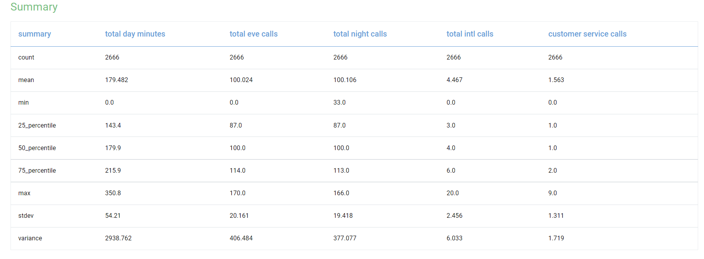
   
