Data Visualization
==========

Fire Insights provides a number of features for visualization of data.

Data Visualization Processors in Fire Insights
----------------------------------------

.. list-table:: 
   :widths: 30 70
   :header-rows: 1

   * - Title
     - Description
   * - BoxPlot
     - Represents variation between two series of data in Box Plot format.
   * - Bubble Chart
     - Represents variation of data between series in Bubble Chart format.
   * - Gauge
     - Represents data for different categories in Gauge format.
   * - Graph Group By Column   
     - Represents count of different groups of data in Graphical format.
   * - Graph SubPlots
     - Represents variation between multiple pair of data series in one go in Graphical format.
   * - Graph Values  
     - Represents variation between a pair of data series in Graphical format.
   * - Print N Rows  
     - Prints rows from incoming dataset.
   * - Print Rich Text
     - Prints output in Rich Format Text.
     
Box Plot
----------------------------------------

Below is a sample workflow that contains ``Box Plot`` processor in Fire Insights. It demonstrates the usage of ``Box Plot`` node to represent variation between two series of data in Box Plot format.

It does the following processing of data:

*	Reads incoming dataset.
*	Represents variation between two series of data in Box Plot format using ``Box Plot`` node.

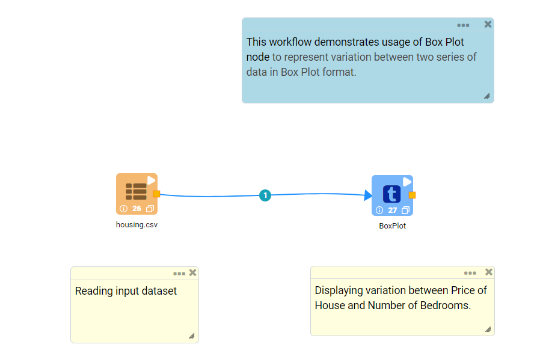
   
**Incoming Dataset**

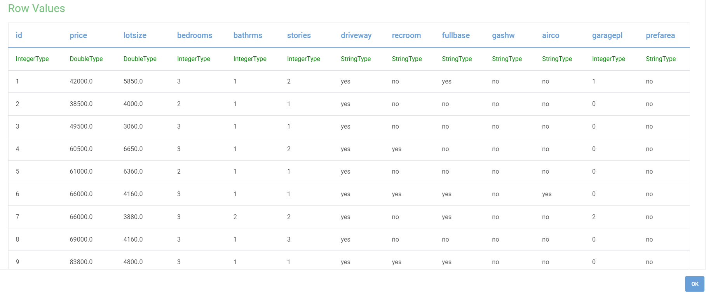

**Box Plot Node Configuration**

*	``Box Plot`` node is configured as below.
*	Input of this node is the incoming dataset.
*	Title of the output needs to be entered in the ``Title`` box.
*	X and Y Labels of the graph needs to be entered in the ``X Label`` and ``Y Label`` boxes.
*	``Max Values To Display`` specifies the maximum data values to be displayed.
*	Column to be used to aggregate data is to be selected in ``Group By Column`` list.
*	Aggregated data that needs to be plotted in the graph is to be selected in ``Value Column`` list.
*	Output of this node would display variation of one data with the other.

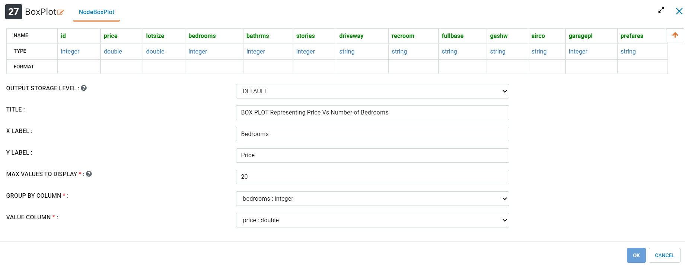
   
**Box Plot Node Output**

Output of ``Box Plot`` node displaying variation of one data with the other.

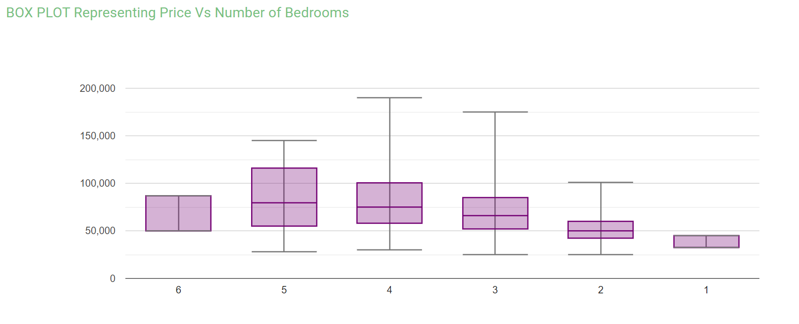
   
Bubble Chart
----------------------------------------

Below is a sample workflow that contains ``Bubble Chart`` processor in Fire Insights. It demonstrates the usage of ``Bubble Chart`` node to represent variation of data between series in Bubble Chart format.

It does the following processing of data:

*	Reads incoming dataset.
*	Represents variation between two series of data in Bubble Chart format using ``Bubble Chart`` node.

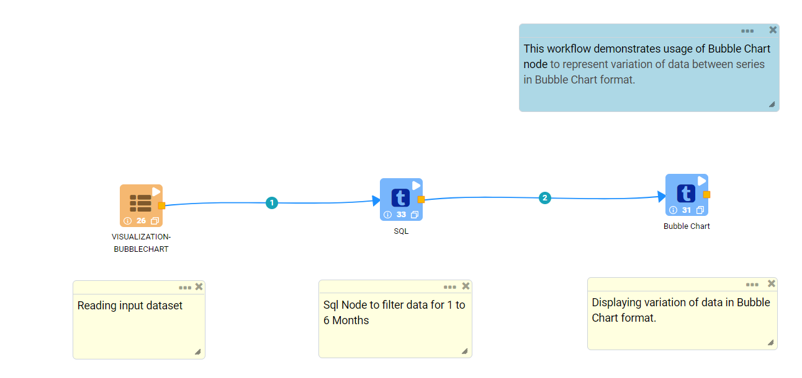
   
**Incoming Dataset**

**Bubble Chart Node Configuration**

*	``Bubble Chart`` node is configured as below.
*	Input of this node is the incoming dataset.
*	Title of the output needs to be entered in the ``Title`` box.
*	``Max Values To Display`` specifies the maximum data values to be displayed.
*	``Is Streaming`` needs to be selected as True if input is a Streaming data (Continuously generated data).
*	X and Y Labels of the graph needs to be entered in the ``X Label`` and the ``Y Label`` boxes.
*	Color Code needs to be selected in ``Chart Colors`` list to display data of different series in different colors.
*	Data Series that defines Bubble Label needs to be selected in the ``Bubbles Label`` list.
*	Data Series that defines points of X-Coordinate needs to be entered in the ``X Coordinate`` list.
*	Data Series that defines points of Y-Coordinate needs to be entered in the ``Y Coordinate`` list.
*	Data Series that defines Bubble Color for each data series needs to be selected in the ``Bubbles Color`` list.
*	Data Series that defines Bubble Size needs to be selected in the ``Bubbles Size`` list.
*	Output of this node would display variation between data series represented in Bubble Chart format.

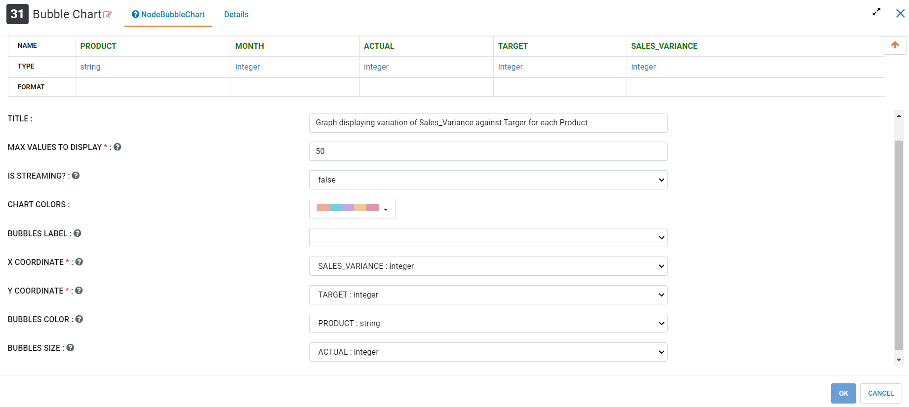
   
**Bubble Chart Node Output**

Output of ``Bubble Chart`` node displaying variation between data series represented in Bubble Chart format.

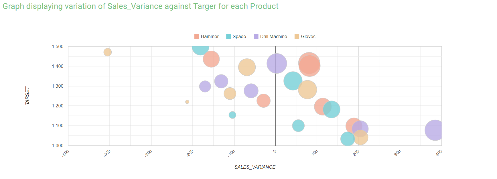
   

Gauge
----------------------------------------

Below is a sample workflow that contains ``Gauge`` processor in Fire Insights. It demonstrates the usage of ``Gauge`` node to represent data for different categories in Gauge format.

It does the following processing of data:

*	Reads incoming dataset.
*	Represents data for different categories in Gauge format using the ``Gauge`` node.

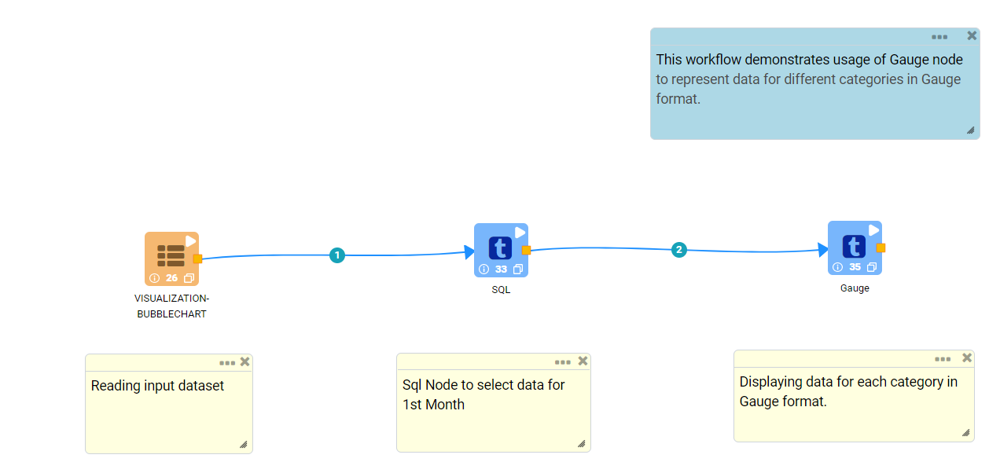
   
**Incoming Dataset**

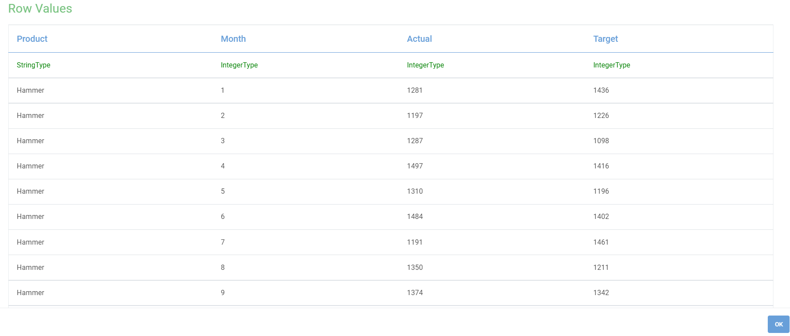

**Gauge Node Configuration**

*	``Gauge`` node is configured as below.
*	Input of this node is the incoming dataset.
*	Title of the output needs to be entered in the ``Title`` box.
*	Column defining categorical data for which separate Gauge is to be displayed needs to be selected in the ``Key Column`` list.
*	Column defining value in Gauge needs to be selected in the ``Value Column`` list.
*	``RedFrom``, ``RedTo``, ``YellowFrom`` and ``YellowTo`` needs to be entered in the respective boxes defining Red and Yellow zone in the Gauge.
*	``MinorTicks`` defining Minor Ticks in the Gauge needs to be entered in the box.
*	Output of this node would display data for different categories in Gauge format.

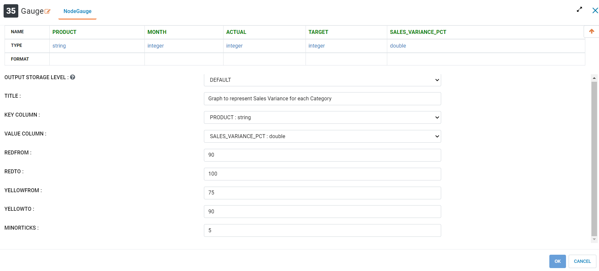
   
**Gauge Node Output**

Output of ``Gauge`` node displaying data for different categories in Gauge format.

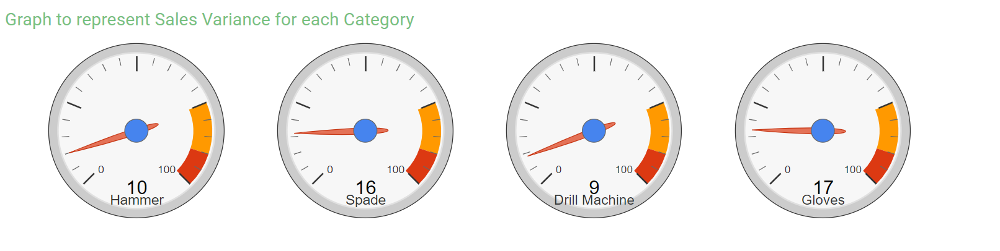
   
Graph Group By Column
----------------------------------------

Below is a sample workflow that contains ``Graph Group By Column`` processor in Fire Insights. It demonstrates the usage of ``Graph Group By Column`` node to represent count of different group of data in Graphical format.

It does the following processing of data:

*	Reads incoming dataset.
*	Represents count of different groups of data in Graphical format using  the ``Graph Group By Column`` node.

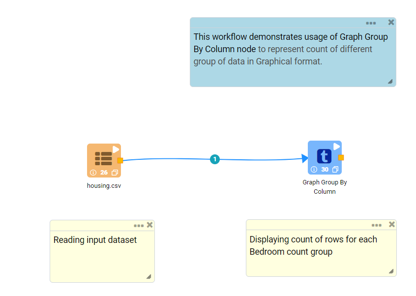
   
**Incoming Dataset**

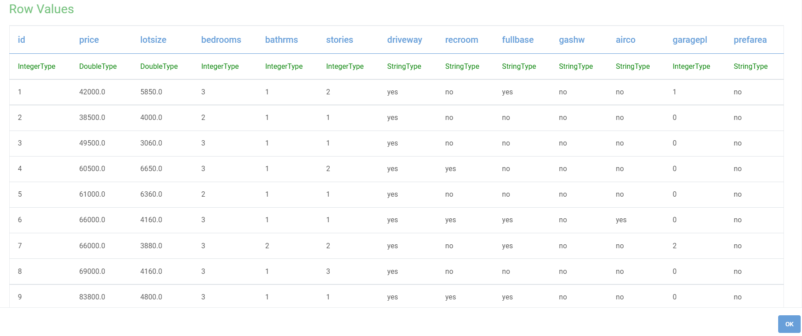

**Graph Group By Column Node configuration**

*	``Graph Group By Column`` node is configured as below.
*	Input of this node is the incoming dataset.
*	Title of the output needs to be entered in the ``Title`` box.
*	``X Label`` and ``Y Label`` needs to be entered with values that need to be displayed in respective coordinates.
*	Number of Maximum data values to be displayed in the graph is to be entered in the ``Max Values to Display`` box. 
*	Color Series to be used for Columns/Bars in the graph is to be selected in the ``Chart Colors`` list.
*	Column that needs to be used to aggregate data is to be selected in the ``Group By Column`` list.
*	Chart type to represent data in the output is to be selected in the ``Chart Type`` list.
*	Output of this node would display count of different groups of data in Graphical format.

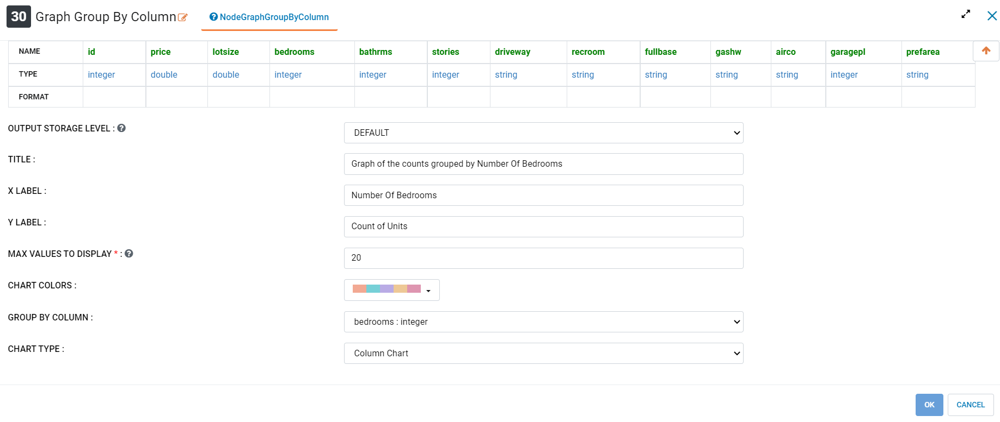
   
**Graph Group By Column Node Output**

Output of ``Graph Group By Column`` node displaying count of different groups of data in Graphical format.

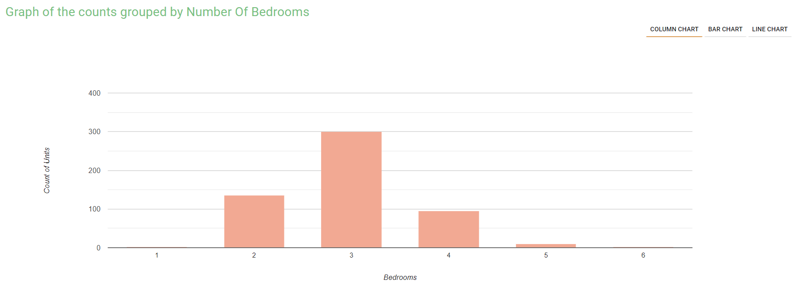
   

Graph SubPlots
----------------------------------------

Below is a sample workflow that contains ``Graph SubPlots`` processor in Fire Insights. It demonstrates the usage of ``Graph SubPlots`` node to represent variation between multiple pairs of data series in one go in Graphical format.

It does the following processing of data:

*	Reads incoming dataset.
*	Represents variation between multiple pairs of data series in one go in Graphical format using ``Graph SubPlots`` node.

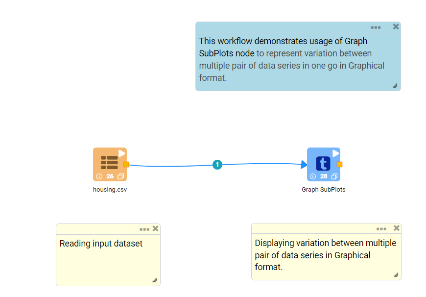
   
**Incoming Dataset**

**Graph SubPlots Node configuration**

*	``Graph SubPlots`` node is configured as below.
*	Input of this node is the incoming dataset.
*	Title of the output needs to be entered in the ``Title`` box.
*	Number of Maximum data values to be displayed in the graph is to be entered in the ``Max Values to Display`` box. 
*	Color Series to be used in the chart is to be selected in the ``Chart Colors`` list.
*	Details of the graph that needs to be plotted is to be entered in the ``Variables List``. A separate row needs to be added to each additional graph.
*	``X-Columns``, ``Y-Columns``, ``GraphTypes``, ``X Labels`` and ``Y Labels`` needs to be entered for each graph.
*	Output of this node would display variation between multiple pairs of data series in one go in Graphical format.

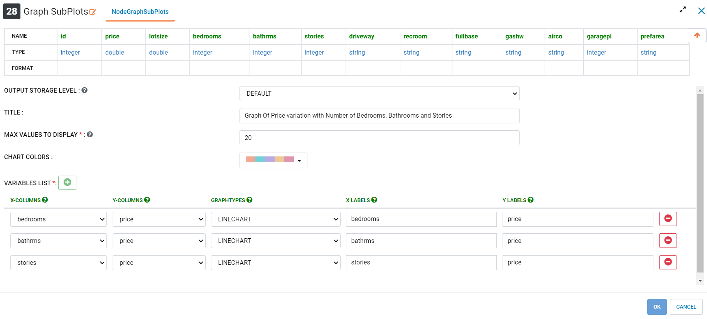
   
**Graph SubPlots Node output**

Output of ``Graph SubPlots`` node displaying variation between multiple pairs of data series in one go in Graphical format.

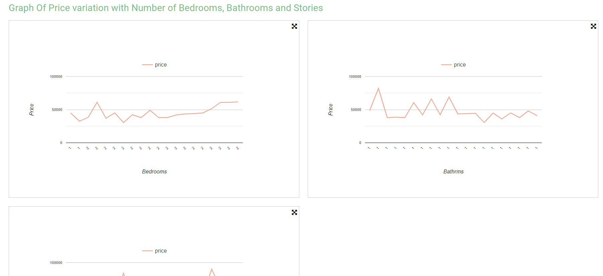
   

Graph Values
----------------------------------------

Below is a sample workflow that contains ``Graph Values`` processor in Fire Insights. It demonstrates the usage of ``Graph Values`` node to represent variation between a pairs of data series in Graphical format.

It does the following processing of data:

*	Reads incoming dataset.
*	Represents variation between a pair of data series in Graphical format using ``Graph Values`` node.

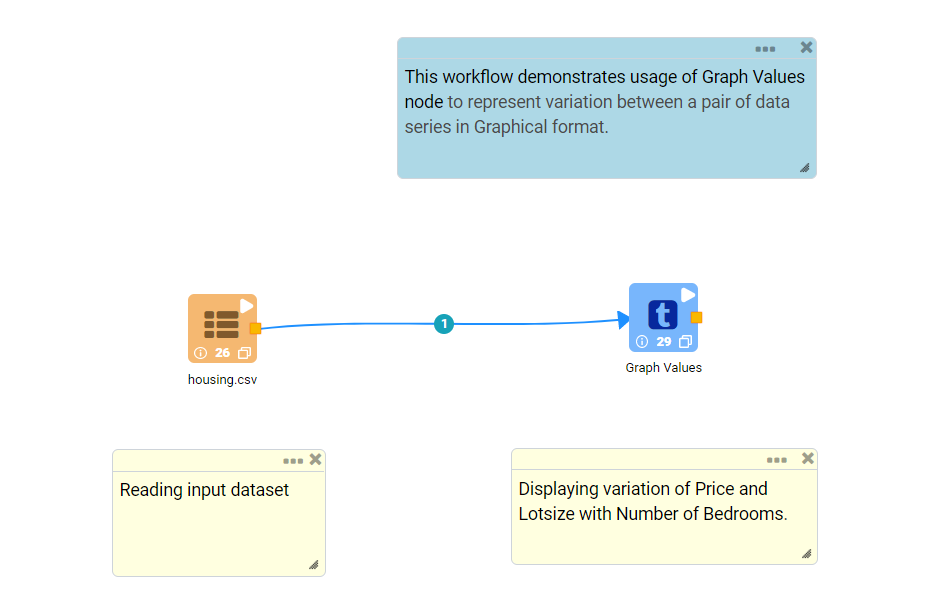
   
**Incoming Dataset**

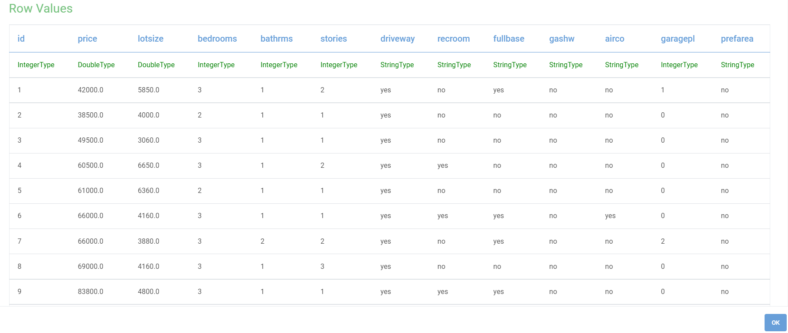

**Graph Values Node configuration**

*	``Graph Values`` node is configured as below.
*	Input of this node is the incoming dataset.
*	Title of the output needs to be entered in the ``Title`` box.
*	Text that needs to be displayed along the coordinates are to be entered in the ``X Label`` and the ``Y Label``
*	Number of Maximum data values to be displayed in the graph is to be entered in the ``Max Values to Display`` box. 
*	Format of the output needs to be selected in the ``Chart Type`` list.
*	Color Series to be used in the chart is to be selected in the ``Chart Colors`` list.
*	``Is Streaming`` needs to be selected based on whether data is a continuous feed one.
*	Data Series to be displayed along X-Coordinate is to be selected in the ``X Column`` list.
*	Data Series to be plotted along Y-Coordinate is to be selected in the ``Y Columns`` list. Multiple data series can be selected.
*	Output of this node would display variation between a pair of data series in Graphical format.

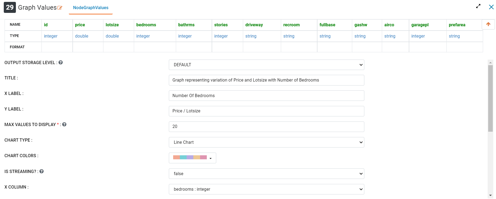
   
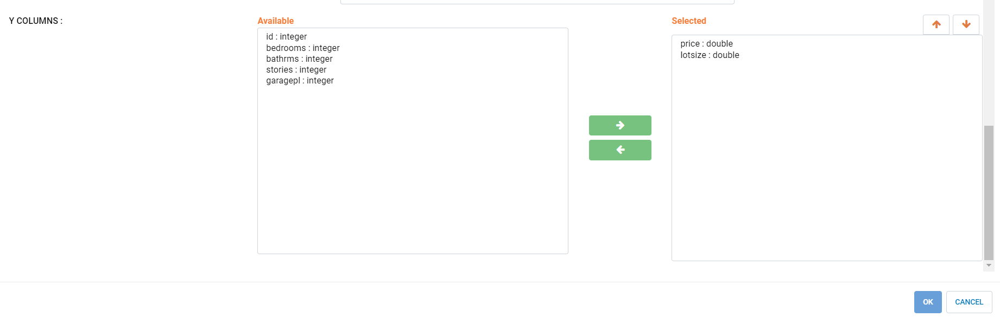
   
**Graph Values Node Output**

Output of ``Graph Values`` node displaying variation between a pair of data series in Graphical format.

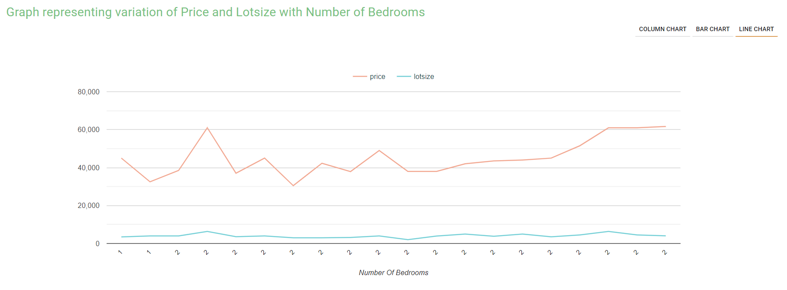
   

Print N Rows
----------------------------------------

Below is a sample workflow that contains ``Print N Rows`` processor in Fire Insights. It demonstrates the usage of ``Print N Rows`` node to print incoming data.

It does the following processing of data:

*	Reads incoming dataset.
*	Prints incoming data using ``Print N Rows`` node.

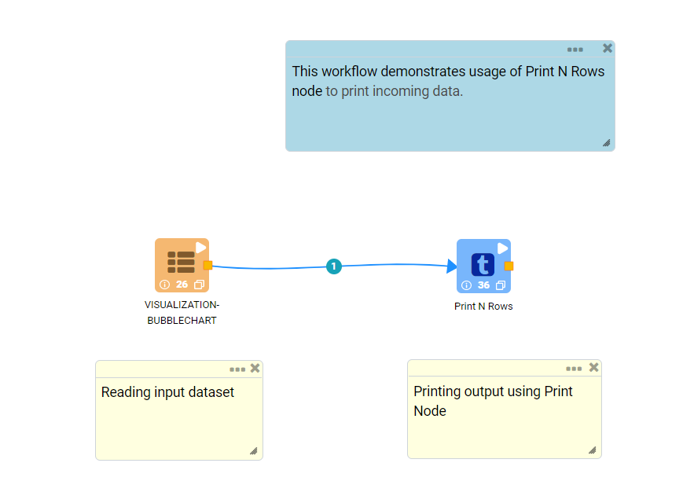
   
**Incoming Dataset**

.. figure:: ../../_assets/user-guide/data-exploration/data-visualization/printnrows-incoming-dataset.png
   :alt: datavisualization_userguide
   :width: 75%

**Print N Rows Node Configuration**

*	``Print N Rows`` node is configured as below.
*	Input of this node is the incoming dataset.
*	Title of the output needs to be entered in the ``Title`` box.
*	Number of Rows to Print is to be entered in the ``Num Rows To Print`` box. 
*	``Display Data Type`` needs to be set based on the need to display datatype of columns in the output.
*	Output of this node would display incoming data.

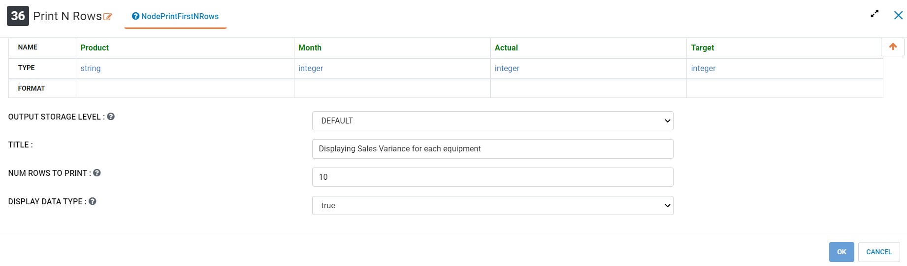
   
**Print N Rows Node Output**

Output of ``Print N Rows`` node displaying incoming data.

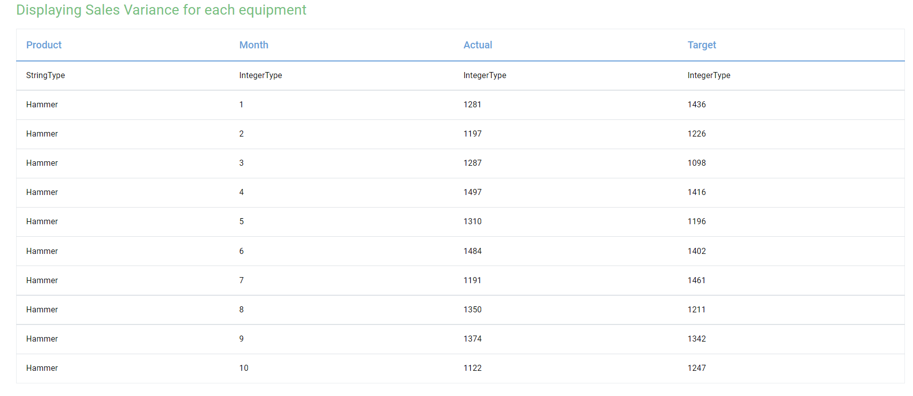
   

Print Rich Text
----------------------------------------

Below is a sample workflow that contains ``Print Rich Text`` processor in Fire Insights. It demonstrates the usage of ``Print Rich Text`` node to print data in Rich Text format.

It does the following processing of data:

*	Reads incoming dataset.
*	Print data in Rich Text format using the ``Print Rich Text`` node.

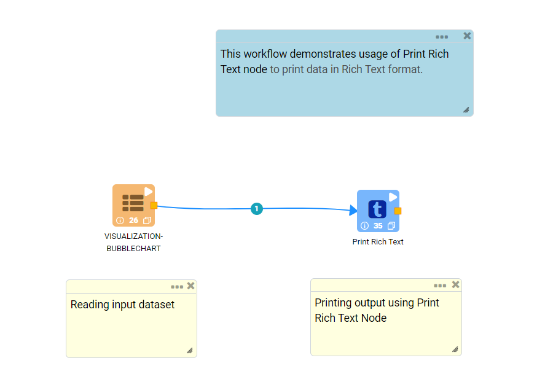
   
**Incoming Dataset**

**Print Rich Text Node Configuration**

*	``Print Rich Text`` node is configured as below.
*	Input of this node is the incoming dataset.
*	Text Data to be printed in the output is to be entered in the ``Text`` box.
*	Format of the text needs to be set using the tool bar of the Text Box.
*	Output of this node would display incoming data in Rich Text format.

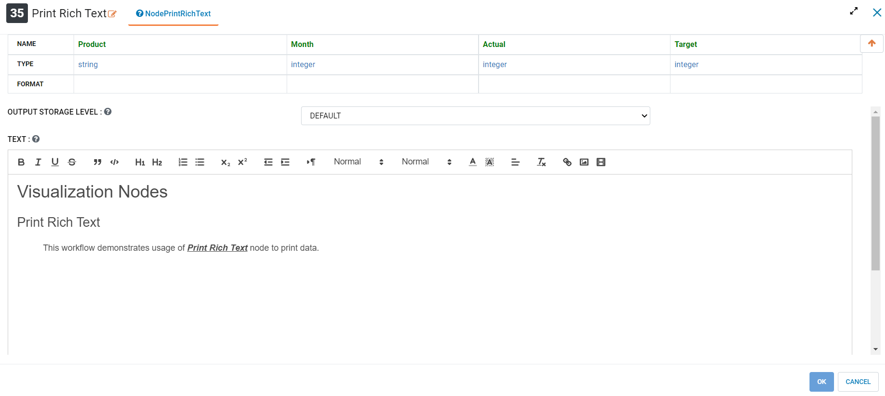
   
**Print Rich Text Node Output**

Output of ``Print Rich Text`` node displaying  the incoming data in Rich Text format.

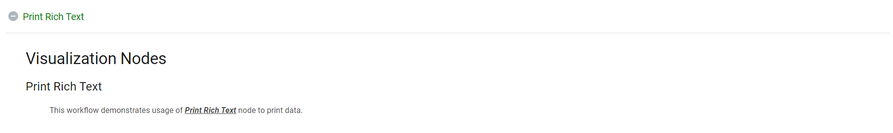
   
