Add Columns
==========

Fire Insights provide processors to cast data type from one type to another.

Add Columns Processors in Fire Insights
----------------------------------------

.. list-table:: 
   :widths: 30 70
   :header-rows: 1

   * - Title
     - Description
   * - Add Columns
     - It adds new columns to the dataset with Current Date, Current Time, String Constant and Integer Column values.
   * - Case When
     - It evaluates expressions and derive column values based on condition met.
   * - Concat Columns
     - It joins values of multiple columns into one column
   * - Expressions
     - It computes new column values based on expression evaluation.
   * - Generate UID
     - It computes UID (Unique Index) value for each row
   * - Generate UUID
     - It computes UUID (Universally Unique ID) value for each row
   * - Hash
     - It compute Hash value for each row by application of selected algorithm on columns selected
   * - Zip With Index
     - It compute Unique Index or value for each row
 
 
Add Columns
----------------------------------------

Below is a sample workflow which contains Add Columns processor in Fire Insights. It demonstrates usage of Add Columns node to add new columns with Current Date, Current Time, String Constant and Integer Column values.

It does following processing of data:

*	Reads incoming Dataset.
*	Adds new columns with Current Date, Current Time, String Constant and Integer Column values using Add Columns node.
*	Prints output dataset with new columns added to the incoming dataset using Print node.

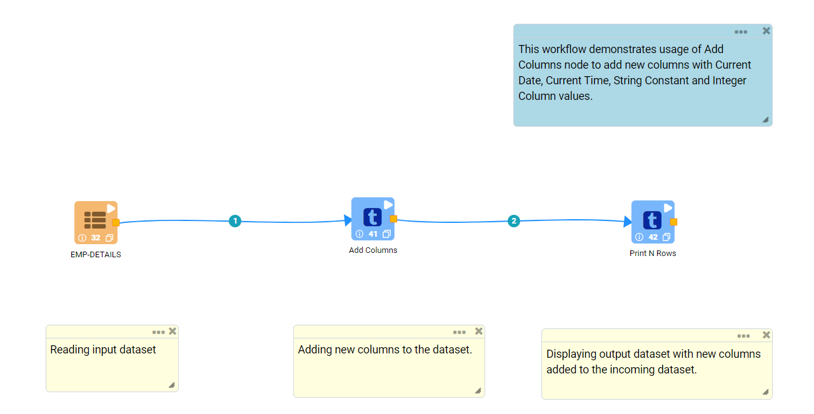
   
**Incoming dataset**

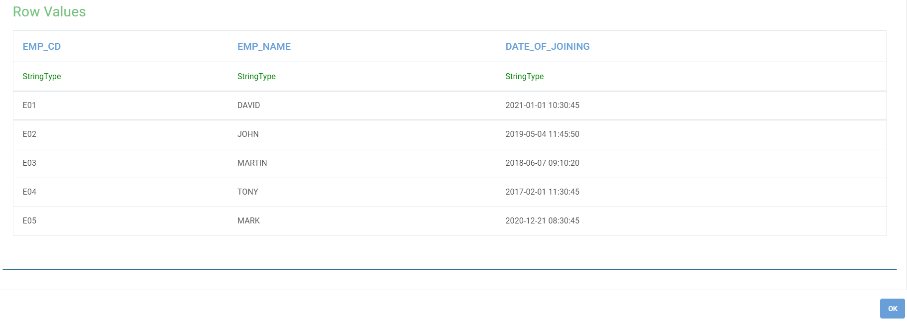
   
**Add Columns Node configuration**

Add Columns node is configured as below.

*	Input of this node are the incoming dataset.
*	**Add Current Date Column** needs to be selected as **True** if Current Date value is to be added to the output.
*	Column name to list Current Date in the output needs to be entered in **Current Date Column Name** box.
*	Above steps need to be repeated for **Current Time**, **String Constant** and **Integer Constant**.
*	Output of this node would display dataset with new columns added to the incoming dataset.

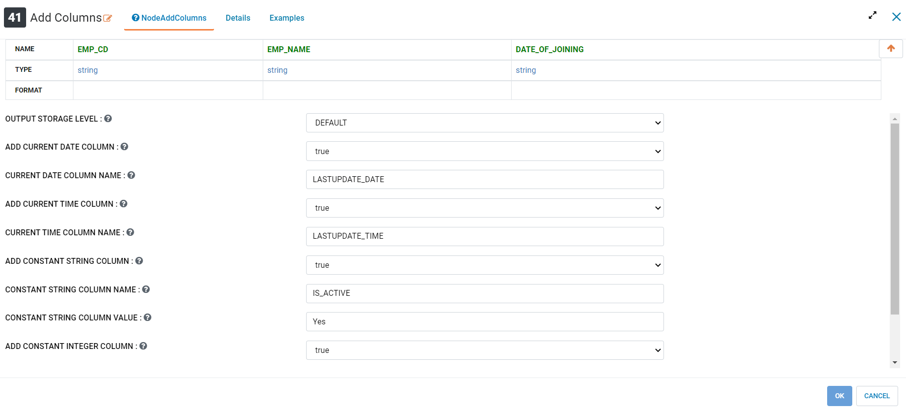
   
**Add Columns Node output**

Output of Add Columns node displaying dataset with new columns added to the incoming dataset.

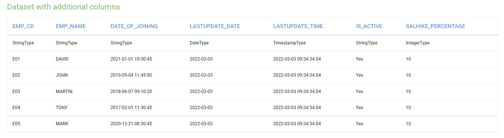
   

Case When
----------------------------------------

Below is a sample workflow which contains Case When processor in Fire Insights. It demonstrates usage of Case When node to evaluate expressions and derive column values based on condition met.

It does following processing of data:

*	Reads incoming Dataset.
*	Evaluates expressions and derive column values based on condition met using Case When node.
*	Prints output dataset with values computed based on Case When conditions using Print node.

.. figure:: ../../_assets/user-guide/data-preparation/addcolumn/casewhen-workflow.png
   :alt: addcolumns_userguide
   :width: 90%
   
**Incoming dataset**

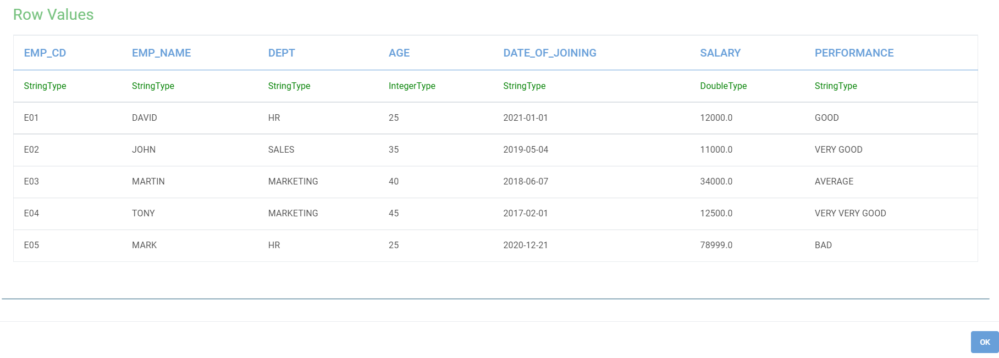
   
**Case When Node configuration**

Case When node is configured as below.

*	Input of this node are the incoming dataset.
*	Column name to list computed value in the output needs to be entered in **Output Column Name** box.
*	Conditional Expression needs to be entered in **When Condition** box. 
*	Value that needs to be assigned to column is to be entered in **Value** box.
*	A new **Key Value Array** row needs to be added for each condition.
*	Conditions should be defined in such a manner that only one of them should be evaluated to true.
*	If all defined conditions don't meet then the value that needs to be assigned is to be entered in **Else** box.
*	Output of this node would display dataset with new computed column added to the incoming dataset.

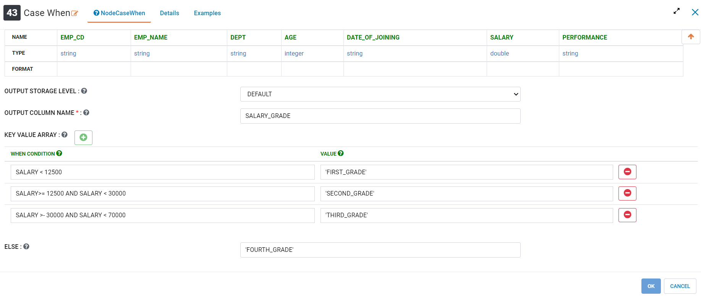
   
**Case When Node output**

Output of Case When node displaying dataset with new computed column added to the incoming dataset.

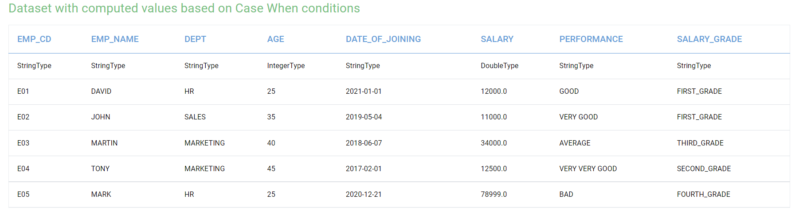
   

Concat Columns
----------------------------------------

Below is a sample workflow which contains Concat Columns processor in Fire Insights. It demonstrates usage of Concat Columns node to join values of multiple columns into one column.

It does following processing of data:

*	Reads incoming Dataset.
*	Joins values of multiple columns into one column using Concat Columns node.
*	Prints output dataset containing values of multiple columns joined together using Print node.

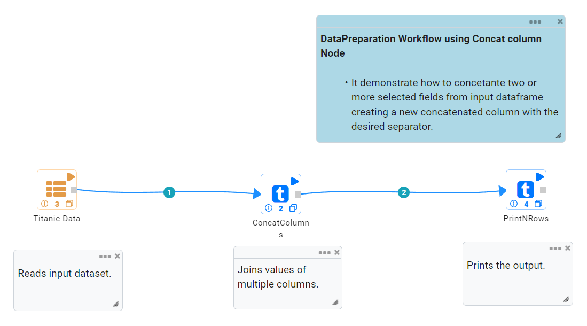
   
**Incoming dataset**

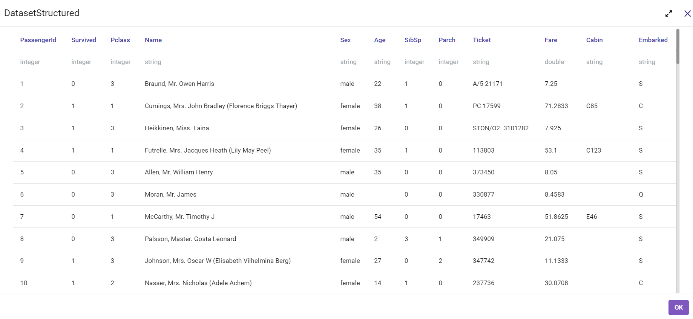
   
**Concat Columns Node configuration**

Concat Columns node is configured as below.

*	Input of this node are the incoming dataset.
*	Columns that need to be joined together are to be selected in **Columns** list.
*	Column name to list the joined data is to be entered in **Concatenated Column Name** box.
*	Separator that needs to be used to separate joined data is to entered in **Separator** box.
*	Output of this node would display dataset containing values of multiple columns joined together.

.. figure:: ../../_assets/user-guide/data-preparation/addcolumn/concat-input-01.png
   :alt: addcolumns_userguide
   :width: 90%
   
.. figure:: ../../_assets/user-guide/data-preparation/addcolumn/concat-input-02.png
   :alt: addcolumns_userguide
   :width: 90%
   
**Concat Columns Node output**

Output of Concat Columns node displaying dataset containing values of multiple columns joined together.

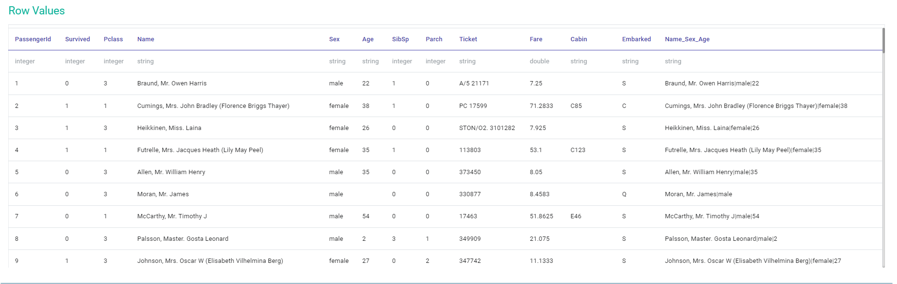
   

Expressions
----------------------------------------

Below is a sample workflow which contains Expressions processor in Fire Insights. It demonstrates usage of Expressions node to compute new column values based on expression evaluation.

It does following processing of data:

*	Reads incoming Dataset.
*	Computes new column values based on expression evaluation using Expressions node.
*	Prints output dataset containing new columns computed using expression evaluation using Print node.

   
**Incoming dataset**

   
**Expressions Node configuration**

Expressions node is configured as below.

*	Input of this node are the incoming dataset.
*	Column name that lists computed values is to be entered in **New Columns Name** box.
*	Expression to computed value is to be entered in **Expressions** box.
*	**New Key Value Array** row needs to be added for each computed value.
*	Output of this node would display dataset containing new columns computed using expression evaluation.

.. figure:: ../../_assets/user-guide/data-preparation/addcolumn/expressions-config.png
   :alt: addcolumns_userguide
   :width: 90%
   
**Expressions Node output**

Output of Expressions node displaying dataset containing new columns computed using expression evaluation.

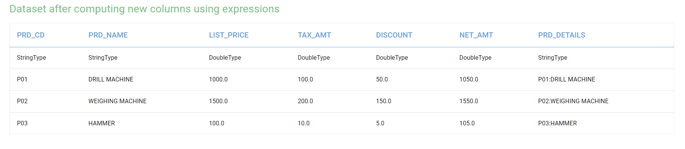
   

Generate UID
----------------------------------------

Below is a sample workflow which contains Generate UID processor in Fire Insights. It demonstrates usage of Generate UID node to compute UID (Unique Index) value for each row/partition.

It does following processing of data:

*	Reads incoming Dataset.
*	Computes UID (Unique Index) value for each row using Generate UID node.
*	Prints output dataset containing Unique Index/Value generated for each row/partition using Print node.

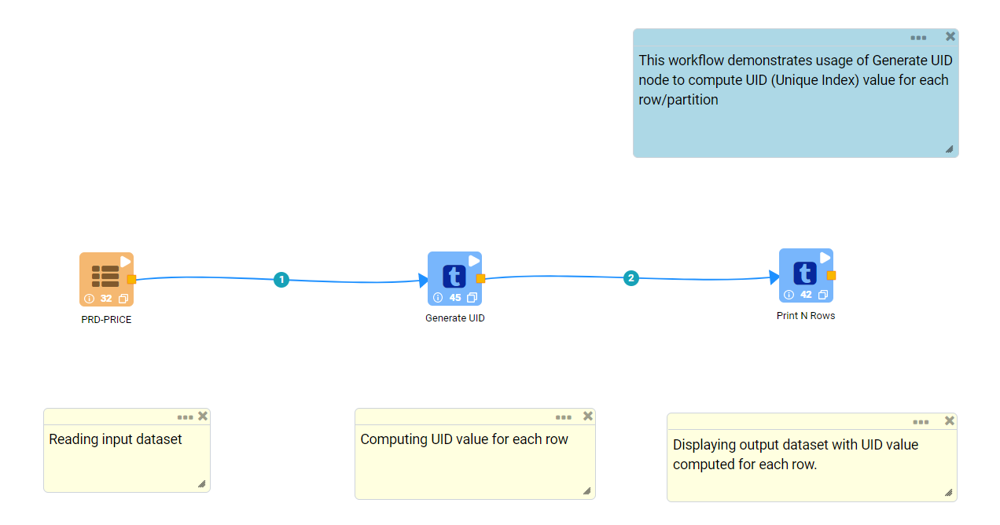
   
**Incoming dataset**

   
**Generate UID Node configuration**

Generate UID node is configured as below.

*	Input of this node are the incoming dataset.
*	Column name that lists generated UID value is to be entered in **UID Column Name** box.
*	Output of this node would display dataset containing Unique Index/Value generated for each row/partition.

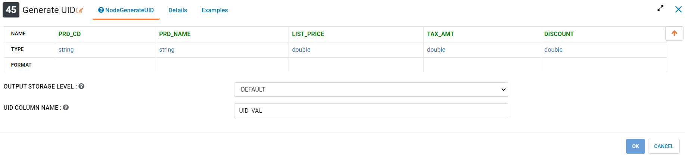
   
**Generate UID Node output**

Output of Generate UID node displaying dataset containing Unique Index/Value generated for each row/partition.

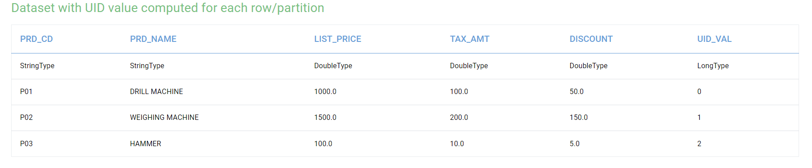
   

Generate UUID
----------------------------------------

Below is a sample workflow which contains Generate UUID processor in Fire Insights. It demonstrates usage of Generate UUID node to compute UUID (Universally Unique ID) value for each row.

It does following processing of data:

*	Reads incoming Dataset.
*	Computes **UUID (Universally Unique ID)** value for each row using Generate UUID node.
*	Prints output dataset containing UUID value generated for each row using Print node.

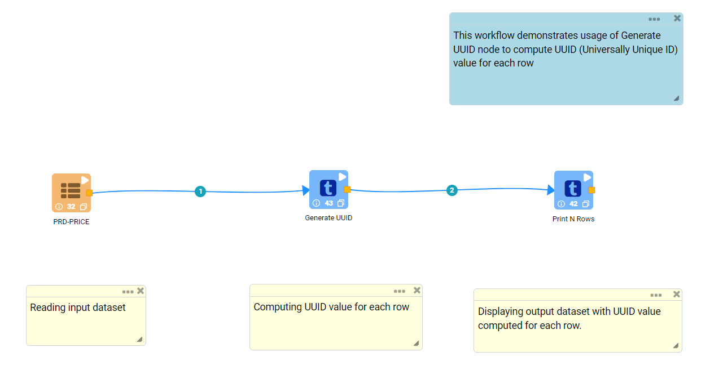
   
**Incoming dataset**

   
**Generate UUID Node configuration**

Generate UUID node is configured as below.

*	Input of this node are the incoming dataset.
*	Column name that lists generated UUID value is to be entered in **Output Column** box.
*	Output of this node would display dataset containing UUID value generated for each row.

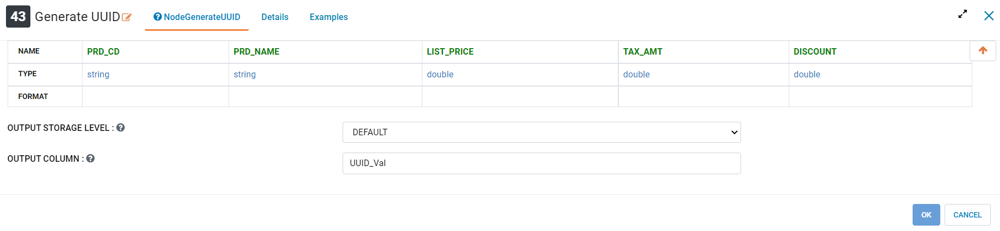
   
**Generate UUID Node output**

Output of Generate UUID node displaying dataset containing UUID value generated for each row.

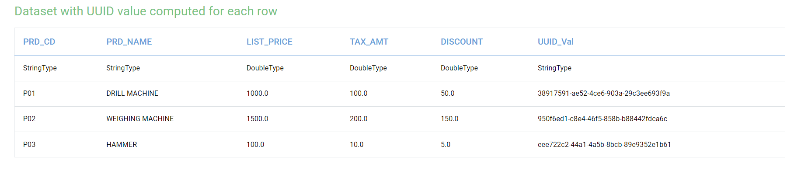
   

Hash
----------------------------------------

Below is a sample workflow which contains Hash processor in Fire Insights. It demonstrates usage of Hash node to compute Hash value for each row by application of selected algorithm on columns selected.

It does following processing of data:

*	Reads incoming Dataset.
*	Computes Hash value for each row by application of selected algorithm on columns selected using Hash node.
*	Prints output dataset containing Hash value generated for each row using Print node.

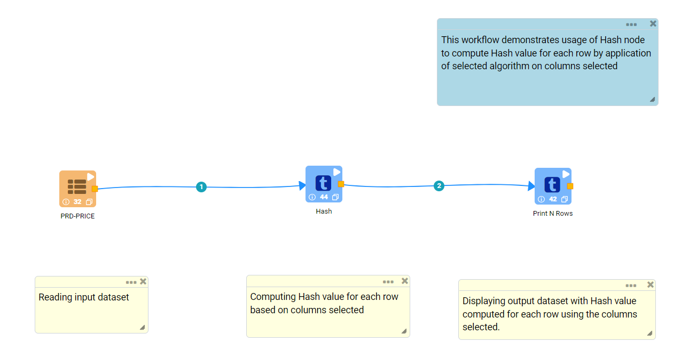
   
**Incoming dataset**

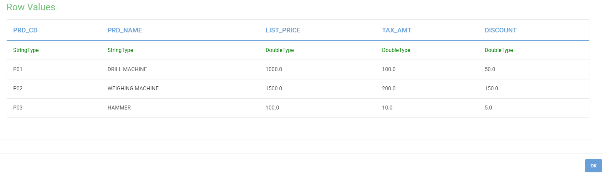
   
**Hash Node configuration**

Hash node is configured as below.

*	Input of this node are the incoming dataset.
*	Columns that needs to be used for hash value computation are to selected in **Columns** list.
*	Hashing Algorithm to be used is to be selected in **Hashing Algorithm** list.
*	Column name that lists generated hash value is to be entered in **Output Column Name** box.
*	Output of this node would display dataset containing Hash value generated for each row.

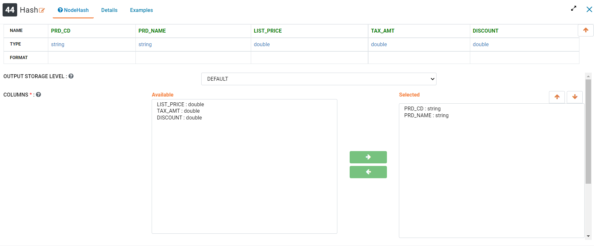
   
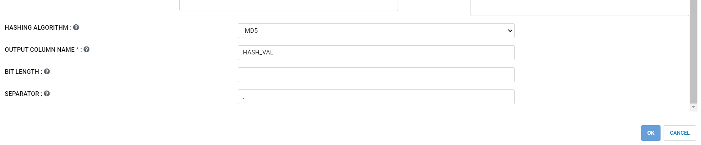
   
**Hash Node output**

Output of Hash node displaying dataset containing Hash value generated for each row.

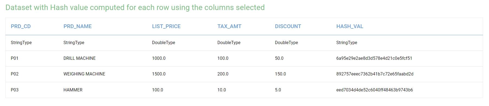
   

Zip With Index
----------------------------------------

Below is a sample workflow which contains Zip With Index processor in Fire Insights. It demonstrates usage of Zip With Index node to compute Unique Index or value for each row.

It does following processing of data:

*	Reads incoming Dataset.
*	Computes Unique Index or value for each row using Zip With Index node.
*	Prints output dataset containing Index value generated for each row using Print node.

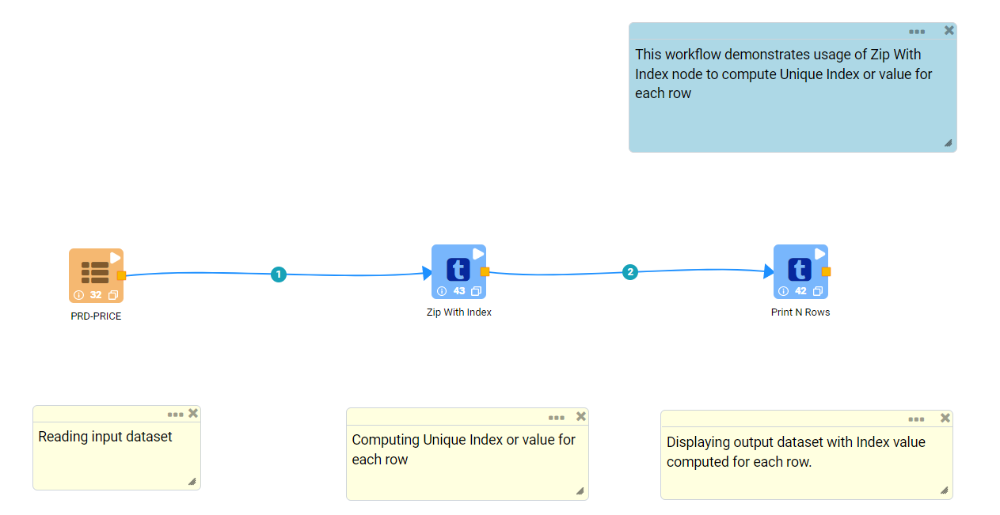
   
**Incoming dataset**

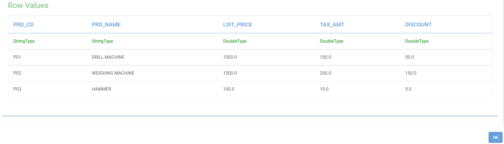
   
**Zip With Index Node configuration**

Zip With Index node is configured as below.

*	Input of this node are the incoming dataset.
*	Column name that lists generated index value is to be entered in **Index Column Name** box.
*	Output of this node would display dataset containing Index value generated for each row.

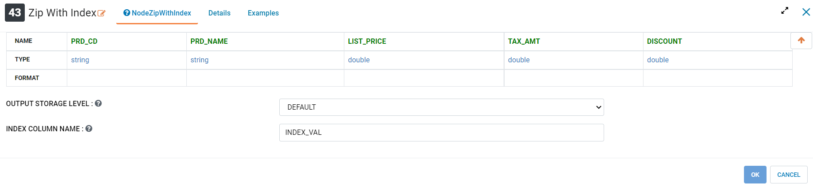
   
**Zip With Index Node output**

Output of Zip With Index node displaying dataset containing Index value generated for each row.

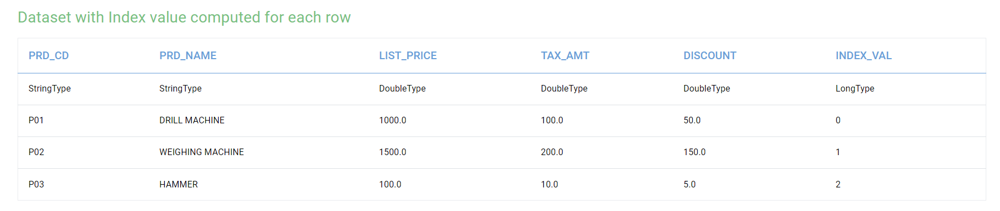
   
