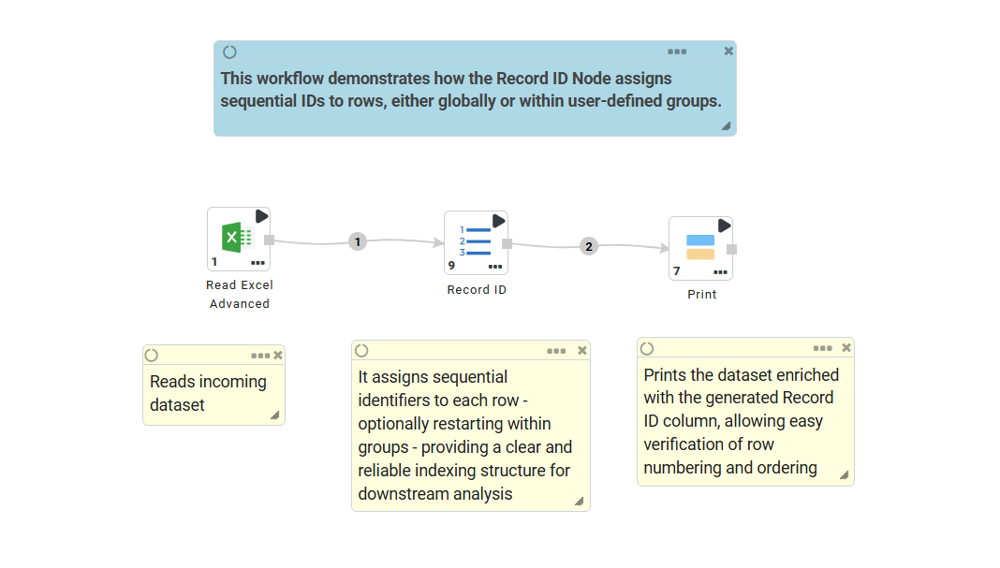
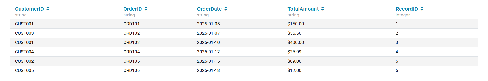
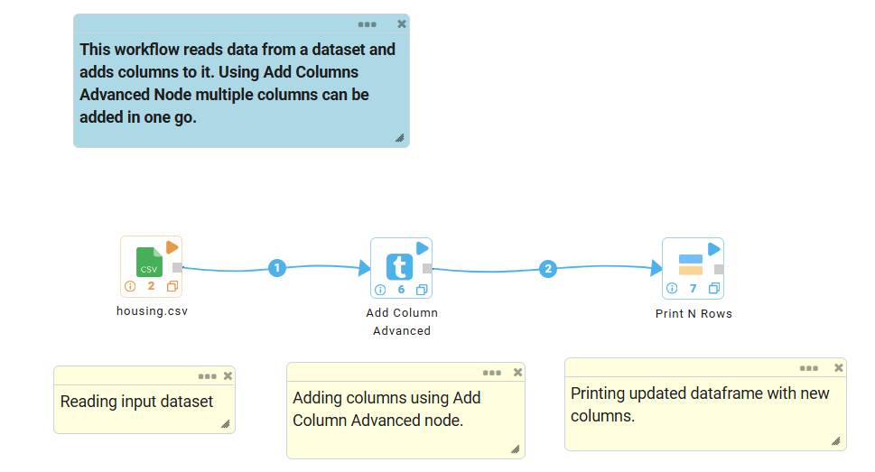
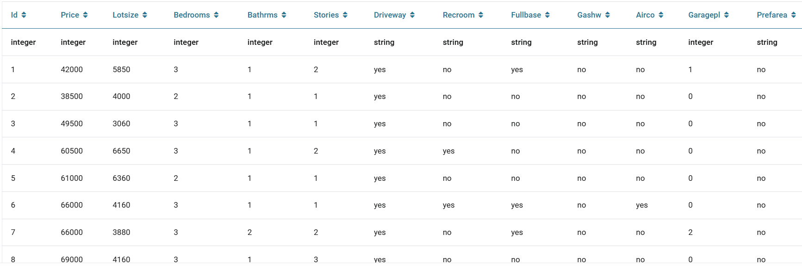
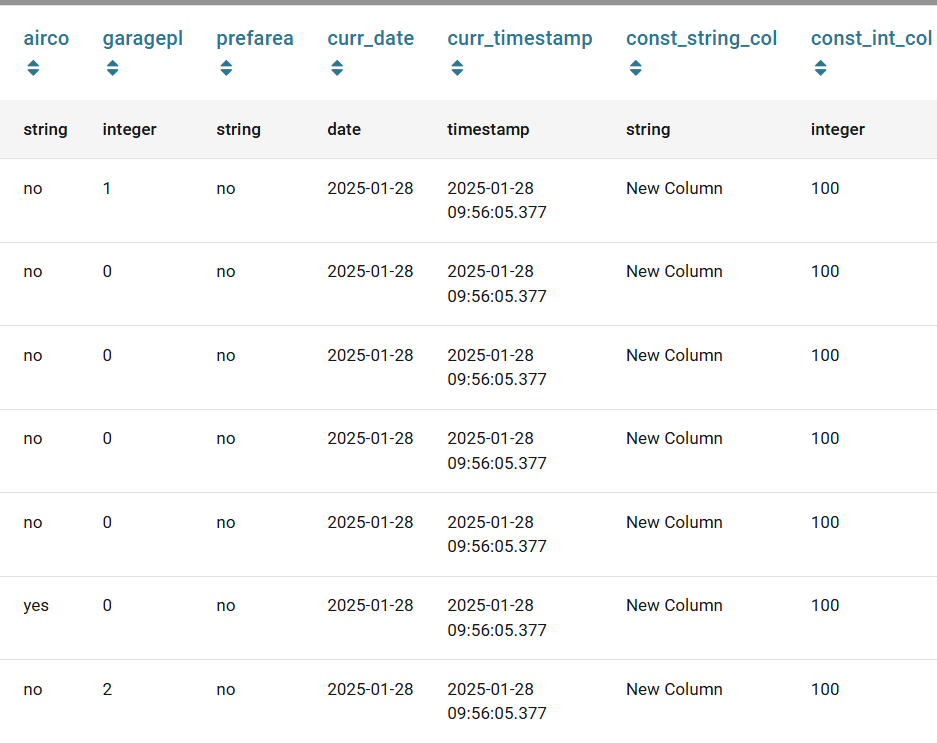
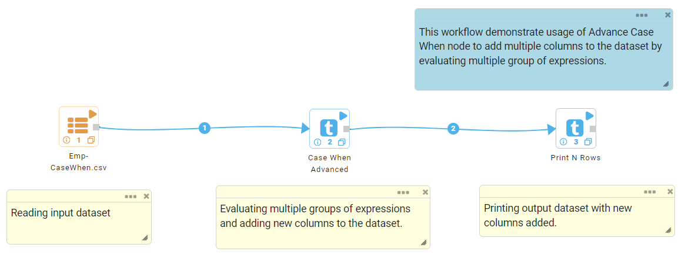
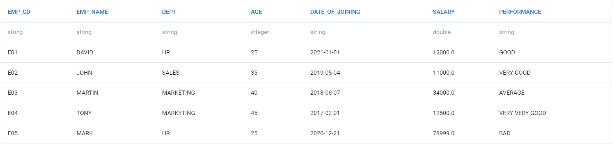
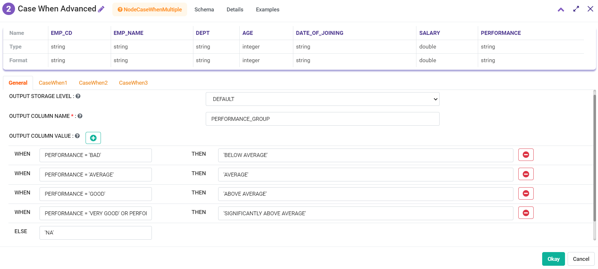
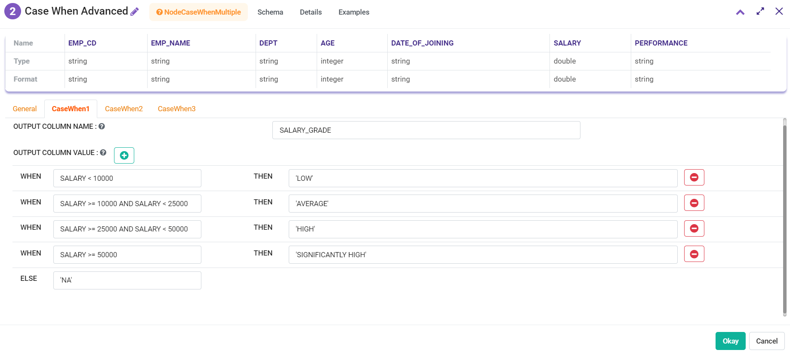
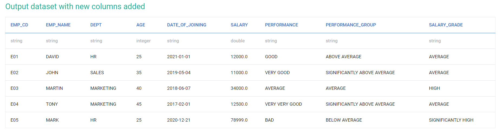

Add Columns
==========

Fire Insights provide processors to cast data type from one type to another.

Add Columns Processors in Fire Insights
----------------------------------------

.. list-table:: 
   :widths: 30 70
   :header-rows: 1

   * - Title
     - Description
   * - Record ID
     - It creates sequential identifiers for each row, with options to number the entire dataset or restart within groups. It also supports sorting, data type            selection, zero-padding, and choosing where the new column is added.
   * - Add Columns
     - It adds new columns to the dataset with Current Date, Current Time, String Constant and Integer Column values.
   * - Add Column Advanced
     - It adds multiple columns to the dataset in single go using Current Date, Current Time, String Constant and Integer Column values.
   * - Case When
     - It evaluates expressions and derives column values based on condition met.
   * - Case When Advance
     - It evaluates multiple group of expressions and derives multiple column values based on condition met.
   * - Concat Columns
     - It joins values of multiple columns into one column.
   * - Expressions
     - It computes new column values based on expression evaluation.
   * - Generate UID
     - It computes UID (Unique Index) value for each row.
   * - Generate UUID
     - It computes UUID (Universally Unique ID) value for each row.
   * - Hash
     - It computes Hash value for each row by application of selected algorithm on the columns selected.
   * - Zip With Index
     - It computes Unique Index or value for each row.
 

Record ID
-----------

Below is a sample workflow which contains Record ID processor in Fire Insights. It demonstrates how the Record ID Node assigns sequential IDs to rows, either globally or within user-defined groups.

It does the following processing of data:

* Reads the incoming dataset.
* Optionally groups rows based on selected Group By Columns.
* Orders the rows using Order By Columns (if specified).
* Generates a sequential Record ID field starting from the configured Start Value.
* Appends the Record ID column at the desired position (first or last).
* Displays the resulting dataset using the Print N Rows node.

**Incoming Dataset**

.. figure:: ../../_assets/user-guide/data-preparation/addcolumn/record-id-incoming-dataset.png
   :alt: record-id_userguide
   :width: 60%

**Record ID Node Configuration**

This node is configured using following options:

* **Input:** The node processes the incoming dataset.
* **Output Column Name:** It specifies the name for the new ID column (e.g., RecordID).
* **Starting Value:** It defines the sequence's initial number (Default: 1).
* **Data Type:** It selects the data type: INTEGER (32-bit), LONG (64-bit), or String.
* **Column Position:** It sets the new column's location: first or last (default).
* **Record ID Generation Scope:** It determines the numbering behavior across the dataset. Select **entire_table** to create a single continuous sequence for the entire dataset or **within_groups** to reset numbering for each group defined through a grouping column.

  .. figure:: ../../_assets/user-guide/data-preparation/addcolumn/record-id-node-config.png
     :alt: record-id_userguide
     :width: 60%
  

**Record ID Node Output**

The output of this node returns a DataFrame identical to the input but with an additional column containing the generated sequential identifiers.

Add Columns
----------------------------------------

Below is a sample workflow which contains Add Columns processor in Fire Insights. It demonstrates usage of Add Columns node to add new columns with Current Date, Current Time, String Constant and Integer Column values.

It does the following processing of data:

*	Reads incoming dataset.
*	Adds new columns with Current Date, Current Time, String Constant and Integer Column values using Add Columns node.
*	Prints output dataset with new columns added to the incoming dataset using Print node.

.. figure:: ../../_assets/user-guide/data-preparation/addcolumn/addcolumns-workflow.png
   :alt: addcolumns_userguide
   :width: 60%
   
**Incoming Dataset**

.. figure:: ../../_assets/user-guide/data-preparation/addcolumn/addcolumns-incoming-dataset.png
   :alt: addcolumns_userguide
   :width: 60%
   
**Add Columns Node Configuration**

This node is configured as follows:

*	**Input:** The node processes the incoming dataset. 
*	**Add Current Date Column:** Select **True** to include the current date in the output.
*	**Current Date Column Name:** Specify the column name to list current date in the output.
*	Repeat the above steps for adding **Current Time**, **String Constant** and **Integer Constant**, as shown below. The output of this node will display the dataset with new columns added to the incoming dataset.

   .. figure:: ../../_assets/user-guide/data-preparation/addcolumn/addcolumns-config.png
      :alt: addcolumns_userguide
      :width: 60%
   

**Add Columns Node Output**

The output of Add Columns node displaying dataset with new columns added to the incoming dataset is shown below.

.. figure:: ../../_assets/user-guide/data-preparation/addcolumn/addcolumns-printnode-output.png
   :alt: addcolumns_userguide
   :width: 60%       	    
   
Add Column Advanced
----------------------------------------

Below is a sample workflow which contains Add Column Advanced processor in Fire Insights. It demonstrates usage of Add Column Advanced node to add new columns with Current Date, Current Time, String Constant and Integer Column values. Multiple columns can be added in single go.

It does the following processing of data:

*	Reads incoming dataset.
*	Adds new columns with Current Date, Current Time, String Constant and Integer Column values using Add Columns node.
*  Multiple columns can be added at a time.
*	Prints output dataset with new columns added to the incoming dataset using Print node.

   
**Incoming Dataset**

   
**Add Column Advanced Node Configuration**

This node is configured as follows:

*	**Input:** The node processes the incoming dataset.
*  **Constant Type:** Select a constant type from the dropdown based on the type of column to be added.
*  **Output Column:** Enter an output column name. 
*  **Constant Value:** If the Constant Type is selected as **ConstantString** or **ConstantInt** then specify the Constant Value, as shown below. The output of this node will display the dataset with new columns added to the incoming dataset.

   .. figure:: ../../_assets/user-guide/data-preparation/addcolumn/addcolumnsadv-config.png
      :alt: addcolumns_userguide
      :width: 60%
   
**Add Column Advanced Node Output**

The output of Add Column Advanced node displaying dataset with new columns added to the incoming dataset is shown below.

   

Case When
----------------------------------------

Below is a sample workflow which contains Case When processor in Fire Insights. It demonstrates usage of Case When node to evaluate expressions and derive column values based on condition met.

It does the following processing of data:

*	Reads incoming dataset.
*	Evaluates expressions and derive column values based on condition met using Case When node.
*	Prints output dataset with values computed based on Case When conditions using Print node.

.. figure:: ../../_assets/user-guide/data-preparation/addcolumn/casewhen-workflow.png
   :alt: addcolumns_userguide
   :width: 60%
   
**Incoming Dataset**

.. figure:: ../../_assets/user-guide/data-preparation/addcolumn/casewhen-incoming-dataset.png
   :alt: addcolumns_userguide
   :width: 60%
   
**Case When Node Configuration**

This node is configured as follows:

*	**Input:** The node processes the incoming dataset.
*	**Output Column Name:** Enter a column name to list computed value in the output.
*	**When Condition:** Enter a Conditional Expression in this box.  
*	**Value:** Enter a value to be assigned to column in this box.
*	**Key Value Array:** For each condition, a new row must be added to the Key Value Array. Conditions should be defined in such a manner that only one of them evaluates to true at a time.
*	**Else:** If none of the defined conditions are met, enter the value that needs to be assigned, as shown below. The output of this node will display the dataset with new computed column added to the incoming dataset.

   .. figure:: ../../_assets/user-guide/data-preparation/addcolumn/casewhen-config.png
      :alt: addcolumns_userguide
      :width: 60%

**Case When Node Output**

The output of Case When node displaying the dataset with new computed column added to the incoming dataset is shown below.

.. figure:: ../../_assets/user-guide/data-preparation/addcolumn/casewhen-printnode-output.png
   :alt: addcolumns_userguide
   :width: 60%       	    
   

Case When Advance
----------------------------------------

Below is a sample workflow which contains Case When Advance processor in Fire Insights. It demonstrates usage of Case When Advance node to evaluate multiple group of expressions and derives multiple column values based on condition met.

It does the following processing of data:

*	Reads incoming dataset.
*	Evaluates expressions and derive column values based on condition met using Case When Advance node.
*	Prints output dataset with values computed based on Case When Advance conditions using Print node.

   
**Incoming Dataset**

   
**Case When Advance Node Configuration**

This node is configured as follows:

*	**Input:** The node processes the incoming dataset.
*	**Output Column Name:** Enter a column name to list computed value in the output.	       
*  **When Condition:** Enter a Conditional Expression in this box.  
*	**Value:** Enter a value to be assigned to column in this box.
*	**Key Value Array:** For each condition, a new row must be added to the Key Value Array. Conditions should be defined in such a manner that only one of them evaluates to true at a time.
*	**Else:** If none of the defined conditions are met, enter the value that needs to be assigned. The output of this node will display the dataset with new computed column added to the incoming dataset.
*  Add details to the multiple Case When tabs to add multiple columns to the output dataset, as shown below.

**Case When Advance Tab 1**

**Case When Advance Tab 2**

**Case When Advance Node Output**

The output of Case When Advance node displaying dataset with new computed columns added to the incoming dataset is shown below.

   

Concat Columns
----------------------------------------

Below is a sample workflow which contains Concat Columns processor in Fire Insights. It demonstrates usage of Concat Columns node to join values of multiple columns into one column.

It does the following processing of data:

*	Reads incoming dataset.
*	Joins values of multiple columns into one column using Concat Columns node.
*	Prints output dataset containing values of multiple columns joined together using Print node.

.. figure:: ../../_assets/user-guide/data-preparation/addcolumn/concat-columns-wf.png
   :alt: addcolumns_userguide
   :width: 60%
   
**Incoming Dataset**

.. figure:: ../../_assets/user-guide/data-preparation/addcolumn/concat-input.png
   :alt: addcolumns_userguide
   :width: 60%
   
**Concat Columns Node Configuration**

This node is configured as follows:

*	**Input:** Incoming dataset is the input for this node.
*	**Columns:** Select the columns that need to be joined together from the list.
*	**Concatenated Column Name:** Enter a column name to list the joined data.
*	**Separator:** Enter a separator that needs to be used to separate the joined data, as shown below and click on **Okay** button. The output of this node will display the dataset containing values of multiple columns joined together.

   .. figure:: ../../_assets/user-guide/data-preparation/addcolumn/concat-input-01.png
      :alt: addcolumns_userguide
      :width: 60%
   
   .. figure:: ../../_assets/user-guide/data-preparation/addcolumn/concat-input-02.png
      :alt: addcolumns_userguide
      :width: 60%
   
**Concat Columns Node Output**

The output of Concat Columns node displaying the dataset containing values of multiple columns joined together is shown below.

.. figure:: ../../_assets/user-guide/data-preparation/addcolumn/concat-columns-output.png
   :alt: addcolumns_userguide
   :width: 60%       	    
   

Expressions
----------------------------------------

Below is a sample workflow which contains Expressions processor in Fire Insights. It demonstrates usage of Expressions node to compute new column values based on expression evaluation.

It does the following processing of data:

*	Reads incoming dataset.
*	Computes new column values based on expression evaluation using Expressions node.
*	Prints output dataset containing new columns computed using expression evaluation using Print node.

.. figure:: ../../_assets/user-guide/data-preparation/addcolumn/expressions-workflow.png
   :alt: addcolumns_userguide
   :width: 60%
   
**Incoming Dataset**

.. figure:: ../../_assets/user-guide/data-preparation/addcolumn/expressions-incoming-dataset.png
   :alt: addcolumns_userguide
   :width: 60%
   
**Expressions Node Configuration**

This node is configured as follows:

*	**Input:** Incoming dataset is the input for this node.
*	**New Columns Name:** Enter a column name that lists computed values in the box.
*	**Expressions:** Enter an Expression to computed value in the box.
*	**Key Value Array:** For each computed value, a new row needs to be added, as shown below. The output of this node will display the dataset containing new columns computed using expression evaluation.

   .. figure:: ../../_assets/user-guide/data-preparation/addcolumn/expressions-config.png
      :alt: addcolumns_userguide
      :width: 60%
   
**Expressions Node Output**

The output of Expressions node displaying dataset containing new columns computed using expression evaluation is shown below.

.. figure:: ../../_assets/user-guide/data-preparation/addcolumn/expressions-printnode-output.png
   :alt: addcolumns_userguide
   :width: 60%       	    
   

Generate UID
----------------------------------------

Below is a sample workflow which contains Generate UID processor in Fire Insights. It demonstrates usage of Generate UID node to compute UID (Unique Index) value for each row/partition.

It does the following processing of data:

*	Reads incoming dataset.
*	Computes UID (Unique Index) value for each row using Generate UID node.
*	Prints output dataset containing Unique Index/Value generated for each row/partition using Print node.

.. figure:: ../../_assets/user-guide/data-preparation/addcolumn/genuid-workflow.png
   :alt: addcolumns_userguide
   :width: 60%
   
**Incoming Dataset**

.. figure:: ../../_assets/user-guide/data-preparation/addcolumn/genuid-incoming-dataset.png
   :alt: addcolumns_userguide
   :width: 60%
   
**Generate UID Node Configuration**

This node is configured as follows:

*	**Input:** The incoming dataset is the input for this node.
*	**UID Column Name:** Enter a column name that lists generated UID value in the box and click on **OK** button, as shown below. The output of this node will display the dataset containing Unique Index/Value generated for each row/partition.

   .. figure:: ../../_assets/user-guide/data-preparation/addcolumn/genuid-config.png
      :alt: addcolumns_userguide
      :width: 60%
   
**Generate UID Node Output**

The output of Generate UID node displaying dataset containing Unique Index/Value generated for each row/partition is shown below.

.. figure:: ../../_assets/user-guide/data-preparation/addcolumn/genuid-printnode-output.png
   :alt: addcolumns_userguide
   :width: 60%       	    
   

Generate UUID
----------------------------------------

Below is a sample workflow which contains Generate UUID processor in Fire Insights. It demonstrates usage of Generate UUID node to compute **UUID (Universally Unique ID)** value for each row.

It does the following processing of data:

*	Reads incoming dataset.
*	Computes UUID value for each row using Generate UUID node.
*	Prints output dataset containing UUID value generated for each row using Print node.

.. figure:: ../../_assets/user-guide/data-preparation/addcolumn/genuuid-workflow.png
   :alt: addcolumns_userguide
   :width: 60%
   
**Incoming Dataset**

.. figure:: ../../_assets/user-guide/data-preparation/addcolumn/genuuid-incoming-dataset.png
   :alt: addcolumns_userguide
   :width: 60%
   
**Generate UUID Node Configuration**

This node is configured as follows:

*	**Input:** Incoming dataset is the input for this node.
*	**Output Column:** Enter a column name that lists generated UUID value in the box, as shown below and click on **OK** button. The output of this node will display the dataset containing UUID value generated for each row.

   .. figure:: ../../_assets/user-guide/data-preparation/addcolumn/genuuid-config.png
      :alt: addcolumns_userguide
      :width: 60%
   
**Generate UUID Node Output**

The output of Generate UUID node displaying dataset containing UUID value generated for each row is shown below.

.. figure:: ../../_assets/user-guide/data-preparation/addcolumn/genuuid-printnode-output.png
   :alt: addcolumns_userguide
   :width: 60%       	    
   

Hash
----------------------------------------

Below is a sample workflow which contains Hash processor in Fire Insights. It demonstrates usage of Hash node to compute Hash value for each row by application of selected algorithm on columns selected.

It does the following processing of data:

*	Reads incoming dataset.
*	Computes Hash value for each row by application of selected algorithm on columns selected using Hash node.
*	Prints output dataset containing Hash value generated for each row using Print node.

.. figure:: ../../_assets/user-guide/data-preparation/addcolumn/hash-workflow.png
   :alt: addcolumns_userguide
   :width: 60%
   
**Incoming Dataset**

.. figure:: ../../_assets/user-guide/data-preparation/addcolumn/hash-incoming-dataset.png
   :alt: addcolumns_userguide
   :width: 60%
   
**Hash Node Configuration**

This node is configured as follows:

*	**Input:** Incoming dataset is the input for this node.
*	**Columns:** Select a column that needs to be used for hash value computation from the list.
*	**Hashing Algorithm:** Select a Hashing Algorithm to be used from the dropdown.
*	**Output Column Name:** Enter a column name that lists generated hash value, as shown below and click on **OK** button. The output of this node will display the dataset containing Hash value generated for each row.

   .. figure:: ../../_assets/user-guide/data-preparation/addcolumn/hash-config1.png
      :alt: addcolumns_userguide
      :width: 60%
   
   .. figure:: ../../_assets/user-guide/data-preparation/addcolumn/hash-config2.png
      :alt: addcolumns_userguide
      :width: 60%
   
**Hash Node Output**

The output of Hash node displaying dataset containing Hash value generated for each row is shown below.

.. figure:: ../../_assets/user-guide/data-preparation/addcolumn/hash-printnode-output.png
   :alt: addcolumns_userguide
   :width: 60%       	    
   

Zip With Index
----------------------------------------

Below is a sample workflow which contains Zip With Index processor in Fire Insights. It demonstrates usage of Zip With Index node to compute Unique Index or value for each row.

It does the following processing of data:

*	Reads incoming dataset.
*	Computes Unique Index or value for each row using Zip With Index node.
*	Prints output dataset containing Index value generated for each row using Print node.

.. figure:: ../../_assets/user-guide/data-preparation/addcolumn/zipwithindex-workflow.png
   :alt: addcolumns_userguide
   :width: 60%
   
**Incoming Dataset**

.. figure:: ../../_assets/user-guide/data-preparation/addcolumn/zipwithindex-incoming-dataset.png
   :alt: addcolumns_userguide
   :width: 60%
   
**Zip With Index Node Configuration**

This node is configured as follows:

*	**Input:** Incoming dataset is the input for this node.
*	**Index Column Name:** Enter a column name that lists generated index value, as shown below and click on **OK** button. The output of this node will display the dataset containing Index value generated for each row.

   .. figure:: ../../_assets/user-guide/data-preparation/addcolumn/zipwithindex-config.png
      :alt: addcolumns_userguide
      :width: 60%
   
**Zip With Index Node Output**

The output of Zip With Index node displaying dataset containing Index value generated for each row is shown below.

.. figure:: ../../_assets/user-guide/data-preparation/addcolumn/zipwithindex-printnode-output.png
   :alt: addcolumns_userguide
   :width: 60%       	    
   
