Aggregate
==========

Fire Insights provide processors that show aggregates for combinations of values in the selected columns.

Aggregate Processors in Fire Insights
----------------------------------------

.. list-table:: Aggregate Processors
   :widths: 30 70
   :header-rows: 1

   * - Title
     - Description
   * - [Cube](#Cube)
     - Cube Node computes aggregations of a group of rows against all possible combinations of values in the selected grouping columns
   * - Group By
     - This node computes aggregations of a group of rows against selected grouping column by applying selected aggregate functions on specified aggregate columns
   * - Pivot By
     - This node creates a Dataframe based on the Pivot table created out of the incoming Dataframe. Pivot table is created by Aggregation of rows by applying the Aggregate functions on the Aggregate Columns against the Grouping and Pivot Columns selected.
   * - Rollup
     - Rollup Node generates a result set that shows aggregates for a hierarchy of values in the selected columns
 

[Cube]
----------------------------------------

Below is a sample workflow which contains ``Cube`` processor in Fire Insights. It demonstrates usage of ``Cube`` node to compute aggregated value against all possible combinations of values in selected Cube columns.

It does following processing of data:

*	Reads incoming Dataset
*	Filters incoming Dataset based on requirement. Here dataset is filtered for selected Departments.
*	Aggregated value (Sum of Salary) is computed using ``Cube`` node against all possible combinations of values in selected Cube Columns (Location and Dept)
* 	Aggregated data is printed using Print node

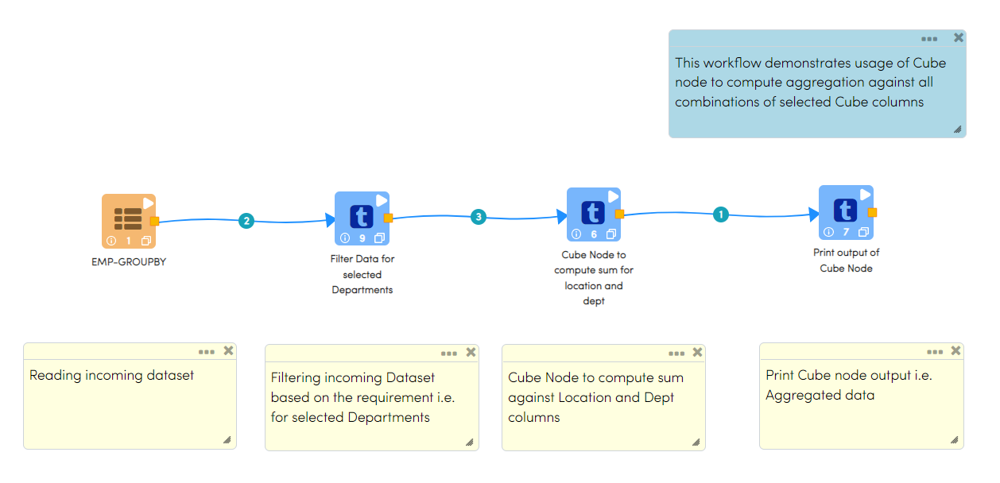
   

**Cube Node configuration**

*	It computes aggregation against all combinations of selected Cube columns values. Aggregated value (Sum of Salary) is computed using ``Cube`` node against all combinations of selected Cube Columns (Location and Dept) values.
*	Columns from incoming Datasets against whom Aggregated values need to be calculated are to be selected as ``Cube Columns``. Multiple columns can be selected as ``Cube Columns``
*	Columns on whom aggregated values need to be computed are to be selected as ``Aggregated Columns``. If aggregated values need to be calculated on multiple columns then additional rows need to be added.
*	Function that needs to be used for Aggregated Value calculation is to be selected in ``Aggregate Operation To Use``. It can be different for each rows.

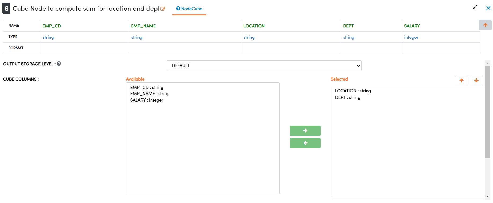

Aggregate column and Aggregate function selection to compute aggregated value is done as below

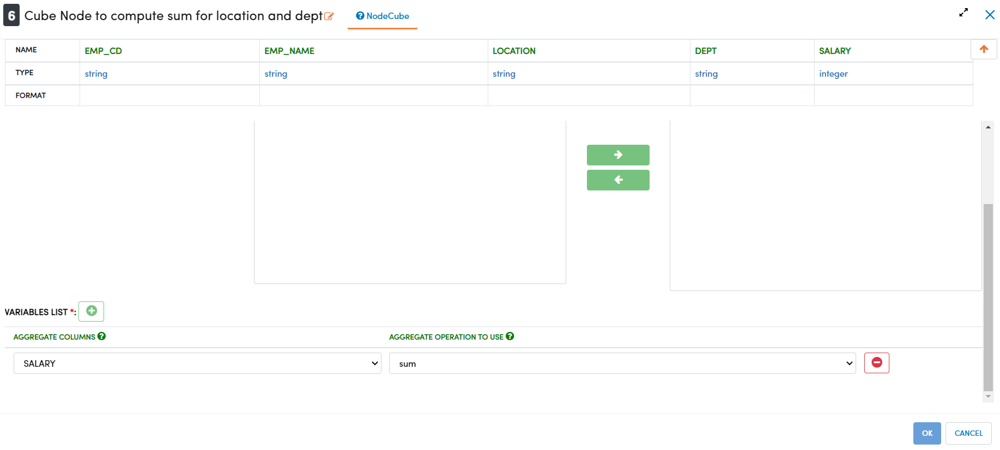

**Cube Node output**

Aggregated value computed using Cube node is displayed using Print node as below

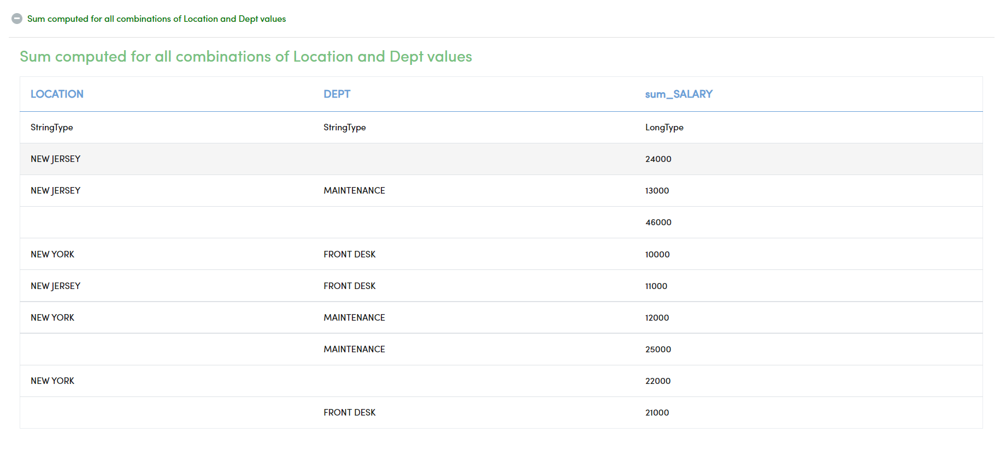

Group By
----------------------------------------

Below is a sample workflow which contains ``Group By`` processor in Fire Insights. It demonstrates usage of ``Group By`` node to compute aggregation of data by grouping rows together based on ``Group By`` columns.

It does following processing of data:

*	Reads incoming Dataset
*	Aggregated value (Sum of Salary) is computed using ``Group By`` node by grouping rows together based on Group By column (Location)
* 	Aggregated data is printed using Print node

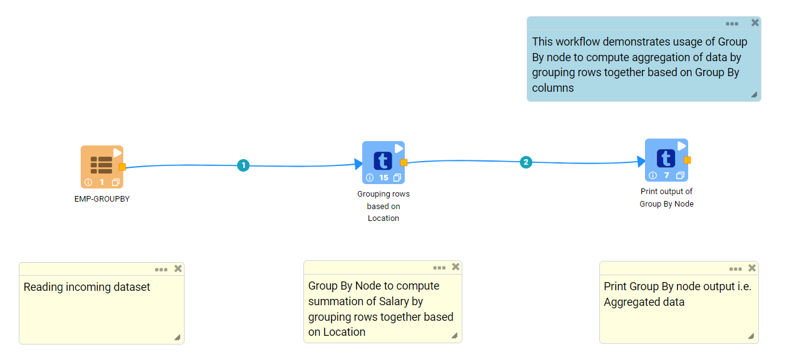
   

**Group By Node configuration**

*	It computes aggregation of data by grouping rows together based on Group By columns. Aggregated value (Sum of Salary) is computed using ``Group By`` node by grouping rows together based on ``Group By`` column (Location).
*	Columns from incoming Datasets against whom Aggregated values need to be calculated are to be selected as ``Grouping Columns``. Multiple columns can be selected as ``Grouping Columns``
*	Columns on whom aggregated values need to be computed are to be selected as ``Aggregated Columns``. If aggregated values need to be calculated on multiple columns then additional rows need to be added.
*	Function that needs to be used for Aggregated Value calculation is to be selected in ``Aggregate Operation To Use``. It can be different for each rows.
*	``Where Clause`` and ``Having Clause`` in the ``Filter Setting`` tab can be used to filter outgoing dataset.

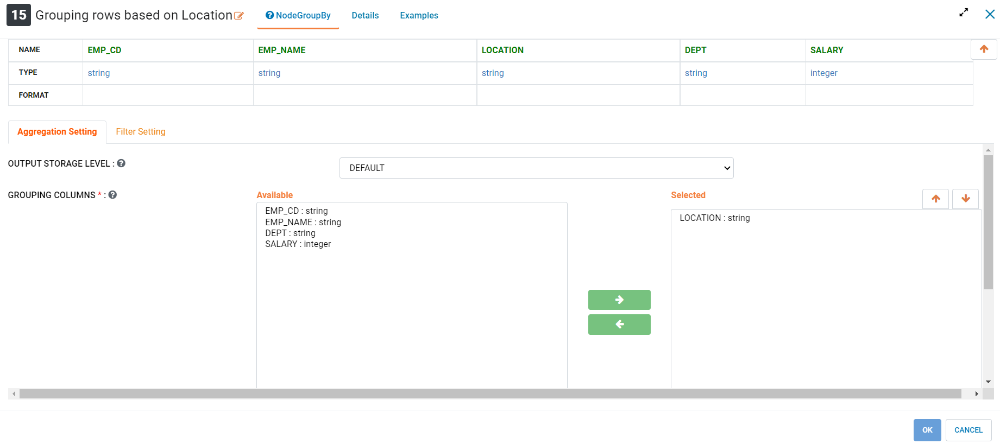

Aggregate column and Aggregate function selection to compute aggregated value is done as below

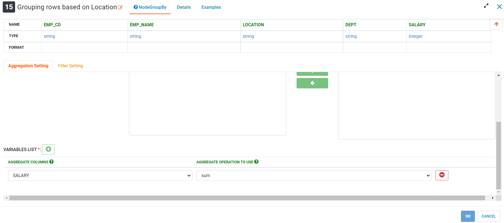

Filter Setting is entered as below

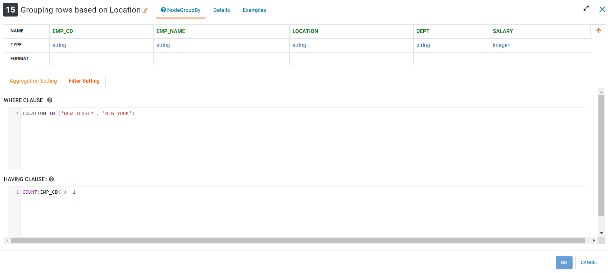

**Group By Node output**

Aggregated value computed using ``Group By`` node is displayed using Print node as below

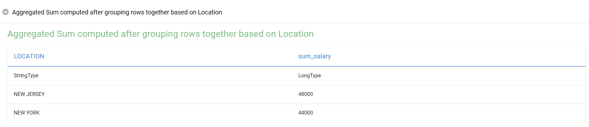

Pivot By
----------------------------------------

Below is a sample workflow which contains ``Pivot By`` processor in Fire Insights. It demonstrates usage of ``Pivot By`` node to compute aggregation of data using Grouping columns and displayed against each Pivot Column value.

It does following processing of data:

*	Reads incoming Dataset
*	Aggregated value (Employee Count) is computed using ``Pivot By`` node by grouping rows together based on ``Group By`` column (Department) and displayed against each ``Pivot Column`` value (Location)
* 	Aggregated data is printed using Print node

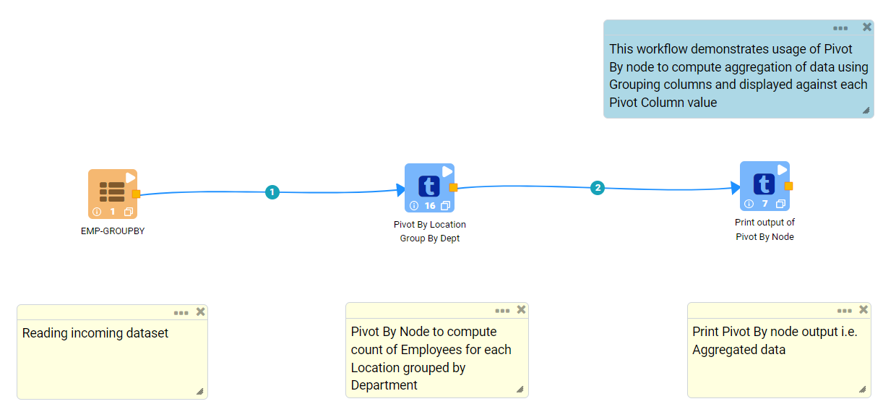
   

**Pivot By Node configuration**

*	It computes aggregation of data using Grouping columns and display it against each Pivot Column value. Aggregated value (Employee Count) is computed using ``Pivot By`` node by grouping rows together based on ``Group By`` column (Department) and displayed against each ``Pivot Column`` value (Location).
*	Columns from incoming Datasets against whom Aggregated values need to be calculated are to be selected as ``Grouping Columns``. Multiple columns can be selected as ``Grouping Columns``
*	Columns from incoming Datasets against whom Aggregated values for each Group need to be displayed are to be selected as ``Pivot Columns``. Values from ``Pivot Columns`` would be displayed as Columns in the output. Multiple columns can be selected as ``Pivot Columns``
*	Columns on whom aggregated values need to be computed are to be selected as ``Aggregated Columns``. If aggregated values need to be calculated on multiple columns then additional rows need to be added.
*	Function that needs to be used for Aggregated Value calculation is to be selected in ``Aggregate Operation To Use``. It can be different for each rows.

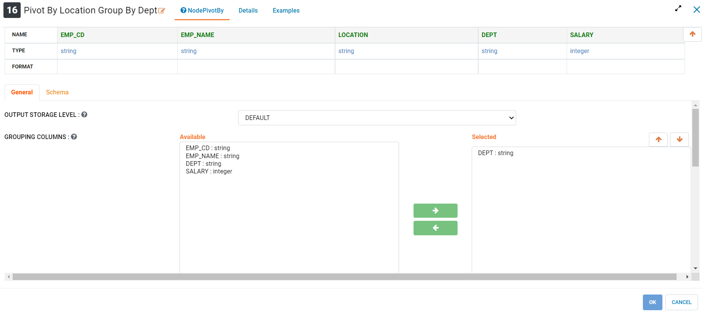

``Pivot Columns`` are selected as below. Data from ``Pivot Columns`` would be displayed as Columns in the output. Aggregated values would be diaplayed against each Pivot Column value. Multiple Pivot columns can be selected.

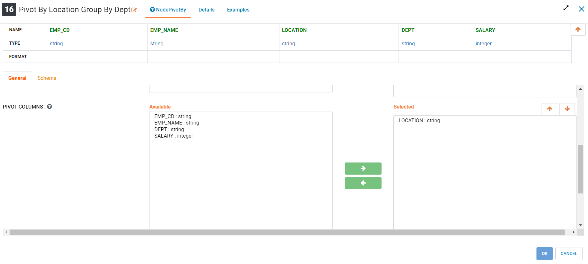

Aggregate column and Aggregate function selection to compute aggregated value is done as below

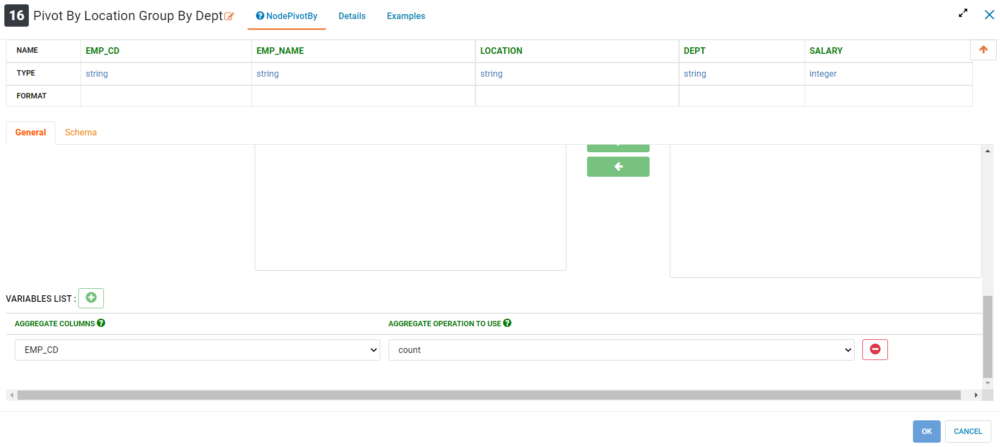

**Pivot By Node output**

Aggregated value computed using ``Pivot By`` node is displayed using Print node as below

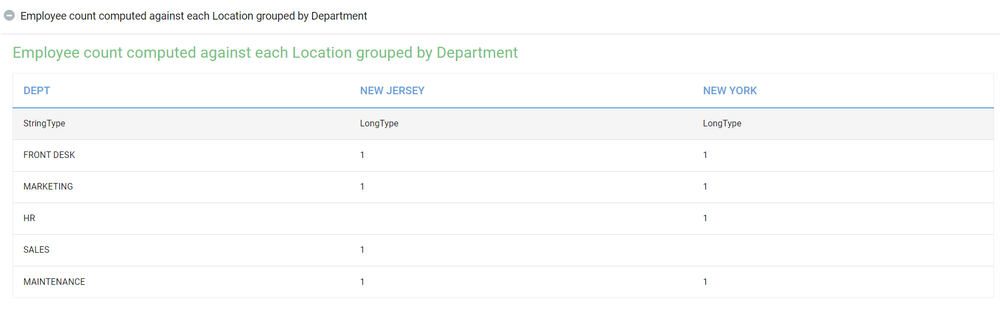
   
Rollup
----------------------------------------

Below is a sample workflow which contains ``Rollup`` processor in Fire Insights. It demonstrates usage of ``Rollup`` node to compute aggregation of data using ``Rollup Columns``. Output is displayed in Hierarchical order depicting the manner in which aggregation rolls-up upward.

It does following processing of data:

*	Reads incoming Dataset
*	Filters incoming Dataset based on requirement. Here dataset is filtered for selected Departments.
*	Aggregated value (Sum of Salary) is computed using ``Rollup`` node for combinations of selected ``Rollup Columns`` (Location and Dept)
* 	Aggregated data is printed using Print node

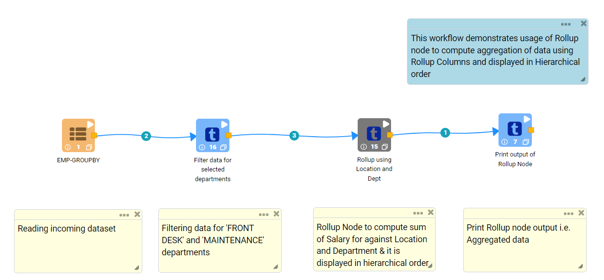
   

**Rollup Node configuration**

*	It compute aggregation of data using ``Rollup Columns``. Output is displayed in Hierarchical order depicting the manner in which aggregation rolls-up upward. Aggregated value (Sum of Salary) is computed using ``Rollup`` node for combinations of selected ``Rollup Columns`` (Location and Dept)
*	Columns from incoming Datasets against whom Aggregated values need to be calculated are to be selected as ``Rollup Columns``. Multiple columns can be selected as ``Rollup Columns``
*	Columns on whom aggregated values need to be computed are to be selected as ``Aggregated Columns``. If aggregated values need to be calculated on multiple columns then additional rows need to be added.
*	Function that needs to be used for Aggregated Value calculation is to be selected in ``Aggregate Operation To Use``. It can be different for each rows.

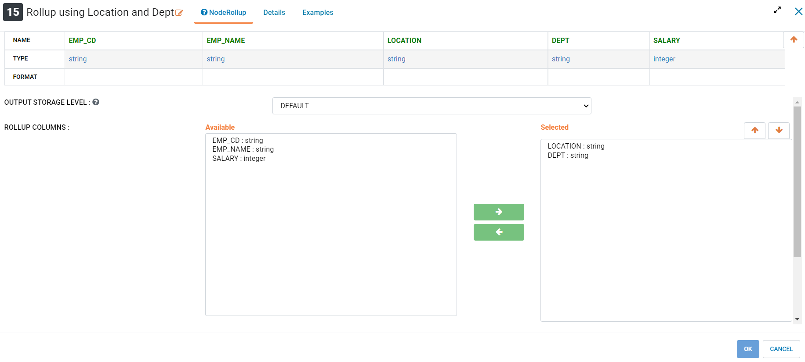

Aggregate column and Aggregate function selection to compute aggregated value is done as below

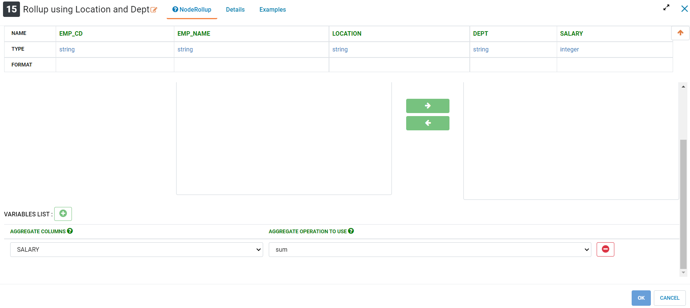

**Rollup Node output**

Aggregated value computed using Rollup node is displayed using Print node as below. 

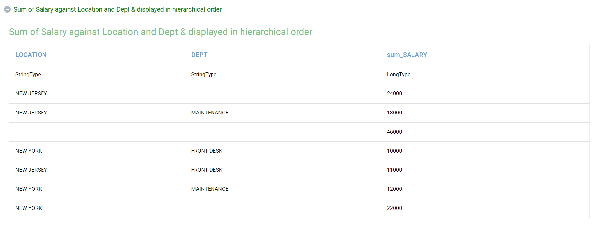
