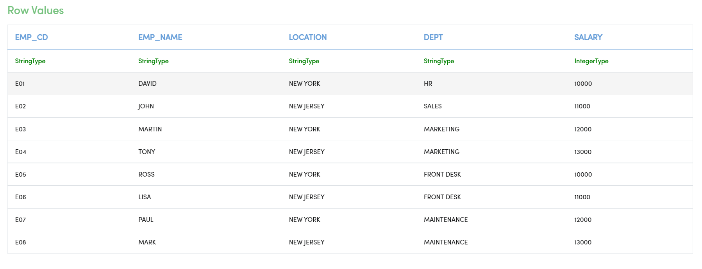
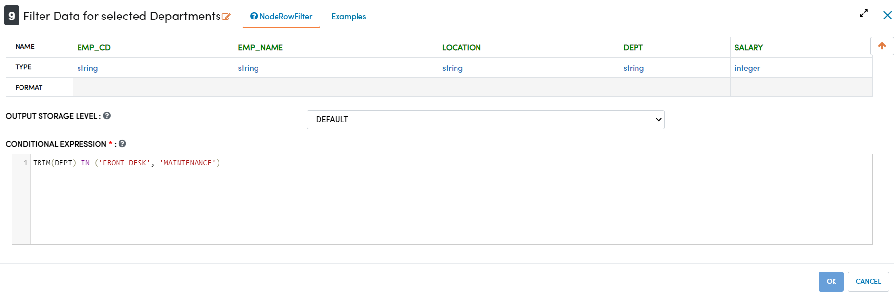
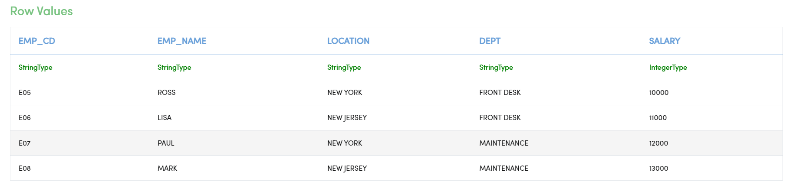
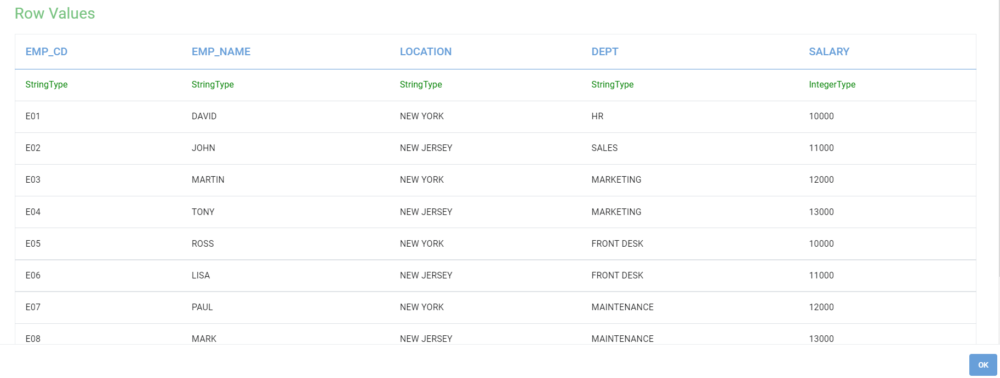
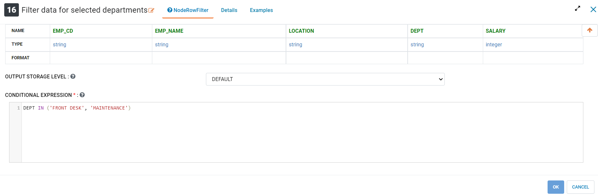
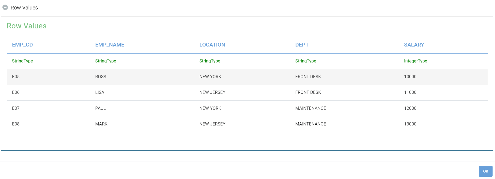

Aggregate
==========

Fire Insights provide processors that show aggregates for combinations of values in the selected columns.

Aggregate Processors in Fire Insights
----------------------------------------

.. list-table:: Aggregate Processors
   :widths: 30 70
   :header-rows: 1

   * - Title
     - Description
   * - Cube
     - Cube Node generates a result set that shows aggregates for all combinations of values in the selected columns
   * - Group By
     - This node computes aggregations of a group of rows against selected grouping column by applying selected aggregate functions on specified aggregate columns
   * - Pivot By
     - This node creates a Dataframe based on the Pivot table created out of the incoming Dataframe. Pivot table is created by Aggregation of rows by applying the Aggregate functions on the Aggregate Columns against the Grouping and Pivot Columns selected.
   * - Rollup
     - Rollup Node generates a result set that shows aggregates for a hierarchy of values in the selected columns
 

Cube
====================

Below is a sample workflow which contains ``Cube`` processor in Fire Insights. It demonstrates usage of Cube node to compute aggregation against all combinations of selected Cube columns.

It does following processing of data:

*	Reads incoming Dataset
*	Filters incoming Dataset based on requirement. Here dataset is filtered for selected Departments.
*	Aggregated value (Sum of Salary) is computed using Cube node against all combinations of selected Cube Columns (Location and Dept)
* 	Aggregated data is printed using Print node

.. figure:: ../../_assets/user-guide/data-preparation/aggregate/cube-demo-workflow.png
   :alt: cube_node_userguide
   :width: 90%
   
**Incoming dataset**

**Filter Node configuration**

Filter Node is configured to select data for 'FRONT DESK' and 'MAINTENANCE' departments

**Filter Node output**

Dataset is created as below after application of filter

**Cube Node configuration**

Cube Columns are selected as below to perform aggregation on.

.. figure:: ../../_assets/user-guide/data-preparation/aggregate/cube-cubecol-selection.png
   :alt: cube_node_userguide
   :width: 90%

Aggregate column and Aggregate function selection to compute aggregated value is done as below

.. figure:: ../../_assets/user-guide/data-preparation/aggregate/cube-aggregatecol-definition.png
   :alt: cube_node_userguide
   :width: 90%

**Cube Node output**

Aggregated value computed using Cube node is displayed using Print node as below

.. figure:: ../../_assets/user-guide/data-preparation/aggregate/cube-printnode-output.png
   :alt: cube_node_userguide
   :width: 90%

Group By
====================

Below is a sample workflow which contains ``Group By`` processor in Fire Insights. It demonstrates usage of Group By node to compute aggregation of data by grouping rows together based on Group By columns.

It does following processing of data:

*	Reads incoming Dataset
*	Aggregated value (Sum of Salary) is computed using Group By node by grouping rows together based on Group By column (Location)
* 	Aggregated data is printed using Print node

.. figure:: ../../_assets/user-guide/data-preparation/aggregate/groupby-demo-workflow.png
   :alt: groupby_node_userguide
   :width: 90%
   
**Incoming dataset**

.. figure:: ../../_assets/user-guide/data-preparation/aggregate/groupby-incoming-dataset.png
   :alt: groupby_node_userguide
   :width: 90%

**Group By Node configuration**

Grouping Columns are selected as below to perform aggregation on. Multiple Grouping columns can be selected.

.. figure:: ../../_assets/user-guide/data-preparation/aggregate/groupby-groupingcol-selection.png
   :alt: groupby_node_userguide
   :width: 90%

Aggregate column and Aggregate function selection to compute aggregated value is done as below

.. figure:: ../../_assets/user-guide/data-preparation/aggregate/groupby-aggregatecol-definition.png
   :alt: groupby_node_userguide
   :width: 90%

**Group By Node output**

Aggregated value computed using Group By node is displayed using Print node as below

.. figure:: ../../_assets/user-guide/data-preparation/aggregate/groupby-printnode-output.png
   :alt: groupby_node_userguide
   :width: 90%

Pivot By
====================

Below is a sample workflow which contains ``Pivot By`` processor in Fire Insights. It demonstrates usage of Pivot By node to compute aggregation of data using Grouping columns and displayed against each Pivot Column value.

It does following processing of data:

*	Reads incoming Dataset
*	Aggregated value (Employee Count) is computed using Pivot By node by grouping rows together based on Group By column (Department) and displayed against each Pivot Column value (Location)
* 	Aggregated data is printed using Print node

.. figure:: ../../_assets/user-guide/data-preparation/aggregate/pivotby-demo-workflow.png
   :alt: pivotby_node_userguide
   :width: 90%
   
**Incoming dataset**

**Pivot By Node configuration**

Grouping Columns are selected as below to perform aggregation on. Multiple Grouping columns can be selected.

.. figure:: ../../_assets/user-guide/data-preparation/aggregate/pivotby-groupingcol-selection.png
   :alt: pivotby_node_userguide
   :width: 90%

Pivot Columns are selected as below. Data from Pivot Columns would be displayed as Columns in the output. Aggregated values would be diaplayed against each Pivot Column value. Multiple Pivot columns can be selected.

.. figure:: ../../_assets/user-guide/data-preparation/aggregate/pivotby-pivotcol-selection.png
   :alt: pivotby_node_userguide
   :width: 90%

Aggregate column and Aggregate function selection to compute aggregated value is done as below

.. figure:: ../../_assets/user-guide/data-preparation/aggregate/pivotby-aggregatecol-definition.png
   :alt: pivotby_node_userguide
   :width: 90%

**Pivot By Node output**

Aggregated value computed using Pivot By node is displayed using Print node as below

.. figure:: ../../_assets/user-guide/data-preparation/aggregate/pivotby-printnode-output.png
   :alt: pivotby_node_userguide
   :width: 90%
   
Rollup
====================

Below is a sample workflow which contains ``Rollup`` processor in Fire Insights. It demonstrates usage of Rollup node to compute aggregation of data using Rollup Columns. Output is displayed in Hierarchical order depicting the manner in which aggregation rolls up upward.

It does following processing of data:

*	Reads incoming Dataset
*	Filters incoming Dataset based on requirement. Here dataset is filtered for selected Departments.
*	Aggregated value (Sum of Salary) is computed using Rollup node for combinations of selected Rollup Columns (Location and Dept)
* 	Aggregated data is printed using Print node

.. figure:: ../../_assets/user-guide/data-preparation/aggregate/rollup-demo-workflow.png
   :alt: rollup_node_userguide
   :width: 90%
   
**Incoming dataset**

.. figure:: ../../_assets/user-guide/data-preparation/aggregate/rollup-incoming-dataset.png
   :alt: rollup_node_userguide
   :width: 90%

**Filter Node configuration**

Filter Node is configured to select data for 'FRONT DESK' and 'MAINTENANCE' departments

**Filter Node output**

Dataset is created as below after application of filter

**Rollup Node configuration**

Rollup Columns are selected as below to perform aggregation on.

.. figure:: ../../_assets/user-guide/data-preparation/aggregate/rollup-rollupcol-selection.png
   :alt: rollup_node_userguide
   :width: 90%

Aggregate column and Aggregate function selection to compute aggregated value is done as below

.. figure:: ../../_assets/user-guide/data-preparation/aggregate/rollup-aggregatecol-definition.png
   :alt: rollup_node_userguide
   :width: 90%

**Rollup Node output**

Aggregated value computed using Rollup node is displayed using Print node as below. 

.. figure:: ../../_assets/user-guide/data-preparation/aggregate/rollup-printnode-output.png
   :alt: rollup_node_userguide
   :width: 90%
