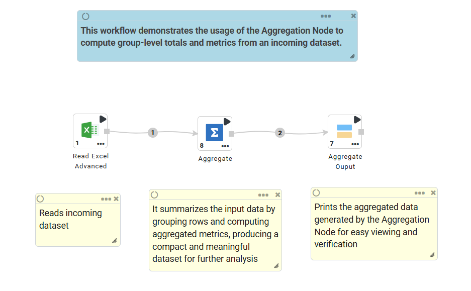
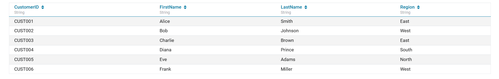
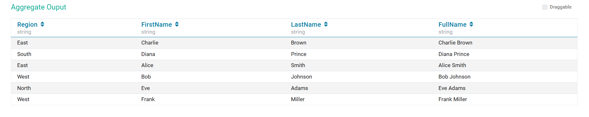
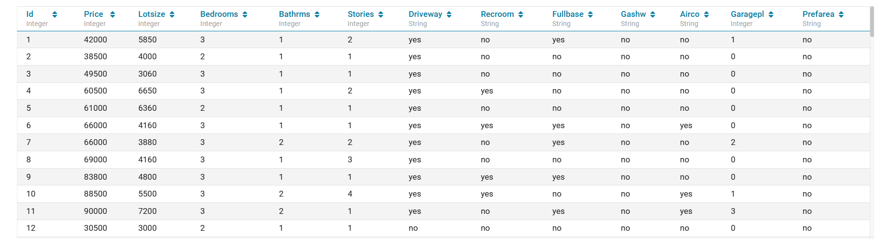
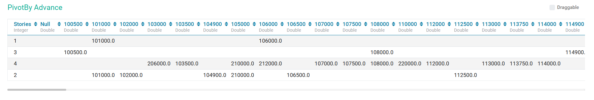

Aggregate
==========

Sparkflows provides processors that show aggregates for combinations of values in the selected columns.

Aggregate Processors in Sparkflows
----------------------------------------

.. list-table::
   :widths: 30 70
   :header-rows: 1

   * - Title
     - Description
   * - Aggregate
     - It computes summary statistics on your dataset by grouping rows and applying aggregation functions. It is commonly used for generating rollups, totals, and summarized reports directly within workflows.
   * - Pivot By Advance
     - It transforms an incoming DataFrame into a pivot table by grouping rows and applying one or more aggregation functions across selected columns.
   * - Cube
     - Cube Node computes aggregations of a group of rows against all possible combinations of values in the selected grouping columns.
   * - Group By
     - This node computes aggregations of a group of rows against selected grouping column by applying selected aggregate functions on specified aggregate columns.
   * - Pivot By
     - This node creates a DataFrame based on the Pivot table created out of the incoming DataFrame. Pivot table is created by Aggregation of rows by applying the Aggregate functions on the Aggregate Columns against the Grouping and Pivot Columns selected.
   * - Rollup
     - Rollup Node generates a result set that shows aggregates for a hierarchy of values in the selected columns.
 

Aggregate
-----------

Below is a sample workflow which contains Aggregate processor in Sparkflows. It demonstrates the usage of the Aggregation Node to compute group-level totals and metrics from an incoming dataset.

It does the following processing of data:

* Reads the incoming dataset.
* Groups data using the selected Group By Columns.
* Computes aggregated values such as Sum, Count, Min, Max, or Average using the Aggregate Node.
* Displays the aggregated output using the Print N Rows node.

**Incoming Dataset**
++++++++++++++++++++++++++

**Aggregate Node Configuration**

This node is configured using following options:

* **Input:** The node processes the incoming dataset.
* **Aggregate Columns:** Choose one or more columns on which the aggregation will be performed. Aggregation functions for each selected column: Sum, Count, Average, Min, Max, Count Distinct, First / Last.
* **Propagate All Input Columns:** Set it to true to include all original input columns along with the aggregated columns.

  .. figure:: ../../_assets/user-guide/data-preparation/aggregate/aggregate-node-config-1.png
     :alt: aggregate_node_userguide
     :width: 55%

* **Group By Columns:** Select one or more columns used to group the dataset. Each unique combination becomes a row in the output.

  .. figure:: ../../_assets/user-guide/data-preparation/aggregate/aggregate-node-config-2.png
     :alt: aggregate_node_userguide
     :width: 55%

* **Pivot Column:** Choose the column whose unique values should become new column headers.
* **Unique Values(optional):** Provide a list of expected unique values. If left blank, Sparkflows detects unique values automatically.

  .. figure:: ../../_assets/user-guide/data-preparation/aggregate/aggregate-node-config-3.png
     :alt: cube_node_userguide
     :width: 55%

**Aggregate Node Output**

The output of aggregate node is shown below:

Pivot By Advance
----------------

Below is a sample workflow which contains Pivot By Advance processor in Sparkflows. It demonstrates the usage of the Pivot By Advance Node to transform and summarize an incoming dataset into a pivot-table format.

It does the following processing of data:

* Reads the incoming dataset.
* Groups data using the selected Grouping Columns.
* Converts unique values from the Pivot Column into new output columns.
* Computes aggregated values such as Sum, Count, Min, Max, Average, or custom operations using the Pivot By Advance Node.
* Displays the pivoted and aggregated output using the Print N Rows node.

.. figure:: ../../_assets/user-guide/data-preparation/aggregate/pivotby-adv-wf.png
   :alt: pivotby_advance_node_userguide
   :width: 55%

**Incoming Dataset**
++++++++++++++++++++++++++

**Pivot By Advance Node Configuration**
++++++++++++++++++++++++++++++++++++++++++++

This node is configured using following options:

* **Input:** The node processes the incoming dataset.
* **Aggregate Tab**

   * **Grouping Columns:** Select one or more columns to group by before pivoting.
   * **Aggregate Columns:** Select the columns on which aggregation should be performed.
   * **Aggregate Operation to use:** Choose one or more aggregation functions for each selected column: sum, avg, min, max, count, count_distinct, first, last, concat (with custom separator), and special functions such as total_row, total_col, percent_row, percent_col.

  .. figure:: ../../_assets/user-guide/data-preparation/aggregate/pivotby-adv-node-config-1.png
     :alt: pivotby_advance_node_userguide
     :width: 55%

* **Pivot Tab**

   * **Pivot Column:** Specify the column whose unique values will become new output columns.
   * **Unique Values (Optional):** Comma-separated list of pivot values. It improves performance by avoiding Spark’s internal distinct scan.

  .. figure:: ../../_assets/user-guide/data-preparation/aggregate/pivotby-adv-node-config-2.png
     :alt: pivotby_advance_node_userguide
     :width: 55%

* **Options Tab**

   * **Case Insensitive Grouping:** If enabled, grouping keys are converted to lowercase before aggregation.
   * **Retain Special Characters:** If disabled, special characters in pivoted column names are replaced with underscores ``_``.
   * **Concatenation Separator:** It is used only when aggregation operation = concat.
   * **Field Size (Max Characters):** Maximum allowed length for concatenated string fields. Values beyond this limit are truncated.

  .. figure:: ../../_assets/user-guide/data-preparation/aggregate/pivotby-adv-node-config-3.png
       :alt: pivotby_advance_node_userguide
       :width: 55%

* **Infer Schema Tab:** It allows defining custom output schema for: Column Names, Column Types, Column Formats

**Pivot By Advance Node Output**
+++++++++++++++++++++++++++++++++++++

The output of the node is a matrix-style table(pivoted DataFrame) suitable for reporting, analytics, and further transformations, as shown below:

Cube
----------------------------------------

Below is a sample workflow which contains ``Cube`` processor in Sparkflows. It demonstrates usage of ``Cube`` node to compute aggregated value against all possible combinations of values in selected Cube columns.

It does the following processing of data:

*	Reads incoming Dataset.
*	Filters incoming Dataset based on requirement. Here, dataset is filtered for selected Departments.
*	Aggregated value (Sum of Salary) is computed using ``Cube`` node against all possible combinations of values in selected Cube Columns (Location and Dept).
* 	Aggregated data is printed using Print node.

.. figure:: ../../_assets/user-guide/data-preparation/aggregate/Cube_WF.png
   :alt: cube_node_userguide
   :width: 55%
   

**Cube Node configuration**

*	It computes aggregation against all combinations of selected Cube columns values. Aggregated value (Sum of Salary) is computed using ``Cube`` node against all combinations of selected Cube Columns (Location and Dept) values.
*	Columns from incoming datasets against whom Aggregated values need to be calculated are to be selected as ``Cube Columns``. Multiple columns can be selected as ``Cube Columns``.
*	Columns on which aggregated values need to be computed are to be selected as ``Aggregated Columns``. If aggregated values need to be calculated on multiple columns then additional rows need to be added.
*	Function that needs to be used for Aggregated Value calculation is to be selected in ``Aggregate Operation To Use``. It can be different for each row.

.. figure:: ../../_assets/user-guide/data-preparation/aggregate/CubeNode1.png
   :alt: cube_node_userguide
   :width: 75%

Aggregate column and Aggregate function selection to compute aggregated value is done as below:

.. figure:: ../../_assets/user-guide/data-preparation/aggregate/CubeNode2.png
   :alt: cube_node_userguide
   :width: 75%

**Cube Node output**

Aggregated value computed with the use of Cube node is displayed using Print node as shown below:

.. figure:: ../../_assets/user-guide/data-preparation/aggregate/CubeNodeOutput.png
   :alt: cube_node_userguide
   :width: 75%

Group By
----------------------------------------

Below is a sample workflow which contains ``Group By`` processor in Sparkflows. It demonstrates the usage of ``Group By`` node to compute aggregation of data by grouping rows together based on ``Group By`` columns.

It does the following processing of data:

*	Reads incoming dataset.
*	Aggregated value (Sum of Salary) is computed with the use of ``Group By`` node by grouping rows together based on Group By column (Location).
* 	Aggregated data is printed using the Print node as shown below:

.. figure:: ../../_assets/user-guide/data-preparation/aggregate/GroupBy_WF.png
   :alt: groupby_node_userguide
   :width: 55%
   

**Group By Node configuration**

*	It computes aggregation of data by grouping rows together based on Group By columns. Aggregated value (Sum of Salary) is computed using ``Group By`` node by grouping rows together based on ``Group By`` column (Location).
*	Columns from incoming Datasets against whom Aggregated values need to be calculated are to be selected as ``Grouping Columns``. Multiple columns can be selected as ``Grouping Columns``.
*	Columns on whom aggregated values need to be computed are to be selected as ``Aggregated Columns``. If aggregated values need to be calculated on multiple columns then additional rows need to be added.
*	Function that needs to be used for Aggregated Value calculation is to be selected in ``Aggregate Operation To Use``. It can be different for each row.
*	``Where Clause`` and ``Having Clause`` in the ``Filter Setting`` tab can be used to filter outgoing dataset.

.. figure:: ../../_assets/user-guide/data-preparation/aggregate/GroupBy1.png
   :alt: groupby_node_userguide
   :width: 75%

Aggregate column and Aggregate function selection to compute aggregated value is done as below:

.. figure:: ../../_assets/user-guide/data-preparation/aggregate/GroupBy2.png
   :alt: groupby_node_userguide
   :width: 75%

Filter Setting is entered as below:

.. figure:: ../../_assets/user-guide/data-preparation/aggregate/GroupBy3.png
   :alt: groupby_node_userguide
   :width: 75%

**Group By Node output**

Aggregated value computed with the use of ``Group By`` node is displayed using the Print node as shown below:

.. figure:: ../../_assets/user-guide/data-preparation/aggregate/GroupByOutput.png
   :alt: groupby_node_userguide
   :width: 75%

Pivot By
----------------------------------------

Below is a sample workflow which contains ``Pivot By`` processor in Sparkflows. It demonstrates the usage of ``Pivot By`` node to compute aggregation of data using Grouping columns and displayed against each Pivot Column value.

It does the following processing of data:

*	Reads incoming dataset.
*	Aggregated value (Employee Count) is computed with the use of ``Pivot By`` node by grouping rows together based on ``Group By`` column (Department) and displayed against each ``Pivot Column`` value (Location).
* 	Aggregated data is printed using the Print node.

.. figure:: ../../_assets/user-guide/data-preparation/aggregate/PivotBy_WF.png
   :alt: pivotby_node_userguide
   :width: 55%
   

**Pivot By Node configuration**

*	It computes aggregation of data using Grouping columns and display it against each Pivot Column value. Aggregated value (Employee Count) is computed using ``Pivot By`` node by grouping rows together based on ``Group By`` column (Department) and displayed against each ``Pivot Column`` value (Location).
*	Columns from incoming Datasets against which Aggregated values need to be calculated are to be selected as ``Grouping Columns``. Multiple columns can be selected as ``Grouping Columns``.
*	Columns from incoming datasets against whom Aggregated values for each Group need to be displayed are to be selected as ``Pivot Columns``. Values from ``Pivot Columns`` would be displayed as Columns in the output. Multiple columns can be selected as ``Pivot Columns``.
*	Columns on which aggregated values need to be computed are to be selected as ``Aggregated Columns``. If aggregated values need to be calculated on multiple columns then additional rows need to be added.
*	Function that needs to be used for Aggregated Value calculation is to be selected in ``Aggregate Operation To Use``. It can be different for each row.

.. figure:: ../../_assets/user-guide/data-preparation/aggregate/PivotBy1.png
   :alt: pivotby_node_userguide
   :width: 75%

``Pivot Columns`` are selected as below. Data from ``Pivot Columns`` would be displayed as Columns in the output. Aggregated values would be diaplayed against each Pivot Column value. Multiple Pivot columns can be selected.

.. figure:: ../../_assets/user-guide/data-preparation/aggregate/PivotBy2.png
   :alt: pivotby_node_userguide
   :width: 75%

Aggregate column and Aggregate function selection to compute aggregated value is done as below:

.. figure:: ../../_assets/user-guide/data-preparation/aggregate/PivotBy3.png
   :alt: pivotby_node_userguide
   :width: 75%

**Pivot By Node output**

Aggregated value computed using ``Pivot By`` node is displayed using Print node as shown below:

.. figure:: ../../_assets/user-guide/data-preparation/aggregate/PivotByOutput.png
   :alt: pivotby_node_userguide
   :width: 75%
   
Rollup
----------------------------------------

Below is a sample workflow which contains ``Rollup`` processor in Sparkflows. It demonstrates usage of ``Rollup`` node to compute aggregation of data using ``Rollup Columns``. Output is displayed in hierarchical order depicting the manner in which aggregation rolls-up upward.

It does the following processing of data:

*	Reads incoming dataset.
*	Filters incoming dataset based on requirement. Here, dataset is filtered for selected Departments.
*	Aggregated value (Sum of Salary) is computed using ``Rollup`` node for combinations of selected ``Rollup Columns`` (Location and Dept).
* 	Aggregated data is printed using the Print node.

.. figure:: ../../_assets/user-guide/data-preparation/aggregate/Rollup_WF.png
   :alt: rollup_node_userguide
   :width: 55%
   

**Rollup Node configuration**

*	It computes aggregation of data using ``Rollup Columns``. Output is displayed in hierarchical order depicting the manner in which aggregation rolls-up upward. Aggregated value (Sum of Salary) is computed using ``Rollup`` node for combinations of selected ``Rollup Columns`` (Location and Dept).
*	Columns from incoming datasets against which Aggregated values need to be calculated are to be selected as ``Rollup Columns``. Multiple columns can be selected as ``Rollup Columns``.
*	Columns on which aggregated values are to be computed need to be selected as ``Aggregated Columns``. If aggregated values are to be calculated on multiple columns then additional rows need to be added.
*	Function that needs to be used for Aggregated Value calculation is to be selected in ``Aggregate Operation To Use``. It can be different for each row.

.. figure:: ../../_assets/user-guide/data-preparation/aggregate/Rollup1.png
   :alt: rollup_node_userguide
   :width: 75%

Aggregate column and Aggregate function selection to compute aggregated value is done as below:

.. figure:: ../../_assets/user-guide/data-preparation/aggregate/Rollup2.png
   :alt: rollup_node_userguide
   :width: 75%

**Rollup Node output**

Aggregated value computed with the use of Rollup node is displayed using the Print node as shown below:

.. figure:: ../../_assets/user-guide/data-preparation/aggregate/RollupOutput.png
   :alt: rollup_node_userguide
   :width: 75%
