Cast Data Type
==========

Fire Insights provide processors for Cast Data Type

Cast Data Type Processors in Fire Insights
----------------------------------------

.. list-table:: Cast Data Type Processors
   :widths: 30 70
   :header-rows: 1

   * - Title
     - Description
   * - Cast To Different Types-1
     - It casts specified columns to different datatypes as specified
   * - Cast To Different Types-2
     - It casts specified columns to different datatypes in the specified format
   * - Cast To Single Type
     - It casts the specified input columns to a new data type
 
Cast To Different Types-1
----------------------------------------

Below is a sample workflow which contains ``Cast To Different Types-1`` processor in Fire Insights. It demonstrates usage of ``Cast To Different Types-1`` node to cast columns to different datatypes.

It does following processing of data:

*	Reads incoming Dataset.
*	Casts columns from incoming dataset to different datatypes using ``Cast To Different Types-1`` node.
*	Prints output dataset with columns casted to different datatypes using Print node.

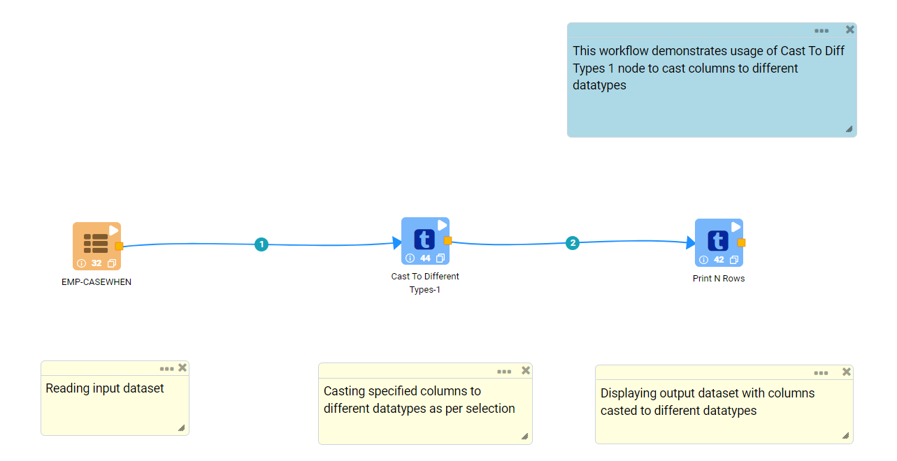
   
**Incoming dataset**

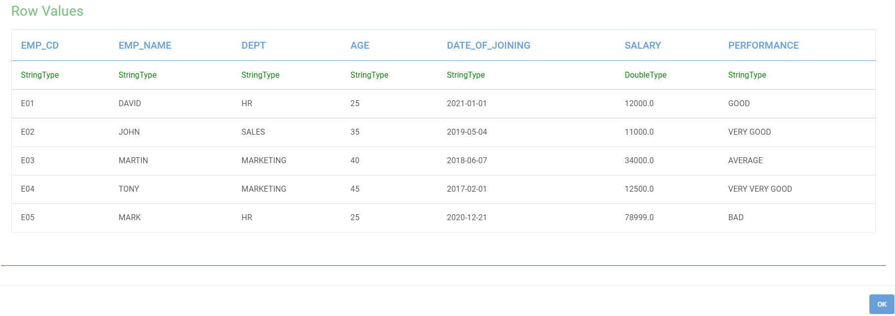
   
**Cast To Different Types-1 Node configuration**

*	``Cast To Different Types-1`` node is configured as below.
*	Input of this node are the incoming dataset.
*	Column that needs to be casted to different datatype is to be selected in the ``Columns`` list.
*	Datatype to which Column needs to be casted is to be selected in the ``New Data Type`` list.
*	``Replace Existing Cols`` needs to be selected as ``True`` if casted column is needed to replace the the existing column in the output.
*	A ``Variables List`` row needs to be added for each casting requirement.
*	Output of this node would display dataset with columns casted to different datatypes.

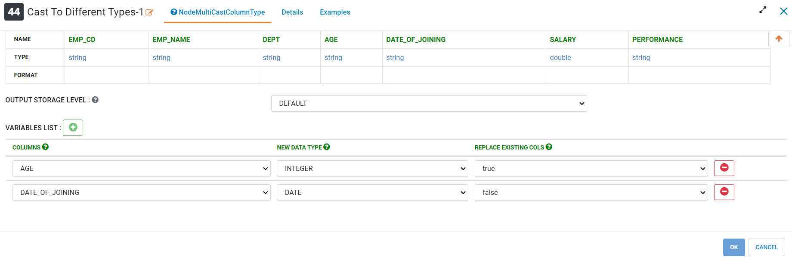
   
**Cast To Different Types-1 Node output**

Output of ``Cast To Different Types-1`` node displaying dataset with columns casted to different datatypes.

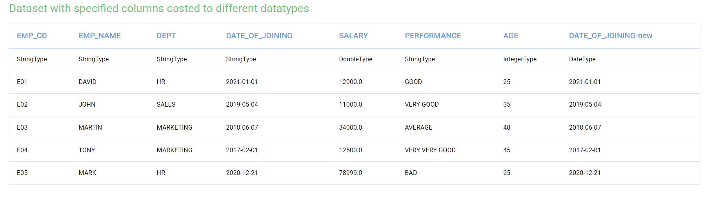
   

Cast To Different Types-2
----------------------------------------

Below is a sample workflow which contains ``Cast To Different Types-2`` processor in Fire Insights. It demonstrates usage of ``Cast To Different Types-2`` node to cast columns to different datatype in the specified format.

It does following processing of data:

*	Reads incoming Dataset.
*	Casts columns to different datatype in the specified format using ``Cast To Different Types-2`` node.
*	Prints output dataset with columns casted to different datatype in the specified format using Print node.

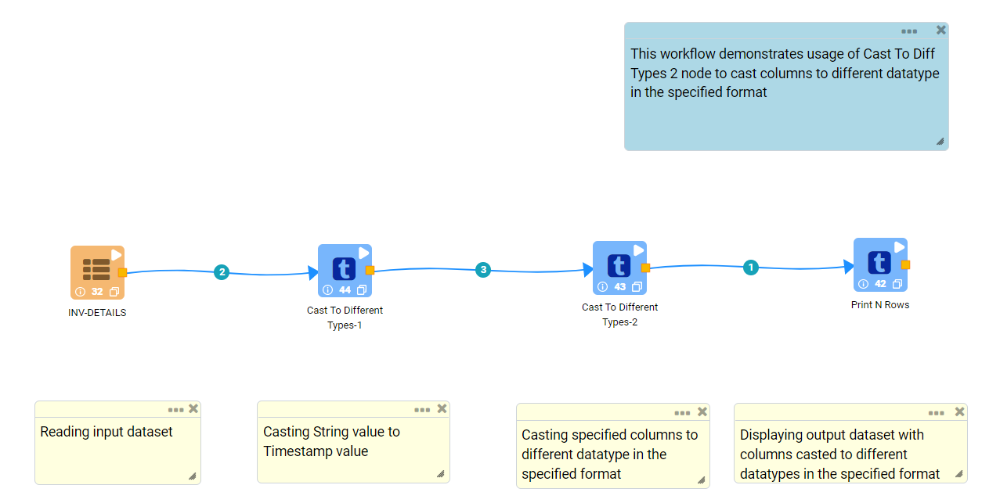
   
**Incoming dataset**

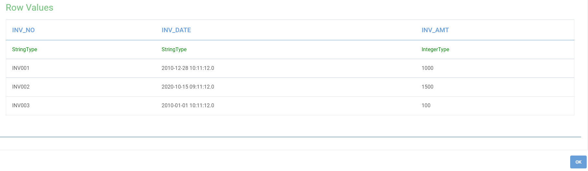
   
**Cast To Different Types-2 Node configuration**

*	``Cast To Different Types-2`` node is configured as below.
*	Input of this node are the incoming dataset.
*	Column that needs to be casted to different datatype is to be selected in the ``Columns`` list.
*	Datatype to which Column needs to be casted is to be selected in the ``New Data Type`` list.
*	``Replace Existing Cols`` needs to be selected as ``True`` if casted column is needed to replace the the existing column in the output.
*	Format of the output data is to be specified in ``Formats`` box.
*	A ``Variables List`` row needs to be added for each casting requirement.
*	Output of this node would display dataset with columns casted to different datatype in the specified format.

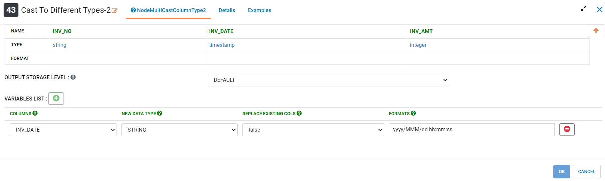
   
**Cast To Different Types-2 Node output**

Output of ``Cast To Different Types-2`` node displaying dataset with columns casted to different datatype in the specified format.

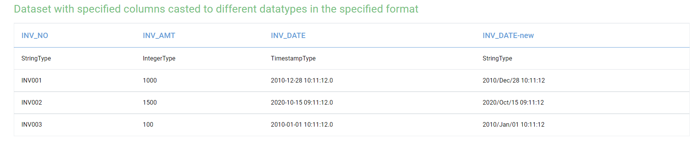
   

Cast To Single Type
----------------------------------------

Below is a sample workflow which contains ``Cast To Single Type`` processor in Fire Insights. It demonstrates usage of ``Cast To Single Type`` node to cast selected columns to single datatypes.

It does following processing of data:

*	Reads incoming Dataset.
*	Casts selected columns to single datatypes using ``Cast To Single Type`` node.
*	Prints output dataset with columns casted to single datatype using Print node.

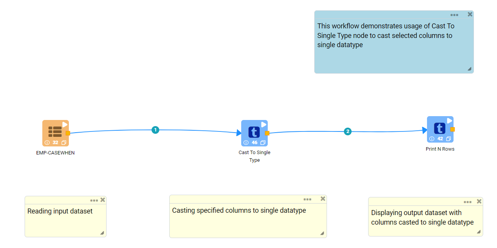
   
**Incoming dataset**

   
**Cast To Single Type Node configuration**

*	``Cast To Single Type`` node is configured as below.
*	Input of this node are the incoming dataset.
*	Columns that are needed to be casted to single datatype are to be selected in the ``Columns`` list.
*	Datatype to which Columns need to be casted is to be selected in the ``New Data Type`` list.
*	``Replace Existing Cols`` needs to be selected as ``True`` if casted columns are needed to replace the the existing columns in the output.
*	Output of this node would display dataset with columns casted to single datatype.

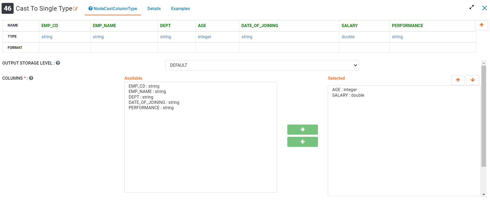
   
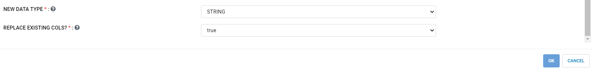
   
**Cast To Single Type Node output**

Output of ``Cast To Single Type`` node displaying dataset with columns casted to single datatype.

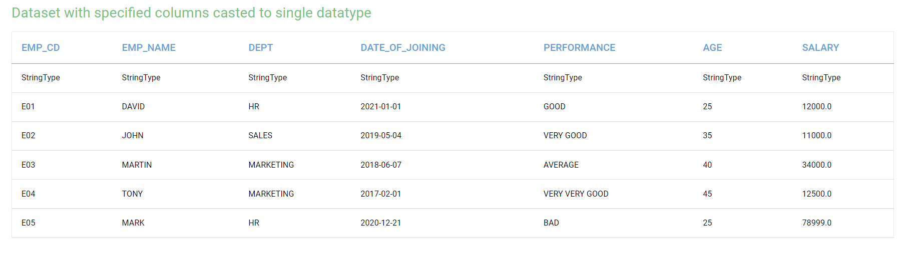
   

