Data Cleaning
==========

Fire Insights provides powerful capabilities for data cleanup.

Data Cleaning Processors in Fire Insights
----------------------------------------

.. list-table::
   :widths: 30 70
   :header-rows: 1

   * - Title
     - Description
   * - Drop Rows With Null
     - This node creates a new DataFrame by dropping rows that contain null values.
   * - Find And Replace Using Regex
     - This node finds and replaces text in a column containing a string.
   * - Find And Replace Using Regex Advanced
     - This node finds and replaces text in a column containing a string.
   * - Dedup
     - This node is used for problems like entity resolution or data matching. Entity resolution or data matching is the problem of finding and linking different mentions of the same entity in a single data source or across multiple data sources.
   * - Drop Duplicate Rows
     - Returns a new dataset that contains the unique rows from this Dataset. When user selects columns in the node, it returns a new Dataset after removing the duplicate rows, considering uniques in the subset of column selected by user
   * - Remove Duplicate Rows
     - This node takes an array of fields and compares rows in those fields. If they match fully, then it considers it a match. From the matches, it would randomly take one row and drop the rest.
   * - Remove Unwanted Characters
     - This node removes unwanted characters.
   * - Remove Unwanted Characters Advanced
     - This node removes unwanted characters from multiple columns.
 

Drop Rows With Null
----------------------------------------

Below is a sample workflow which contains Drop Rows With Null processor in Fire Insights. It demonstrates the usage of Drop Rows With Null node to remove rows having null value in columns.

It does the following processing of data:

*	Reads incoming dataset.
*	Remove rows from incoming dataset having Null value in columns using Drop Rows With Null processor. 
* 	Output data is printed using the Print node.

**Drop Rows with Null Node Sample workflow**

.. figure:: ../../_assets/user-guide/data-preparation/datacleaning/droprowsnull-workflow.png
   :alt: datacleaning_userguide
   :width: 75%
   
**Incoming Dataset**

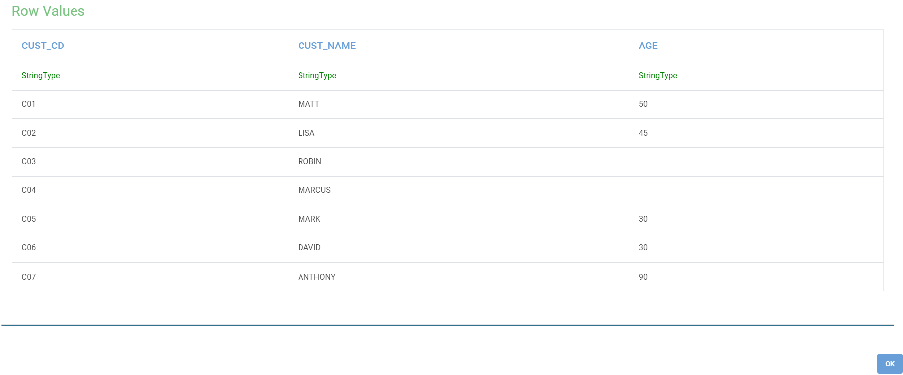

**Drop Rows With Null Node configuration**

Drop Rows With Null node is configured as below.

*	Input of this node is the incoming dataset.
*	Output of this node would contain rows that don't have null values in columns.

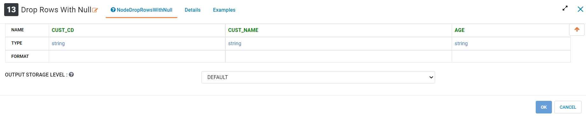
   
**Drop Rows With Null Node output**

Output of Drop Rows With Null node which displays rows that don't have null values is shown below:

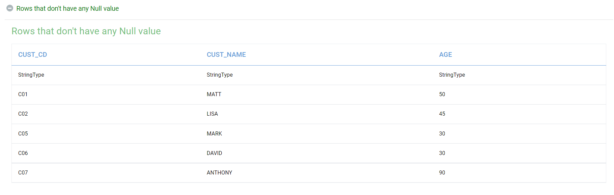
   
   
Find And Replace Using Regex
----------------------------------------

Below is a sample workflow which contains the Find And Replace Using Regex processor in Fire Insights. It demonstrates the usage of Find And Replace Using Regex node to replace a string pattern with another by the use of a Regex Expression.

It processes the dataset in the following ways:

*	Reads incoming dataset.
*	Replaces a string pattern with another by the use of Find And Replace Using Regex node. In the sample workflow shown below, date separator is replced from '-' to '\/'. 
* 	Output data is printed by the use of the Print node.

**Find and Replace Using Regex Node Sample workflow**

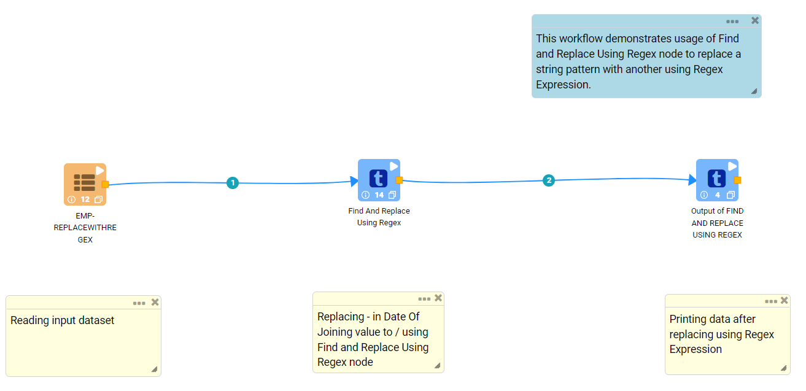
   
**Incoming Dataset**

**Find And Replace Using Regex Node configuration**

Find And Replace Using Regex node is configured as below.

*	Input of this node is the incoming dataset.
*	Columns in which data needs to be replaced is selected as ``Input Columns``. More than one column can be selected.
*	String Pattern that needs to be searched is to be entered in ``Find`` box.
*	String Pattern that replaces matched values in the output is to be entered in ``Replace`` box.
*	Output of this node would contain replaced values for the matches found.

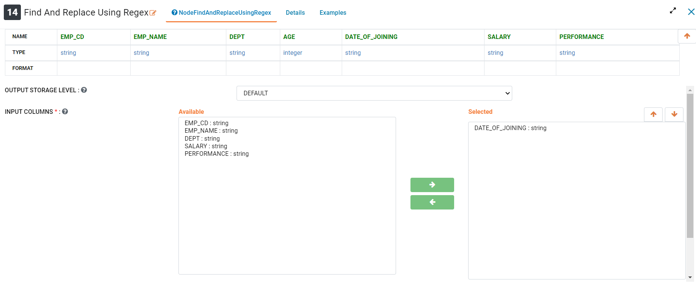
   
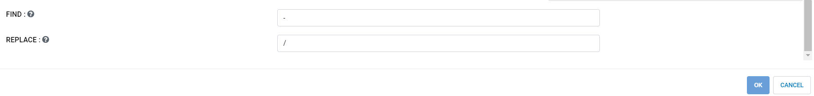
   
**Find And Replace Using Regex Node output**

Output of Find And Replace Using Regex node displaying values replaced for the matches found is shown below. In the sample workflow shown below, Date Separator in ``Date Of Joining`` has been changed from '-' to '\/'.

.. figure:: ../../_assets/user-guide/data-preparation/datacleaning/fnrregex-printnode-output.png
   :alt: datacleaning_userguide
   :width: 75%    
   
Find And Replace Using Regex Multiple
----------------------------------------

Below is a sample workflow which contains Find And Replace Using Regex Multiple processor in Fire Insights. It demonstrates the usage of Find And Replace Using Regex Multiple node to replace a string pattern with another using Regex Expression. This node facilitates multiple transformations in one go.

It does the following processing of data:

*	Reads incoming Dataset.
*	Replaces a string pattern with another using Find And Replace Using Regex Multiple node. In the sample workflow shown below, date separator is replced from '-' to '\/' in ``Date Of Joining``, spaces in ``Salary`` is replaced with a comma, 'BAD' in ``Performance`` is replaced with 'NOT SO GOOD'.  
* 	Output data after replacement is printed using the Print node.

**Find and Replace Using Regex Multiple Node Sample workflow**

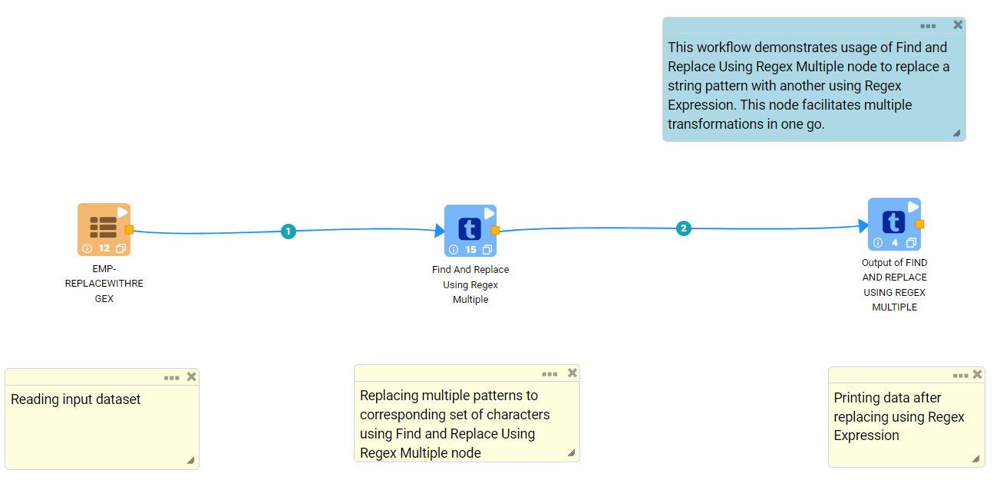
   
**Incoming dataset**

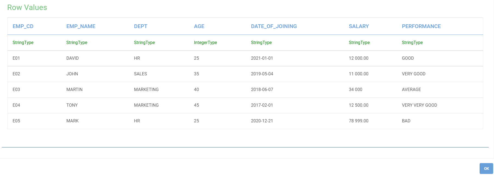

**Find And Replace Using Regex Multiple Node configuration**

Find And Replace Using Regex Multiple node is configured as below.

*	Input of this node is the incoming dataset.
*	In the ``Variables List``, Column in which data needs to be replaced is to be selected as ``Input Columns``. 
*	String Pattern that needs to be searched is to be entered in ``Find`` box.
*	String Pattern that replaces matched values in the output is to be entered in ``Replace`` box.
*	Multiple transformation for different columns can be entered as separate rows.
*	Output of this node would contain replaced values for the matches found.

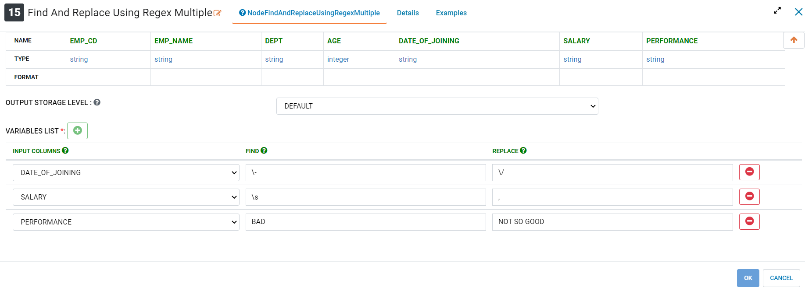
   
**Find And Replace Using Regex Multiple Node output**

Output of Find And Replace Using Regex Multiple node displaying values replaced for the matches found.

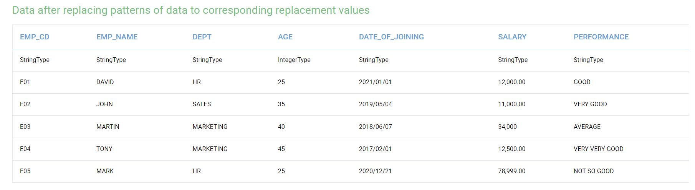
   
Dedup
----------------------------------------

Below is a sample workflow which contains Dedup processor in Fire Insights. It demonstrates  the usage of Dedup node to compare data of an entity from multiple sources to identify whether they are same or not.

It does following processing of data:

*	Reads incoming Base Dataset and Dedup Dataset.
*	Joins Base and Dedup datasets into single dataset to facilitate comparison using ``Join Using SQL`` node.
*	Base and Dedup datasets are compared using ``Dedup`` node. ``Confidence Score`` is calculated as a result of comparison which indicates extent to which both datasets match.
* 	Output data listing ``Confidence Score`` is printed using  the Print node.

**Dedup Node Sample Workflow**

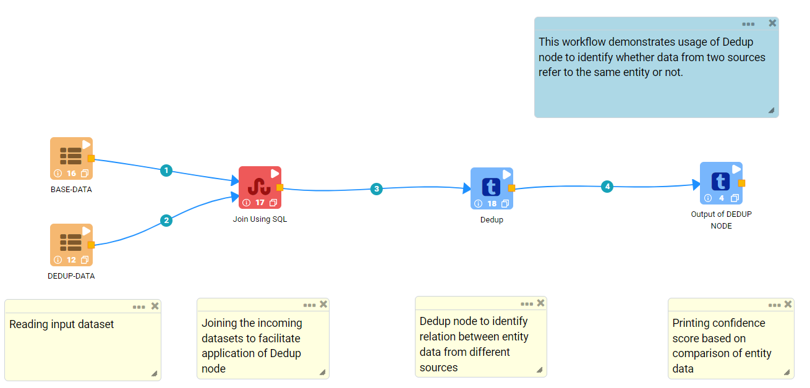
   
**Incoming datasets**

*	Base Dataset against which other dataset is compared for accuracy.

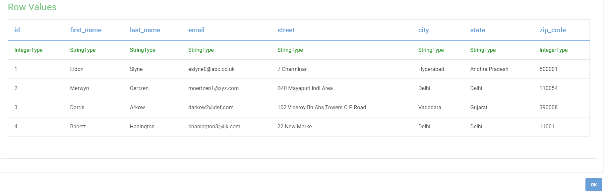
   
*	Dedup Dataset which needs to be checked for accuracy.

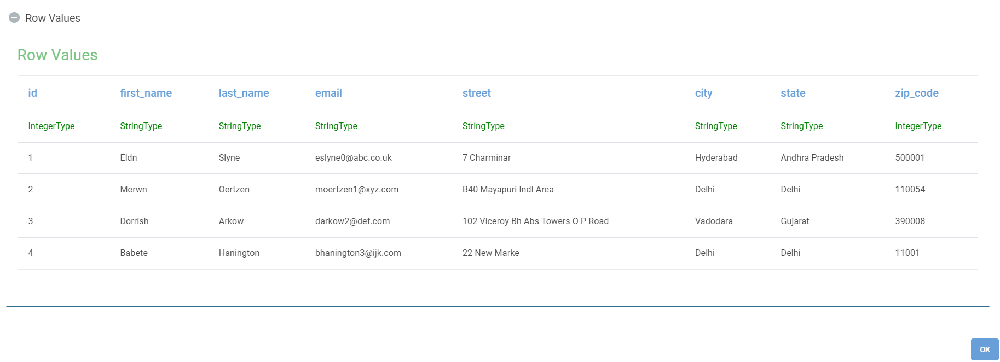

**Dedup Node configuration**

Dedup node is configured as below.

*	Input of this node are the incoming datasets.
*	Column name that lists ``Confidence Score`` in the output needs to be entered in the ``Confidence Score`` box.
*	Columns that are used for comparison need to be selected as ``LHS Variables`` and ``RHS Variables`` respectively. 
*	Algorithm to be used for comparison needs to be selected in ``Algorithm To Use`` drop down.
*	Weightage of each column that contributes to final Confidence Score calculation needs to be entered in ``Weights`` box.
*	Column name displaying the result of each column comaprison needs to be entered in ``Output Column`` box.
*	Output of this node would contain final Confidence Score computed.

.. figure:: ../../_assets/user-guide/data-preparation/datacleaning/dedup-config.png
   :alt: datacleaning_userguide
   :width: 75%
   
**Dedup Node output**

Output of Dedup node displaying Confidence Score value is shown as below:

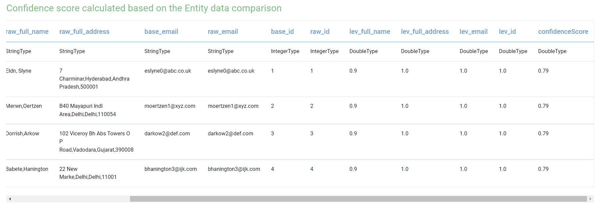
   
Drop Duplicate Rows
----------------------------------------

Below is a sample workflow which contains Drop Duplicate Rows processor in Fire Insights. It demonstrates the usage of Drop Duplicate Rows node to drop duplicate rows having same values in the selected columns.

It does the following processing of data:

*	Reads incoming Dataset.
*	Drops duplicate rows from incoming dataset having same values in the selected columns using Drop Duplicate Rows node.
* 	Output data containing only unique rows is printed using the Print node.

**Drop Duplicate Rows Workflow**

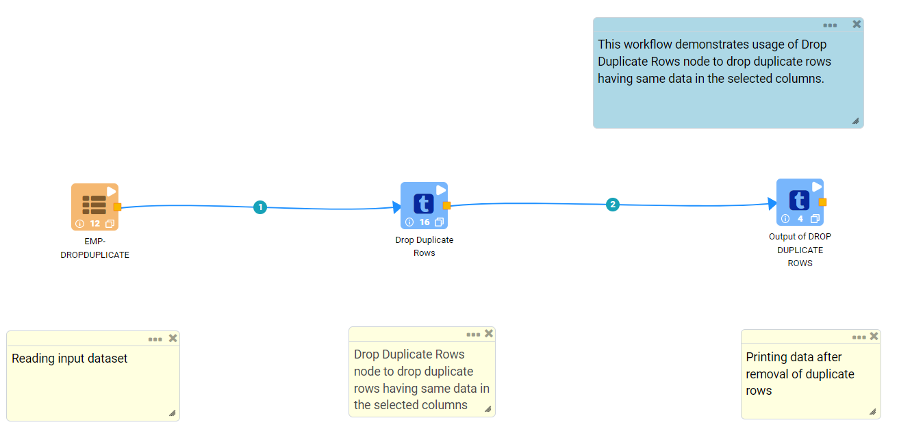
   
**Incoming Dataset**

.. figure:: ../../_assets/user-guide/data-preparation/datacleaning/dropduprows-incoming-dataset.png
   :alt: datacleaning_userguide
   :width: 75%

**Drop Duplicate Rows Node configuration**

Drop Duplicate Rows node is configured as below.

*	Input of this node is the incoming dataset.
*	Columns in which data needs to be checked for duplicate values is to be selected in ``Columns``. More than one column can be selected.
*	Output of this node would contain unique combination of values in the selected Columns.

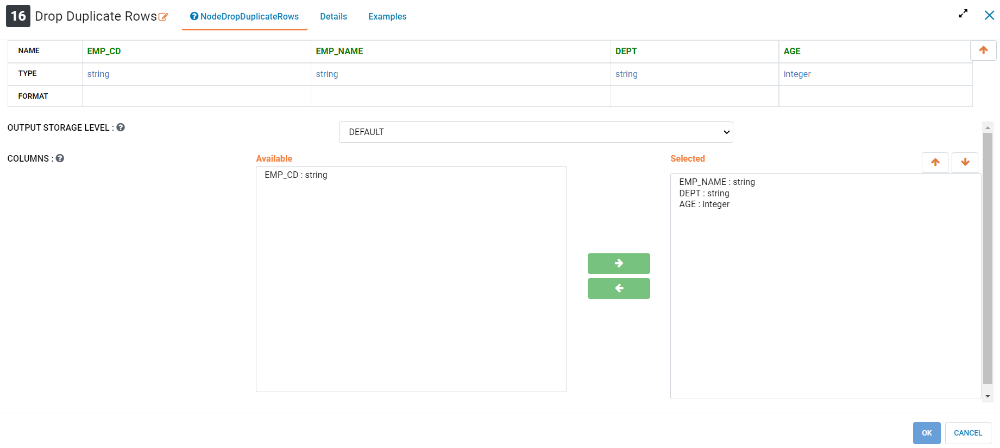
   
**Drop Duplicate Rows Node output**

Output of Drop Duplicate Rows node displaying rows having unique combination of values in the selected Columns.

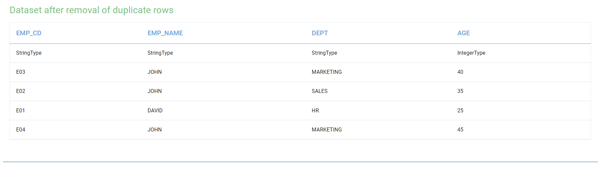
   
Remove Duplicate Rows
----------------------------------------

Below is a sample workflow which contains Remove Duplicate Rows processor in Fire Insights. It demonstrates usage of Remove Duplicate Rows node to remove duplicate rows having same data in the selected columns and retain one rows as per the selection.

It does the following processing of data:

*	Reads incoming Dataset.
*	Removes duplicate rows from incoming dataset having same values in the selected columns using Remove Duplicate Rows node. It retains one of the duplicate rows in the output either first or last based on the selection.
* 	Output data containing only unique rows is printed using the Print node.

**Remove Duplicate Rows Node Sample workflow**

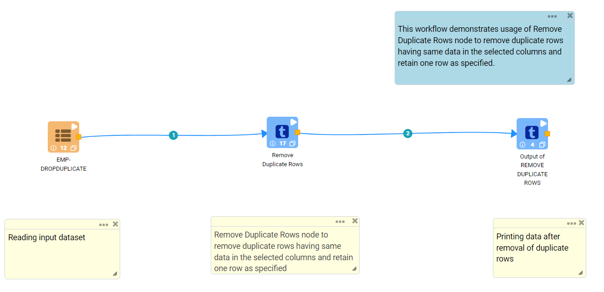
   
**Incoming Dataset**

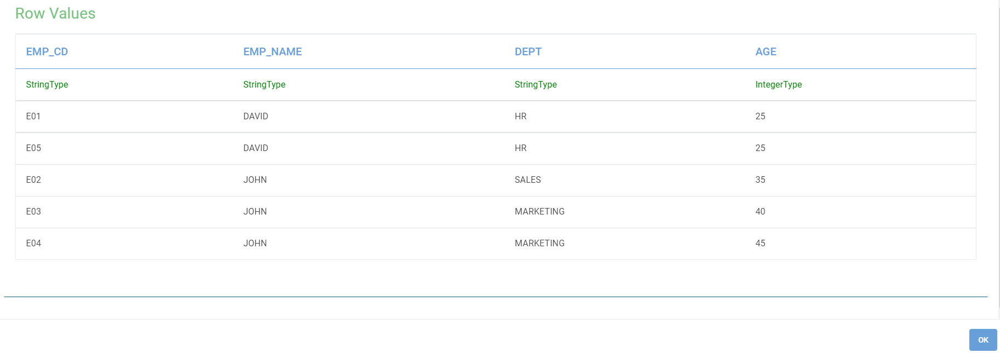

**Remove Duplicate Rows Node configuration**

Remove Duplicate Rows node is configured as below.

*	Input of this node is the incoming dataset.
*	A Row from the duplicate set of rows, that needs to be retained in the output, is to be selected in ``Order`` dropdown. It allows to select either ``first`` or ``last``.
*	Columns in which data needs to be checked for duplicate values is to be selected in ``Columns``. More than one column can be selected.
*	Output of this node would contain unique combination of values in the selected Columns.

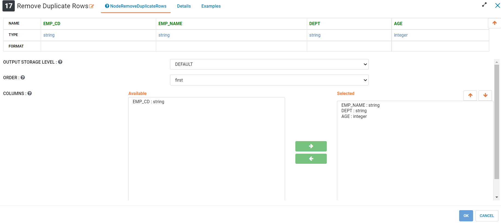
   
**Remove Duplicate Rows Node output**

Output of Remove Duplicate Rows node displaying rows having unique combination of values in the selected Columns is shown below:

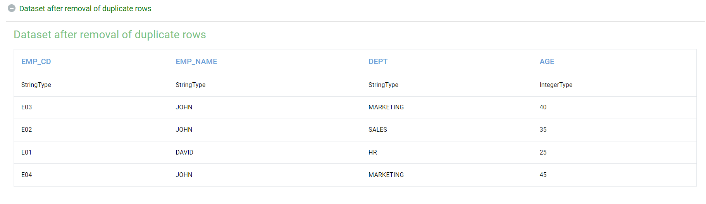
   
Remove Unwanted Characters
----------------------------------------

Below is a sample workflow which contains Remove Unwanted Characters processor in Fire Insights. It demonstrates the usage of Remove Unwanted Characters node to remove White Spaces, Letters, Digits, Signs and Commas from the selected columns.

It does the following processing of data:

*	Reads incoming Dataset.
*	Removes White Spaces, Letters, Digits, Signs and Commas from the selected columns using Remove Unwanted Characters node. 
* 	Output data containing transformed data is printed using the Print node.

**Remove Unwanted Characters Sample workflow**

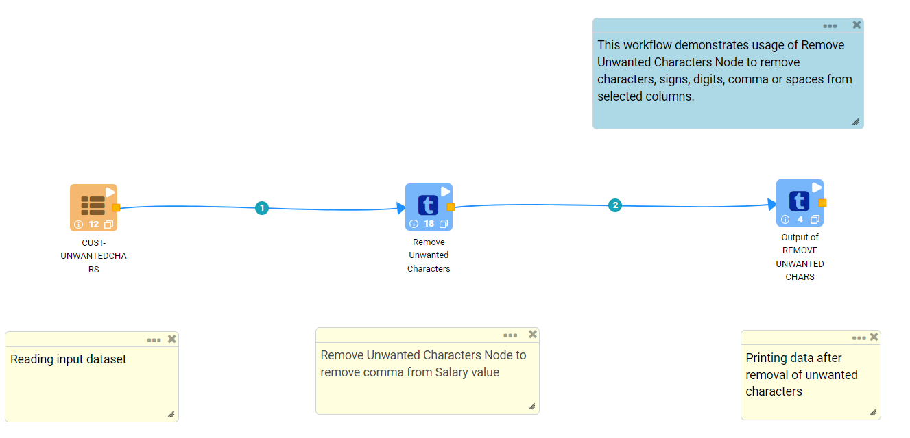
   
**Incoming Dataset**

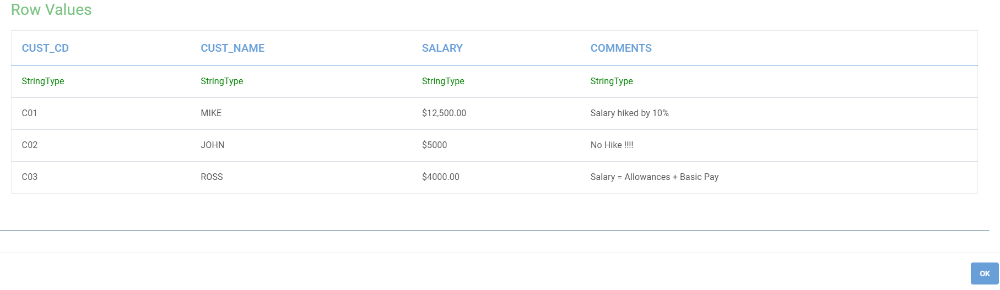

**Remove Unwanted Characters Node configuration**

Remove Unwanted Characters node is configured as below.

*	Input of this node is the incoming dataset.
*	Columns from which unwanted characters need to be removed are to be selected in ``Input Columns`` list.
*	Based on the requirement of character removal, White Spaces, Letters, Digits, Signs and Commas dropdown need to be selected as ``True``.
*	Output of this node would contain transformed data based on the selection.

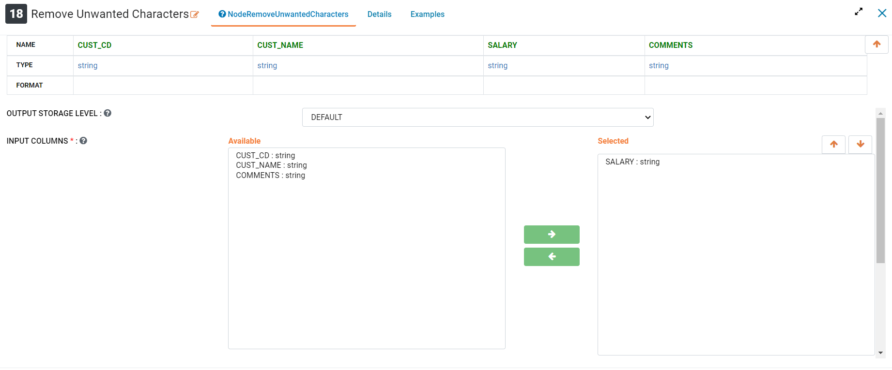
   
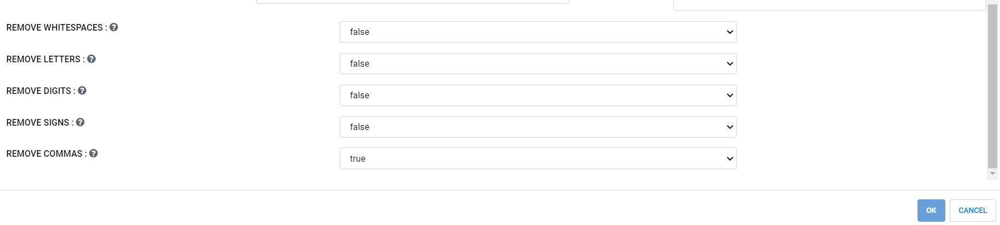
   
**Remove Unwanted Characters Node output**

Output of Remove Unwanted Characters node displaying transformed data after removal of selected characters from selected columns is shown below:

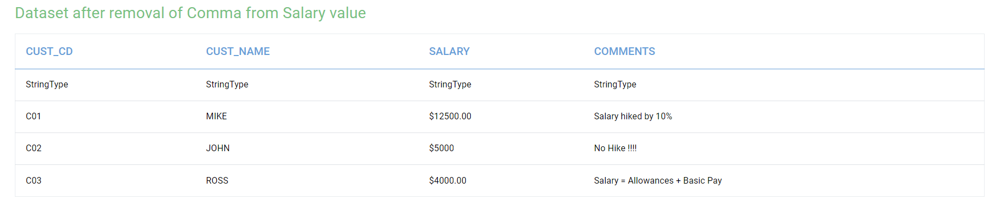
   
Remove Unwanted Characters Multiple
----------------------------------------

Below is a sample workflow which contains Remove Unwanted Characters Multiple processor in Fire Insights. It demonstrates  the usage of Remove Unwanted Characters Multiple node to remove White Spaces, Letters, Digits, Signs and Commas from the selected columns. This node can be configured to remove different set of characters for different columns in one go.

It does the following processing of data:

*	Reads incoming dataset.
*	Removes White Spaces, Letters, Digits, Signs and Commas from the selected columns using Remove Unwanted Characters Multiple node. Different columns are configured to remove different set of characters.
* 	Output data containing transformed data is printed using  the Print node.

**Remove Unwanted Characters Multiple Sample workflow**

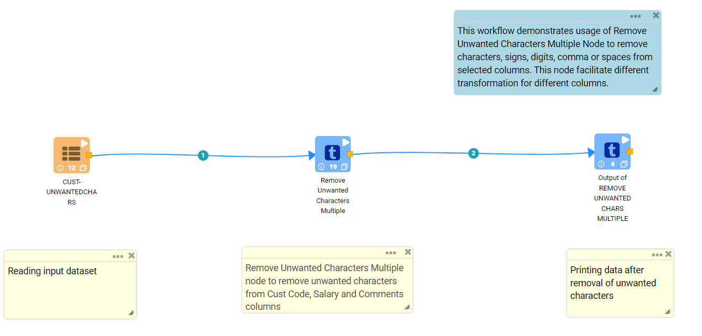
   
**Incoming Dataset**

**Remove Unwanted Characters Multiple Node configuration**

Remove Unwanted Characters Multiple node is configured as below.

*	Input of this node is the incoming dataset.
*	In the ``Variables List``, columns from which unwanted characters need to be removed are to be selected in ``Input Columns`` list.
*	Based on the requirement of character removal, White Spaces, Letters, Digits, Signs and Commas dropdown need to be selected as ``True``.
*	Multiple transformations for different columns can be added as separate rows.
*	Output of this node would contain transformed data based on the selection.

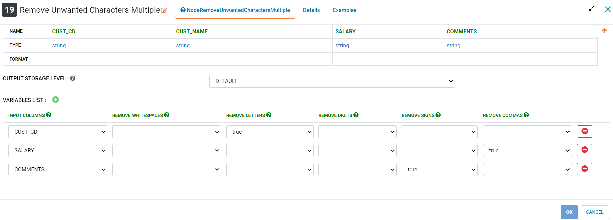
   
**Remove Unwanted Characters Multiple Node output**

Output of Remove Unwanted Characters Multiple node displaying transformed data after removal of selected characters from selected columns is shown below:

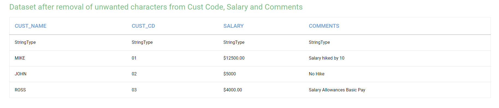
